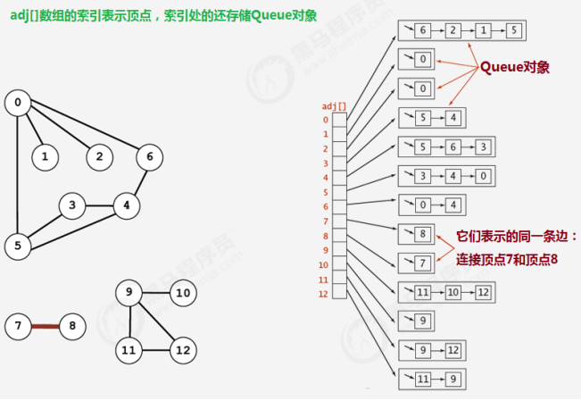
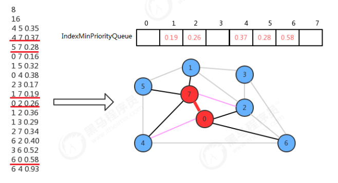

在现实生活中，有许多应用场景会包含很多点以及点点之间的连接，而这些应用场景我们都可以用即将要学习的图这种数据结构去解决。

地图：我们生活中经常使用的地图，基本上是由城市以及连接城市的道路组成，如果我们把城市看做是一个一个的点，把道路看做是一条一条的连接，那么地图就是我们将要学习的图这种数据结构。

我们生活中经常见到的集成电路板，它其实就是由一个一个触点组成，并把触点与触点之间通过线进行连接，这也是我们即将要学习的图这种数据结构的应用场景

## 图的定义
定义：图是由一组顶点和一组能够将两个顶点相连的边组成的。

图的分类：按照连接两个顶点的边的不同，可以把图分为以下两种：
- 无向图：边仅仅连接两个顶点，没有其他含义；
- 有向图：边不仅连接两个顶点，并且具有方向；

图的相关术语: 
- 相邻顶点：当两个顶点通过一条边相连时，我们称这两个顶点是相邻的，并且称这条边依附于这两个顶点。
- 度：某个顶点的度就是依附于该顶点的边的个数
- 子图：是一幅图的所有边的子集(包含这些边依附的顶点)组成的图；
- 路径：是由边顺序连接的一系列的顶点组成
- 环：是一条至少含有一条边且终点和起点相同的路径
- 连通图：如果图中任意一个顶点都存在一条路径到达另外一个顶点，那么这幅图就称之为连通图

图的存储结构: 常见的图的存储结构有两种：邻接矩阵和邻接表。要表示一幅图，只需要表示清楚以下两部分内容即可：图中所有的顶点和所有连接顶点的边。

### 邻接矩阵
1. 使用一个V*V的二维数组int[V][V] adj,把索引的值看做是顶点；
2. 如果顶点v和顶点w相连，我们只需要将adj[v][w]和adj[w][v]的值设置为1,否则设置为0即可。


很明显，邻接矩阵这种存储方式的空间复杂度是V^2的，如果我们处理的问题规模比较大的话，内存空间极有可能不够用。

### 邻接表
1.使用一个大小为V的数组 Queue[V] adj，把索引看做是顶点；
2.每个索引处adj[v]存储了一个队列，该队列中存储的是所有与该顶点相邻的其他顶点


很明显，邻接表的空间并不是是线性级别的，所以后面我们一直采用邻接表这种存储形式来表示图。

###  图的实现
类名 | Graph
-- | --
构造方法 | Graph(int V)：创建一个包含V个顶点但不包含边的图
成员方法 | 1.public int V():获取图中顶点的数量
        | 2.public int E():获取图中边的数量
        | 3.public void addEdge(int v,int w):向图中添加一条边 v-w
        | 4.public Queue adj(int v)：获取和顶点v相邻的所有顶点
成员变量 | 1.private final int V: 记录顶点数量
        | 2.private int E: 记录边数量
        | 3.private Queue[] adj: 邻接表

代码实现：
```
public class Graph {

    // 图的顶点数
    private final int V;

    // 图的边数
    private int E;

    // 邻接表
    private List<Integer>[] adj;

    public Graph(int V) {
        this.V = V;
        this.E = 0;
        this.adj = new List[V];
        for (int i = 0; i < V; i++) {
            this.adj[i] = new LinkedList<Integer>();
        }
    }

    public int V() {
        return this.V;
    }

    public int E() {
        return this.E;
    }

    public void addEdge(int v, int w) {
        // 把w添加到v的链表中，这样顶点v就多了一个相邻点w
        adj[v].add(w);
        // 把v添加到w的链表中，这样顶点w就多了一个相邻点v
        adj[w].add(v);
        E++;
    }

    public List adj(int v) {
        return this.adj[v];
    }
}
```

## 图的搜索
在很多情况下，我们需要遍历图，得到图的一些性质，例如，找出图中与指定的顶点相连的所有顶点，或者判定某个顶点与指定顶点是否相通，是非常常见的需求。
有关图的搜索，最经典的算法有深度优先搜索和广度优先搜索，接下来我们分别讲解这两种搜索算法。

### 深度优先搜索
所谓的深度优先搜索，指的是在搜索时，如果遇到一个结点既有子结点，又有兄弟结点，那么先找子结点，然后找兄弟结点。


很明显，在由于边是没有方向的，所以，如果4和5顶点相连，那么4会出现在5的相邻链表中，5也会出现在4的相邻链表中，那么为了不对顶点进行重复搜索，应该要有相应的标记来表示当前顶点有没有搜索过，可以使用一个布尔类型的数组 boolean[V] marked,索引代表顶点，值代表当前顶点是否已经搜索，如果已经搜索，标记为true，如果没有搜索，标记为false；

类名 | DepthFirstSearch
-- | --
构造方法 | DepthFirstSearch(Graph G,int s)：构造深度优先搜索对象，使用深度优先搜索找出G图中s顶点的所有相通顶点
成员方法  | 1.private void dfs(Graph G, int v)：使用深度优先搜索找出G图中v顶点的所有相通顶点
         | 2.public boolean marked(int w):判断w顶点与s顶点是否相通
         | 3.public int count():获取与顶点s相通的所有顶点的总数
成员变量  | 1.private boolean[] marked: 索引代表顶点，值表示当前顶点是否已经被搜索
          | 2.private int count：记录有多少个顶点与s顶点相通

代码实现：
```
public class DepthFirstSearch {

    // 标记某顶点是否被搜索过
    private boolean[] marked;

    // 与起点相邻的顶点个数
    private int count;

    // 图和遍历起点
    public DepthFirstSearch(Graph g, int s) {
        this.marked = new boolean[g.V()];

        dfs(g, s);
    }

    // 以v为起点遍历
    private void dfs(Graph g, int v) {
        marked[v] = true;

        // 获取v顶点的邻接表，遍历
        List<Integer> adj = g.adj(v);
        for(Integer w : adj) {
            // 如果w顶点没有遍历过
            if (!marked[w]) {
                dfs(g, w);
            }
        }

        count++;
    }

    // w顶点是否与起点s相通，如果w被遍历过，则marked[w]为true
    public boolean marked(int w) {
        return marked[w];
    }

    public int count() {
        return this.count;
    }
}
```

### 广度优先搜索
所谓的深度优先搜索，指的是在搜索时，如果遇到一个结点既有子结点，又有兄弟结点，那么先找兄弟结点，然后找子结点。


类名 | BreadthFirstSearch
-- | --
构造方法 | BreadthFirstSearch(Graph G,int s)：构造广度优先搜索对象，使用广度优先搜索找出G图中s顶点的所有相邻顶点
成员方法 | 1.private void bfs(Graph G, int v)：使用广度优先搜索找出G图中v顶点的所有相邻顶点
         | 2.public boolean marked(int w):判断w顶点与s顶点是否相通
         | 3.public int count():获取与顶点s相通的所有顶点的总数
成员变量     | 1.private boolean[] marked: 索引代表顶点，值表示当前顶点是否已经被搜索
            | 2.private int count：记录有多少个顶点与s顶点相通
            | 3.private Queue waitSearch: 用来存储待搜索邻接表的点

代码实现：
```
todo
```

## 无向图案例-畅通工程续1
某省调查城镇交通状况，得到现有城镇道路统计表，表中列出了每条道路直接连通的城镇。省政府“畅通工程”的目
标是使全省任何两个城镇间都可以实现交通（但不一定有直接的道路相连，只要互相间接通过道路可达即可）。目
前的道路状况，9号城市和10号城市是否相通？9号城市和8号城市是否相通？
在我们的测试数据文件夹中有一个trffic_project.txt文件，它就是诚征道路统计表，下面是对数据的解释：
```
20  城市个数
7   已修好路的个数，下面是每条道路对应的相通城市
0 1   每个数字代表一个城市，且这两个城市相通
6 9
3 8
5 11
2 12
6 10
4 8
```
总共有20个城市，目前已经修改好了7条道路，问9号城市和10号城市是否相通？9号城市和8号城市是否相通？

解题思路：
1. 创建一个图Graph对象，表示城市；
2. 分别调用addEdge(0,1),addEdge(6,9),addEdge(3,8),addEdge(5,11),addEdge(2,12),addEdge(6,10),addEdge(4,8)，表示已经修建好的道路把对应的城市连接起来；
3. 通过Graph对象和顶点9，构建DepthFirstSearch对象或BreadthFirstSearch对象；
4. 调用搜索对象的marked(10)方法和marked(8)方法，即可得到9和城市与10号城市以及9号城市与8号城市是否相通。

代码实现：
```
todo
```

##  无向图应用-路径查找
在实际生活中，地图是我们经常使用的一种工具，通常我们会用它进行导航，输入一个出发城市，输入一个目的地城市，就可以把路线规划好，而在规划好的这个路线上，会路过很多中间的城市。这类问题翻译成专业问题就是：从s顶点到v顶点是否存在一条路径？如果存在，请找出这条路径。


例如在上图上查找顶点0到顶点4的路径用红色标识出来,那么我们可以把该路径表示为 0-2-3-4。

类名 | DepthFirstPaths
-- | --
构造方法 | DepthFirstPaths(Graph G,int s)：构造深度优先搜索对象，使用深度优先搜索找出G图中起点为s的所有路径
成员方法    | 1.private void dfs(Graph G, int v)：使用深度优先搜索找出G图中v顶点的所有相邻顶点
            | 2.public boolean hasPathTo(int v):判断v顶点与s顶点是否存在路径
            | 3.public Stack pathTo(int v):找出从起点s到顶点v的路径(就是该路径经过的顶点)
成员变量    | 1.private boolean[] marked: 索引代表顶点，值表示当前顶点是否已经被搜索
            | 2.private int s:起点
            | 3.private int[] edgeTo:索引代表顶点，值代表从起点s到当前顶点路径上的最后一个顶点

我们实现路径查找，最基本的操作还是得遍历并搜索图，所以，我们的实现暂且基于深度优先搜索来完成。其搜索的过程是比较简单的。我们添加了edgeTo[]整型数组，这个整型数组会记录从每个顶点回到起点s的路径。如果我们把顶点设定为0，那么它的搜索可以表示为下图：


代码实现：
```
todo
```

## 有向图的定义
在实际生活中，很多应用相关的图都是有方向性的，最直观的就是网络，可以从A页面通过链接跳转到B页面，那么a和b连接的方向是a->b,但不能说是b->a,此时我们就需要使用有向图来解决这一类问题，它和我们之前学习的无向图，最大的区别就在于连接是具有方向的，在代码的处理上也会有很大的不同。下面列出有向图的定义及相关术语：

- 定义：有向图是一副具有方向性的图，是由一组顶点和一组有方向的边组成的，每条方向的边都连着一对有序的顶点。
- 出度：由某个顶点指出的边的个数称为该顶点的出度。
- 入度：指向某个顶点的边的个数称为该顶点的入度。
- 有向路径：由一系列顶点组成，对于其中的每个顶点都存在一条有向边，从它指向序列中的下一个顶点。
- 有向环：一条至少含有一条边，且起点和终点相同的有向路径。

一副有向图中两个顶点v和w可能存在以下四种关系：
1. 没有边相连；
2. 存在从v到w的边v—>w;
3. 存在从w到v的边w—>v;
4. 既存在w到v的边，也存在v到w的边，即双向连接；

类名 | Digraph
-- | --
构造方法 | Digraph(int V)：创建一个包含V个顶点但不包含边的有向图
成员方法    | 1.public int V():获取图中顶点的数量
            | 2.public int E():获取图中边的数量
            | 3.public void addEdge(int v,int w):向有向图中添加一条边 v->w
            | 4.public Queue adj(int v)：获取由v指出的边所连接的所有顶点
            | 5.private Digraph reverse():该图的反向图
成员变量    | 1.private final int V: 记录顶点数量
            | 2.private int E: 记录边数量
            | 3.private Queue[] adj: 邻接表

在api中设计了一个反向图，其因为有向图的实现中，用adj方法获取出来的是由当前顶点v指向的其他顶点，如果能得到其反向图，就可以很容易得到指向v的其他顶点。

代码实现：
```
todo
```

## 有向图-检测有向图中的环

类名 | DirectedCycle
-- | --
构造方法 | DirectedCycle(Digraph G)：创建一个检测环对象，检测图G中是否有环
成员方法 | 1.private void dfs(Digraph G,int v)：基于深度优先搜索，检测图G中是否有环
        | 2.public boolean hasCycle():判断图中是否有环
成员变量 |1.private boolean[] marked: 索引代表顶点，值表示当前顶点是否已经被搜索
        | 2.private boolean hasCycle: 记录图中是否有环
        | 3.private boolean[] onStack:索引代表顶点，使用栈的思想，记录当前顶点有没有已经处于正在搜索的有向路径上

在API中添加了onStack[] 布尔数组，索引为图的顶点，当我们深度搜索时：
1. 在如果当前顶点正在搜索，则把对应的onStack数组中的值改为true，标识进栈；
2. 如果当前顶点搜索完毕，则把对应的onStack数组中的值改为false，标识出栈；
3. 如果即将要搜索某个顶点，但该顶点已经在栈中，则图中有环；


代码实现：
```
todo
```

## 有向图-基于深度优先的顶点排序
如果要把图中的顶点生成线性序列其实是一件非常简单的事，之前我们学习并使用了多次深度优先搜索，我们会发现其实深度优先搜索有一个特点，那就是在一个连通子图上，每个顶点只会被搜索一次，如果我们能在深度优先搜索的基础上，添加一行代码，只需要将搜索的顶点放入到线性序列的数据结构中，我们就能完成这件事。

类名 | DepthFirstOrder
-- | --
构造方法| DepthFirstOrder(Digraph G)：创建一个顶点排序对象，生成顶点线性序列；
成员方法 | 1.private void dfs(Digraph G,int v)：基于深度优先搜索，生成顶点线性序列
        | 2.public Stack reversePost():获取顶点线性序列
成员变量 | 1.private boolean[] marked: 索引代表顶点，值表示当前顶点是否已经被搜索
        | 2.private Stack reversePost: 使用栈，存储顶点序列

在API的设计中，我们添加了一个栈reversePost用来存储顶点，当我们深度搜索图时，每搜索完毕一个顶点，把该顶点放入到reversePost中，这样就可以实现顶点排序。

## 有向图-拓扑排序实现
前面已经实现了环的检测以及顶点排序，那么拓扑排序就很简单了，基于一幅图，先检测有没有环，如果没有环，
则调用顶点排序即可。

## 加权无向图
加权无向图是一种为每条边关联一个权重值或是成本的图模型。这种图能够自然地表示许多应用。在一副航空图中，边表示航线，权值则可以表示距离或是费用。在一副电路图中，边表示导线，权值则可能表示导线的长度即成本，或是信号通过这条先所需的时间。此时我们很容易就能想到，最小成本的问题，例如，从西安飞纽约，怎样飞才能使时间成本最低或者是金钱成本最低？

在下图中，从顶点0到顶点4有三条路径，分别为0-2-3-4,0-2-4,0-5-3-4,那我们如果要通过那条路径到达4顶点最好呢？此时就要考虑，那条路径的成本最低。


加权无向图中的边我们就不能简单的使用v-w两个顶点表示了，而必须要给边关联一个权重值，因此我们可以使用对象来描述一条边。

类名 | Edge implements Comparable
-- | --
构造方法 | Edge(int v,int w,double weight)：通过顶点v和w，以及权重weight值构造一个边对象
成员方法 | 1.public double weight():获取边的权重值
        | 2.public int either():获取边上的一个点
        | 3.public int other(int vertex)):获取边上除了顶点vertex外的另外一个顶点
        | 4.public int compareTo(Edge that)：比较当前边和参数that边的权重，如果当前边权重大，返回1，如果一样大，返回0，如果当前权重小，返回-1
成员变量    | 1.private final int v：顶点一
        | 2.private final int w：顶点二
        | 3.private final double weight：当前边的权重

代码实现：
```
todo
```

加权无向图的实现: 之前我们已经完成了无向图，在无向图的基础上，我们只需要把边的表示切换成Edge对象即可。

类名 | EdgeWeightedGraph
-- | --
构造方法 | EdgeWeightedGraph(int V)：创建一个含有V个顶点的空加权无向图
成员方法 | 1.public int V():获取图中顶点的数量
        | 2.public int E():获取图中边的数量
        | 3.public void addEdge(Edge e):向加权无向图中添加一条边e
        | 4.public Queue adj(int v)：获取和顶点v关联的所有边
        | 5.public Queue edges()：获取加权无向图的所有边
成员变量    | 1.private final int V: 记录顶点数量
            | 2.private int E: 记录边数量
            | 3.private Queue[] adj: 邻接表

代码实现：
```
todo
```

## 最小生成树
之前学习的加权图，我们发现它的边关联了一个权重，那么我们就可以根据这个权重解决最小成本问题，但如何才能找到最小成本对应的顶点和边呢？最小生成树相关算法可以解决。

定义：图的生成树是它的一棵含有其所有顶点的无环连通子图，一副加权无向图的最小生成树它的一棵权值(树中所有边的权重之和)最小的生成树。

约定：
1. 只考虑连通图。最小生成树的定义说明它只能存在于连通图中，如果图不是连通的，那么分别计算每个连通图子图的最小生成树，合并到一起称为最小生成森林。
2. 所有边的权重都各不相同。如果不同的边权重可以相同，那么一副图的最小生成树就可能不唯一了，虽然我们的算法可以处理这种情况，但为了好理解，我们约定所有边的权重都各不相同。


### 切分定理
要从一副连通图中找出该图的最小生成树，需要通过切分定理完成。
切分：将图的所有顶点按照某些规则分为两个非空且没有交集的集合。
横切边：连接两个属于不同集合的顶点的边称之为横切边。

例如我们将图中的顶点切分为两个集合，灰色顶点属于一个集合，白色顶点属于另外一个集合，实心黑线就是横切边，那么效果如下：


切分定理：在一副加权图中，给定任意的切分，它的横切边中的权重最小者必然属于图中的最小生成树。


注意:一次切分产生的多个横切边中，权重最小的边不一定是所有横切边中唯一属于图的最小生成树的边。

### 贪心算法
贪心算法是计算图的最小生成树的基础算法，它的基本原理就是切分定理，使用切分定理找到最小生成树的一条边，不断的重复直到找到最小生成树的所有边。如果图有V个顶点，那么需要找到V-1条边，就可以表示该图的最小生成树。
计算图的最小生成树的算法有很多种，但这些算法都可以看做是贪心算法的一种特殊情况，这些算法的不同之处在于保存切分和判定权重最小的横切边的方式。

### Prim算法
我们学习第一种计算最小生成树的方法叫Prim算法，它的每一步都会为一棵生成中的树添加一条边。一开始这棵树只有一个顶点，然后会向它添加V-1条边，每次总是将下一条连接树中的顶点与不在树中的顶点且权重最小的边加入到树中。
Prim算法的切分规则：把最小生成树中的顶点看做是一个集合，把不在最小生成树中的顶点看做是另外一个集合。
实现原理：Prim算法始终将图中的顶点切分成两个集合，最小生成树顶点和非最小生成树顶点，通过不断的重复做某些操作，可以逐渐将非最小生成树中的顶点加入到最小生成树中，直到所有的顶点都加入到最小生成树中。

类名 | PrimMST
-- | --
构造方法 | PrimMST(EdgeWeightedGraph G)：根据一副加权无向图，创建最小生成树计算对象；
成员方法 |  1.private void visit(EdgeWeightedGraph G, int v)：将顶点v添加到最小生成树中，并且更新数据
        |  2.public Queue edges():获取最小生成树的所有边
成员变量    | 1.private Edge[] edgeTo: 索引代表顶点，值表示当前顶点和最小生成树之间的最短边
            | 2.private double[] distTo: 索引代表顶点，值表示当前顶点和最小生成树之间的最短边的权重
            | 3.private boolean[] marked:索引代表顶点，如果当前顶点已经在树中，则值为true，否则为false
            | 4.private IndexMinPriorityQueue pq:存放树中顶点与非树中顶点之间的有效横切边

我们在设计API的时候，使用最小索引优先队列存放树中顶点与非树中顶点的有效横切边，那么它是如何表示的呢？我们可以让最小索引优先队列的索引值表示图的顶点，让最小索引优先队列中的值表示从其他某个顶点到当前顶点的边权重。


初始化状态，先默认0是最小生成树中的唯一顶点，其他的顶点都不在最小生成树中，此时横切边就是顶点0的邻接表中0-2,0-4,0-6,0-7这四条边，我们只需要将索引优先队列的2、4、6、7索引处分别存储这些边的权重值就可以表示了。

现在只需要从这四条横切边中找出权重最小的边，然后把对应的顶点加进来即可。所以找到0-7这条横切边的权重最小，因此把0-7这条边添加进来，此时0和7属于最小生成树的顶点，其他的不属于，现在顶点7的邻接表中的边也成为了横切边，这时需要做两个操作：
1. 0-7这条边已经不是横切边了，需要让它失效：只需要调用最小索引优先队列的delMin()方法即可完成；
2. 2和4顶点各有两条连接指向最小生成树，需要只保留一条：4-7的权重小于0-4的权重，所以保留4-7，调用索引优先队列的change(4,0.37)即可，0-2的权重小于2-7的权重，所以保留0-2，不需要做额外操作。



我们不断重复上面的动作，就可以把所有的顶点添加到最小生成树中。

代码实现：
```
todo
```

### kruskal算法
kruskal算法是计算一副加权无向图的最小生成树的另外一种算法，它的主要思想是按照边的权重(从小到大)处理它们，将边加入最小生成树中，加入的边不会与已经加入最小生成树的边构成环，直到树中含有V-1条边为止。

kruskal算法和prim算法的区别：Prim算法是一条边一条边的构造最小生成树，每一步都为一棵树添加一条边。kruskal算法构造最小生成树的时候也是一条边一条边地构造，但它的切分规则是不一样的。它每一次寻找的边会连接一片森林中的两棵树。如果一副加权无向图由V个顶点组成，初始化情况下每个顶点都构成一棵独立的树，则V个顶点对应V棵树，组成一片森林，kruskal算法每一次处理都会将两棵树合并为一棵树，直到整个森林中只剩一棵树为止。

类名 | KruskalMST
-- | --
构造方法 | KruskalMST(EdgeWeightedGraph G)：根据一副加权无向图，创建最小生成树计算对象；
成员方法 | 1.public Queue edges():获取最小生成树的所有边
成员变量    | 1.private Queue mst：保存最小生成树的所有边       
            | 2.private UF_Tree_Weighted uf: 索引代表顶点，使用uf.connect(v,w)可以判断顶点v和顶点w是否在同一颗树中，使用uf.union(v,w)可以把顶点v所在的树和顶点w所在的树合并
            | 3.private MinPriorityQueue pq: 存储图中所有的边，使用最小优先队列，对边按照权重进行排序

在设计API的时候，使用了一个MinPriorityQueue pq存储图中所有的边，每次使用pq.delMin()取出权重最小的边，并得到该边关联的两个顶点v和w，通过uf.connect(v,w)判断v和w是否已经连通，如果连通，则证明这两个顶点在同一棵树中，那么就不能再把这条边添加到最小生成树中，因为在一棵树的任意两个顶点上添加一条边，都会形成环，而最小生成树不能有环的存在，如果不连通，则通过uf.connect(v,w)把顶点v所在的树和顶点w所在的树合并成一棵树，并把这条边加入到mst队列中，这样如果把所有的边处理完，最终mst中存储的就是最小生树的所有边。


代码实现：
```
todo
```

## 加权有向图
之前学习的加权无向图中，边是没有方向的，并且同一条边会同时出现在该边的两个顶点的邻接表中，为了能够处理含有方向性的图的问题，我们需要实现以下加权有向图。

加权有向图边的表示: 

类名 | DirectedEdge
-- | --
构造方法 | DirectedEdge(int v,int w,double weight)：通过顶点v和w，以及权重weight值构造一个边对象
成员方法 | 1.public double weight():获取边的权重值
        | 2.public int from():获取有向边的起点
        | 3.public int to():获取有向边的终点
成员变量    | 1.private final int v：起点
            | 2.private final int w：终点
            | 3.private final double weight：当前边的权重

代码实现：
```
todo
```

之前我们已经完成了有向图，在有向图的基础上，我们只需要把边的表示切换成DirectedEdge对象即可。

类名 | EdgeWeightedDigraph
-- | --
构造方法 | EdgeWeightedDigraph(int V)：创建一个含有V个顶点的空加权有向图
成员方法 | 1.public int V():获取图中顶点的数量
        | 2.public int E():获取图中边的数量
        | 3.public void addEdge(DirectedEdge e):向加权有向图中添加一条边e
        | 4.public Queue adj(int v)：获取由顶点v指出的所有的边
        | 5.public Queue edges()：获取加权有向图的所有边
成员变量  | 1.private final int V: 记录顶点数量
        | 2.private int E: 记录边数量
        | 3.private Queue[] adj: 邻接表

代码实现：
```
todo
```

## 最短路径
有了加权有向图之后，我们立刻就能联想到实际生活中的使用场景，例如在一副地图中，找到地点a与地点b之间的路径，这条路径可以是距离最短，也可以是时间最短，也可以是费用最小等，如果我们把 距离/时间/费用 看做是成本，那么就需要找到地点a和地点b之间成本最小的路径，也就是我们接下来要解决的最短路径问题。

最短路径定义：在一副加权有向图中，从顶点s到顶点t的最短路径是所有从顶点s到顶点t的路径中总权重最小的那条路径。
最短路径树：给定一副加权有向图和一个顶点s，以s为起点的一棵最短路径树是图的一副子图，它包含顶点s以及从s可达的所有顶点。这棵有向树的根结点为s，树的每条路径都是有向图中的一条最短路径。


计算最短路径树的经典算法是dijstra算法，为了实现它，先设计如下API：

类名 | DijkstraSP
-- | --
构造方法 | public DijkstraSP(EdgeWeightedDigraph G, int s)：根据一副加权有向图G和顶点s，创建一个计算顶点为s的最短路径树对象
成员方法 | 1.private void relax(EdgeWeightedDigraph G, int v)：松弛图G中的顶点v
        | 2.public double distTo(int v):获取从顶点s到顶点v的最短路径的总权重
        | 3.public boolean hasPathTo(int v):判断从顶点s到顶点v是否可达
        | 4.public Queue pathTo(int v):查询从起点s到顶点v的最短路径中所有的边
成员变量    | 1.private DirectedEdge[] edgeTo: 索引代表顶点，值表示从顶点s到当前顶点的最短路径上的最后一条边
            | 2.private double[] distTo: 索引代表顶点，值从顶点s到当前顶点的最短路径的总权重
            | 3.private IndexMinPriorityQueue pq:存放树中顶点与非树中顶点之间的有效横切边

### 松弛技术
松弛这个词来源于生活：一条橡皮筋沿着两个顶点的某条路径紧紧展开，如果这两个顶点之间的路径不止一条，还有存在更短的路径，那么把皮筋转移到更短的路径上，皮筋就可以放松了。

松弛这种简单的原理刚好可以用来计算最短路径树。

在我们的API中，需要用到两个成员变量edgeTo和distTo，分别存储边和权重。一开始给定一幅图G和顶点s，我们只知道图的边以及这些边的权重，其他的一无所知，此时初始化顶点s到顶点s的最短路径的总权重disto[s]=0；顶点s到其他顶点的总权重默认为无穷大，随着算法的执行，不断的使用松弛技术处理图的边和顶点，并按一定的条件更新edgeTo和distTo中的数据，最终就可以得到最短路劲树。

边的松弛：放松边v->w意味着检查从s到w的最短路径是否先从s到v，然后再从v到w？
- 如果是，则v-w这条边需要加入到最短路径树中，更新edgeTo和distTo中的内容：edgeTo[w]=表示v->w这条边的DirectedEdge对象，distTo[w]=distTo[v]+v->w这条边的权重；
- 如果不是，则忽略v->w这条边。


顶点的松弛：顶点的松弛是基于边的松弛完成的，只需要把某个顶点指出的所有边松弛，那么该顶点就松弛完毕。例如要松弛顶点v，只需要遍历v的邻接表，把每一条边都松弛，那么顶点v就松弛了。

如果把起点设置为顶点0，那么找出起点0到顶点6的最短路径0->2->7>3->6的过程如下:

img todo

### Dijstra算法
Disjstra算法的实现和Prim算法很类似，构造最短路径树的每一步都是向这棵树中添加一条新的边，而这条新的边是有效横切边pq队列中的权重最小的边。

代码实现：
```
todo
```

## 参考资料
> - []()
> - []()
