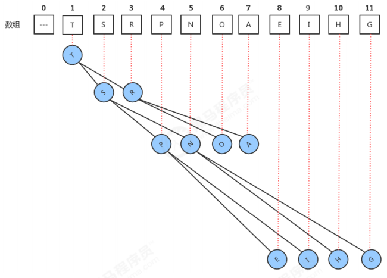
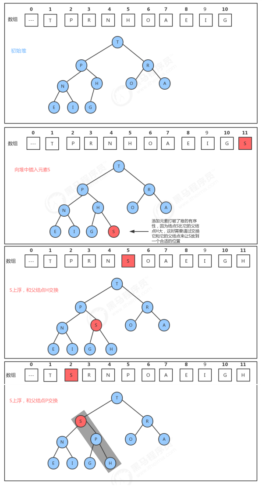
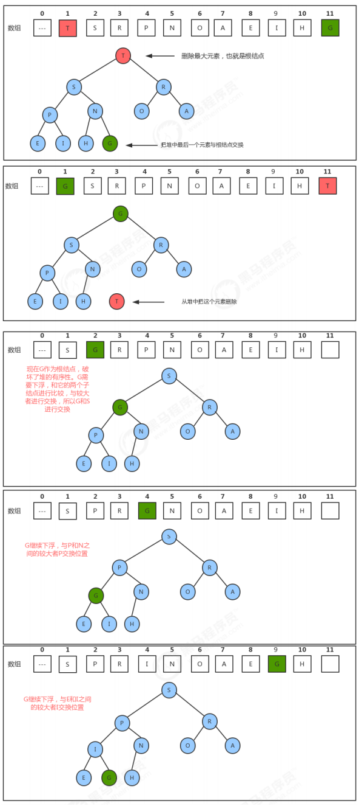
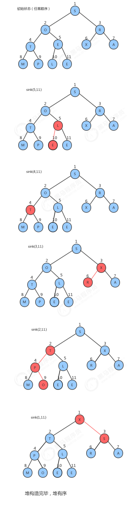
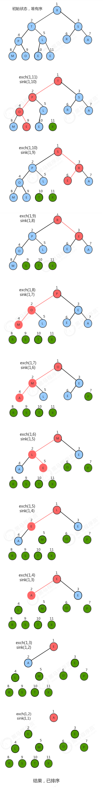
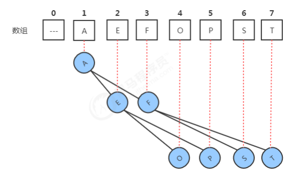
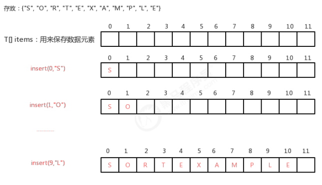
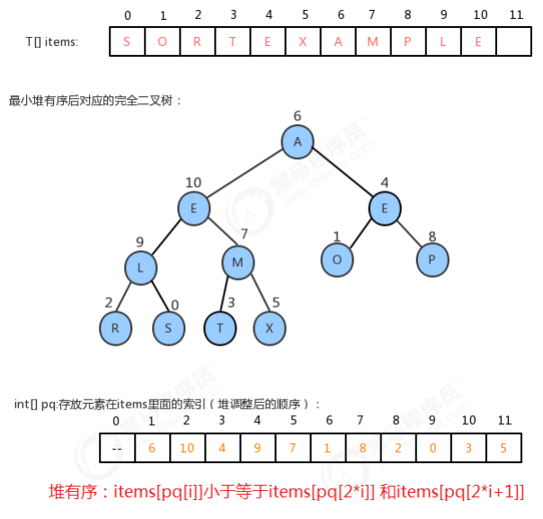
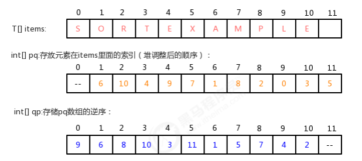

堆是计算机科学中一类特殊的数据结构的统称，堆通常可以被看做是一棵完全二叉树的数组对象。

## 堆的定义

1. 它是完全二叉树，除了树的最后一层结点不需要是满的，其它的每一层从左到右都是满的，如果最后一层结点不是满的，那么要求左满右不满。
2. 它通常用数组来实现。具体方法就是将二叉树的结点按照层级顺序放入数组中，根结点在位置1，它的子结点在位置2和3，而子结点的子结点则分别在位置4,5,6和7，以此类推。如果一个结点的位置为k，则它的父结点的位置为[k/2],而它的两个子结点的位置则分别为2k和2k+1。这样，在不使用指针的情况下，我们也可以通过计算数组的索引在树中上下移动：从a[k]向上一层，就令k等于k/2,向下一层就令k等于2k或2k+1。
3. 每个结点都大于等于它的两个子结点。这里要注意堆中仅仅规定了每个结点大于等于它的两个子结点，但这两个子结点的顺序并没有做规定，跟我们之前学习的二叉查找树是有区别的。



堆的API设计： 

类名 | Heap
-- | --
构造方法 | Heap(int capacity)：创建容量为capacity的Heap对象
成员方法 | 1.private boolean less(int i,int j)：判断堆中索引i处的元素是否小于索引j处的元素
        | 2.private void exch(int i,int j):交换堆中i索引和j索引处的值
        | 3.public T delMax():删除堆中最大的元素,并返回这个最大元素
        | 4.public void insert(T t)：往堆中插入一个元素
        | 5.private void swim(int k):使用上浮算法，使索引k处的元素能在堆中处于一个正确的位置
        | 6.private void sink(int k):使用下沉算法，使索引k处的元素能在堆中处于一个正确的位置
成员变量 | 1.private T[] imtes : 用来存储元素的数组
        | 2.private int N：记录堆中元素的个数

insert插入方法的实现：堆是用数组完成数据元素的存储的，由于数组的底层是一串连续的内存地址，所以我们要往堆中插入数据，我们只能往数组中从索引0处开始，依次往后存放数据，但是堆中对元素的顺序是有要求的，每一个结点的数据要大于等于它的两个子结点的数据，所以每次插入一个元素，都会使得堆中的数据顺序变乱，这个时候我们就需要通过一些方法让刚才插入的这个数据放入到合适的位置。



delMax删除最大元素方法的实现: 由堆的特性我们可以知道，索引1处的元素，也就是根结点就是最大的元素，当我们把根结点的元素删除后，需要有一个新的根结点出现，这时我们可以暂时把堆中最后一个元素放到索引1处，充当根结点，但是它有可能不满足堆的有序性需求，这个时候我们就需要通过一些方法，让这个新的根结点放入到合适的位置。所以，当删除掉最大元素后，只需要将最后一个元素放到索引1处，并不断的拿着当前结点a[k]与它的子结点a[2k]和a[2k+1]中的较大者交换位置，即可完成堆的有序调整。



代码实现：
```
todo
```

## 堆排序
实现步骤：
1. 构造堆；
2. 得到堆顶元素，这个值就是最大值；
3. 交换堆顶元素和数组中的最后一个元素，此时所有元素中的最大元素已经放到合适的位置；
4. 对堆进行调整，重新让除了最后一个元素的剩余元素中的最大值放到堆顶；
5. 重复2~4这个步骤，直到堆中剩一个元素为止。

类名 | HeapSort
-- | --
成员方法 | 1.public static void sort(Comparable[] source)：对source数组中的数据从小到大排序
        | 2.private static void createHeap(Comparable[] source, Comparable[] heap):根据原数组source，构造出堆heap
        | 3.private static boolean less(Comparable[] heap, int i, int j)：判断heap堆中索引i处的元素是否小于索引j处的元素
        | 4.private static void exch(Comparable[] heap, int i, int j):交换heap堆中i索引和j索引处的值
        | 5.private static void sink(Comparable[] heap, int target, int range):在heap堆中，对target处的元素做下沉，范围是0~range。

堆构造过程：堆的构造，最直观的想法就是另外再创建一个和新数组数组，然后从左往右遍历原数组，每得到一个元素后，添加到新数组中，并通过上浮，对堆进行调整，最后新的数组就是一个堆。上述的方式虽然很直观，也很简单，但是我们可以用更聪明一点的办法完成它。创建一个新数组，把原数组0~length-1的数据拷贝到新数组的1~length处，再从新数组长度的一半处开始往1索引处扫描（从右往左），然后对扫描到的每一个元素做下沉调整即可。可以这样做是因为堆是个完全二叉树，从数组一半处开始可以更快调整堆。



堆排序过程：对构造好的堆，我们只需要做类似于堆的删除操作，就可以完成排序。
1. 将堆顶元素和堆中最后一个元素交换位置；
2. 通过对堆顶元素下沉调整堆，把最大的元素放到堆顶(此时最后一个元素不参与堆的调整，因为最大的数据已经到了数组的最右边)
3. 重复1~2步骤，直到堆中剩最后一个元素。



## 优先队列
普通的队列是一种先进先出的数据结构，元素在队列尾追加，而从队列头删除。在某些情况下，我们可能需要找出队列中的最大值或者最小值，例如使用一个队列保存计算机的任务，一般情况下计算机的任务都是有优先级的，我们需要在这些计算机的任务中找出优先级最高的任务先执行，执行完毕后就需要把这个任务从队列中移除。普通的队列要完成这样的功能，需要每次遍历队列中的所有元素，比较并找出最大值，效率不是很高，这个时候，我们就可以使用一种特殊的队列来完成这种需求，优先队列。

优先队列按照其作用不同，可以分为以下两种：
- 最大优先队列：可以获取并删除队列中最大的值
- 最小优先队列：可以获取并删除队列中最小的值

###  最大优先队列
堆这种结构是可以方便的删除最大的值，所以，接下来我们可以基于堆区实现最大优先队列。

类名 | MaxPriorityQueue>
-- | --
构造方法 | MaxPriorityQueue(int capacity)：创建容量为capacity的MaxPriorityQueue对象
成员方法 | 1.private boolean less(int i,int j)：判断堆中索引i处的元素是否小于索引j处的元素
        | 2.private void exch(int i,int j):交换堆中i索引和j索引处的值
        | 3.public T delMax():删除队列中最大的元素,并返回这个最大元素
        | 4.public void insert(T t)：往队列中插入一个元素
        | 5.private void swim(int k):使用上浮算法，使索引k处的元素能在堆中处于一个正确的位置
        | 6.private void sink(int k):使用下沉算法，使索引k处的元素能在堆中处于一个正确的位置
        | 7.public int size():获取队列中元素的个数
        | 8.public boolean isEmpty():判断队列是否为空
成员变量 | 1.private T[] imtes : 用来存储元素的数组
        | 2.private int N：记录堆中元素的个数

代码实现：

```
todo
```

### 最小优先队列
最小优先队列实现起来也比较简单，我们同样也可以基于堆来完成最小优先队列。其实我们之前实现的堆可以把它叫做最大堆，我们可以用相反的思想实现最小堆，让堆中存放数据元素的数组满足如下特性：
1. 最小的元素放在数组的索引1处。
2. 每个结点的数据总是小于等于它的两个子结点的数据。



类名 | MinPriorityQueue
-- | --
构造方法 | MinPriorityQueue(int capacity)：创建容量为capacity的MinPriorityQueue对象
成员方法    | 1.private boolean less(int i,int j)：判断堆中索引i处的元素是否小于索引j处的元素
            | 2.private void exch(int i,int j):交换堆中i索引和j索引处的值
            | 3.public T delMin():删除队列中最小的元素,并返回这个最小元素
            | 4.public void insert(T t)：往队列中插入一个元素
            | 5.private void swim(int k):使用上浮算法，使索引k处的元素能在堆中处于一个正确的位置
            | 6.private void sink(int k):使用下沉算法，使索引k处的元素能在堆中处于一个正确的位置
            | 7.public int size():获取队列中元素的个数
            | 8.public boolean isEmpty():判断队列是否为空
成员变量    | 1.private T[] imtes : 用来存储元素的数组
            | 2.private int N：记录堆中元素的个数

代码实现：

```
todo
```

### 索引优先队列
在之前实现的最大优先队列和最小优先队列，他们可以分别快速访问到队列中最大元素和最小元素，但是他们有一个缺点，就是没有办法通过索引访问已存在于优先队列中的对象，并更新它们。为了实现这个目的，在优先队列的基础上，学习一种新的数据结构，索引优先队列。接下来我们以最小索引优先队列举列。

索引优先队列实现思路: 
1. 存储数据时，给每一个数据元素关联一个整数，例如insert(int k,T t),我们可以看做k是t关联的整数，那么我们的实现需要通过k这个值，快速获取到队列中t这个元素，此时有个k这个值需要具有唯一性。最直观的想法就是我们可以用一个T[] items数组来保存数据元素，在insert(int k,T t)完成插入时，可以把k看做是items数组的索引，把t元素放到items数组的索引k处，这样我们再根据k获取元素t时就很方便了，直接就可以拿到items[k]即可。



2. 步骤一完成后的结果，虽然我们给每个元素关联了一个整数，并且可以使用这个整数快速的获取到该元素，但是，items数组中的元素顺序是随机的，并不是堆有序的，所以，为了完成这个需求，我们可以增加一个数组int[]pq,来保存每个元素在items数组中的索引，pq数组需要堆有序，也就是说，pq[1]对应的数据元素items[pq[1]]要小于等于pq[2]和pq[3]对应的数据元素items[pq[2]]和items[pq[3]]。



3. 通过步骤二的分析，我们可以发现，其实我们通过上浮和下沉做堆调整的时候，其实调整的是pq数组。如果需要对items中的元素进行修改，比如让items[0]=“H”,那么很显然，我们需要对pq中的数据做堆调整，而且是调整pq[9]中元素的位置。但现在就会遇到一个问题，我们修改的是items数组中0索引处的值，如何才能快速的知道需要挑中pq[9]中元素的位置呢？最直观的想法就是遍历pq数组，拿出每一个元素和0做比较，如果当前元素是0，那么调整该索引处的元素即可，但是效率很低。我们可以另外增加一个数组，int[] qp,用来存储pq的逆序。例如：在pq数组中：pq[1]=6;那么在qp数组中，把6作为索引，1作为值，结果是：qp[6]=1; 当有了pq数组后，如果我们修改items[0]="H"，那么就可以先通过索引0，在qp数组中找到qp的索引：qp[0]=9,那么直接调整pq[9]即可。



索引优先队列API设计:

类名 | IndexMinPriorityQueue>
-- | --
构造方法 | IndexMinPriorityQueue(int capacity)：创建容量为capacity的IndexMinPriorityQueue对象
成员方法    | 1.private boolean less(int i,int j)：判断堆中索引i处的元素是否小于索引j处的元素
            | 2.private void exch(int i,int j):交换堆中i索引和j索引处的值
            | 3.public int delMin():删除队列中最小的元素,并返回该元素关联的索引
            | 4.public void insert(int i,T t)：往队列中插入一个元素,并关联索引i
            | 5.private void swim(int k):使用上浮算法，使索引k处的元素能在堆中处于一个正确的位置
            | 6.private void sink(int k):使用下沉算法，使索引k处的元素能在堆中处于一个正确的位置
            | 7.public int size():获取队列中元素的个数
            | 8.public boolean isEmpty():判断队列是否为空
            | 9.public boolean contains(int k):判断k对应的元素是否存在
            | 10.public void changeItem(int i, T t):把与索引i关联的元素修改为为t
            | 11.public int minIndex():最小元素关联的索引
            | 12.public void delete(int i):删除索引i关联的元素
成员变量    | 1.private T[] imtes : 用来存储元素的数组
            | 2.private int[] pq:保存每个元素在items数组中的索引，pq数组需要堆有序
            | 3.private int [] qp:保存qp的逆序，pq的值作为索引，pq的索引作为值
            | 4.private int N：记录堆中元素的个数

代码实现：
```
todo
```

## 参考资料
> - []()
> - []()
