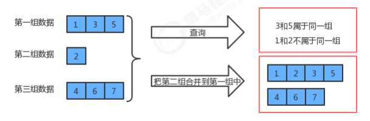
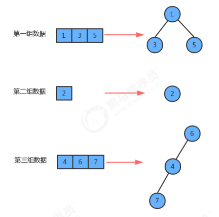
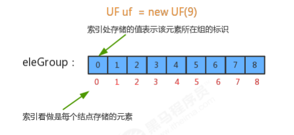
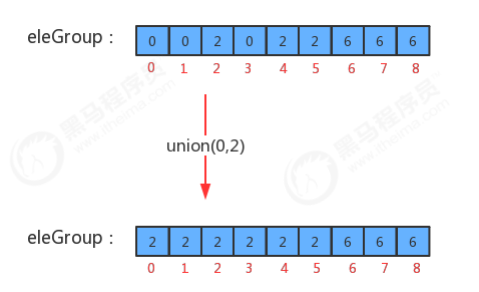
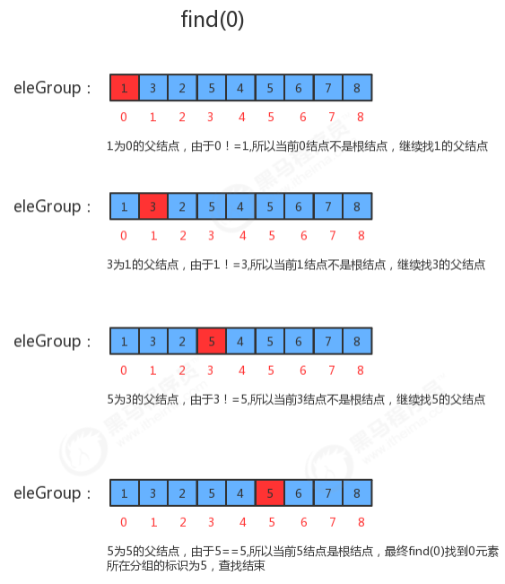
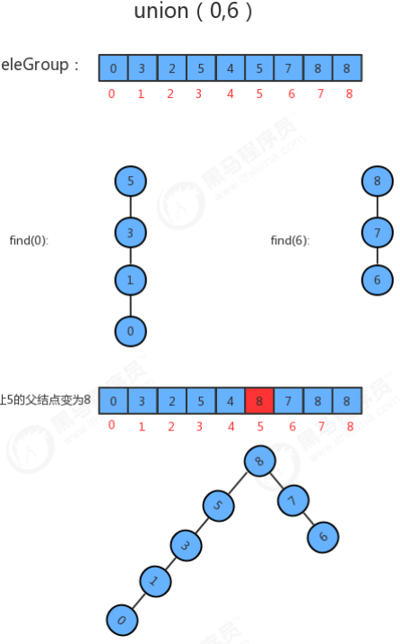
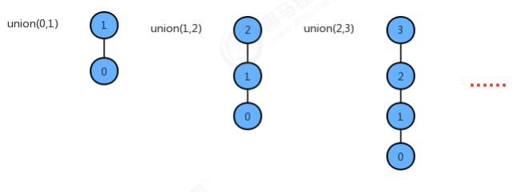
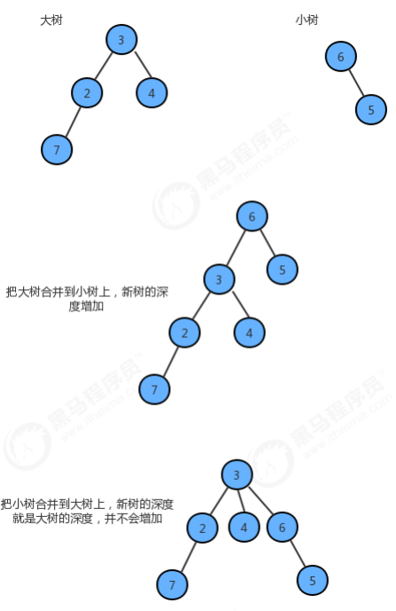
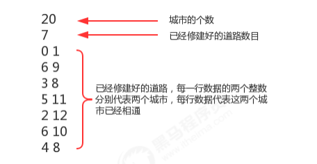

并查集是一种树型的数据结构 ，并查集可以高效地进行如下操作：
- 查询元素p和元素q是否属于同一组
- 合并元素p和元素q所在的组



## 并查集结构
并查集也是一种树型结构，但这棵树跟我们之前讲的二叉树、红黑树、B树等都不一样，这种树的要求比较简单：
1. 每个元素都唯一的对应一个结点；
2. 每一组数据中的多个元素都在同一颗树中；
3. 一个组中的数据对应的树和另外一个组中的数据对应的树之间没有任何联系；
4. 元素在树中并没有子父级关系的硬性要求；



类名 | UF
-- | --
构造方法 | UF(int N)：初始化并查集，以整数标识(0,N-1)个结点
成员方法    | 1.public int count()：获取当前并查集中的数据有多少个分组
            | 2.public boolean connected(int p,int q):判断并查集中元素p和元素q是否在同一分组中
            | 3.public int find(int p):元素p所在分组的标识符
            | 4.public void union(int p,int q)：把p元素所在分组和q元素所在分组合并
成员变量     | 1.private int[] eleAndGroup: 记录结点元素和该元素所在分组的标识
            | 2.private int count：记录并查集中数据的分组个数

## 并查集的实现
UF(int N)构造方法实现:
1. 初始情况下，每个元素都在一个独立的分组中，所以，初始情况下，并查集中的数据默认分为N个组；
2. 初始化数组eleAndGroup；
3. 把eleAndGroup数组的索引看做是每个结点存储的元素，把eleAndGroup数组每个索引处的值看做是该结点所在的分组，那么初始化情况下，i索引处存储的值就是i



union(int p,int q)合并方法实现:
1. 如果p和q已经在同一个分组中，则无需合并
2. 如果p和q不在同一个分组，则只需要将p元素所在组的所有的元素的组标识符修改为q元素所在组的标识符即可
3. 分组数量-1



代码实现：
```
todo
```

## 并查集应用举例
如果我们并查集存储的每一个整数表示的是一个大型计算机网络中的计算机，则我们就可以通过connected(intp,int q)来检测，该网络中的某两台计算机之间是否连通？如果连通，则他们之间可以通信，如果不连通，则不能通信，此时我们又可以调用union(int p,int q)使得p和q之间连通，这样两台计算机之间就可以通信了。

一般像计算机这样网络型的数据，我们要求网络中的每两个数据之间都是相连通的，也就是说，我们需要调用很多次union方法，使得网络中所有数据相连，其实我们很容易可以得出，如果要让网络中的数据都相连，则我们至少要调用N-1次union方法才可以，但由于我们的union方法中使用for循环遍历了所有的元素，所以很明显，我们之前实现的合并算法的时间复杂度是O(N^2)，如果要解决大规模问题，它是不合适的，所以我们需要对算法进行优化。

## UF_Tree算法优化
为了提升union算法的性能，我们需要重新设计find方法和union方法的实现，此时我们先需要对我们的之前数据结构中的eleAndGourp数组的含义进行重新设定：
1. 我们仍然让eleAndGroup数组的索引作为某个结点的元素；
2. eleAndGroup[i]的值不再是当前结点所在的分组标识，而是该结点的父结点；

类名 | UF_Tree
-- | --
构造方法 | UF_Tree(int N)：初始化并查集，以整数标识(0,N-1)个结点
成员方法 | 1.public int count()：获取当前并查集中的数据有多少个分组
        | 2.public boolean connected(int p,int q):判断并查集中元素p和元素q是否在同一分组中
        | 3.public int find(int p):元素p所在分组的标识符
        | 4.public void union(int p,int q)：把p元素所在分组和q元素所在分组合并
成员变量 | 1.private int[] eleAndGroup: 记录结点元素和该元素的父结点
        | 2.private int count：记录并查集中数据的分组个数

### find(int p)查询方法实现
1. 判断当前元素p的父结点eleAndGroup[p]是不是自己，如果是自己则证明已经是根结点了；
2. 如果当前元素p的父结点不是自己，则让p=eleAndGroup[p]，继续找父结点的父结点,直到找到根结点为止；



### union(int p,int q)合并方法实现
1. 找到p元素所在树的根结点
2. 找到q元素所在树的根结点
3. 如果p和q已经在同一个树中，则无需合并；
4. 如果p和q不在同一个分组，则只需要将p元素所在树根结点的父结点设置为q元素的根结点即可；
5. 分组数量-1



代码实现：
```
todo
```

### 优化后的性能分析
我们优化后的算法union，如果要把并查集中所有的数据连通，仍然至少要调用N-1次union方法，但是，我们发现union方法中已经没有了for循环，所以union算法的时间复杂度由O(N^2)变为了O(N)。
但是这个算法仍然有问题，因为我们之前不仅修改了union算法，还修改了find算法。我们修改前的find算法的时间复杂度在任何情况下都为O(1)，但修改后的find算法在最坏情况下是O(N)：

在union方法中调用了find方法，所以在最坏情况下union算法的时间复杂度仍然为O(N^2)

## 路径压缩
UF_Tree中最坏情况下union算法的时间复杂度为O(N^2)，其最主要的问题在于最坏情况下，树的深度和数组的大小一样，如果我们能够通过一些算法让合并时，生成的树的深度尽可能的小，就可以优化find方法。之前我们在union算法中，合并树的时候将任意的一棵树连接到了另外一棵树，这种合并方法是比较暴力的，如果我们把并查集中每一棵树的大小记录下来，然后在每次合并树的时候，把较小的树连接到较大的树上，就可以减小树的深度。


只要我们保证每次合并，都能把小树合并到大树上，就能够压缩合并后新树的路径，这样就能提高find方法的效率。为了完成这个需求，我们需要另外一个数组来记录存储每个根结点对应的树中元素的个数，并且需要一些代码调整数组中的值。

UF_Tree_Weighted API设计:

类名 | UF_Tree_Weighted
-- | --
构造方法 | UF_Tree_Weighted(int N)：初始化并查集，以整数标识(0,N-1)个结点
成员方法    | 1.public int count()：获取当前并查集中的数据有多少个分组
           | 2.public boolean connected(int p,int q):判断并查集中元素p和元素q是否在同一分组中
            | 3.public int find(int p):元素p所在分组的标识符
            | 4.public void union(int p,int q)：把p元素所在分组和q元素所在分组合并
成员变量    | 1.private int[] eleAndGroup: 记录结点元素和该元素的父结点
            | 2.private int[] sz: 存储每个根结点对应的树中元素的个数
            | 3.private int count：记录并查集中数据的分组个数

代码实现：
```
todo
```

## 案例-畅通工程
某省调查城镇交通状况，得到现有城镇道路统计表，表中列出了每条道路直接连通的城镇。省政府“畅通工程”的目标是使全省任何两个城镇间都可以实现交通（但不一定有直接的道路相连，只要互相间接通过道路可达即可）。问最少还需要建设多少条道路？

在我们的测试数据文件夹中有一个trffic_project.txt文件，它就是诚征道路统计表，下面是对数据的解释：


总共有20个城市，目前已经修改好了7条道路，问还需要修建多少条道路，才能让这20个城市之间全部相通？

解题思路：
1. 创建一个并查集UF_Tree_Weighted(20);
2. 分别调用union(0,1),union(6,9),union(3,8),union(5,11),union(2,12),union(6,10),union(4,8)，表示已经修建好的道路把对应的城市连接起来；
3. 如果城市全部连接起来，那么并查集中剩余的分组数目为1，所有的城市都在一个树中，所以，只需要获取当前并查集中剩余的数目，减去1，就是还需要修建的道路数目；

代码实现：
```
todo
```

## 参考资料
> - []()
> - []()
