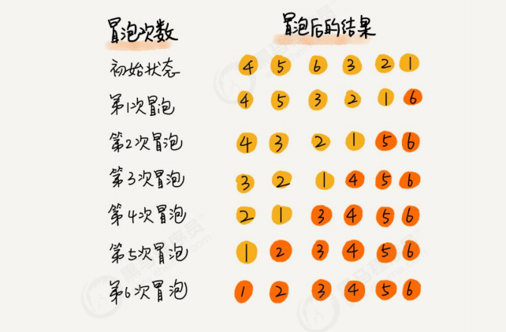
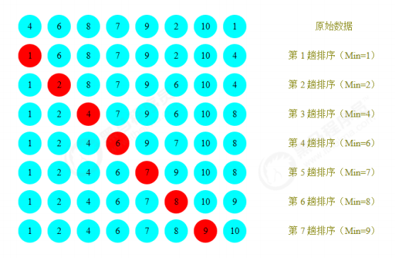
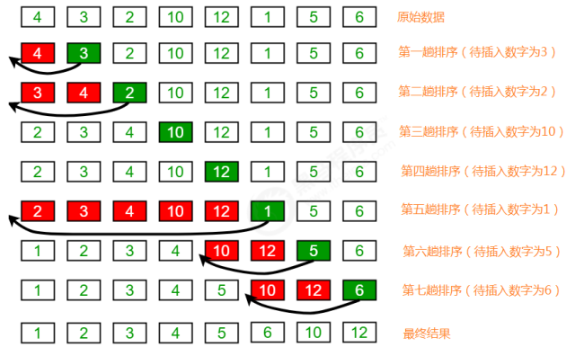
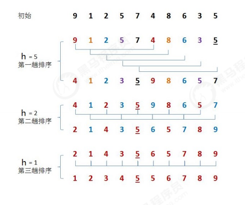
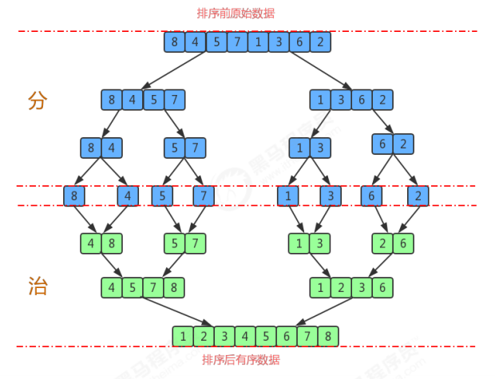
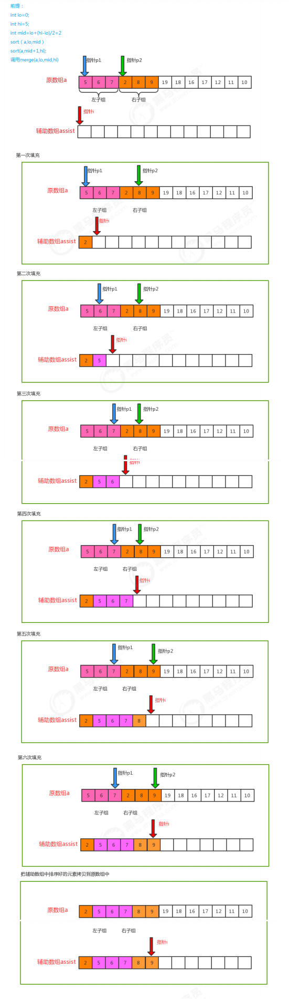
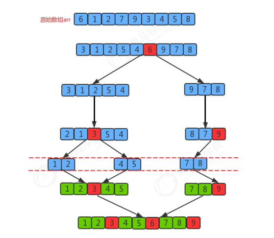
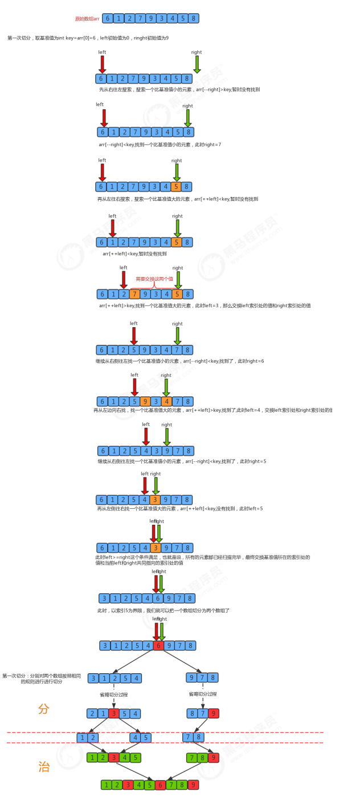
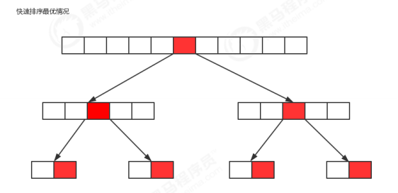
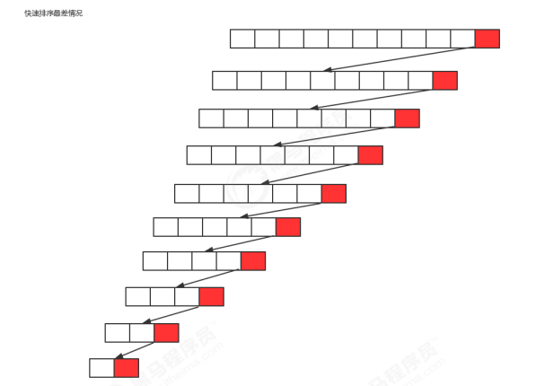

简单排序算法：冒泡、选择、插入，在最坏情况下的时间复杂度都是O(N^2)
高级排序算法：希尔、归并、快速、堆

Comparable接口：由于是排序，所以肯定会在元素之间进行比较，而Java提供了一个接口Comparable就是用来定义排序规则的。

## 冒泡排序
排序原理：
1. 比较相邻的元素。如果前一个元素比后一个元素大，就交换这两个元素的位置。
2. 对每一对相邻元素做同样的工作，从开始第一对元素到结尾的最后一对元素。最终最后位置的元素就是最大值。



类名 | Bubble
-- | --
构造方法 | Bubble()：创建Bubble对象
成员方法    | 1.public static void sort(Comparable[] a)：对数组内的元素进行排序
            | 2.private static boolean greater(Comparable v,Comparable w):判断v是否大于w
            | 3.private static void exch(Comparable[] a,int i,int j)：交换a数组中，索引i和索引j处的值

代码实现：
```
public class Bubble {

    public static void sort(Comparable[] a) {
        for (int i = a.length - 1; i > 0; i--) {
            for (int j = 0; j < i; j++ ) {
                if (greater(a[j], a[j + 1])) {
                    exch(a, j, j + 1);
                }
            }
        }
    }

    private static boolean greater(Comparable v, Comparable w) {
        return v.compareTo(w) > 0;
    }

    private static void exch(Comparable[] a, int i, int j) {
        Comparable temp = a[i];
        a[i] = a[j];
        a[j] = temp;
    }

    public static void main(String[] args) {
        Integer[] arr = new Integer[]{4,5,6,3,2,1};
        Bubble.sort(arr);
        System.out.println(Arrays.toString(arr));
    }
}
```

冒泡排序的时间复杂度分析:

冒泡排序使用了双层for循环，其中内层循环的循环体是真正完成排序的代码，所以，我们分析冒泡排序的时间复杂度，主要分析一下内层循环体的执行次数即可。在最坏情况下，也就是假如要排序的元素为{6,5,4,3,2,1}逆序，那么：
- 元素比较的次数为：(N-1)+(N-2)+(N-3)+...+2+1=((N-1)+1)*(N-1)/2=N^2/2-N/2;
- 元素交换的次数为：(N-1)+(N-2)+(N-3)+...+2+1=((N-1)+1)*(N-1)/2=N^2/2-N/2;
- 总执行次数为：(N^2/2-N/2)+(N^2/2-N/2)=N^2-N;

按照大O推导法则，保留函数中的最高阶项那么最终冒泡排序的时间复杂度为O(N^2).

## 选择排序
排序原理：
1. 每一次遍历的过程中，都假定第一个索引处的元素是最小值，和其他索引处的值依次进行比较，如果当前索引处的值大于其他某个索引处的值，则假定其他某个索引出的值为最小值，最后可以找到最小值所在的索引
2. 交换第一个索引处和最小值所在的索引处的值



类名 | Selection
-- | --
构造方法 | Selection()：创建Selection对象
成员方法    | 1.public static void sort(Comparable[] a)：对数组内的元素进行排序
            | 2.private static boolean greater(Comparable v,Comparable w):判断v是否大于w
            | 3.private static void exch(Comparable[] a,int i,int j)：交换a数组中，索引i和索引j处的值

代码实现：
```
public class Selection {

    public static void sort(Comparable[] a) {
        for (int i = 0; i < a.length; i++) {
            int minIndex = i;
            for (int j = i + 1; j < a.length; j++) {
                if (greater(a[minIndex], a[j])) {
                    minIndex = j;
                }
            }
            exch(a, i, minIndex);
        }
    }
}
```

选择排序的时间复杂度分析：

选择排序使用了双层for循环，其中外层循环完成了数据交换，内层循环完成了数据比较，所以我们分别统计数据交换次数和数据比较次数：
- 数据比较次数：(N-1)+(N-2)+(N-3)+...+2+1=((N-1)+1)*(N-1)/2=N^2/2-N/2;
- 数据交换次数： N-1
- 时间复杂度：N^2/2-N/2+（N-1）=N^2/2+N/2-1;

根据大O推导法则，保留最高阶项，去除常数因子，时间复杂度为O(N^2);

## 插入排序
插入排序的工作方式非常像人们排序一手扑克牌一样。开始时，我们的左手为空并且桌子上的牌面朝下。然后，我们每次从桌子上拿走一张牌并将它插入左手中正确的位置。为了找到一张牌的正确位置，我们从右到左将它与已在手中的每张牌进行比较。

排序原理：
1. 把所有的元素分为两组，已经排序的和未排序的；
2. 找到未排序的组中的第一个元素，向已经排序的组中进行插入；
3. 倒叙遍历已经排序的元素，依次和待插入的元素进行比较，直到找到一个元素小于等于待插入元素，那么就把待插入元素放到这个位置，其他的元素向后移动一位；



类名 | Insertion
-- | --
构造方法 | Insertion()：创建Insertion对象
成员方法    | 1.public static void sort(Comparable[] a)：对数组内的元素进行排序
            | 2.private static boolean greater(Comparable v,Comparable w):判断v是否大于w
            | 3.private static void exch(Comparable[] a,int i,int j)：交换a数组中，索引i和索引j处的值

代码实现：
```
public class Insertion {

    public static void sort(Integer[] arr) {
        for (int i = 1; i < arr.length; i++) {
            for (int j = i; j > 0; j--) {
                if (greater(arr[j - 1], arr[j])) {
                    exch(arr, j - 1, j);
                } else {
                    break;
                }
            }
        }
    }

}
```

插入排序的时间复杂度分析:

插入排序使用了双层for循环，其中内层循环的循环体是真正完成排序的代码，所以，我们分析插入排序的时间复杂度，主要分析一下内层循环体的执行次数即可。最坏情况，也就是待排序的数组元素为{12,10,6,5,4,3,2,1}，那么：
- 比较的次数为：(N-1)+(N-2)+(N-3)+...+2+1=((N-1)+1)*(N-1)/2=N^2/2-N/2;
- 交换的次数为：(N-1)+(N-2)+(N-3)+...+2+1=((N-1)+1)*(N-1)/2=N^2/2-N/2;
- 总执行次数为：(N^2/2-N/2)+(N^2/2-N/2)=N^2-N;

按照大O推导法则，保留函数中的最高阶项那么最终插入排序的时间复杂度为O(N^2)

## 希尔排序
希尔排序是插入排序的一种，又称“缩小增量排序”，是插入排序算法的一种更高效的改进版本。

前面学习插入排序的时候，我们会发现一个很不友好的事儿，如果已排序的分组元素为{2,5,7,9,10}，未排序的分组元素为{1,8}，那么下一个待插入元素为1，我们需要拿着1从后往前，依次和10,9,7,5,2进行交换位置，才能完成真正的插入，每次交换只能和相邻的元素交换位置。那如果我们要提高效率，直观的想法就是一次交换，能把1放到更前面的位置，比如一次交换就能把1插到2和5之间，这样一次交换1就向前走了5个位置，可以减少交换的次数，这样的需求如何实现呢？接下来我们来看看希尔排序的原理。

排序原理：
1. 选定一个增长量h，按照增长量h作为数据分组的依据，对数据进行分组；
2. 对分好组的每一组数据完成插入排序；
3. 减小增长量，最小减为1，重复第二步操作。



增长量h的确定：增长量h的值每一固定的规则，我们这里采用以下规则：
```
// N是待排序数组长度
int h = 1
while(h < N / 2){
    h = 2 * h + 1；//3,7
}

//循环结束后我们就可以确定h的最大值；
h的减小规则为：h=h/2
```

类名 | Shell
-- | --
构造方法 | Shell()：创建Shell对象
成员方法 | 1.public static void sort(Comparable[] a)：对数组内的元素进行排序
        | 2.private static boolean greater(Comparable v,Comparable w):判断v是否大于w
        | 3.private static void exch(Comparable[] a,int i,int j)：交换a数组中，索引i和索引j处的值

代码实现：

```
todo
```

希尔排序的时间复杂度分析:

在希尔排序中，增长量h并没有固定的规则，有很多论文研究了各种不同的递增序列，但都无法证明某个序列是最好的，对于希尔排序的时间复杂度分析，已经超出了我们的范畴，所以在这里就不做分析了。

## 归并排序
归并排序是建立在归并操作上的一种有效的排序算法，该算法是采用分治法的一个非常典型的应用。将已有序的子序列合并，得到完全有序的序列；即先使每个子序列有序，再使子序列段间有序。若将两个有序表合并成一个有序表，称为二路归并。

排序原理：
1. 尽可能的一组数据拆分成两个元素相等的子组，并对每一个子组继续拆分，直到拆分后的每个子组的元素个数是1为止。
2. 将相邻的两个子组进行合并成一个有序的大组；
3. 不断的重复步骤2，直到最终只有一个组为止。



类名 | Merge
-- | --
构造方法 | Merge()：创建Merge对象
成员方法    | 1.public static void sort(Comparable[] a)：对数组内的元素进行排序
            | 2.private static void sort(Comparable[] a, int lo, int hi)：对数组a中从索引lo到索引hi之间的元素进行排序
            | 3.private static void merge(Comparable[] a, int lo, int mid, int hi):从索引lo到mid为一个子组，从索引mid+1到hi为另一个子组，把数组a中的这两个子组的数据合并成一个有序的大组（从索引lo到hi）
            | 4.private static boolean less(Comparable v,Comparable w):判断v是否小于w
            | 5.private static void exch(Comparable[] a,int i,int j)：交换a数组中，索引i和索引j处的值
成员变量    | 1.private static Comparable[] assist：完成归并操作需要的辅助数组

合并实现：


代码实现：
```
todo
```

归并排序时间复杂度分析：

归并排序是分治思想的最典型的例子，上面的算法中，对a[lo...hi]进行排序，先将它分为a[lo...mid]和a[mid+1...hi]两部分，分别通过递归调用将他们单独排序，最后将有序的子数组归并为最终的排序结果。该递归的出口在于如果一个数组不能再被分为两个子数组，那么就会执行merge进行归并，在归并的时候判断元素的大小进行排序。

上面用树状图来描述归并，如果一个数组有8个元素，那么它将每次除以2找最小的子数组，共拆log8次，值为3，所以树共有3层,那么自顶向下第k层有2^k个子数组，每个数组的长度为2^(3-k)，归并最多需要2^(3-k)次比较。因此每层的比较次数为 2^k * 2^(3-k)=2^3,那么3层总共为 3*2^3。

假设元素的个数为n，那么使用归并排序拆分的次数为log2(n),所以共log2(n)层，那么使用log2(n)替换上面3*2^3中的3这个层数，最终得出的归并排序的时间复杂度为：log2(n)* 2^(log2(n))=log2(n)*n,根据大O推导法则，忽略底数，最终归并排序的时间复杂度为O(nlogn);

归并排序的缺点：需要申请额外的数组空间，导致空间复杂度提升，是典型的以空间换时间的操作。

## 快速排序
快速排序是对冒泡排序的一种改进。它的基本思想是：通过一趟排序将要排序的数据分割成独立的两部分，其中一部分的所有数据都比另外一部分的所有数据都要小，然后再按此方法对这两部分数据分别进行快速排序，整个排序过程可以递归进行，以此达到整个数据变成有序序列。

排序原理：
1. 首先设定一个分界值，通过该分界值将数组分成左右两部分；
2. 将大于或等于分界值的数据放到到数组右边，小于分界值的数据放到数组的左边。此时左边部分中各元素都小于或等于分界值，而右边部分中各元素都大于或等于分界值；
3. 然后，左边和右边的数据可以独立排序。对于左侧的数组数据，又可以取一个分界值，将该部分数据分成左右两部分，同样在左边放置较小值，右边放置较大值。右侧的数组数据也可以做类似处理。
4. 重复上述过程，可以看出，这是一个递归定义。通过递归将左侧部分排好序后，再递归排好右侧部分的顺序。当左侧和右侧两个部分的数据排完序后，整个数组的排序也就完成了。



类名 | Quick
-- | --
构造方法 | Quick()：创建Quick对象
成员方法    | 1.public static void sort(Comparable[] a)：对数组内的元素进行排序
            | 2.private static void sort(Comparable[] a, int lo, int hi)：对数组a中从索引lo到索引hi之间的元素进行排序
            | 3.public static int partition(Comparable[] a,int lo,int hi):对数组a中，从索引 lo到索引 hi之间的元素进行分组，并返回分组界限对应的索引
            | 4.private static boolean less(Comparable v,Comparable w):判断v是否小于w
            | 5.private static void exch(Comparable[] a,int i,int j)：交换a数组中，索引i和索引j处的值

把一个数组切分成两个子数组的基本思想：
1. 找一个基准值，用两个指针分别指向数组的头部和尾部；
2. 先从尾部向头部开始搜索一个比基准值小的元素，搜索到即停止，并记录指针的位置；
3. 再从头部向尾部开始搜索一个比基准值大的元素，搜索到即停止，并记录指针的位置；
4. 交换当前左边指针位置和右边指针位置的元素；
5. 重复2,3,4步骤，直到左边指针的值大于右边指针的值停止。



代码实现：
```
todo
```

快速排序和归并排序的区别：快速排序是另外一种分治的排序算法，它将一个数组分成两个子数组，将两部分独立的排序。快速排序和归并排序是互补的：归并排序将数组分成两个子数组分别排序，并将有序的子数组归并从而将整个数组排序，而快速排序的方式则是当两个数组都有序时，整个数组自然就有序了。在归并排序中，一个数组被等分为两半，归并调用发生在处理整个数组之前，在快速排序中，切分数组的位置取决于数组的内容，递归调用发生在处理整个数组之后。

快速排序时间复杂度分析：快速排序的一次切分从两头开始交替搜索，直到left和right重合，因此，一次切分算法的时间复杂度为O(n),但整个快速排序的时间复杂度和切分的次数相关。

最优情况：每一次切分选择的基准数字刚好将当前序列等分。



如果我们把数组的切分看做是一个树，那么上图就是它的最优情况的图示，共切分了logn次，所以，最优情况下快速排序的时间复杂度为O(nlogn);

最坏情况：每一次切分选择的基准数字是当前序列中最大数或者最小数，这使得每次切分都会有一个子组，那么总共就得切分n次，所以，最坏情况下，快速排序的时间复杂度为O(n^2);



平均情况：每一次切分选择的基准数字不是最大值和最小值，也不是中值，这种情况我们也可以用数学归纳法证明，快速排序的时间复杂度为O(nlogn),由于数学归纳法有很多数学相关的知识，容易使我们混乱，所以这里就不对平均情况的时间复杂度做证明了。

## 排序的稳定性
稳定性的定义：数组arr中有若干元素，其中A元素和B元素相等，并且A元素在B元素前面，如果使用某种排序算法排序后，能够保证A元素依然在B元素的前面，可以说这个该算法是稳定的。

稳定性的意义：如果一组数据只需要一次排序，则稳定性一般是没有意义的，如果一组数据需要多次排序，稳定性是有意义的。例如要排序的内容是一组商品对象，第一次排序按照价格由低到高排序，第二次排序按照销量由高到低排序，如果第二次排序使用稳定性算法，就可以使得相同销量的对象依旧保持着价格高低的顺序展现，只有销量不同的对象才需要重新排序。这样既可以保持第一次排序的原有意义，而且可以减少系统开销。

常见排序算法的稳定性：
- 冒泡排序：只有当arr[i]>arr[i+1]的时候，才会交换元素的位置，而相等的时候并不交换位置，所以冒泡排序是一种稳定排序算法。
- 选择排序: 选择排序是给每个位置选择当前元素最小的,例如有数据{5(1)，8 ，5(2)， 2， 9 },第一遍选择到的最小元素为2，所以5(1)会和2进行交换位置，此时5(1)到了5(2)后面，破坏了稳定性，所以选择排序是一种不稳定的排序算法。
- 插入排序：比较是从有序序列的末尾开始，也就是想要插入的元素和已经有序的最大者开始比起，如果比它大则直接插入在其后面，否则一直往前找直到找到它该插入的位置。如果碰见一个和插入元素相等的，那么把要插入的元素放在相等元素的后面。所以，相等元素的前后顺序没有改变，从原无序序列出去的顺序就是排好序后的顺序，所以插入排序是稳定的。
- 希尔排序：希尔排序是按照不同步长对元素进行插入排序 ,虽然一次插入排序是稳定的，不会改变相同元素的相对顺序，但在不同的插入排序过程中，相同的元素可能在各自的插入排序中移动，最后其稳定性就会被打乱，所以希尔排序是不稳定的。
- 归并排序：归并排序在归并的过程中，只有arr[i]<arr[i+1]的时候才会交换位置，如果两个元素相等则不会交换位置，所以它并不会破坏稳定性，归并排序是稳定的。
- 快速排序：快速排序需要一个基准值，在基准值的右侧找一个比基准值小的元素，在基准值的左侧找一个比基准值大的元素，然后交换这两个元素，此时会破坏稳定性，所以快速排序是一种不稳定的算法。

## 参考资料
> - []()
> - []()
