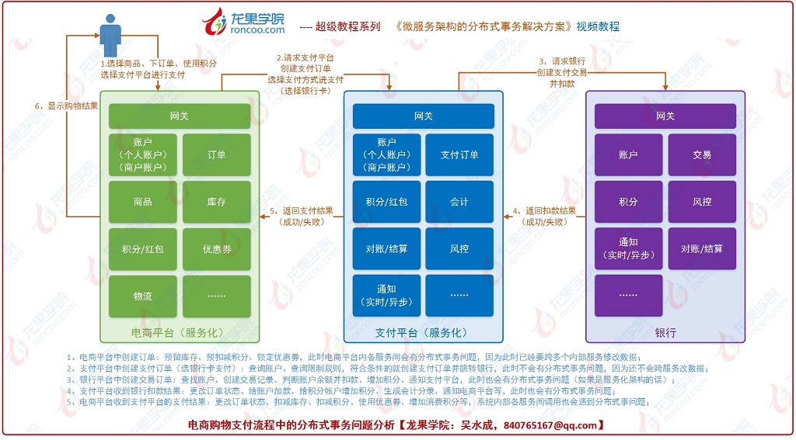
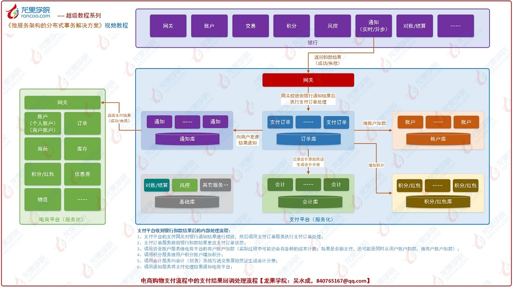
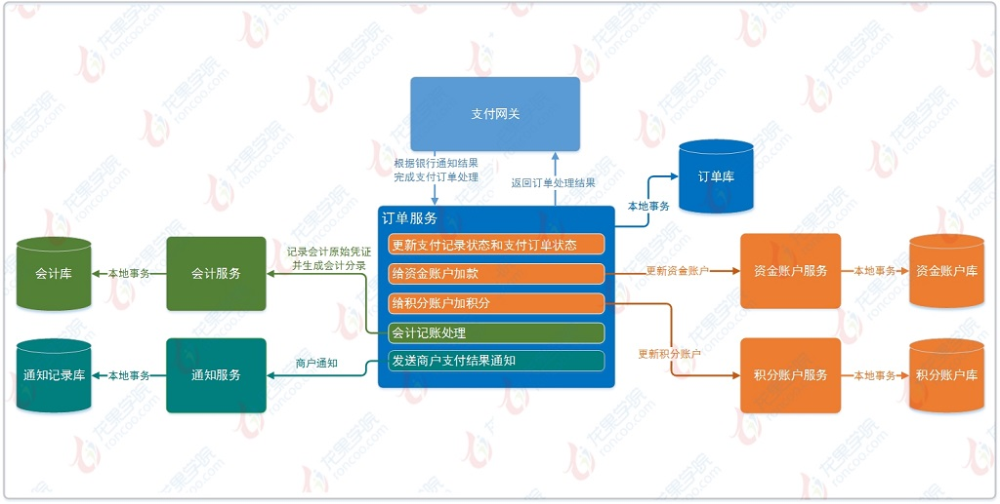
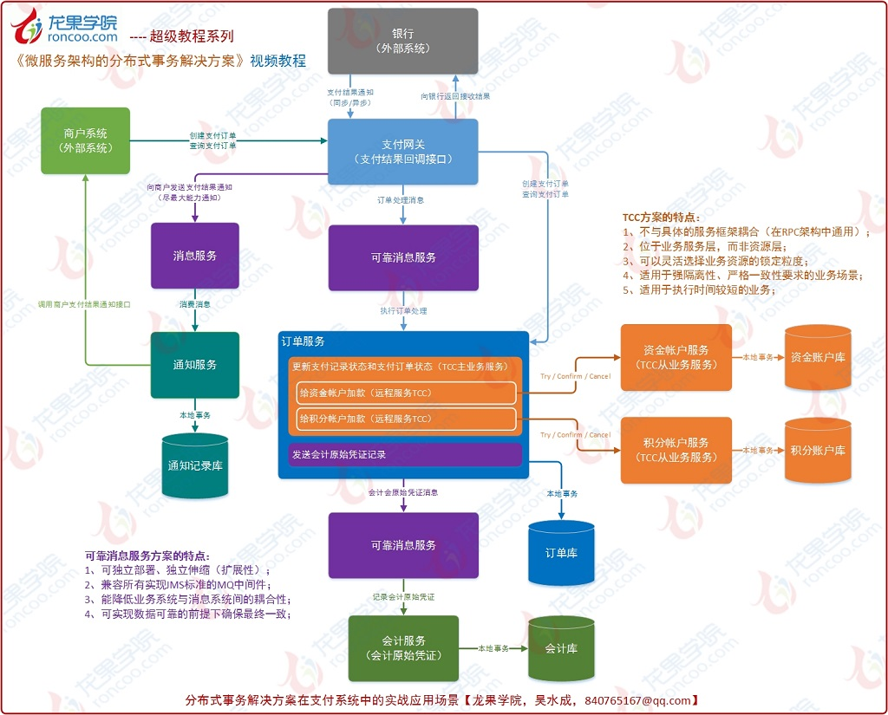
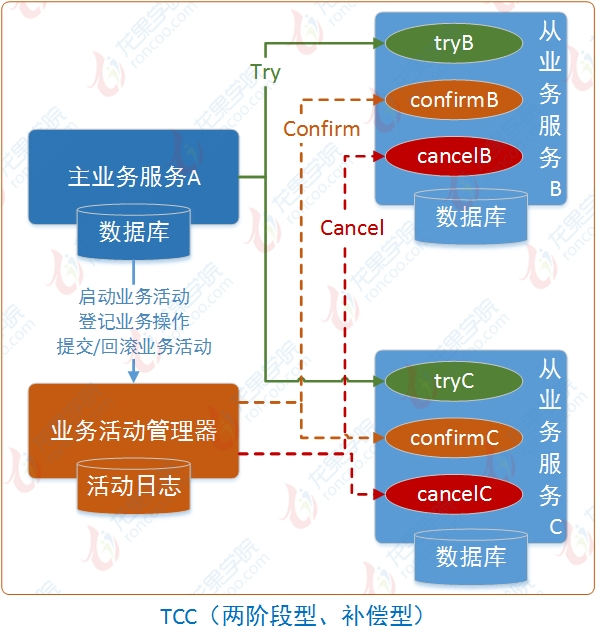
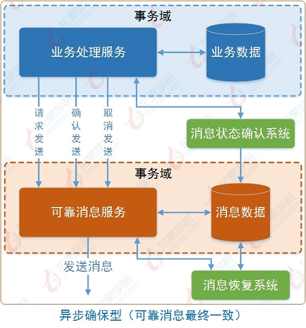
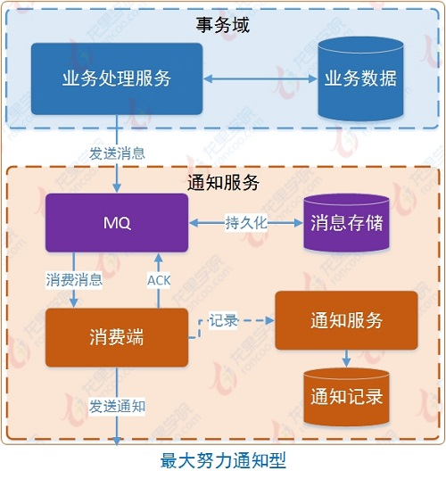

高并发下一般采用柔性事务，柔性事务是指非强一致性，而是通过某种方式达到最终一致的事务方案，根据应用场景不同，主要有以下三种：

1. 可靠消息的最终一致性方案
2. TCC两阶段型方案
3. 最大努力通知型方案

下面我们以电商购物支付流程中，在各大参与者系统中可能会遇到分布式事务问题的场景进行详细的分析！




如上图所示，假设三大参与平台（电商平台、支付平台、银行）的系统都做了分布式系统架构拆分，按上数中的流程步骤进行分析：

1. 电商平台中创建订单：预留库存、预扣减积分、锁定优惠券，此时电商平台内各服务间会有分布式事务问题，因为此时已经要跨多个内部服务修改数据；
2. 支付平台中创建支付订单（选银行卡支付）：查询账户、查询限制规则，符合条件的就创建支付订单并跳转银行，此时不会有分布式事务问题，因为还不会跨服务改数据；
3. 银行平台中创建交易订单：查找账户、创建交易记录、判断账户余额并扣款、增加积分、通知支付平台，此时也会有分布式事务问题（如果是服务化架构的话）；
4. 支付平台收到银行扣款结果：更改订单状态、给账户加款、给积分帐户增加积分、生成会计分录、通知电商平台等，此时也会有分布式事务问题；
5. 电商平台收到支付平台的支付结果：更改订单状态、扣减库存、扣减积分、使用优惠券、增加消费积分等，系统内部各服务间调用也会遇到分布式事问题；





如上图，支付平台收到银行扣款结果后的内部处理流程：

1. 支付平台的支付网关对银行通知结果进行校验，然后调用支付订单服务执行支付订单处理；
2. 支付订单服务根据银行扣款结果更改支付订单状态；
3. 调用资金账户服务给电商平台的商户账户加款（实际过程中可能还会有各种的成本计费；如果是余额支付，还可能是同时从用户账户扣款，给商户账户加款）；
4. 调用积分服务给用户积分账户增加积分；
5. 调用会计服务向会计（财务）系统写进交易原始凭证生成会计分录；
6. 调用通知服务将支付处理结果通知电商平台；



如上图，把支付系统中的银行扣款成功回调处理流程提取出来，对应的分布式事务问题的代码场景：

```
/** 支付订单处理 **/
@Transactional(rollbackFor = Exception.class)
public void completeOrder() {
    orderDao.update();  // 订单服务本地更新订单状态
    accountService.update();  // 调用资金账户服务给资金帐户加款
    pointService.update();  // 调用积分服务给积分帐户增加积分
    accountingService.insert();  // 调用会计服务向会计系统写入会计原始凭证
    merchantNotifyService.notify();  // 调用商户通知服务向商户发送支付结果通知
}
```

以上分布式事务问题，需要多种分布式事务解决方案来进行处理。

基于支付系统真实业务中的经典场景来对“可靠消息的最终一致性方案”、“TCC两阶段型方案”和“最大努力通知型方案”这3种柔性事务解决方案进行具体设计实现和详细讲解。




- 订单处理：本地事务
- 资金账户加款、积分账户增加积分：TCC型事务（或两阶段提交型事务），实时性要求比较高，数据必须可靠。



- 会计记账：异步确保型事务（基于可靠消息的最终一致性，可以异步，但数据绝对不能丢，而且一定要记账成功）



- 商户通知：最大努力通知型事务（按规律进行通知，不保证数据一定能通知成功，但会提供可查询操作接口进行核对）




## TCC编程模式

所谓的TCC编程模式，也是两阶段提交的一个变种。TCC提供了一个编程框架，将整个业务逻辑分为三块：Try、Confirm和Cancel三个操作。以在线下单为例，Try阶段会去扣库存，Confirm阶段则是去更新订单状态，如果更新订单失败，则进入Cancel阶段，会去恢复库存。总之，TCC就是通过代码人为实现了两阶段提交，不同的业务场景所写的代码都不一样，复杂度也不一样，因此，这种模式并不能很好地被复用。

## **本地消息表**

这种实现方式的思路，其实是源于ebay，后来通过支付宝等公司的布道，在业内广泛使用。其基本的设计思想是将远程分布式事务拆分成一系列的本地事务。如果不考虑性能及设计优雅，借助关系型数据库中的表即可实现。

举个经典的跨行转账的例子来描述。

1. 通过本地事务保证了扣款1W和凭证消息插入到消息表中。
2. 通知对方银行账户上加1W了。那问题来了，如何通知到对方呢？

通常采用两种方式：

- 采用时效性高的MQ，由对方订阅消息并监听，有消息时自动触发事件
- 采用定时轮询扫描的方式，去检查消息表的数据。


两种方式其实各有利弊，仅仅依靠MQ，可能会出现通知失败的问题。而过于频繁的定时轮询，效率也不是最佳的（90%是无用功）。所以，我们一般会把两种方式结合起来使用。

解决了通知的问题，又有新的问题了。万一这消息有重复被消费，往用户帐号上多加了钱，那岂不是后果很严重？

仔细思考，其实我们可以消息消费方，也通过一个“消费状态表”来记录消费状态。在执行“加款”操作之前，检测下该消息（提供标识）是否已经消费过，消费完成后，通过本地事务控制来更新这个“消费状态表”。这样子就避免重复消费的问题。

总结：上诉的方式是一种非常经典的实现，基本避免了分布式事务，实现了“最终一致性”。但是，关系型数据库的吞吐量和性能方面存在瓶颈，频繁的读写消息会给数据库造成压力。所以，在真正的高并发场景下，该方案也会有瓶颈和限制的。


## 参考资料
> - []()
> - []()
