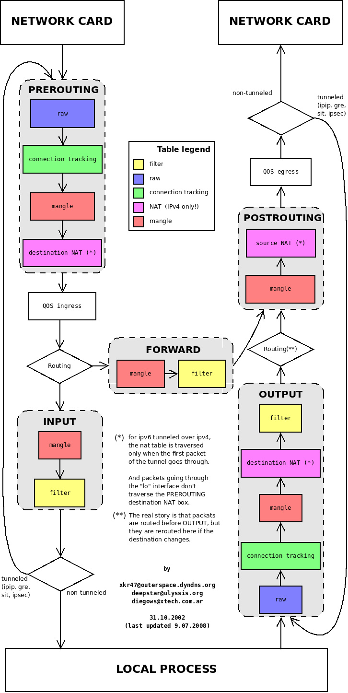
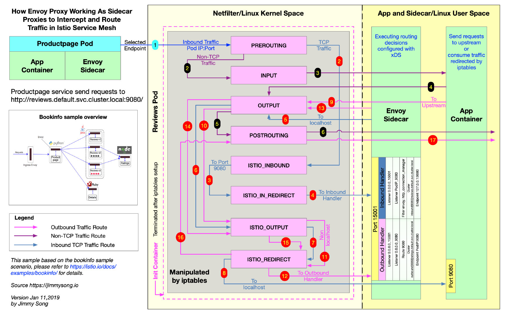

在讲解 Istio 如何将 Envoy 代理注入到应用程序 Pod 中之前，我们需要先了解以下几个概念：

- Sidecar 模式：容器应用模式之一，Service Mesh 架构的一种实现方式。
- Init 容器：Pod 中的一种专用的容器，在应用程序容器启动之前运行，用来包含一些应用镜像中不存在的实用工具或安装脚本。
- iptables：流量劫持是通过 iptables 转发实现的。


## Init 容器

Init 容器是一种专用容器，它在应用程序容器启动之前运行，用来包含一些应用镜像中不存在的实用工具或安装脚本。

一个 Pod 中可以指定多个 Init 容器，如果指定了多个，那么 Init 容器将会按顺序依次运行。只有当前面的 Init  容器必须运行成功后，才可以运行下一个 Init 容器。当所有的 Init 容器运行完成后，Kubernetes 才初始化 Pod  和运行应用容器。

在所有的 Init 容器没有成功之前，Pod 将不会变成 `Ready` 状态。Init 容器的端口将不会在 Service 中进行聚集。 正在初始化中的 Pod 处于 `Pending` 状态，但应该会将 `Initializing` 状态设置为 true。Init 容器运行完成以后就会自动终止。


## Istio注入Sidecar代理

基于k8s平台，在Istio注入sidecar之后，Service没有变化，所有变化都在`Deployment` 里，Istio 给应用 Pod 注入的配置主要包括：

- Init 容器 `istio-init`：用于给 Sidecar 容器即 Envoy 代理做初始化，设置 iptables 端口转发，该容器存在的意义就是让 Envoy 代理可以拦截所有的进出 Pod 的流量，即将入站流量重定向到 Sidecar，再拦截应用容器的出站流量经过 Sidecar 处理后再出站。因为 Init 容器初始化完毕后就会自动终止，因为我们无法登陆到容器中查看 iptables 信息，但是 Init 容器初始化结果会保留到应用容器和 Sidecar 容器中。
- 应用容器`istio-proxy`：运行 Envoy 代理


## iptables普及

`iptables` 是 Linux 内核中的防火墙软件 netfilter 的管理工具，位于用户空间，同时也是 netfilter 的一部分。Netfilter 位于内核空间，不仅有网络地址转换的功能，也具备数据包内容修改、以及数据包过滤等防火墙功能。

在了解 Init 容器初始化的 iptables 之前，我们先来了解下 iptables 和规则配置。

下图展示了 iptables 调用链。




- Init 容器中使用的的 iptables 版本是 `v1.6.0`，共包含 5 张表：

1. `raw` 用于配置数据包，`raw` 中的数据包不会被系统跟踪。
2. `filter` 是用于存放所有与防火墙相关操作的默认表。
3. `nat` 用于 [网络地址转换](https://en.wikipedia.org/wiki/Network_address_translation)（例如：端口转发）。
4. `mangle` 用于对特定数据包的修改（参考[损坏数据包](https://en.wikipedia.org/wiki/Mangled_packet)）。
5. `security` 用于[强制访问控制](https://wiki.archlinux.org/index.php/Security#Mandatory_access_control) 网络规则。

不同的表中的具有的链类型如下表所示：

| 规则名称    | raw  | filter | nat  | mangle | security |
| ----------- | ---- | ------ | ---- | ------ | -------- |
| PREROUTING  | ✓    |        | ✓    | ✓      |          |
| INPUT       |      | ✓      | ✓    | ✓      | ✓        |
| OUTPUT      |      | ✓      | ✓    | ✓      | ✓        |
| POSTROUTING |      |        | ✓    | ✓      |          |
| FORWARD     | ✓    | ✓      |      | ✓      | ✓        |


下图是 iptables 的调用链顺序。


- iptables 命令

`iptables` 命令的主要用途是修改这些表中的规则。`iptables` 命令格式如下：

```bash
$ iptables [-t 表名] 命令选项［链名]［条件匹配］[-j 目标动作或跳转］
```

- 查看iptables 规则，默认查看的是 filter 表中的规则

```bash
$ iptables -L -v
Chain INPUT (policy ACCEPT 350K packets, 63M bytes)
 pkts bytes target     prot opt in     out     source               destination

Chain FORWARD (policy ACCEPT 0 packets, 0 bytes)
 pkts bytes target     prot opt in     out     source               destination

Chain OUTPUT (policy ACCEPT 18M packets, 1916M bytes)
 pkts bytes target     prot opt in     out     source               destination
```

我们看到三个默认的链，分别是 INPUT、FORWARD 和 OUTPUT，每个链中的第一行输出表示链名称（在本例中为INPUT/FORWARD/OUTPUT），后跟默认策略（ACCEPT）。

每条链中都可以添加多条规则，规则是按照顺序从前到后执行的。我们来看下规则的表头定义。

- **pkts**：处理过的匹配的报文数量
- **bytes**：累计处理的报文大小（字节数）
- **target**：如果报文与规则匹配，指定目标就会被执行。
- **prot**：协议，例如 `tdp`、`udp`、`icmp` 和 `all`。 
- **opt**：很少使用，这一列用于显示 IP 选项。
- **in**：入站网卡。
- **out**：出站网卡。
- **source**：流量的源 IP 地址或子网，后者是 `anywhere`。
- **destination**：流量的目的地 IP 地址或子网，或者是 `anywhere`。

`prot`、`opt`、`in`、`out`、`source` 和 `destination` 和显示在 `destination` 后面的没有表头的一列扩展条件共同组成匹配规则。当流量匹配这些规则后就会执行 `target`。

- target 支持的类型

`target` 类型包括 `ACCEPT`、`REJECT`、`DROP`、`LOG` 、`SNAT`、`MASQUERADE`、`DNAT`、`REDIRECT`、`RETURN` 或者跳转到其他规则等。只要执行到某一条链中只有按照顺序有一条规则匹配后就可以确定报文的去向了，除了 `RETURN` 类型，类似编程语言中的 `return` 语句，返回到它的调用点，继续执行下一条规则。


## 通过iptables nat表劫持流量

Init 容器通过向 iptables nat 表中注入转发规则来劫持流量的，下图显示的是 productpage 服务中的 iptables 流量劫持的详细过程。




Init 容器启动时命令行参数中指定了 `REDIRECT` 模式，因此只创建了 NAT 表规则，接下来我们查看下 NAT 表中创建的规则，这是全文中的**重点部分**，前面讲了那么多都是为它做铺垫的。下面是查看 nat 表中的规则，其中链的名字中包含 `ISTIO` 前缀的是由 Init 容器注入的，规则匹配是根据下面显示的顺序来执行的，其中会有多次跳转。

```bash
# 查看 NAT 表中规则配置的详细信息
$ iptables -t nat -L -v
# PREROUTING 链：用于目标地址转换（DNAT），将所有入站 TCP 流量跳转到 ISTIO_INBOUND 链上
Chain PREROUTING (policy ACCEPT 0 packets, 0 bytes)
 pkts bytes target     prot opt in     out     source               destination
    2   120 ISTIO_INBOUND  tcp  --  any    any     anywhere             anywhere

# INPUT 链：处理输入数据包，非 TCP 流量将继续 OUTPUT 链
Chain INPUT (policy ACCEPT 2 packets, 120 bytes)
 pkts bytes target     prot opt in     out     source               destination

# OUTPUT 链：将所有出站数据包跳转到 ISTIO_OUTPUT 链上
Chain OUTPUT (policy ACCEPT 41146 packets, 3845K bytes)
 pkts bytes target     prot opt in     out     source               destination
   93  5580 ISTIO_OUTPUT  tcp  --  any    any     anywhere             anywhere

# POSTROUTING 链：所有数据包流出网卡时都要先进入POSTROUTING 链，内核根据数据包目的地判断是否需要转发出去，我们看到此处未做任何处理
Chain POSTROUTING (policy ACCEPT 41199 packets, 3848K bytes)
 pkts bytes target     prot opt in     out     source               destination

# ISTIO_INBOUND 链：将所有目的地为 9080 端口的入站流量重定向到 ISTIO_IN_REDIRECT 链上
Chain ISTIO_INBOUND (1 references)
 pkts bytes target     prot opt in     out     source               destination
    2   120 ISTIO_IN_REDIRECT  tcp  --  any    any     anywhere             anywhere             tcp dpt:9080

# ISTIO_IN_REDIRECT 链：将所有的入站流量跳转到本地的 15001 端口，至此成功的拦截了流量到 Envoy 
Chain ISTIO_IN_REDIRECT (1 references)
 pkts bytes target     prot opt in     out     source               destination
    2   120 REDIRECT   tcp  --  any    any     anywhere             anywhere             redir ports 15001

# ISTIO_OUTPUT 链：选择需要重定向到 Envoy（即本地） 的出站流量，所有非 localhost 的流量全部转发到 ISTIO_REDIRECT。为了避免流量在该 Pod 中无限循环，所有到 istio-proxy 用户空间的流量都返回到它的调用点中的下一条规则，本例中即 OUTPUT 链，因为跳出 ISTIO_OUTPUT 规则之后就进入下一条链 POSTROUTING。如果目的地非 localhost 就跳转到 ISTIO_REDIRECT；如果流量是来自 istio-proxy 用户空间的，那么就跳出该链，返回它的调用链继续执行下一条规则（OUPT 的下一条规则，无需对流量进行处理）；所有的非 istio-proxy 用户空间的目的地是 localhost 的流量就跳转到 ISTIO_REDIRECT
Chain ISTIO_OUTPUT (1 references)
 pkts bytes target     prot opt in     out     source               destination
    0     0 ISTIO_REDIRECT  all  --  any    lo      anywhere            !localhost
   40  2400 RETURN     all  --  any    any     anywhere             anywhere             owner UID match istio-proxy
    0     0 RETURN     all  --  any    any     anywhere             anywhere             owner GID match istio-proxy    
    0     0 RETURN     all  --  any    any     anywhere             localhost
   53  3180 ISTIO_REDIRECT  all  --  any    any     anywhere             anywhere

# ISTIO_REDIRECT 链：将所有流量重定向到 Envoy（即本地） 的 15001 端口
Chain ISTIO_REDIRECT (2 references)
 pkts bytes target     prot opt in     out     source               destination
   53  3180 REDIRECT   tcp  --  any    any     anywhere             anywhere             redir ports 15001
```

`ISTIO_OUTPUT` 链规则匹配的详细过程如下：

- 如果目的地非 localhost 就跳转到 ISTIO_REDIRECT 链
- 所有来自 istio-proxy 用户空间的非 localhost 流量跳转到它的调用点 `OUTPUT` 继续执行 `OUTPUT` 链的下一条规则，因为 `OUTPUT` 链中没有下一条规则了，所以会继续执行 `POSTROUTING` 链然后跳出 iptables，直接访问目的地
- 如果流量不是来自 istio-proxy 用户空间，又是对 localhost 的访问，那么就跳出 iptables，直接访问目的地
- 其它所有情况都跳转到 `ISTIO_REDIRECT` 链

其实在最后这条规则前还可以增加 IP 地址过滤，让某些 IP 地址段不通过 Envoy 代理。

以上 iptables 规则都是 Init 容器启动的时使用 [istio-iptables.sh](https://github.com/istio/istio/blob/master/tools/deb/istio-iptables.sh) 脚本生成的，详细过程可以查看该脚本。

## 参考资料

> - []()
> - []()
