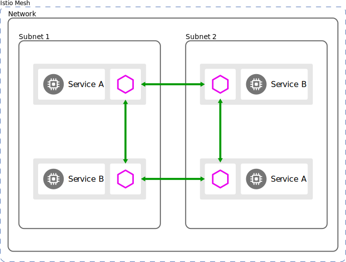
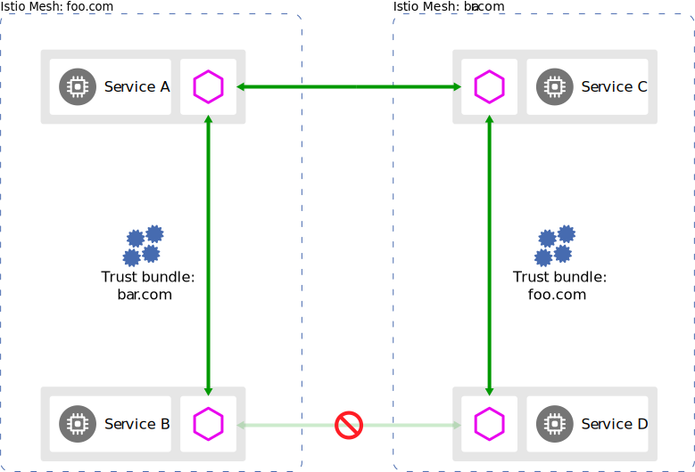
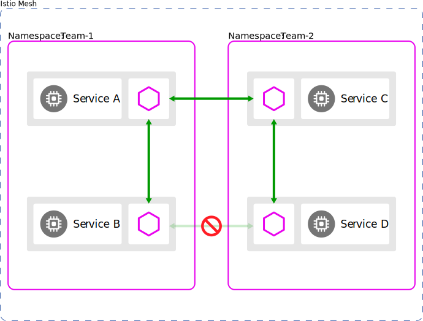

重要的系统模型会影响您的整体Istio部署模型。本页讨论了每种模型的选项，并描述了如何配置Istio来解决它们。

## 集群模型

您的应用程序的工作负载实例在一个或多个集群中运行。为了实现隔离，性能和高可用性，您可以将群集限制在可用性区域和区域中。

根据需求，生产系统可以跨多个区域或区域跨多个集群运行，从而利用云负载均衡器来处理诸如本地性，区域性或区域性故障转移之类的事情。

在大多数情况下，群集代表配置和端点发现的边界。例如，每个Kubernetes集群都有一个API服务器，该服务器管理集群的配置以及在Pod上升或下降时提供服务端点信息。由于Kubernetes在每个集群的基础上配置了此行为，因此这种方法有助于限制由错误配置引起的潜在问题。

在Istio中，您可以配置单个服务网格以跨越任意数量的集群。

#### 单集群

在最简单的情况下，您可以将Istio网格限制为单个群集。群集通常在单个网络上运行，但是在基础架构提供商之间会有所不同。单个群集和单个网络模型包括一个控制平面，这导致最简单的Istio部署。

单群集部署提供了简单性，但缺少其他功能，例如，故障隔离和故障转移。如果需要更高的可用性，则应使用多个群集。

#### 多集群

您可以将单个网格配置为包括多个群集。在单个网格中使用多集群部署可提供以下功能，而不仅仅是单个集群的功能： 

- 故障隔离和故障转移：cluster-1发生故障，故障转移到cluster-2。
- 位置感知路由和故障转移：将请求发送到最近的服务。
- 各种控制平面模型：支持不同级别的可用性。 
- 团队或项目隔离：每个团队都运行自己的集群集。

多集群部署可为您提供更大程度的隔离和可用性，但会增加复杂性。如果您的系统具有高可用性要求，则可能需要跨多个区域和区域的群集。您可以在单个集群中进行金丝雀的配置更改或新的二进制发行版，其中配置更改只会影响少量的用户流量。此外，如果群集有问题，您可以暂时将流量路由到附近的群集，直到解决该问题为止。

您可以根据网络和云提供商所支持的选项来配置集群间通信。例如，如果两个群集位于同一基础网络上，则可以通过简单地配置防火墙规则来启用跨群集通信。

## 网络模型

许多生产系统需要多个网络或子网来实现隔离和高可用性。 Istio支持跨多种网络拓扑扩展服务网格。这种方法使您可以选择适合您现有网络拓扑的网络模型。

#### 单网络

在最简单的情况下，服务网格在单个完全连接的网络上运行。在单个网络模型中，无需Istio网关，所有工作负载实例都可以直接相互访问。

单个网络使Istio能够以统一的方式跨网状配置服务使用者，并具有直接处理工作负载实例的能力。

上图中Network是物理网络，subnet1和subnet2是kubernetes内网Service间的虚拟网络。

#### 多网络

您可以跨多个网络跨越一个服务网格。这样的配置称为多网络。 多个网络提供了除单个网络之外的以下功能：

- 服务端点的重叠IP或VIP范围 
- 跨越管理界限 
- 容错能力 
- 网络地址扩展 
- 符合要求网络分段的标准

在此模型中，不同网络中的工作负载实例只能通过一个或多个Istio网关相互访问。 Istio使用分区服务发现为消费者提供服务端点的不同视图。该视图取决于消费者的网络。

## 控制平面模型

Istio网格使用控制平面来配置网格内工作负载实例之间的所有通信。您可以复制控制平面，工作负载实例连接到任何控制平面实例以获取其配置。 在最简单的情况下，可以在单个群集上使用控制平面运行网格。

多集群部署也可以共享控制平面实例。在这种情况下，控制平面实例可以驻留在一个或多个群集中。

为了获得高可用性，您应该在多个群集，区域或区域之间部署控制平面。

该模型具有以下优点： 

- 改进的可用性：如果控制平面不可用，则中断范围仅限于该控制平面。 
- 配置隔离：您可以在一个群集，区域或区域中进行配置更改，而不会影响其他群集，区域或区域。

您可以通过故障转移来提高控制平面的可用性。当控制平面实例不可用时，工作负载实例可以连接到另一个可用的控制平面实例。故障转移可能发生在群集，区域或区域之间。

以下列表按可用性对控制平面部署示例进行了排名： 

- 每个region一个集群（最低可用性） 
- 每个region多个集群 
- 每个zone一个集群 
- 每个zone多个群集 
- 每个集群（最高可用性）

一个region区域包含多个zone区域。

## 身份和信任模型

在服务网格中创建工作负载实例时，Istio会为工作负载分配一个身份标识。 证书颁发机构（CA）创建并签名用于验证网格中使用的身份的证书。您可以使用为该身份创建并签名证书的CA的公钥来验证消息发件人的身份。信任包是Istio网格使用的所有CA公共密钥的集合。借助网格的信任包，任何人都可以验证来自该网格的任何信息的发件人。

#### 网格内的信任

在单个Istio网格中，Istio确保每个工作负载实例都有一个代表其自身身份的适当证书，以及识别网格和所有联合网格中所有身份所必需的信任包。 CA仅为这些身份创建并签署证书。此模型允许网格中的工作负载实例在进行通信时相互认证。

#### 网格之间的信任

如果网格中的服务需要另一个网格中的服务，则必须在两个网格之间联合身份和信任。要联合身份和信任，必须交换网格的信任包。您可以使用SPIFFE信任域联合之类的协议手动或自动交换信任束。将信任包导入网格后，即可为这些身份配置本地策略。

## 网格模型

Istio支持将您的所有服务都放在一个网格中，或者将多个网格联合在一起，这也称为多网格。

#### 单网格

最简单的Istio部署是单个网格。在网格内，服务名称是唯一的。例如，在foo命名空间中，只有一个服务可以具有名称mysvc。此外，工作负载实例具有相同的标识，因为服务帐户名称在名称空间中是唯一的，就像服务名称一样。

单个网格可以跨越一个或多个群集和一个或多个网络。在网格内，名称空间用于租赁。

#### 多网格

网格联合产生了多个网格部署。

多个网格提供了除单个网格之外的以下功能： 

- 组织界限：业务线 
- 服务名称或名称空间重用：默认名称空间的多种不同用途 
- 加强隔离：将测试工作负载与生产工作负载隔离

您可以使用网格联合启用网格间通信。联合时，每个网格可以公开一组服务和身份，所有参与的网格都可以识别。

为了避免服务命名冲突，可以为每个网格提供全局唯一的网格ID，以确保每个服务的完全限定域名（FQDN）是唯一的。

联合两个不共享同一信任域的网格时，必须联合它们之间的身份和信任包。有关概述，请参见“多个信任域”部分。

## 租约模型

在Istio中，租户是一组用户，它们共享对一组已部署工作负载的公共访问权限和特权。通常，您可以通过网络配置和策略将工作负载实例与多个租户彼此隔离。您可以配置租户模型以满足以下组织隔离要求： 

- 安全 
- 政策 
- 容量 
- 成本
- 性能

Istio支持两种类型的租赁模型： 命名空间租赁 集群租赁

#### 命名空间租赁 

Istio使用名称空间作为网格内的租赁单位。 Istio还可以在未实现名称空间租约的环境中使用。在这样的环境中，您可以授予团队权限以仅将其工作负载部署到给定的名称空间或一组名称空间。默认情况下，来自多个租户名称空间的服务可以相互通信。

为了提高隔离度，您可以有选择地选择将哪些服务公开给其他名称空间。您可以为公开服务配置授权策略以将访问权限限制为仅对适当的调用者进行访问。

使用多个群集时，每个群集中共享相同名称的名称空间被视为相同的名称空间。例如，群集1的foo命名空间中的服务B和群集2的foo命名空间中的服务B引用同一服务，并且Istio合并其端点以进行服务发现和负载平衡。

#### 集群租赁

Istio支持使用群集作为租赁单位。在这种情况下，您可以为每个团队提供一个专用集群或一组集群来部署其工作负载。群集的权限通常仅限于拥有它的团队成员。您可以设置各种角色以实现更精细的控制，例如： 集群管理员 开发者

要将群集租用与Istio结合使用，请将每个群集配置为一个独立的网格。或者，您可以使用Istio将一组群集实现为单个租户。然后，每个团队可以拥有一个或多个集群，但是您可以将所有集群配置为单个网格。要将各个团队的网格连接在一起，可以将网格联合成一个多网格部署。

由于每个网格都由不同的团队或组织来操作，因此服务命名很少有区别。例如，cluster-1的foo命名空间中的mysvc和cluster-2的foo命名空间中的mysvc服务没有引用同一服务。最常见的示例是Kubernetes中的场景，其中许多团队将其工作负载部署到默认名称空间。

当每个团队都有自己的网格时，跨网格通信遵循多网格模型中描述的概念。

## 参考资料

> - 
> - 
