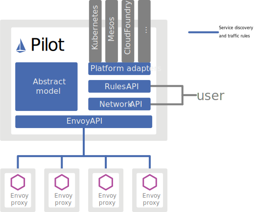

Istio的流量路由规则使您可以轻松控制服务之间的流量和API调用。 Istio简化了诸如断路器，超时和重试之类的服务级别属性的配置，并使其易于设置重要任务（如A / B测试，canary部署和基于百分比的流量拆分的分阶段部署）。它还提供了开箱即用的故障恢复功能，有助于使您的应用程序更强大，以防止相关服务或网络的故障。

Istio的流量管理模型依靠与服务一起部署的Envoy代理。网格服务发送和接收的所有流量（数据平面流量）都通过Envoy进行代理，从而可以轻松地引导和控制网状网络周围的流量，而无需对服务进行任何更改。

## 介绍Istio流量管理

为了在网状网络内引导流量，Istio需要知道所有端点在哪里以及它们属于哪些服务。为了填充自己的服务注册表，Istio连接到服务发现系统。例如，如果您在Kubernetes群集上安装了Istio，则Istio会自动检测该群集中的服务和端点。

使用此服务注册表，Envoy代理可以将流量定向到相关服务。大多数基于微服务的应用程序每个服务工作负载都有多个实例来处理服务流量，有时也称为负载平衡池。默认情况下，Envoy代理使用循环模型在每个服务的负载平衡池中分配流量，该请求将请求依次发送到每个池成员，并在每个服务实例收到请求后返回池的顶部。

虽然Istio的基本服务发现和负载平衡为您提供了一个有效的服务网格，但远非Istio所能做的。在许多情况下，您可能希望对网状流量发生的情况进行更细粒度的控制。您可能希望将特定百分比的流量定向到服务的新版本，作为A / B测试的一部分，或者将不同的负载平衡策略应用于特定服务实例子集的流量。您可能还想将特殊规则应用于进出网格的流量，或将网格的外部依赖项添加到服务注册表。您可以使用Istio的流量管理API向Istio添加自己的流量配置，以完成所有这些工作。

与其他Istio配置一样，该API使用Kubernetes自定义资源定义（CRD）指定，您可以使用YAML对其进行配置，如示例所示。

本指南的其余部分将检查每种流量管理API资源以及如何使用它们。这些资源是：

- 虚拟服务 
- 目的地规则 
- 网关 
- 服务条目 
- 边车

本指南还概述了API资源中内置的一些网络弹性和测试功能。


## 虚拟服务

虚拟服务以及目标规则是Istio流量路由功能的关键组成部分。虚拟服务使您可以在Istio和您的平台提供的基本连接和发现的基础上，配置如何将请求路由到Istio服务网格中的服务。

每个虚拟服务由一组路由规则组成，这些路由规则按顺序进行评估，从而使Istio将对虚拟服务的每个给定请求匹配到网格内特定的实际目的地。您的网格可能需要多个虚拟服务，也可能不需要多个虚拟服务，具体取决于您的用例。

#### 为什么要使用虚拟服务

虚拟服务在使Istio的流量管理变得灵活和强大方面发挥着关键作用。他们通过将客户端从真正实现它们的目标工作负载中发送请求的位置之间去耦合，来实现这一点。虚拟服务还提供了一种丰富的方法来指定用于将流量发送到那些工作负载的不同流量路由规则。

为什么这么有用？没有虚拟服务，Envoy使用循环负载平衡在所有服务实例之间分配流量，如简介中所述。您可以通过了解工作负载来改善此行为。例如，某些代表不同的版本。这在A / B测试中很有用，您可能需要基于不同服务版本之间的百分比来配置流量路由，或将流量从内部用户引导到一组特定的实例。

使用虚拟服务，可以为一个或多个主机名指定流行为。您在虚拟服务中使用路由规则，该规则告诉Envoy如何将虚拟服务的流量发送到适当的目的地。路由目的地可以是相同服务的版本，也可以是完全不同的服务的版本。

典型的用例是将流量发送到指定为服务子集的服务的不同版本。客户端将请求发送到虚拟服务主机，就好像它是单个实体一样，然后Envoy根据虚拟服务规则将流量路由到不同版本：例如，“ 20％的呼叫转到新版本”或“呼叫这些用户转到版本2”。例如，这使您可以创建“金丝雀”部署，逐步增加发送到新服务版本的流量百分比。流量路由与实例部署完全分开，这意味着可以完全根据流量负载来扩展和缩小实现新服务版本的实例的数量，而无需完全引用流量路由。相比之下，像Kubernetes这样的容器编排平台仅支持基于实例扩展的流量分配，这很快变得复杂。您可以在使用Istio的Canary部署中阅读有关虚拟服务如何帮助Canary部署的更多信息。<https://istio.io/blog/2017/0.1-canary/>

虚拟服务也可以让你：

- 通过单个虚拟服务处理多个应用程序服务。例如，如果网格使用Kubernetes，则可以配置虚拟服务以处理特定名称空间中的所有服务。将单个虚拟服务映射到多个“真实”服务在帮助将单片应用程序转换为由不同的微服务构建的复合服务时特别有用，而无需该服务的使用者适应过渡。您的路由规则可以指定“对monolith.com的这些URI的调用转到微服务A”，依此类推。您可以在下面的示例之一中查看其工作原理。
- 结合网关配置流量规则，以控制入口和出口流量。

在某些情况下，您还需要配置目标规则以使用这些功能，因为这些是您指定服务子集的位置。在单独的对象中指定服务子集和其他特定于目标的策略，使您可以在虚拟服务之间清晰地重用它们。您可以在下一部分中找到有关目标规则的更多信息。


#### 虚拟服务例子

以下虚拟服务根据请求是否来自特定用户将请求路由到服务的不同版本。

```
apiVersion: networking.istio.io/v1alpha3
kind: VirtualService
metadata:
  name: reviews
spec:
  hosts:
  - reviews
  http:
  - match:
    - headers:
        end-user:
          exact: jason
    route:
    - destination:
        host: reviews
        subset: v2
  - route:
    - destination:
        host: reviews
        subset: v3
```

- spec.hosts字段

该字段列出了虚拟服务的主机，换句话说，这些路由规则适用于用户可寻址的目的地。这是客户端向服务发送请求时使用的地址。

虚拟服务主机名可以是IP地址，DNS名称，也可以是短名称（例如Kubernetes服务短名称），具体取决于平台，该短名称隐式或显式地解析为完全限定的域名（FQDN）。您还可以使用通配符（“ *”）前缀，从而为所有匹配的服务创建一套路由规则。虚拟服务主机实际上不一定是Istio服务注册表的一部分，它们只是虚拟目的地。这样，您就可以为网格内没有可路由条目的虚拟主机的流量建模。

- spec.http配置路由规则

http部分包含虚拟服务的路由规则，描述了路由发送到hosts字段中指定的目标的HTTP / 1.1，HTTP2和gRPC通信的匹配条件和动作（您也可以使用tcp和tls部分来配置路由TCP和未终止TLS流量的规则）。路由规则由您希望流量流向的目的地以及零个或多个匹配条件组成，具体取决于您的用例。

上面例子中的第一条路由包含了match条件和route目的地，功能是会将匹配请求头中包含end-user=jason的请求到reviews服务的v2子集。

此处要注意一下，route.destination.host字段与spec.hosts虚拟服务的主机不同，前者必须是Istio的服务注册表中存在的真实目的地，否则Envoy不知道将流量发送到哪里。它可以是带有代理的网格服务，也可以是使用服务条目添加的非网格服务。在上面例子中，我们在Kubernetes上运行，reviews是Kubernetes服务名。

请注意，在本页面的该示例和其他示例中，为简单起见，我们使用Kubernetes短名称作为目标主机。执行此路由规则时，Istio将基于虚拟服务的名称空间添加一个域后缀，该名称后缀包含路由规则以获取主机的标准名称。在我们的示例中使用短名称还意味着您可以在任意喜欢的名称空间中复制并尝试使用它们。

仅当目标主机和虚拟服务实际上在同一Kubernetes命名空间中时，才使用这样的短名称。因为使用Kubernetes短名称可能会导致配置错误，所以我们建议您在生产环境中指定标准主机名。

目标部分还指定了要让符合此规则条件的请求转到该Kubernetes服务的哪个子集，在本例中为名为v2的子集。您将在下面有关目标规则的部分中看到如何定义服务子集。


## 路由规则优先权

路由规则从上到下按顺序进行评估，虚拟服务定义中的第一个规则具有最高优先级。在这种情况下，您希望不符合第一个路由规则的所有内容都转到第二个规则中指定的默认目的地。因此，第二条规则没有匹配条件，仅将流量定向到v3子集。

我们建议在每个虚拟服务中提供默认的“无条件”或基于权重的规则（如下所述）作为每个虚拟服务中的最后一个规则，以确保到虚拟服务的流量始终具有至少一条匹配的路由。


## 关于路由规则的更多

如上所述，路由规则是将流量路由到特定目的地的特定子集的强大工具。您可以在流量端口，标头字段，URI等上设置匹配条件。例如，此虚拟服务使用户可以将流量发送到两个单独的服务（评级和评论），就好像他们是http://bookinfo.com/上较大的虚拟服务的一部分一样。虚拟服务规则根据请求URI匹配流量，并将请求定向到适当的服务。

```
apiVersion: networking.istio.io/v1alpha3
kind: VirtualService
metadata:
  name: bookinfo
spec:
  hosts:
    - bookinfo.com
  http:
  - match:
    - uri:
        prefix: /reviews
    route:
    - destination:
        host: reviews
  - match:
    - uri:
        prefix: /ratings
    route:
    - destination:
        host: ratings
```

匹配条件字段及其可能值的完整列表可以在HTTPMatchRequest参考中找到。

<https://istio.io/docs/reference/config/networking/v1alpha3/virtual-service/#HTTPMatchRequest>


除了使用匹配条件外，您还可以按百分比“权重”分配流量。这对于A / B测试和Canary推出很有用：

```
spec:
  hosts:
  - reviews
  http:
  - route:
    - destination:
        host: reviews
        subset: v1
      weight: 75
    - destination:
        host: reviews
        subset: v2
      weight: 25
```

您还可以使用路由规则对流量执行一些操作，例如：

-  附加或删除标题。 

- 重写URL。 

- 为该目的地的呼叫设置重试策略。 

要了解有关可用操作的更多信息，请参见HTTPRoute参考。

<https://istio.io/docs/reference/config/networking/v1alpha3/virtual-service/#HTTPRoute>


## 目的地规则

除虚拟服务外，目的地规则也是Istio流量路由功能的关键部分。您可以将虚拟服务视为如何将流量路由到给定的目的地，然后使用目的地规则配置该目的地的流量所发生的情况。在评估了虚拟服务路由规则之后，将应用目标规则，因此它们将应用于流量的“真实”目标。

特别是，您可以使用目标规则来指定命名的服务子集，例如按版本对所有给定服务的实例进行分组。然后，您可以在虚拟服务的路由规则中使用这些服务子集，以控制流向服务的不同实例的流量。

使用目标规则，还可以在调用整个目标服务或特定服务子集时自定义Envoy的流量策略，例如首选的负载平衡模型，TLS安全模式或断路器设置。您可以在“目标规则”参考中看到目标规则选项的完整列表。

<https://istio.io/docs/reference/config/networking/v1alpha3/destination-rule/>


#### 负载均衡选项

默认情况下，Istio使用循环负载平衡策略，其中实例池中的每个服务实例依次获得一个请求。 Istio还支持以下模型，您可以在目标规则中为对特定服务或服务子集的请求指定这些模型。

- 随机：将请求随机转发到池中的实例。
- 加权：根据特定百分比将请求转发到池中的实例。
- 最少请求：将请求转发到请求数量最少的实例。

有关每个选项的更多信息，请参阅Envoy负载平衡文档。

<https://www.envoyproxy.io/docs/envoy/v1.5.0/intro/arch_overview/load_balancing>


#### 目的地规则例子

以下示例目标规则使用不同的负载平衡策略为my-svc目标服务配置了三个不同的子集：

```
apiVersion: networking.istio.io/v1alpha3
kind: DestinationRule
metadata:
  name: my-destination-rule
spec:
  host: my-svc
  trafficPolicy:
    loadBalancer:
      simple: RANDOM
  subsets:
  - name: v1
    labels:
      version: v1
  - name: v2
    labels:
      version: v2
    trafficPolicy:
      loadBalancer:
        simple: ROUND_ROBIN
  - name: v3
    labels:
      version: v3
```

每个子集都是基于一个或多个标签定义的，在Kubernetes中，这些标签是附加到对象（例如Pod）的键/值对。这些标签作为元数据在Kubernetes服务的部署中应用，以标识不同的版本。

除了定义子集外，此目标规则还具有针对此目标中所有子集的默认流量策略，以及针对该子集覆盖该子集的特定于子集的策略。在子集字段上方定义的默认策略为v1和v3子集设置了一个简单的随机负载均衡器。在第2版政策中，在相应子集的字段中指定了循环负载均衡器。


## 网关

您可以使用网关来管理网格的入站和出站流量，让您指定要输入或离开网格的流量。网关配置适用于在网格边缘运行的独立Envoy代理，而不是与服务工作负载一起运行的sidecar Envoy代理。

与其他控制进入系统的流量的机制（例如Kubernetes Ingress API）不同，Istio网关可让您充分利用Istio流量路由的强大功能和灵活性。您可以执行此操作，因为Istio的网关资源仅允许您配置4-6层负载均衡属性，例如要公开的端口，TLS设置等。然后，您没有将应用程序层流量路由（L7）添加到相同的API资源，而是将常规Istio虚拟服务绑定到网关。这样，您就可以像管理Istio网格中的任何其他数据平面流量一样，基本上管理网关流量。

网关主要用于管理入口流量，但是您也可以配置出口网关。出口网关使您可以为离开网状网络的流量配置专用的出口节点，从而限制可以或应该访问外部网络的服务，或者启用对出口流量的安全控制以增加网状网络的安全性。您还可以使用网关来配置纯内部代理。

Istio提供了一些您可以使用的预配置网关代理部署（istio-ingressgateway和istio-egressgateway）-如果使用我们的演示安装，则两者都部署，而只有入口网关是使用我们的默认配置文件或sds配置文件进行部署的。您可以将自己的网关配置应用于这些部署，也可以部署和配置自己的网关代理。

#### 网关例子

以下示例显示了用于外部HTTPS入口流量的可能网关配置：

```
apiVersion: networking.istio.io/v1alpha3
kind: Gateway
metadata:
  name: ext-host-gwy
spec:
  selector:
    app: my-gateway-controller
  servers:
  - port:
      number: 443
      name: https
      protocol: HTTPS
    hosts:
    - ext-host.example.com
    tls:
      mode: SIMPLE
      serverCertificate: /tmp/tls.crt
      privateKey: /tmp/tls.key
```

此网关配置允许HTTPS流量从ext-host.example.com进入端口443上的网格，但没有为该流量指定任何路由。

要指定路由并使网关按预期工作，您还必须将网关绑定到虚拟服务。您可以使用虚拟服务的网关字段执行此操作，如以下示例所示：

```
apiVersion: networking.istio.io/v1alpha3
kind: VirtualService
metadata:
  name: virtual-svc
spec:
  hosts:
  - ext-host.example.com
  gateways:
    - ext-host-gwy
```

然后，您可以使用外部流量的路由规则配置虚拟服务。

## 服务条目

您使用服务条目将条目添加到Istio内部维护的服务注册表中。添加服务条目后，Envoy代理可以将流量发送到服务，就好像它是网格中的服务一样。通过配置服务条目，您可以管理在网格外部运行的服务的流量，包括以下任务：

- 重定向和转发外部目标的流量，例如从网络使用的API或旧基础结构中服务的流量。
- 为外部目标定义重试，超时和故障注入策略。
- 将在虚拟机（VM）中运行的服务添加到网格以扩展网格。
- 在逻辑上将来自其他群集的服务添加到网格，以在Kubernetes上配置多群集Istio网格。

您无需为要使用网格服务的每个外部服务添加服务条目。默认情况下，Istio将Envoy代理配置为将请求传递给未知服务。但是，您不能使用Istio功能来控制到未在网格中注册的目标的访问量。

## 服务条目例子

以下示例mesh-external服务条目将ext-resource外部依赖项添加到Istio的服务注册表中：

```
apiVersion: networking.istio.io/v1alpha3
kind: ServiceEntry
metadata:
  name: svc-entry
spec:
  hosts:
  - ext-svc.example.com
  ports:
  - number: 443
    name: https
    protocol: HTTPS
  location: MESH_EXTERNAL
  resolution: DNS
```

您可以使用“主机”字段指定外部资源。您可以完全限定它，也可以使用带通配符前缀的域名。

您可以配置虚拟服务和目标规则，以更精细的方式控制到服务条目的流量，就像为网格中的其他任何服务配置流量一样。例如，以下目标规则将流量路由配置为使用双向TLS来保护与我们使用服务条目配置的ext-svc.example.com外部服务的连接：

```
apiVersion: networking.istio.io/v1alpha3
kind: DestinationRule
metadata:
  name: ext-res-dr
spec:
  host: ext-svc.example.com
  trafficPolicy:
    tls:
      mode: MUTUAL
      clientCertificate: /etc/certs/myclientcert.pem
      privateKey: /etc/certs/client_private_key.pem
      caCertificates: /etc/certs/rootcacerts.pem
```

有关更多可能的配置选项，请参阅服务条目参考。

<https://istio.io/docs/reference/config/networking/v1alpha3/service-entry>


## 边车

默认情况下，Istio将每个Envoy代理配置为在其相关工作负载的所有端口上接受流量，并在转发流量时到达网格中的每个工作负载。您可以使用sidecar配置执行以下操作： 

- 微调Envoy代理接受的端口和协议集。 
- 限制Envoy代理可以访问的服务集。

在大型应用程序中，您可能希望像这样限制Sidecar的可达性，在该应用程序中，将每个代理配置为可访问网格中的所有其他服务可能会由于内存使用率较高而潜在地影响网格性能。

您可以指定希望将sidecar配置应用于特定名称空间中的所有工作负载，或使用工作负载选择器选择特定工作负载。例如，以下sidecar配置将bookinfo命名空间中的所有服务配置为仅访问在相同命名空间和Istio控制平面（当前需要使用Istio的策略和遥测功能）中运行的服务：

```
apiVersion: networking.istio.io/v1alpha3
kind: Sidecar
metadata:
  name: default
  namespace: bookinfo
spec:
  egress:
  - hosts:
    - "./*"
    - "istio-system/*"
```

更多详细信息参考如下

<https://istio.io/docs/reference/config/networking/v1alpha3/sidecar/>


## 网络弹性和测试

除了帮助您引导网络中的流量外，Istio还提供了可以在运行时动态配置的可选故障恢复和故障注入功能。使用这些功能可以帮助您的应用程序可靠地运行，确保服务网格可以容忍出现故障的节点，并防止局部故障级联到其他节点。

#### 超时

超时是指Envoy代理应等待来自给定服务的答复的时间，以确保服务不会无限期地等待答复，并确保呼叫在可预测的时间内成功或失败。HTTP请求的默认超时为15秒，这意味着，如果服务在15秒内未响应，则调用将失败。

对于某些应用程序和服务，Istio的默认超时可能不合适。例如，超时时间过长可能导致等待失败服务的回复导致过多的延迟，而超时时间过短可能导致在等待涉及多个服务的操作返回时调用不必要地失败。为了查找和使用最佳超时设置，Istio使您可以使用虚拟服务轻松地基于虚拟服务按服务动态调整超时，而无需编辑服务代码。这是一项虚拟服务，它为评级服务的v1子集的调用指定了10秒的超时时间：

```
apiVersion: networking.istio.io/v1alpha3
kind: VirtualService
metadata:
  name: ratings
spec:
  hosts:
  - ratings
  http:
  - route:
    - destination:
        host: ratings
        subset: v1
    timeout: 10s
```


#### 重试

重试设置指定如果初始调用失败，Envoy代理尝试连接到服务的最大次数。重试可以确保不会因暂时性问题（例如服务或网络暂时过载）而导致呼叫永久失败，从而提高服务可用性和应用程序性能。重试之间的间隔（25ms +）是可变的，并由Istio自动确定，以防止被调用的服务被请求所淹没。默认情况下，Envoy代理在首次失败后不会尝试重新连接到服务。

与超时一样，Istio的默认重试行为在延迟（对失败的服务进行过多的重试会降低速度）或可用性方面可能不适合您的应用程序需求。与超时一样，您也可以在虚拟服务中基于每个服务调整重试设置，而无需触摸服务代码。您还可以通过添加每次重试超时，指定您要等待每次重试尝试成功连接到服务的时间，来进一步优化重试行为。下面的示例在一次初始呼叫失败后最多配置3次重试以连接到该服务子集，每个重试都有2秒的超时时间。

```
apiVersion: networking.istio.io/v1alpha3
kind: VirtualService
metadata:
  name: ratings
spec:
  hosts:
  - ratings
  http:
  - route:
    - destination:
        host: ratings
        subset: v1
    retries:
      attempts: 3
      perTryTimeout: 2s
```


#### 断路器

断路器是Istio提供的另一个有用的机制，可用于创建基于弹性微服务的应用程序。在断路器中，可以设置对服务内单个主机的呼叫限制，例如并发连接数或对该主机的呼叫失败次数。一旦达到该限制，断路器将“跳闸”并停止与该主机的进一步连接。使用断路器模式可实现快速故障，而不是使客户端尝试连接到过载或故障主机。

为了让断路器适用于负载平衡池中的“真实”网格目标，因此您需要在目标规则中配置电路断路器阈值，并将设置应用于服务中的每个主机。以下示例将v1子集的reviews服务工作负载的并发连接数限制为100：

```
apiVersion: networking.istio.io/v1alpha3
kind: DestinationRule
metadata:
  name: reviews
spec:
  host: reviews
  subsets:
  - name: v1
    labels:
      version: v1
    trafficPolicy:
      connectionPool:
        tcp:
          maxConnections: 100
```

您可以在Circuit Breaking中找到有关创建断路器的更多信息。

<https://istio.io/docs/tasks/traffic-management/circuit-breaking/>

#### 故障注入 

配置完网络（包括故障恢复策略）后，可以使用Istio的故障注入机制来测试整个应用程序的故障恢复能力。故障注入是一种将错误引入系统的测试方法，以确保它可以承受并从错误情况中恢复。使用故障注入对确保您的故障恢复策略不兼容或限制过于严格特别有用，这可能会导致关键服务不可用。

与其他在网络层引入错误（例如延迟数据包或杀死Pod）的机制不同，Istio’允许您在应用层注入故障。这使您可以注入更多相关的故障，例如HTTP错误代码，以获得更多相关的结果。

您可以注入两种类型的故障，均使用虚拟服务配置：

- 延迟：延迟是计时失败。它们模仿增加的网络延迟或上游服务过载。
- 中止：中止是崩溃失败。它们模仿上游服务中的故障。中止通常以HTTP错误代码或TCP连接失败的形式表现出来。

例如，此虚拟服务为评级服务每1000个请求中的1个引入5秒的延迟。

```
apiVersion: networking.istio.io/v1alpha3
kind: VirtualService
metadata:
  name: ratings
spec:
  hosts:
  - ratings
  http:
  - fault:
      delay:
        percentage:
          value: 0.1
        fixedDelay: 5s
    route:
    - destination:
        host: ratings
        subset: v1
```

有关如何配置延迟和中止的详细说明，请参阅故障注入。

<https://istio.io/docs/tasks/traffic-management/fault-injection/>


#### 处理您的应用程序

Istio故障恢复功能对应用程序是完全透明的。应用程序不知道Envoy Sidecar代理在返回响应之前是否正在处理被调用服务的故障。这意味着，如果您还在应用程序代码中设置故障恢复策略，则需要记住两者都独立工作，因此可能会发生冲突。例如，假设您有两个超时，一个在虚拟服务中配置，另一个在应用程序中配置。应用程序为服务的API调用设置了2秒超时。但是，您在虚拟服务中配置了3秒超时和1次重试。在这种情况下，应用程序的超时会首先开始，因此您的Envoy超时和重试尝试无效。

尽管Istio故障恢复功能提高了网格中服务的可靠性和可用性，但应用程序必须处理故障或错误并采取适当的后备操作。例如，当负载平衡池中的所有实例均失败时，Envoy将返回HTTP 503代码。应用程序必须实现处理HTTP 503错误代码所需的所有后备逻辑。

## 架构

Istio的流量管理模型依赖于以下两个组件： 

- Pilot，核心流量管理组件。 
- Envoy代理，这些代理强制通过Pilot设置配置和策略。

这些组件启用以下Istio流量管理功能： 

- 服务发现 
- 负载均衡 
- 流量路由和控制

#### Pilot: 核心流量管理

下图显示了Pilot体系结构：



如图所示，Pilot维护了网格中所有服务的抽象模型。Pilot中特定于平台的适配器可为您的平台适当转换抽象模型。例如，Kubernetes适配器实现了控制器，以监视Kubernetes API服务器对pod注册信息和服务资源的更改。 Kubernetes适配器将这些数据转换为抽象模型。

Pilot使用抽象模型生成适当的特定于Envoy的配置，以使Envoy代理通过Envoy API在网格中相互了解。

您可以使用Istio的流量管理API来指示Pilot优化Envoy配置，以更精细地控制服务网格中的流量。


#### Envoy代理

Istio中的流量分为数据平面流量和控制平面流量。数据平面流量是指工作负载的业务逻辑发送和接收的消息。控制平面流量是指在Istio组件之间发送的用于配置网格行为的配置和控制消息。 Istio中的流量管理专门指数据平面流量。

Envoy代理是与数据平面流量交互的唯一Istio组件。 Envoy代理跨网状网络路由数据平面流量并执行配置和流量规则，而服务不必知道它们。Envoy代理可为网格中的所有服务调解所有入站和出站流量。 Envoy代理作为服务的辅助工具部署，通过流量管理功能从逻辑上扩展服务：

- 服务发现和负载平衡 
- 流量路由和配置 
- 网络弹性和测试

Envoy代理启用的某些功能和任务包括：

- 流量控制功能：使用丰富的路由规则对HTTP，gRPC，WebSocket和TCP流量实施细粒度的流量控制。
- 网络弹性功能：设置重试，故障转移，断路器和故障注入。
- 安全和身份验证功能：实施安全策略并实施通过配置API定义的访问控制和速率限制。


#### 服务发现与负载均衡

Istio服务发现利用Kubernetes等平台为基于容器的应用程序提供的服务发现功能。无论您使用什么平台，服务发现的工作方式都相似：

1. 平台启动一个服务的新实例，该实例通知其平台适配器。
2. 平台适配器将实例注册到Pilot抽象模型。
3. Pilot将流量规则和配置分发给Envoy代理以说明更改。

下图显示了平台适配器和Envoy代理如何交互:


由于服务发现功能与平台无关，因此服务网格可以包含跨多个平台的服务。

通过使用抽象模型，Pilot将Envoy代理配置为对服务请求执行负载平衡，从而替换了所有基础平台特定的负载平衡功能。在没有更具体的路由规则的情况下，Envoy将根据Pilot抽象模型和负载平衡器配置，在调用服务的负载平衡池中的各个实例之间分配流量。

## 参考资料

> - []()
> - []()
