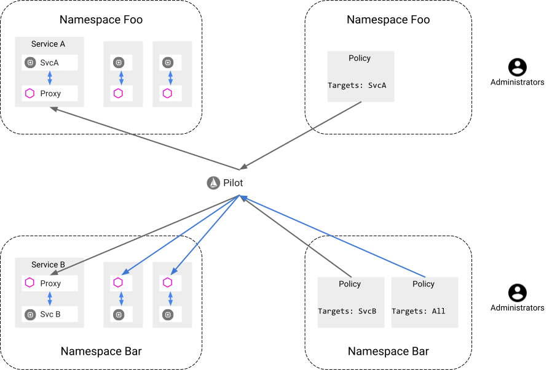
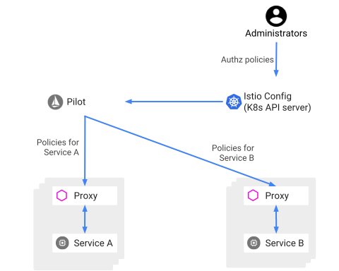

将整体应用程序分解为原子服务可带来各种好处，包括更好的敏捷性，更好的可伸缩性和更好的重用服务能力。但是，微服务也有特殊的安全需求：

- 为了抵御中间人攻击，他们需要流量加密。
- 为了提供灵活的服务访问控制，他们需要相互TLS和细粒度的访问策略。
- 要审核谁在什么时间做了什么，他们需要审核工具。

Istio Security试图提供全面的安全解决方案来解决所有这些问题。

此页面概述了如何在任何地方运行Istio安全功能以保护服务。特别是，Istio安全性可以减轻对您的数据，端点，通信和平台的内部和外部威胁。


Istio安全功能提供强大的身份，强大的策略，透明的TLS加密以及身份验证，授权和审核（AAA）工具，以保护您的服务和数据。 Istio安全性的目标是：

- 默认情况下的安全性：无需更改应用程序代码和基础结构
- 深度防御：与现有安全系统集成以提供多层防御
- 零信任网络：在不受信任的网络上构建安全解决方案

请访问我们的“相互TLS迁移”文档，开始将Istio安全功能与已部署的服务一起使用。请访问我们的安全任务，以获取有关使用安全功能的详细说明。

- <https://istio.io/docs/tasks/security/mtls-migration/>
- <https://istio.io/docs/tasks/security/>


## 策略

Istio允许您为应用程序配置自定义策略，以在运行时强制执行规则，例如： 

- 速率限制以动态限制服务流量 
- 拒绝，白名单和黑名单，以限制对服务的访问 
- 请求头重写和重定向

Istio还允许您创建自己的策略适配器，以添加例如自己的自定义授权行为。 

您必须为网格启用策略实施才能使用此功能。


## 高层架构

Istio中的安全涉及多个组件：

- Citadel: 管理秘钥和证书
- Sidecar 和 perimeter proxies: 实现客户端与服务端间的安全交流
- Pilot: 向代理分发身份验证策略和安全的命名信息
- Mixer: 管理授权和审计

istio安全架构图：


在以下各节中，我们将详细介绍Istio安全功能。

## Istio身份

身份是任何安全基础结构的基本概念。在服务到服务的通信开始时，双方必须出于相互认证目的而将凭据与其身份信息交换凭据。在客户端，将根据安全命名信息检查服务器的身份，以查看其是否是该服务的授权运行者。在服务器端，服务器可以根据授权策略确定客户端可以访问哪些信息，审核谁在什么时间访问了哪些信息，根据他们使用的服务向客户端收费，并拒绝所有未能支付账单的客户端访问服务。

在Istio身份模型中，Istio使用一流的服务身份来确定服务的身份。这为表示人类用户，单个服务或一组服务提供了极大的灵活性和粒度。在没有此类身份的平台上，Istio可以使用其他可以对服务实例进行分组的身份，例如服务名称。

Istio在不同平台上服务身份： 

- Kubernetes：Kubernetes service account
- GKE / GCE：可以使用GCP service account
- GCP：GCP service account
- AWS：AWS IAM用户/角色帐户 
- 本地（非Kubernetes）：用户帐户，自定义服务帐户，服务名称，Istio服务帐户或GCP服务帐户。定制服务帐户是指现有服务帐户，就像客户的身份目录管理的身份一样。


#### Istio安全性与SPIFFE

SPIFFE标准提供了一种框架规范，该框架能够跨异构环境引导和向服务发布身份。

Istio和SPIFFE共享同一身份证明文件：SVID（SPIFFE可验证身份证明文件）。例如，在Kubernetes中，X.509证书的URI字段格式为spiffe：// \ <domain\> / ns / \ <namespace\> / sa / \ <serviceaccount \>。这使Istio服务可以建立和接受与其他符合SPIFFE的系统的连接。

Istio安全性和SPIRE（SPIFFE的实现）在PKI实施细节上有所不同。 Istio提供了更全面的安全解决方案，包括身份验证，授权和审核。


## PKI

Istio PKI建立在Istio Citadel的基础上，可为每个工作负载安全地配置强身份。 Istio使用X.509证书以SPIFFE格式携带身份。 PKI还可以按比例自动执行密钥和证书轮换。

Istio支持在Kubernetes Pod和本地计算机上运行的服务。当前，我们针对每种情况使用不同的证书密钥置备机制。

#### kubernetes 场景

1. Citadel监视Kubernetes apiserver，为每个现有和新服务帐户创建一个SPIFFE证书和密钥对。 Citadel将证书和密钥对存储为Kubernetes secrets。
2. 创建Pod时，Kubernetes会通过Kubernetes secret volume根据其服务帐户将证书和密钥对安装到Pod。
3. Citadel监视每个证书的有效期，并通过重写Kubernetes secrets自动旋转证书。
4. Pilot生成安全的命名信息，该信息定义哪些服务帐户或哪些帐户可以运行特定服务。然后，Pilot将安全命名信息传递给边sidecar Envoy。

#### 本地机器场景

1. Citadel创建了一个gRPC服务来接受证书签名请求（CSR）。
2. 节点代理会生成一个私钥和CSR，然后将CSR及其凭据发送给Citadel进行签名。
3. Citadel验证CSR附带的凭据，并对CSR签名以生成证书。
4. 节点代理将从Citadel收到的证书和私钥发送到Envoy。
5. 对于证书和密钥轮换，上述CSR过程会定期重复。

#### Kubernetes中的节点代理

Istio提供了使用Kubernetes中的节点代理进行证书和密钥置备的选项，可用来查看secret，如下图所示。请注意，在不久的将来，本地机器的身份配置流程将相似，我们仅在此处描述Kubernetes场景。


流程如下：

1. Citadel创建了一个gRPC服务来接受CSR请求。
2. Envoy通过Envoy 秘密发现服务（SDS）API发送证书和密钥请求。
3. 节点代理收到SDS请求后，会在将CSR及其凭据发送给Citadel进行签名之前，先创建私钥和CSR。
4. Citadel验证CSR中携带的凭据并签署CSR以生成证书。 
5. 节点代理通过Envoy SDS API将从Citadel接收到的证书和私钥发送给Envoy。 
6. 对于证书和密钥轮换，上述CSR过程会定期重复。

使用节点代理调试端点可以查看节点代理正在主动为其客户端代理提供服务的secret。导航到代理的端口8080上的/ debug / sds / workload以转储活动的工作负载secret，或/ debug / sds / gateway来转储活动的网关secret。


## 最佳实践

在本节中，我们提供一些部署指南，并讨论实际场景。

#### 部署准则

如果有多个服务团队（也称为SRE）在中型或大型集群中部署不同的服务，我们建议为每个SRE团队创建一个单独的Kubernetes命名空间以隔离其访问权限。例如，您可以为team1创建一个team1-ns命名空间，为team2创建一个team2-ns命名空间，以使两个团队无法访问彼此的服务。

如果Citadel受到威胁，则它在群集中的所有托管密钥和证书都可能被公开。强烈建议在专用名称空间（例如istio-citadel-ns）中运行Citadel，以将对群集的访问限制为仅管理员。


#### 例子

我们考虑一个具有三项服务的三层应用程序：照片前端，照片后端和数据存储。照片SRE团队管理照片前端和照片后端服务，而数据存储区SRE团队管理数据存储区服务。照片前端服务可以访问照片后端，而照片后端服务可以访问数据存储。但是，照片前端服务无法访问数据存储。

在这种情况下，群集管理员将创建三个名称空间：istio-citadel-ns，photo-ns和datastore-ns。管理员有权访问所有名称空间，每个团队只能访问其自己的名称空间。 photo SRE团队创建了两个服务帐户，分别在photo-ns名称空间中运行photo-frontend和photo-backend。数据存储区SRE团队创建了一个服务帐户来在datastore-ns命名空间中运行数据存储区服务。此外，我们需要在Istio Mixer中强制执行服务访问控制，以便照片前端无法访问数据存储。

在这种设置中，Kubernetes可以隔离管理服务的操作员特权。 Istio管理所有命名空间中的证书和密钥，并对服务实施不同的访问控制规则。

#### Citadel如何确定是否创建service account secret

当Citadel实例注意到在名称空间中创建了ServiceAccount时，它必须决定是否应为该ServiceAccount生成istio.io/key-and-cert secret。为了做出决定，Citadel考虑了三个输入（请注意：单个群集中可以部署多个Citadel实例，并且以下定位规则应用于每个实例）：

- ca.istio.io/env  ServiceAccount所在的命名空间标签： 值为字符串，指定了想要生成secret的Citadel实例。

- ca.istio.io/override ServiceAccount所在的命名空间标签：值为布尔值：是否覆盖其他配置

- enableNamespacesByDefault安全配置：没发现上面标签时的默认行为

从这三个值中，决策过程与Sidecar Injection Webhook的过程类似。详细的行为是：

1. 如果ca.istio.io/override存在且为true，则为工作负载生成密钥/证书secret。
2. 否则，如果ca.istio.io/override存在且为false，则不要为工作负载生成密钥/证书secret。
3. 否则，如果在ServiceAccount的名称空间中定义了ca.istio.io/env：“ ns-foo”标签，在ns-foo命名空间的Citadel 实例将用于为ServiceAccount命名空间中的工作负载生成密钥/证书secret。
4. 否则，会遵循enableNamespacesByDefault Helm标志。如果为true，则默认Citadel实例将用于为ServiceAccount命名空间中的工作负载生成密钥/证书secret。
5. 否则，不会为ServiceAccount的名称空间创建任何秘密。

当名称空间从禁用过渡到启用时，Citadel将为该名称空间中的所有ServiceAccounts追溯生成秘密。但是，从启用状态转换为禁用状态时，Citadel不会删除名称空间的生成机密，直到更新根证书为止。


## 认证

Istio提供了两种类型的认证：

- **Transport authentication**传输身份验证，也称为服务到服务身份验证：验证建立连接的直接客户端。 Istio提供双向TLS作为用于传输身份验证的完整堆栈解决方案。您可以轻松打开此功能，而无需更改服务代码。此解决方案：
  1. 为每个服务提供一个强大的标识，以表示其角色，以实现跨集群和云的互操作性。
  2. 保护服务到服务的通信和最终用户到服务的通信。
  3. 提供密钥管理系统，以自动进行密钥和证书的生成，分发和轮换。
- **Origin authentication**原始身份验证，也称为最终用户身份验证：将发出请求的原始客户端验证为最终用户或设备。 Istio通过JSON Web令牌（JWT）验证启用请求级身份验证，并为开源OpenID Connect提供程序ORY Hydra，Keycloak，Auth0，Firebase Auth，Google Auth和自定义身份验证提供简化的开发人员体验。

在这两种情况下，Istio都会通过自定义的Kubernetes API将身份验证策略存储在Istio配置存储中。Pilot可以使每个代理服务器保持最新状态，并在适当时提供密钥。此外，Istio支持许可模式下的身份验证，以帮助您了解策略更改在生效之前如何影响您的安全状况。


#### 相互TLS身份验证

Istio通过客户端和服务器端Envoy代理建立服务到服务的通信通道。为了使客户端通过相互TLS身份验证调用服务器：

1. Istio将来自客户端的出站流量重新路由到客户端的本地Sidecar Envoy。
2. 客户端Envoy与服务器端Envoy开始相互TLS握手。在握手期间，客户端Envoy还会进行安全的命名检查，以验证服务器证书中提供的服务帐户是否有权运行目标服务。
3. 客户端Envoy和服务器端Envoy建立了双向TLS连接，Istio将流量从客户端Envoy转发到服务器端Envoy。
4. 授权后，服务器端Envoy通过本地TCP连接将流量转发到服务器服务。


> 许可模式

Istio双向TLS具有允许模式，该模式允许服务同时接受纯文本流量和双向TLS流量。此功能极大地改善了相互TLS的入门体验。

与非Istio服务器通信的许多非Istio客户端给想要将服务器迁移到启用了TLS的Istio的操作员带来了问题。通常，操作员无法同时为所有客户端安装Istio边车，甚至没有权限在某些客户端上安装。即使在服务器上安装了Istio Sidecar之后，操作员也无法在不中断现有通信的情况下启用双向TLS。

启用许可模式后，服务器将接受纯文本和相互TLS流量。该模式为注册过程提供了极大的灵活性。安装服务器的Istio边车可立即进行双向TLS流量，而不会破坏现有的纯文本流量。因此，运营商可以逐步安装和配置客户端的Istio边车，以发送相互的TLS流量。一旦完成客户端的配置，操作员就可以将服务器配置为仅TLS双向模式。有关更多信息，请访问“相互TLS迁移”教程。

<https://istio.io/docs/tasks/security/mtls-migration/>


> 安全命名

安全命名信息包含从N到N的映射，这些映射从证书中编码的服务器身份到发现服务或DNS引用的服务名称。从身份A到服务名称B的映射表示“允许并授权A运行服务B”。飞行员监视Kubernetes apiserver，生成安全的命名信息，并将其安全地分发给Sidecar Envoys。以下示例说明了为什么安全命名对于身份验证至关重要。

假设运行服务数据存储的合法服务器仅使用infra-team身份。恶意用户具有test-team身份的证书和密钥。恶意用户打算模拟服务以检查从客户端发送的数据。恶意用户使用证书和test-team身份的密钥来部署伪造的服务器。假设恶意用户成功劫持（通过DNS欺骗，BGP /路由劫持，ARP欺骗等）发送到数据存储区的流量并将其重定向到伪造的服务器。

客户端调用数据存储服务时，它将从服务器的证书中提取测试团队身份，并检查是否允许测试团队使用安全命名信息来运行数据存储。客户端检测到不允许测试团队运行数据存储服务，并且身份验证失败。

安全命名能够防止HTTPS流量受到一般性网络劫持。除了DNS欺骗外，它还可以保护TCP流量免受一般网络劫持。如果攻击者劫持了DNS并修改了目的地的IP地址，它将无法用于TCP通信。这是因为TCP流量不包含主机名信息，我们只能依靠IP地址进行路由。而且甚至在客户端Envoy收到流量之前，也可能发生DNS劫持。


#### 认证架构

您可以使用身份验证策略为在Istio网格中接收请求的服务指定身份验证要求。管理员使用.yaml文件指定策略。部署后，策略将保存在Istio配置存储中。 Istio控制器Pilot监视配置存储。在任何策略更改后，Pilot都会将新策略转换为适当的配置，告诉Envoy Sidecar代理如何执行所需的身份验证机制。Pilot可以获取公共密钥，并将其附加到配置中以进行JWT验证。另外，Pilot提供了Istio系统管理的密钥和证书的路径，并将它们安装到应用程序容器中以实现相互TLS。您可以在PKI部分中找到更多信息。 Istio将配置异步发送到目标端点。代理收到配置后，新的身份验证要求将立即在该容器上生效。

客户端服务（发送请求的服务）负责遵循必要的身份验证机制。对于原始身份验证（JWT），应用程序负责获取JWT凭证并将其附加到请求。对于双向TLS，Istio提供了目标规则。操作员可以使用目标规则来指示客户端代理使用TLS和服务器端预期的证书进行初始连接。您可以在相互TLS身份验证中找到有关Istio中相互TLS如何工作的更多信息。

<https://istio.io/docs/concepts/security/#mutual-tls-authentication>




Istio输出具有两种类型的认证身份，以及其它权利要求中所述凭证如果适用的话，到下一层：授权。此外，运营商可以通过Istio将其用作“委托人”来指定通过传输或原始身份验证使用的身份。

#### 认证策略

本节提供有关Istio身份验证策略如何工作的更多详细信息。您会从“架构”部分记住，身份验证策略适用于服务收到的请求。要在双向TLS中指定客户端身份验证规则，您需要在DestinationRule中指定TLSSettings。您可以在我们的TLS设置参考文档中找到更多信息。与其他Istio配置一样，您可以在.yaml文件中指定身份验证策略。您使用kubectl部署策略。

<https://istio.io/docs/reference/config/networking/v1alpha3/destination-rule/#TLSSettings>

以下示例身份验证策略指定评论服务的传输身份验证必须使用双向TLS：

```
apiVersion: "authentication.istio.io/v1alpha1"
kind: "Policy"
metadata:
  name: "reviews"
spec:
  targets:
  - name: reviews
  peers:
  - mtls: {}
```

> 策略存储范围

Istio可以将身份验证策略存储在名称空间范围或网格范围存储中,名称空间范围存储中的策略只能影响相同名称空间中的服务。 网格范围中的策略会影响网格中的所有服务。

- 网格范围策略使用Kind字段的值“ MeshPolicy”和名称“默认”指定。例如：

```
apiVersion: "authentication.istio.io/v1alpha1"
kind: "MeshPolicy"
metadata:
  name: "default"
spec:
  peers:
  - mtls: {}
```

- 命名空间范围策略的Kind字段值是“Policy”和需指定命名空间，如果不指定则使用default命名空间。如下例子是ns1:

```
apiVersion: "authentication.istio.io/v1alpha1"
kind: "Policy"
metadata:
  name: "default"
  namespace: "ns1"
spec:
  peers:
  - mtls: {}
```

为了防止冲突和滥用，只能在网格范围存储中定义一个策略。该策略必须命名为default，并且具有空的target：部分。您可以在目标选择器部分找到更多信息。

<https://istio.io/docs/concepts/security/#target-selectors>

Kubernetes当前在自定义资源定义（CRD）上实现Istio配置。这些CRD对应于名称空间范围CRD和群集范围CRD，并通过Kubernetes RBAC自动继承访问保护。您可以在Kubernetes CRD文档中阅读更多内容。

<https://kubernetes.io/docs/concepts/extend-kubernetes/api-extension/custom-resources/#customresourcedefinitions>


> 目标选择器

身份验证策略的目标指定了该策略适用的一项或多项服务。下面的示例显示一个target：部分，指定该策略适用于：

- product-page服务的任何端口上
- reviews服务的9000端口上

```
targets:
 - name: product-page
 - name: reviews
   ports:
   - number: 9000
```

如果您未提供target：部分，则Istio会将策略与策略存储范围内的所有服务进行匹配。因此，targets：部分可以帮助您指定策略的范围：

- 网格范围策略：在网格范围存储中定义的没有目标选择器部分的策略。网格中最多可以有一个网格范围的策略。
- 命名空间范围的策略：在命名空间范围存储中定义的策略，名称为default，没有目标选择器部分。每个名称空间最多可以有一个名称空间范围的策略。
- 特定于服务的策略：在名称空间范围存储中定义的策略，带有非空目标选择器部分。名称空间可以具有零个，一个或多个特定于服务的策略。

对于每种服务，Istio都会应用最窄的匹配策略。顺序为：特定于服务>整个命名空间>整个网格。如果一个以上特定于服务的策略与一项服务匹配，则Istio会随机选择其中之一。运营商在配置其策略时必须避免此类冲突。

为了对网格范围和命名空间范围的策略强制唯一性，Istio每个网格仅接受一个身份验证策略，每个命名空间仅接受一个身份验证策略。Istio还要求网状范围和名称空间范围的策略具有特定的默认名称。

如果服务没有匹配的策略，则会禁用传输身份验证和原始身份验证。


> 传输认证

peers：该部分定义策略中支持传输身份验证的身份验证方法和相关参数。本节可以列出不止一种方法，并且只有一种方法必须满足才能通过身份验证。但是，从Istio 0.7版本开始，当前支持的唯一传输身份验证方法是双向TLS。

以下示例显示了对等点：部分，使用相互TLS启用传输身份验证。

```
peers:
  - mtls: {}
```

相互TLS设置具有一个可选的mode参数，该参数定义对等传输身份验证的严格性。这些模式记录在“身份验证策略”参考文档中。

<https://istio.io/docs/reference/config/istio.authentication.v1alpha1/#MutualTls-Mode>

默认的双向TLS模式为STRICT。因此，模式：STRICT等效于以下所有：

- `- mtls: {}`
- `- mtls:`
- `- mtls: null`

如果不指定双向TLS模式，则对等方无法使用传输身份验证，并且Istio拒绝绑定到Sidecar的双向TLS连接。在应用程序层，服务仍可以处理它们自己的相互TLS会话。

> 原始身份验证

origins：部分定义了身份验证所支持的身份验证方法和相关参数。 Istio仅支持JWT原始身份验证。您可以指定允许的JWT颁发者，并为特定路径启用或禁用JWT身份验证。如果为请求路径禁用了所有JWT，则身份验证也会通过，就像没有定义任何身份验证一样。与对等身份验证类似，只有一种列出的方法必须满足才能通过身份验证。

以下示例策略指定了Origins：来源认证部分，该部分接受Google发布的JWT。路径/health的JWT身份验证已禁用。

```
origins:
- jwt:
    issuer: "https://accounts.google.com"
    jwksUri: "https://www.googleapis.com/oauth2/v3/certs"
    trigger_rules:
    - excluded_paths:
      - exact: /health
```

> 主体绑定

主体绑定键值对定义策略的主体认证。默认情况下，Istio使用peers：部分中配置的身份验证。如果在peers：部分中未配置身份验证，则Istio会将身份验证保留为未设置状态。策略编写者可以使用USE_ORIGIN值覆盖此行为。此值将Istio配置为使用来源身份验证作为主体身份验证。将来，我们将支持条件绑定，例如：当peer为X时为USE_PEER，否则为USE_ORIGIN。

以下示例显示了值为USE_ORIGIN的principalBinding键：

```
principalBinding: USE_ORIGIN
```


#### 升级认证策略

您可以随时更改身份验证策略，Istio几乎实时地将更改推送到端点。但是，Istio无法保证所有端点都同时收到新策略。以下是在更新身份验证策略时避免中断的建议：

- 要启用或禁用双向TLS，请执行以下操作：使用带有mode：键和PERMISSIVE值的临时策略。这将接收服务配置为接受两种类型的流量：纯文本和TLS。因此，没有请求被丢弃。一旦所有客户端切换到期望的协议（带有或不带有相互TLS），就可以用最终策略替换PERMISSIVE策略。

  ```
  peers:
  - mtls:
      mode: PERMISSIVE
  ```

- 对于JWT身份验证迁移：更改策略之前，请求应包含新的JWT。服务器端完全切换到新策略后，可以删除旧的JWT（如果有的话）。为了使这些更改生效，需要更改客户端应用程序。


## 授权

Istio的授权功能（也称为基于角色的访问控制（RBAC））为Istio Mesh中的服务提供名称空间级别，服务级别和方法级别的访问控制。它具有以下特点：

- 基于角色的语义，简单易用。
- 服务到服务和最终用户到服务的授权。 
- 通过自定义属性支持的灵活性，例如角色和角色绑定中的条件。
- 高性能，因为Istio授权在Envoy上本地执行。 
- 高兼容性，本地支持HTTP，HTTPS和HTTP2以及任何普通的TCP协议。

#### 授权架构



上图显示了基本的Istio授权架构。运维人员使用.yaml文件指定Istio授权策略。部署后，Istio会将策略保存在Istio Config Store中。 

Pilot监视Istio授权策略的更改。如果看到任何更改，它将获取更新的授权策略。Pilot将Istio授权策略分发给与服务实例位于同一位置的Envoy代理。

每个Envoy代理都运行一个授权引擎，该引擎在运行时对请求进行授权。当请求到达代理时，授权引擎将根据当前的授权策略评估请求上下文，并返回授权结果ALLOW或DENY。

#### 启用授权

您可以使用ClusterRbacConfig对象启用Istio授权。 ClusterRbacConfig对象是具有默认名称的固定名称的集群范围的单例。您只能在网格中使用一个ClusterRbacConfig实例。与其他Istio配置对象一样，ClusterRbacConfig定义为Kubernetes CustomResourceDefinition（CRD）对象。 

在ClusterRbacConfig对象中，运维人员可以指定一个模式值，该值可以是：

- OFF：禁用Istio授权。 
- ON：为网格中的所有服务启用Istio授权。 
- ON_WITH_INCLUSION：仅对包含字段中指定的服务和名称空间启用Istio授权。 
- ON_WITH_EXCLUSION：为网格中的所有服务启用Istio授权，但排除字段中指定的服务和名称空间除外。

在以下示例中，为默认名称空间启用了Istio授权。

```
apiVersion: "rbac.istio.io/v1alpha1"
kind: ClusterRbacConfig
metadata:
  name: default
spec:
  mode: 'ON_WITH_INCLUSION'
  inclusion:
    namespaces: ["default"]
```


#### 授权策略

要配置Istio授权策略，可以指定一个ServiceRole和ServiceRoleBinding。与其他Istio配置对象一样，它们被定义为Kubernetes CustomResourceDefinition（CRD）对象。 

- ServiceRole定义了一组访问服务的权限。
- ServiceRoleBinding将ServiceRole授予特定主题，例如用户，组或服务。

ServiceRole和ServiceRoleBinding的组合指定：**who** is allowed to do **what** under **which conditions**.。特别：

- who引用ServiceRoleBinding中的subjects部分。 
- what指的是ServiceRole中的权限部分。 
- which condition是指可以在ServiceRole或ServiceRoleBinding中使用Istio属性指定的条件部分。

> ServiceRole

ServiceRole规范包括规则列表，也叫权限。每个规则都有以下标准字段：

- services：服务名称列表。您可以将值设置为\*以在指定的名称空间中包括所有服务。 
- methods：HTTP方法列表。您可以将值设置为*以包括所有HTTP方法。不应为TCP和gRPC服务设置此字段。 
- path：HTTP路径或gRPC方法。 gRPC方法必须采用/packageName.serviceName/methodName的形式，并且区分大小写。

ServiceRole规范仅适用于元数据部分中指定的名称空间。一条规则必需要services字段，而其他字段是可选的。如果未指定字段或将其值设置为*，则Istio会将字段应用于所有实例。

下面的示例显示一个简单的角色：service-admin，它具有对默认名称空间中所有服务的完全访问权限。

```
apiVersion: "rbac.istio.io/v1alpha1"
kind: ServiceRole
metadata:
  name: service-admin
  namespace: default
spec:
  rules:
  - services: ["*"]
```

这是另一个角色：products-viewer，已读取“ GET”和“ HEAD”，可以访问默认名称空间中的服务product.default.svc.cluster.local。

```
apiVersion: "rbac.istio.io/v1alpha1"
kind: ServiceRole
metadata:
  name: products-viewer
  namespace: default
spec:
  rules:
  - services: ["products.default.svc.cluster.local"]
    methods: ["GET", "HEAD"]
```

此外，我们支持规则中所有字段的前缀匹配和后缀匹配。例如，您可以在默认名称空间中定义具有以下权限的测试人员角色：

- 完全访问所有带有前缀“ test- *”的服务，例如：test-bookstore，test-performance，test-api.default.svc.cluster.local。
- 读取（“ GET”）访问带有“ * / reviews”后缀的所有路径，例如：/ books / reviews，/ events / booksale / reviews，服务bookstore.default.svc.cluster.local中的/ reviews。

```
apiVersion: "rbac.istio.io/v1alpha1"
kind: ServiceRole
metadata:
  name: tester
  namespace: default
spec:
  rules:
  - services: ["test-*"]
    methods: ["*"]
  - services: ["bookstore.default.svc.cluster.local"]
    paths: ["*/reviews"]
    methods: ["GET"]
```

在ServiceRole中，名称空间+服务+路径+方法的组合定义了如何访问一个或多个服务。在某些情况下，您可能需要为规则指定其他条件。例如，规则可能仅适用于服务的特定版本，或仅适用于带有特定标签（例如“ foo”）的服务。您可以使用约束轻松指定这些条件。

例如，以下ServiceRole定义添加了一个约束，即request.headers [version]是“ v1”或“ v2”，从而扩展了先前的产品查看者角色。约束和属性页面中列出了受支持的约束键值。在属性是map的情况下，例如request.headers，键是map中的条目，例如request.headers [version]。

<https://istio.io/docs/reference/config/authorization/constraints-and-properties/>

```
apiVersion: "rbac.istio.io/v1alpha1"
kind: ServiceRole
metadata:
  name: products-viewer-version
  namespace: default
spec:
  rules:
  - services: ["products.default.svc.cluster.local"]
    methods: ["GET", "HEAD"]
    constraints:
    - key: request.headers[version]
      values: ["v1", "v2"]
```

> ServiceRoleBinding

ServiceRoleBinding规范包括两个部分： 

- roleRef引用同一命名空间中的**ServiceRole**资源。 
- 分配给角色的**subjects**列表。

您可以使用用户或一组属性来明确指定主题。 ServiceRoleBinding主题中的属性类似于ServiceRole规范中的约束。属性还允许您使用条件来指定分配给该角色的一组帐户。它包含一个键及其允许的值。约束和属性页面中列出了受支持的约束键值。

下面的示例显示一个名为test-binding-products的ServiceRoleBinding，它将两个主题绑定到名为“ product-viewer”的ServiceRole中，并且具有以下主题

- 代表服务a的服务帐户，“ service-account-a”。 
- 代表Ingress服务“ istio-ingress-service-account”的服务帐户，其中JWT电子邮件声明为“ a@foo.com”。

```
apiVersion: "rbac.istio.io/v1alpha1"
kind: ServiceRoleBinding
metadata:
  name: test-binding-products
  namespace: default
spec:
  subjects:
  - user: "service-account-a"
  - user: "istio-ingress-service-account"
    properties:
      request.auth.claims[email]: "a@foo.com"
  roleRef:
    kind: ServiceRole
    name: "products-viewer"
```

如果要使服务可公开访问，可以将主题设置为用户：“ *”。此值将ServiceRole分配给所有（经过身份验证和未经身份验证的）用户和服务，例如：

```
apiVersion: "rbac.istio.io/v1alpha1"
kind: ServiceRoleBinding
metadata:
  name: binding-products-allusers
  namespace: default
spec:
  subjects:
  - user: "*"
  roleRef:
    kind: ServiceRole
    name: "products-viewer"
```

要将ServiceRole仅分配给经过身份验证的用户和服务，请改用source.principal：“ *”，例如：

```
apiVersion: "rbac.istio.io/v1alpha1"
kind: ServiceRoleBinding
metadata:
  name: binding-products-all-authenticated-users
  namespace: default
spec:
  subjects:
  - properties:
      source.principal: "*"
  roleRef:
    kind: ServiceRole
    name: "products-viewer"
```


#### 在纯TCP协议上使用Istio授权

服务角色和服务角色绑定中的示例显示了使用HTTP协议在服务上使用Istio授权的典型方法。在这些示例中，支持服务角色和服务角色绑定中的所有字段。

Istio授权支持使用任何普通TCP协议（例如MongoDB）的服务。在这种情况下，您以与HTTP服务相同的方式配置服务角色和服务角色绑定。区别在于某些字段，约束和属性仅适用于HTTP服务。这些字段包括：

- 在ServiceRole配置中的paths和methods字段
- 在ServiceRoleBinding中的group字段

如果您对TCP服务使用仅HTTP字段，则Istio会完全忽略服务角色或绑定自定义资源和策略的服务角色。

假设您在端口27017上具有MongoDB服务，以下示例将服务角色和服务角色绑定配置为仅允许Istio网格中的bookinfo-ratings-v2访问MongoDB服务。

```
apiVersion: "rbac.istio.io/v1alpha1"
kind: ServiceRole
metadata:
  name: mongodb-viewer
  namespace: default
spec:
  rules:
  - services: ["mongodb.default.svc.cluster.local"]
    constraints:
    - key: "destination.port"
      values: ["27017"]
---
apiVersion: "rbac.istio.io/v1alpha1"
kind: ServiceRoleBinding
metadata:
  name: bind-mongodb-viewer
  namespace: default
spec:
  subjects:
  - user: "cluster.local/ns/default/sa/bookinfo-ratings-v2"
  roleRef:
    kind: ServiceRole
    name: "mongodb-viewer"
```


#### 授权许可模式

授权许可模式是Istio 1.1版中的一项实验功能。其界面可以在将来的版本中更改。

授权允许模式使您可以在将授权策略应用于生产环境之前对其进行验证。

您可以在全局授权配置和单个策略上启用授权许可模式。如果在全局授权配置上设置许可模式，则所有策略都将切换到许可模式，而不管其自身的设置模式如何。如果将全局授权模式设置为ENFORCED，则由单个策略设置的强制模式生效。如果未设置模式，则默认情况下，全局授权配置和单个策略都将设置为ENFORCED模式。

要全局启用许可模式，请将全局Istio RBAC授权配置中的Implementation_mode：键的值设置为PERMISSIVE，如以下示例所示。

```
apiVersion: "rbac.istio.io/v1alpha1"
kind: ClusterRbacConfig
metadata:
  name: default
spec:
  mode: 'ON_WITH_INCLUSION'
  inclusion:
    namespaces: ["default"]
  enforcement_mode: PERMISSIVE
```

要为特定策略启用许可模式，请在策略配置文件中将mode：键的值设置为PERMISSIVE，如下例所示。

```
apiVersion: "rbac.istio.io/v1alpha1"
kind: ServiceRoleBinding
metadata:
  name: bind-details-reviews
  namespace: default
spec:
  subjects:
    - user: "cluster.local/ns/default/sa/bookinfo-productpage"
  roleRef:
    kind: ServiceRole
    name: "details-reviews-viewer"
  mode: PERMISSIVE
```

虽然我们强烈建议使用Istio授权机制，但Istio足够灵活，允许您通过Mixer组件插入自己的身份验证和授权机制。要在Mixer中使用和配置插件，请访问我们的策略和遥测适配器文档。

#### 使用其他授权机制

虽然我们强烈建议使用Istio授权机制，但Istio足够灵活，允许您通过Mixer组件插入自己的身份验证和授权机制。要在Mixer中使用和配置插件，请访问我们的策略和遥测适配器文档。

<https://istio.io/docs/reference/config/policy-and-telemetry/adapters/>

## 参考资料

> - []()
> - []()
