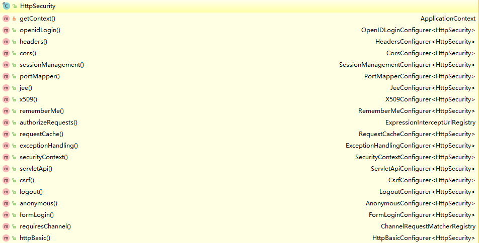
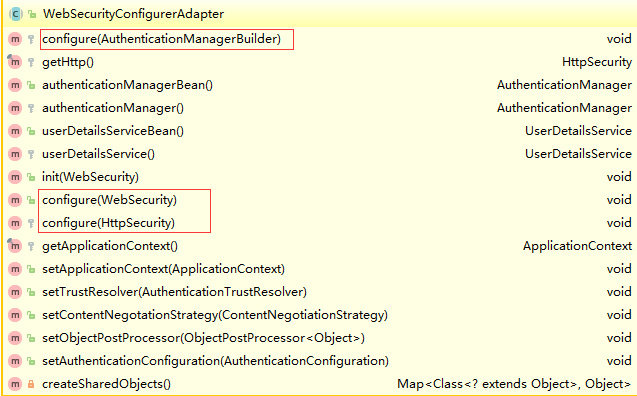

##  常用配置
```
@Configuration
@EnableWebSecurity
public class WebSecurityConfig extends WebSecurityConfigurerAdapter {
  
  @Override
  protected void configure(HttpSecurity http) throws Exception {
      http
          .authorizeRequests()
              .antMatchers("/", "/home").permitAll()
              .anyRequest().authenticated()
              .and()
          .formLogin()
              .loginPage("/login")
              .permitAll()
              .and()
          .logout()
              .permitAll();
  }
  
  @Autowired
  public void configureGlobal(AuthenticationManagerBuilder auth) throws Exception {
      auth
          .inMemoryAuthentication()
              .withUser("admin").password("admin").roles("USER");
  }
}
```
- 除了“/”,”/home”(首页),”/login”(登录),”/logout”(注销),之外，其他路径都需要认证。
- 指定“/login”该路径为登录页面，当未认证的用户尝试访问任何受保护的资源时，都会跳转到“/login”。
- 默认指定“/logout”为注销页面
- 配置一个内存中的用户认证器，使用admin/admin作为用户名和密码，具有USER角色

##  @EnableWebSecurity
我们自己定义的配置类WebSecurityConfig加上了@EnableWebSecurity注解，同时继承了WebSecurityConfigurerAdapter。你可能会在想谁的作用大一点，毫无疑问@EnableWebSecurity起到决定性的配置作用，它其实是个组合注解。

```
@Import({ WebSecurityConfiguration.class, // <2>
      SpringWebMvcImportSelector.class }) // <1>
@EnableGlobalAuthentication // <3>
@Configuration
public @interface EnableWebSecurity {
   boolean debug() default false;
}
```
@Import是springboot提供的用于引入外部的配置的注解，可以理解为：@EnableWebSecurity注解激活了@Import注解中包含的配置类。

<1> SpringWebMvcImportSelector的作用是判断当前的环境是否包含springmvc，因为spring security可以在非spring环境下使用，为了避免DispatcherServlet的重复配置，所以使用了这个注解来区分。

<2> WebSecurityConfiguration顾名思义，是用来配置web安全的，下面的小节会详细介绍。

<3> @EnableGlobalAuthentication注解的源码如下：

```
@Import(AuthenticationConfiguration.class)
@Configuration
public @interface EnableGlobalAuthentication {
}
```
注意点同样在@Import之中，它实际上激活了AuthenticationConfiguration这样的一个配置类，用来配置认证相关的核心类。

也就是说：@EnableWebSecurity完成的工作便是加载了WebSecurityConfiguration，AuthenticationConfiguration这两个核心配置类，也就此将spring security的职责划分为了配置安全信息，配置认证信息两部分。

## WebSecurityConfiguration（安全信息配置）
在这个配置类中，有一个非常重要的Bean被注册了。

```
@Configuration
public class WebSecurityConfiguration {
	//DEFAULT_FILTER_NAME = "springSecurityFilterChain"
	@Bean(name = AbstractSecurityWebApplicationInitializer.DEFAULT_FILTER_NAME)
    public Filter springSecurityFilterChain() throws Exception {
    	...
    }
   
 }
```
在未使用springboot之前，大多数人都应该对“springSecurityFilterChain”这个名词不会陌生，他是spring security的核心过滤器，是整个认证的入口。在曾经的XML配置中，想要启用spring security，需要在web.xml中进行如下配置：

```
<!-- Spring Security -->
<filter>
   <filter-name>springSecurityFilterChain</filter-name>
   <filter-class>org.springframework.web.filter.DelegatingFilterProxy</filter-class>
</filter>
<filter-mapping>
   <filter-name>springSecurityFilterChain</filter-name>
   <url-pattern>/*</url-pattern>
</filter-mapping>
```
而在springboot集成之后，这样的XML被java配置取代。WebSecurityConfiguration中完成了声明springSecurityFilterChain的作用，并且最终交给DelegatingFilterProxy这个代理类，负责拦截请求（注意DelegatingFilterProxy这个类不是spring security包中的，而是存在于web包中，spring使用了代理模式来实现安全过滤的解耦）。

## AuthenticationConfiguration（认证信息配置）

```
@Configuration
@Import(ObjectPostProcessorConfiguration.class)
public class AuthenticationConfiguration {
  	@Bean
	public AuthenticationManagerBuilder authenticationManagerBuilder(
			ObjectPostProcessor<Object> objectPostProcessor) {
		return new AuthenticationManagerBuilder(objectPostProcessor);
	}
  
  	public AuthenticationManager getAuthenticationManager() throws Exception {
    	...
    }
}
```
AuthenticationConfiguration的主要任务，便是负责生成全局的身份认证管理者AuthenticationManager。

## WebSecurityConfigurerAdapter
适配器模式在spring中被广泛的使用，在配置中使用Adapter的好处便是，我们可以选择性的配置想要修改的那一部分配置，而不用覆盖其他不相关的配置。WebSecurityConfigurerAdapter中我们可以选择自己想要修改的内容，来进行重写，而其提供了三个configure重载方法，是我们主要关心的：

由参数就可以知道，分别是对AuthenticationManagerBuilder，WebSecurity，HttpSecurity进行个性化的配置。

## HttpSecurity常用配置
```
@Configuration
@EnableWebSecurity
public class CustomWebSecurityConfig extends WebSecurityConfigurerAdapter {
  
    @Override
    protected void configure(HttpSecurity http) throws Exception {
        http
            .authorizeRequests()
                .antMatchers("/resources/**", "/signup", "/about").permitAll()
                .antMatchers("/admin/**").hasRole("ADMIN")
                .antMatchers("/db/**").access("hasRole('ADMIN') and hasRole('DBA')")
                .anyRequest().authenticated()
                .and()
            .formLogin()
                .usernameParameter("username")
                .passwordParameter("password")
                .failureForwardUrl("/login?error")
                .loginPage("/login")
                .permitAll()
                .and()
            .logout()
                .logoutUrl("/logout")
                .logoutSuccessUrl("/index")
                .permitAll()
                .and()
            .httpBasic()
                .disable();
    }
}
```
上述是一个使用Java Configuration配置HttpSecurity的典型配置，其中http作为根开始配置，每一个and()对应了一个模块的配置（等同于xml配置中的结束标签），并且and()返回了HttpSecurity本身，于是可以连续进行配置。他们配置的含义也非常容易通过变量本身来推测，

- authorizeRequests()配置路径拦截，表明路径访问所对应的权限，角色，认证信息。
- formLogin()对应表单认证相关的配置
- logout()对应了注销相关的配置
- httpBasic()可以配置basic登录
- etc

他们分别代表了http请求相关的安全配置，这些配置项无一例外的返回了Configurer类，而所有的http相关配置可以通过查看HttpSecurity的主要方法得知：


需要对http协议有一定的了解才能完全掌握所有的配置，不过，springboot和spring security的自动配置已经足够使用了。其中每一项Configurer（e.g.FormLoginConfigurer,CsrfConfigurer）都是HttpConfigurer的细化配置项。

## WebSecurityBuilder常用配置
```
@Configuration
@EnableWebSecurity
public class WebSecurityConfig extends WebSecurityConfigurerAdapter {
    @Override
    public void configure(WebSecurity web) throws Exception {
        web
            .ignoring()
            .antMatchers("/resources/**");
    }
}
```
## AuthenticationManagerBuilder常用配置

```
@Configuration
@EnableWebSecurity
public class WebSecurityConfig extends WebSecurityConfigurerAdapter {
    
    @Override
    protected void configure(AuthenticationManagerBuilder auth) throws Exception {
        auth
            .inMemoryAuthentication()
            .withUser("admin").password("admin").roles("USER");
    }
}
```
想要在WebSecurityConfigurerAdapter中进行认证相关的配置，可以使用configure(AuthenticationManagerBuilder auth)暴露一个AuthenticationManager的建造器：AuthenticationManagerBuilder 。如上所示，我们便完成了内存中用户的配置。

细心的朋友会发现，在前面的文章中我们配置内存中的用户时，似乎不是这么配置的，而是：
```
@Configuration
@EnableWebSecurity
public class WebSecurityConfig extends WebSecurityConfigurerAdapter {
    
    @Autowired
    public void configureGlobal(AuthenticationManagerBuilder auth) throws Exception {
        auth
            .inMemoryAuthentication()
                .withUser("admin").password("admin").roles("USER");
    }
}
```
如果你的应用只有唯一一个WebSecurityConfigurerAdapter，那么他们之间的差距可以被忽略，从方法名可以看出两者的区别：使用@Autowired注入的AuthenticationManagerBuilder是全局的身份认证器，作用域可以跨越多个WebSecurityConfigurerAdapter，以及影响到基于Method的安全控制；而 protected configure()的方式则类似于一个匿名内部类，它的作用域局限于一个WebSecurityConfigurerAdapter内部。关于这一点的区别，可以参考我曾经提出的issuespring-security#issues4571。官方文档中，也给出了配置多个WebSecurityConfigurerAdapter的场景以及demo，将在该系列的后续文章中解读。

## 参考资料
> - [徐靖峰](https://www.cnkirito.moe/categories/Spring-Security/)
