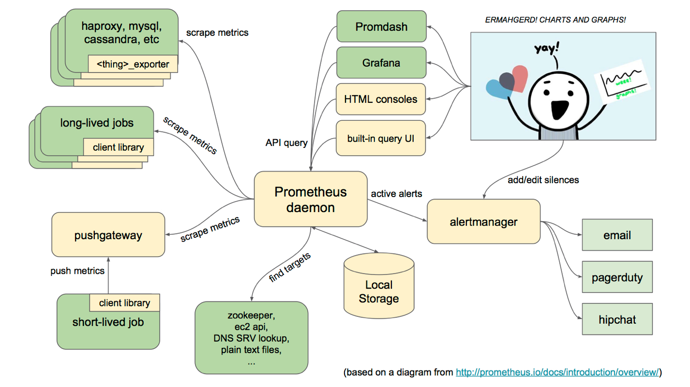

官网：https://prometheus.io

普罗米修斯的灵感来自于谷歌的Borgmon。它最初是由马特·t·普劳德(Matt T. Proud)作为一个研究项目开发的，普劳德曾是谷歌(google)的一名雇员。在普劳德加入SoundCloud之后，他与另一位工程师朱利叶斯•沃尔兹(Julius Volz)合作，认真开发普罗米修斯。其他开发人员也参与了这项工作，并继续在SoundCloud内部进行开发，最终于2015年1月公开发布。

Prometheus是由SoundCloud开发的开源监控报警系统和时序列数据库(TSDB)。Prometheus使用Go语言开发，是Google BorgMon监控系统的开源版本。

2016年由Google发起Linux基金会旗下的云原生基金会(Cloud Native Computing Foundation), 将Prometheus纳入其下第二大开源项目。Prometheus目前在开源社区相当活跃。

## 基本原理

Prometheus的基本原理是通过HTTP协议周期性抓取被监控组件的状态，任意组件只要提供对应的HTTP接口就可以接入监控。不需要任何SDK或者其他的集成过程。这样做非常适合做虚拟化环境监控系统，比如VM、Docker、Kubernetes等。输出被监控组件信息的HTTP接口被叫做exporter 。目前互联网公司常用的组件大部分都有exporter可以直接使用，比如汇报机器数据的 node_exporter, 汇报 MongoDB 信息的 MongoDB exporter 等等。


## 监控过程

1. Prometheus Daemon负责定时去目标上抓取metrics(指标)数据，每个抓取目标需要暴露一个http服务的接口给它定时抓取。Prometheus支持通过配置文件、文本文件、Zookeeper、Consul、DNS SRV Lookup等方式指定抓取目标。Prometheus采用PULL的方式进行监控，即服务器可以直接通过目标PULL数据或者间接地通过中间网关来Push数据。
2. Prometheus在本地存储抓取的所有数据，并通过一定规则进行清理和整理数据，并把得到的结果存储到新的时间序列中。
3. Prometheus通过PromQL和其他API可视化地展示收集的数据。Prometheus支持很多方式的图表可视化，例如Grafana、自带的Promdash以及自身提供的模版引擎等等。Prometheus还提供HTTP API的查询方式，自定义所需要的输出。
4. PushGateway支持Client主动推送metrics到PushGateway，而Prometheus只是定时去Gateway上抓取数据。
5. Alertmanager是独立于Prometheus的一个组件，可以支持Prometheus的查询语句，提供十分灵活的报警方式。



## 核心概念

data model：指标数据根本上是基于时间序列存储的，由一个float64值和毫秒精度的时间戳组成

metric type：指标类型有以下几种

- Counter:  数量从0开始累加，一般永远增长，如用户访问量
- Gauge:  瞬时的数量，如内存使用量
- Histogram: 直方图，通常观察和计数一个桶的数据值
- Summary: 摘要，类似直方图

job 和 instance分别指：

- instance:  指一个可抓取的端点
- job:   具有相同目的的实例的集合


## 常用函数

- sum()：对值进行加合

- increase()：主要针对Counter 这种持续增长的数值，截取其中⼀段时间的增量，如increase(node_cpu[1m])表示获取CPU总运行时间在1分钟内的增量

- rate()：是专门搭配**counter**类型数据使⽤的函数，它的功能是按照设置⼀个时间段，取counter在这个时间段中的平均每秒的增量，如rate(node_network_receive_bytes[1m])表示1分钟内网络接受字节数/60秒的值

- topk()：取最⾼值的前⼏位，对图形意义不大，如topk(3,count_netstat_wait_connections)表示等待连接数前3位值

- count()：把数值符合条件的输出数⽬进⾏加合计数，如count(count_netstat_wait_connections > 200)表示等待连接数大于200的个数

- by (instance)：类似于通过instance分组

- 过滤：通过标签进行精确匹配和模糊匹配

```
.*  属于正则表达式
=~  模糊匹配  
!~  模糊不匹配 

# 表示把所有 机器名中 带有 web的 机器都显⽰出来
count_netstat_wait_connections{exported_instance=~"web.*"}

# 数字过滤
count_netstat_wait_connections{exported_instance=~"web.*"} > 400
```


## example

- 获取cpu使用率

```
# 1 - (空闲时间 / 总时间)
(1-((sum(increase(node_cpu{mode="idle"}[1m])) by (instance))  /
(sum(increase(node_cpu[1m])) by (instance)))) * 100
```


## 参考资料

> - []()
> - []()
