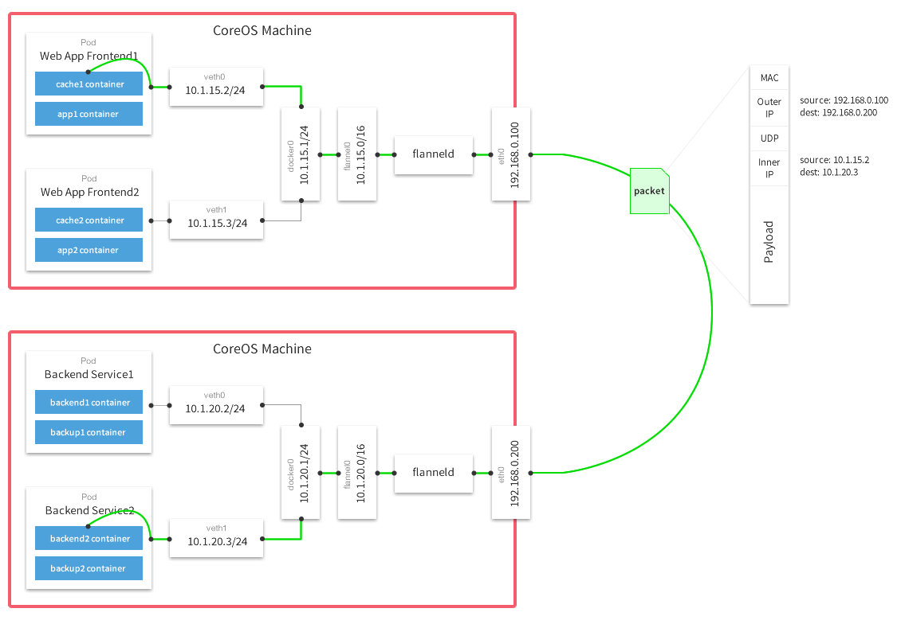

Github:  https://github.com/coreos/flannel/

Kubernetes的网络模型假定了所有Pod都在一个可以直接连通的扁平网络空间中。这在GCE里面是现成的网络模型，Kubernetes假定这个网络也存在。而在私有云里搭建Kubernetes集群，就不能假定这种网络已经存在了。我们需要自己实现这个网络假设，将不同节点上的Docker容器之间的相互访问先打通，然后运行Kubernetes。

目前已经有多个开源组件支持容器网络模型。本篇介绍Flannel的实现。Flannel之所以可以搭建Kubernetes依赖的底层网络，是因为它能实现以下两点:

- 它能协助Kubernetes，给每一个Node上的Docker容器都分配互相不冲突的IP地址。
- 它能在这些IP地址之间建立一个覆盖网络（Overlay Network），通过这个覆盖网络，将数据包原封不动地传递到目标容器内。



## 分配不冲突的地址

在各节点上的Docker主机在docker0上默认使用同一个子网，不同节点的容器都有可能会获取到相同的地址，那么在跨节点通信时就会出现地址冲突的问题。并且在多个节点上的docker0使用不同的子网，也会因为没有准确的路由信息导致无法准确送达报文。

而为了解决这一问题，Flannel的解决办法是，预留一个使用网络，如10.244.0.0/16，然后自动为每个节点的Docker容器引擎分配一个子网，如10.244.1.0/24和10.244.2.0/24，并将分配信息保存在etcd持久存储。

从上图可以看到，Flannel首先创建了一个名为flannel0的网桥，而且这个网桥的一端连接docker0网桥，另一端连接一个叫作flanneld的服务进程。flanneld进程并不简单，它利用etcd来管理可分配的IP地址段资源，同时监控etcd中每个Pod的实际地址，并在内存中建立了一个Pod节点路由表；另一方面如上图，通过flannel0连接docker0和物理网络，使用内存中的Pod节点路由表，将docker0发给它的数据包包装起来，利用物理网络的连接将数据包投递到目标flanneld上，从而完成Pod到Pod之间的直接地址通信。通过源flanneld封包、目标flanneld解包，最终docker0收到的就是原始的数据，对容器应用来说是透明的，感觉不到中间Flannel的存在。

我们看一下Flannel是如何做到为不同Node上的Pod分配的IP不产生冲突的。其实想到Flannel使用了集中的etcd存储就很容易理解了。它每次分配的地址段都在同一个公共区域获取，这样大家自然能够互相协调，不产生冲突了。而且在Flannel分配好地址段后，后面的事情是由Docker完成的，Flannel通过修改Docker的启动参数将分配给它的地址段传递进去：

```
## 启动docker进程时，配置docker0网桥的IP地址和掩码
--bip 172.17.18.1/24
```

通过这些操作，Flannel就控制了每个Node上的docker0地址段的地址，也就保障了所有Pod的IP地址在同一个水平网络中且不产生冲突了。

Flannel完美地实现了对Kubernetes网络的支持，但是它引入了多个网络组件，在网络通信时需要转到flannel0网络接口，再转到用户态的flanneld程序，到对端后还需要走这个过程的反过程，所以也会引入一些网络的时延损耗。


## 通信底层实现

前面我们已经知道，针对各节点的pod网络，Flannel自动为每个节点分配一个子网，如10.244.1.0/24和10.244.2.0/24，并将分配信息保存在etcd持久存储。然后需要解决两个问题，单节点和跨节点的pod间通信问题。

单节点pod间通信类似于Docker引擎的桥接模式，查看各个节点上的网络接口可以发现多了一个虚拟接口cni0，它是由flanneld创建的一个虚拟网桥，在Pod本地通信使用，仅作用于本地通信。flanneld为每个Pod创建一对veth虚拟设备，一端放在容器接口上，一端放在cni0桥上。 类似于Docker引擎的docker0网桥。

跨节点pod通信，Flannel可以采用不同类型的后端网络模型进行处理，底层通信协议的可选技术包括UDP、VxLan、AWS VPC、AliVPC等多种方式：

1. UDP：使用普通的UDP报文封装完成隧道转发。
2. VxLAN：使用内核中的VxLAN模块进行封装报文。默认就是VxLAN模式，即Overlay Network。
3. host-gw：即Host Gateway，通过在节点上创建目标容器地址的路由直接完成报文转发，要求各节点必须在同一个2层网络，对报文转发性能要求较高的场景使用。

## VxLAN

flannel运行后，在各Node宿主机多了一个网络接口：flannel.1。它是专门用来封装隧道协议的。

那么跨主机pod通信是如何实现的呢？ master上查看路由表信息：

```
[root@k8s-master ~]# ip route
......
10.244.1.0/24 via 10.244.1.0 dev flannel.1 onlink 
10.244.2.0/24 via 10.244.2.0 dev flannel.1 onlink 
......
```

发送到`10.244.1.0/24`和`10.244.2.0/24`网段的数据报文发给本机的flannel.1接口，即进入二层隧道，然后对数据报文进行封装（封装VxLAN首部-->UDP首部-->IP首部-->以太网首部），到达目标Node节点后，由目标Node上的flannel.1进行解封装。

VxLAN是Linux内核本身支持的一种网络虚拟化技术，是内核的一个模块，在内核态实现封装解封装，构建出覆盖网络，其实就是一个由各宿主机上的Flannel.1设备组成的虚拟二层网络。

## host-gw

由于VxLAN由于额外的封包解包，导致其性能较差，所以Flannel就有了host-gw模式，即把宿主机当作网关，除了本地路由之外没有额外开销，性能和calico差不多，由于没有叠加来实现报文转发，这样会导致路由表庞大。因为一个节点对应一个网络，也就对应一条路由条目。

host-gw虽然VxLAN网络性能要强很多，但是种方式有个缺陷：要求各物理节点必须在同一个二层网络中，即物理节点必须在同一网段中。这样会使得一个网段中的主机量会非常多，万一发一个广播报文就会产生干扰。在私有云场景下，宿主机不在同一网段是很常见的状态，所以就不能使用host-gw了。

## direct routing

 VxLAN还有另外一种功能，VxLAN也支持类似host-gw的玩法，如果两个节点在同一网段时使用host-gw通信，如果不在同一网段中，即当前pod所在节点与目标pod所在节点中间有路由器，就使用VxLAN这种方式，使用叠加网络。 结合了Host-gw和VxLAN，这就是VxLAN的**Direct routing模式**。

- Direct routing模式配置

```
修改kube-flannel.yml文件，将flannel的configmap对象改为：

[root@k8s-master ~]# vim kube-flannel.yml 
......
 net-conf.json: |
    {
      "Network": "10.244.0.0/16",   #默认网段
      "Backend": {
        "Type": "vxlan",
        "Directrouting": true   #增加
      }
    }
......

[root@k8s-master ~]# kubectl apply -f kube-flannel.yml 
clusterrole.rbac.authorization.k8s.io/flannel configured
clusterrolebinding.rbac.authorization.k8s.io/flannel configured
serviceaccount/flannel unchanged
configmap/kube-flannel-cfg configured
daemonset.extensions/kube-flannel-ds-amd64 created
daemonset.extensions/kube-flannel-ds-arm64 created
daemonset.extensions/kube-flannel-ds-arm created
daemonset.extensions/kube-flannel-ds-ppc64le created
daemonset.extensions/kube-flannel-ds-s390x created

#查看路由信息
[root@k8s-master ~]# ip route
......
10.244.1.0/24 via 192.168.56.12 dev eth0 
10.244.2.0/24 via 192.168.56.13 dev eth0 
......
```

从上面的结果可以看到，发往`10.244.1.0/24`和`10.244.2.0/24`的包都是直接经过`eth0`网络接口直接发出去的，这就是Directrouting。如果两个节点是跨网段的，则flannel自动降级为VxLAN模式。

此时，在各个集群节点上执行“`iptables -nL”`命令可以看到，iptables  filter表的FORWARD链上由其生成了如下两条转发规则，它显式放行了`10.244.0.0/16`网络进出的所有报文，用于确保由物理接口接收或发送的目标地址或源地址为`10.244.0.0/16`网络的所有报文均能够正常通行。这些是DirectRouting模式得以实现的必要条件：

```
target      prot    opt     source              destination 
ACCEPT      all     --  10. 244. 0. 0/ 16       0. 0. 0. 0/ 0 
ACCEPT      all     --  0. 0. 0. 0/ 0           10. 244. 0. 0/ 16
```


## 参考资料

> - []()
> - []()
