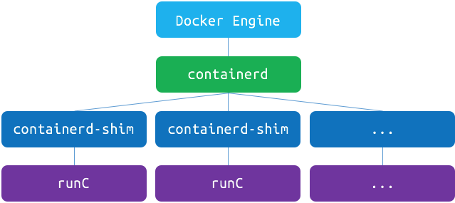

容器无疑是近年来云计算中最火热的关键词。随着docker的大热，docker、oci、runc、containerd等等名词也逐渐传播开来。这么多的名词，也容易让人混淆。本文对相关名词和其之间的联系进行一下梳理和总结，方便大家更好地理解。

## 容器引擎

容器引擎，或者说容器平台，不仅包含对于容器的生命周期的管理，还包括了对于容器生态的管理，比如对于镜像等。现在的docker、rkt以及阿里推出的pouch均可属于此范畴。

Docker可以分为两个阶段来理解。docker版本为1.2时，当时的docker的主要作用是容器的生命周期管理和镜像管理，当时的docker在功能上更趋近于现在的container
runtime。而后来，随着docker的发展，docker就不再局限于容器的管理，还囊括了存储(volume)、网络(net)等的管理，因此后来的docker更多的是一个容器及容器生态的管理平台。

## OCI

全称：Open Container Initiative，开放容器联盟

Linux基金会于2015年6月成立OCI组织，旨在围绕容器格式和运行时制定一个开放的工业化标准，目前主要有两个标准文档：**容器运行时标准 （runtime spec）和 容器镜像标准（image spec）**。

容器运行时标准中对于容器的状态描述，以及对于容器的创建、删除、查看等操作进行了定义。**runc**是对于OCI标准的一个参考实现，是一个可以用于创建和运行容器的CLI(command-line 
interface)工具。runc直接与容器所依赖的cgroup/linux kernel等进行交互，负责为容器配置cgroup/namespace等启动容器所需的环境，创建启动容器的相关进程。

为了兼容OCI标准，docker也做了架构调整。将容器运行时相关的程序从docker daemon剥离出来，形成了**containerd**。Containerd向docker提供运行容器的API，二者通过grpc进行交互。containerd最后会通过runc来实际运行容器。

## CRI

全称：Container Runtime Interface，容器运行时接口

kubernetes在初期版本里，就对多个容器引擎做了兼容，因此可以使用docker、rkt对容器进行管理。以docker为例，kubelet中会启动一个docker manager，通过直接调用docker的api进行容器的创建等操作。

在kubernetes 1.5版本之后，kubernetes推出了自己的运行时接口api--**CRI**(container runtime interface)。cri接口的推出，隔离了各个容器引擎之间的差异，而通过统一的接口与各个容器引擎之间进行互动。

在cri开始之初，主要是支持docker和rkt两种。其中kubelet是通过cri接口，调用docker-shim，并进一步调用docker api实现的。后来为了要直接支持containerd和runC，kubernetes分别又孵化了**cri-containerd**和**cri-o**。他们关系如下：

## CNI

全称：Container Network Interface，容器网络接口

CNI(Container Network Interface) 是 google 和 CoreOS  主导制定的容器网络标准，它本身并不是实现或者代码，可以理解成一个协议。这个标准是在 rkt  网络提议的基础上发展起来的，综合考虑了灵活性、扩展性、ip 分配、多网卡等因素.

这个协议连接了两个组件：容器管理系统和网络插件。它们之间通过 JSON  格式的文件进行通信，实现容器的网络功能。具体的事情都是插件来实现的，包括：创建容器网络空间（network  namespace）、把网络接口（interface）放到对应的网络空间、给网络接口分配 IP 等等

## 参考资料
> - 
> - 
