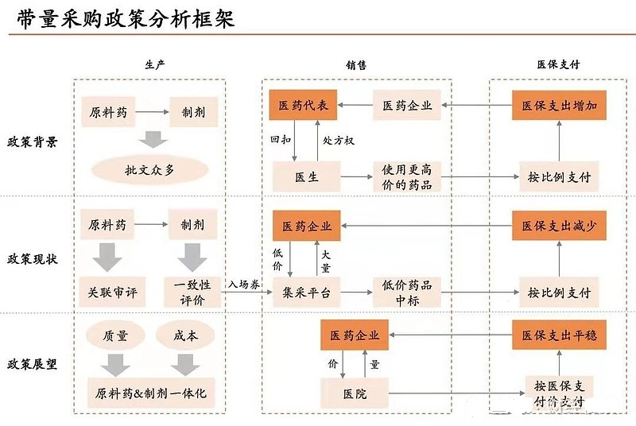

简单来说就是：以前各个医疗单位独自采购，采购量小，不具备和厂家的议价能力，同时还有经销商层层加价以及医院收取回扣的现象，因此国家政府部门出面，统一收集各个公立医疗单位医药用品的需求量，然后对各个医院的用量进行整合，最后向企业统一采购药品。

2018年11月，国家组织的药品集中采购和使用试点工作启动，以北京、上海、天津、重庆4个直辖市，沈阳、大连、厦门、广州、深圳、成都、西安等7个城市的公立医疗机构作为集中采购主体，集合他们的需求量，以带量采购的方式向医药生产厂家采购医药用品，以达到降低采购成本，降低患者医药负担的目的。按目前的态势看，集采改革呈现全面推进之势。药品集采不仅将从试点推广到全国，而且政府集中采购的医药目录也将会越来越多，这将显著的改善居民看病成本，同时这也不可避免会对医药企业乃至整个行业发展带来深刻影响。这就是医疗集采的大致背景和目前集采的现状

我国的药品集中采购政策是从2000年开始发展起来的，1999年通过的《中华人民共和国招投标法》，正式从法律层面上规定了我国药品集中投标的方式来采购。从2000年起，各个省份到底如何开展和执行中央政策的。我没有做具体的研究，但各个地区在执行上一定遇到很多问题，例如：政策规定药品要集中招投标，那么所有的药品都要招投标吗？招投标是多少年进行一次呢？在这之后的十几年中，因为没有一个政策具体规定集中采购要具体怎么操作，因此各个省市根据当地的特点，发展出了有当地特色的执行政策。

其中，不是所有的药品都是通过招投标的形式采购的。还有另一个最能体现这个特点的是各种不同的集中采购平台的出现。几乎每个省和直辖市都会有自己的采购平台，比如：上海的阳光医药采购网，四川药械采购监管网等等，同时，还存在GPO（Group purchasing organizations，集团采购组织）平台，上海药品集团采购服务网，深圳的全药网，重庆药交所，三明市的三明联盟，等等。这里我使用平台来表述，很多文章用采购模式来表述，我认为平台在表述上比较清晰，因为可以很清晰的和集中招标，谈判采购，等等采购模式区别开来，避免混淆。

- 上海的阳光医药采购网: http://www.yyzbsw.sh.cn/
- 四川药械采购监管网: https://www.scyxzbcg.cn/
- 上海药品集团采购服务网: 
- 深圳的全药网: https://www.quanyaowang.com/
- 重庆药交所: http://cq.yjsds.com/
- 三明市的三明联盟: https://www.udplat.com/

一直到2015年,国务院办公厅发布了“关于完善公立医院药品集中采购工作的指导意见”从政策层面上总结了各个地区的经验，并指出了药品集中采购的未来发展路径。这也是当前全国执行的药品集中采购的基本政策。其中有几个关键的点：

1. 政府坚持以省为单位在网上进行集中采购，并且鼓励地方结合实际探索创新，目的是提高医院在药品采购中的参与度。因此，才有目前各个不同的，都说自己有多创新的采购平台的出现。

2. 针对不同特点的药品，规定了5种采购模式：
    1）集中招标采购，针对用量大的药品；
    2）谈判采购，针对专利药，独家药；
    3）医院直接采购，针对基础，常用的保障性药品；
    4）国家定点生产，议价采购，针对用量小，供应少的必须药品；
    5）国家管控采购，针对管制类药品，免疫规划和防治床染病等药品。

3. 规定在2015年全国开展新一轮的药品采购。自此，每个省份开始了新一轮的药品集中采购。甚至有的省份从2014年就已经开始了。这个政策意味着，每个省份开始重新选择药品的供应商，涉及到上千种药品。这一轮药品集中采购流程大体上有这么几步：

    1. 第一步：每个省份根据自己对药品的使用情况，把所有药品分成5类，每一类对应一种采购模式。哪些药品是招标采购，哪些是谈判，哪些直接采购，可以在药品集采网站上直接看到。
    2. 第二步：各个药厂根据公布的药品分类和对应的采购模式，参与对应的流程。
    3. 第三步：省政府部门筛选药品供应商，最终确定省级别的供应商名录。

在第一步的5种采购模式中，每种模式有不同的操作流程。其中，集中招标采购最复杂。按照政策要求，至少80%的药品要用这种采购模式，意味这上千种药品要招标，竞标，开标。可以想象，当年每个省份的食药监局的工作人员有多忙。但是对于药厂来说，这就是市场的计划呀，也可以想象他们有多么的紧张和兴奋。一旦中标，就开疆拓土，一旦失败，那就失去市场。非常的残酷和现实。

耐人寻味的是，在2015年政策中，对于集中招标采购，强调了要落实带量采购。实际上，几乎没有省份真正的执行的带量采购，只有上海在完成了新一轮的采购之后，在2016，2017和2018进行了三次实验性的带量采购，涉及的药品一共才20个左右。也许因为上海有过几次带量采购的经验，所以主导了2018年底开始的“4+7”带量采购。回到2015年的集中采购上来，到了2016年，基本上每个省份的集中采购已经结束，该选择的供应商已经确定。医院和供应商之间也就开始正常的采购和供应（其中当然存在因为政策的原因，导致的各种灰色的市场行为，这里我们先不谈）。有意思的是，2015年的政策并没有规定这次采购结果的时效，简单说就是没有具体说明，这次选了供应商以后多久在选择一次。这也意味着，在一个省内，中标的药企可以连续几年给在这个地区的医院供应药品，失败的药企只能在零售药店卖药，没有资格供应医院。因此，集中采购结束，药企在这个市场的竞争大格局也就确定了。

最后，时间来到2018年11月，国家发布了“4+7城市药品集中采购文件”，选择了11个城市，对31种药品进行了跨城市的试点带量采购。注意的是，这个政策只是针对5种集中采购模式中集中招标采购做的规定，并不针对其他的4种采购模式。这个政策对药企来说有爱有恨，爱的是供应商选择重新开始。恨的是，本地药企和国际药企同台晋级，而且成王败寇，每个企业都压低价格。到目前为止，对政策的效果褒贬不一，但带量采购会成为未来的方向。

## 参考资料
> - [https://www.zhihu.com/column/c_1173267719310254080](https://www.zhihu.com/column/c_1173267719310254080)
> - 
