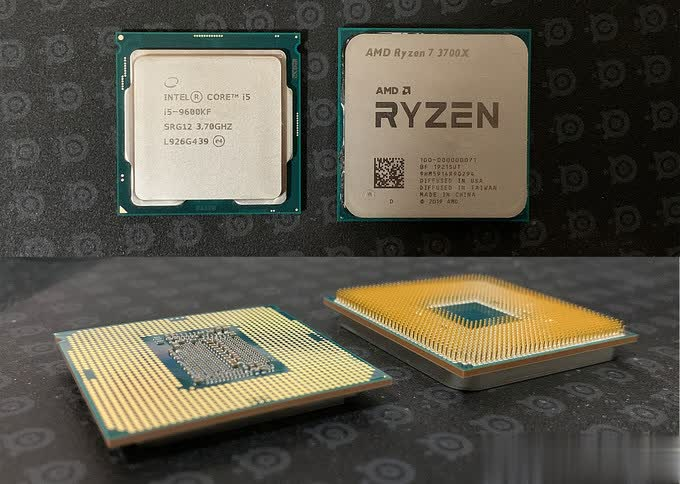

主板（Motherboard、湾湾那边叫“主機板”），是PC硬件平台的重要部分，通过电路设计、各个芯片、硬件插槽、I/O接口，来连接包括CPU、显卡、内存、硬盘（包含SSD）、声卡、网卡、外设等拓展设备。贵为“主机三大件之一”，虽看上去并不像CPU、显卡甚至内存、固态硬盘那样提供性能上的支持，但是整个机器运行的基础平台，所以兼容性、稳定性、拓展性都和他息息相关。
至于主板上的各个部分和功能用途，我们稍后来讲，上来从最直接核心的匹配CPU来说。首先，主板其实是按照主板芯片组来划分，“芯片组”其实就是Intel、AMD这样的CPU芯片厂商推出的一个连接CPU和各个配件的集成电路芯片，并予以支持相应的CPU处理器，比如我们常说的什么B360、Z390芯片组主板。
而我们看到的华硕、技嘉、微星、华擎等主板厂商，其实可以理解为基于芯片组的各个主板OEM厂商。主板厂商在采购Intel/AMD的芯片组后，通过自己的研发设计，推出规格、用料、功能、外形各不相同的主板，进行不同消费需求的细分。所以即便是同一Z390主板，规格和价格差异也可以很大，当然品牌溢价也少不了。
实际装机选购中，CPU确定后就可以选择搭配的主板。这里我们只讨论目前主流平台：其中Intel是第八代、第九代酷睿处理器的LGA 1151接口主板；AMD那边则是支持锐龙处理器的AM4接口主板。

两大芯片厂商还有一个比较有意思的地方，两者CPU针脚形式是不同的：上面我放出Intel和AMD两颗CPU对比图，虽然两家正面看起来差不多，但AMD背面还是有一个个密集的针脚（PGA针脚形式），Intel的CPU背面则是触点（LGA触点形式）。
所以Intel的针脚放在主板的Socket插座上，AMD的AM4主板CPU底座则是一个个凹槽。我们都知道CPU/或者主板插座上的针脚是比较脆弱的，所以两者不同逻辑的设计，就造成AMD的CPU针脚容易断裂（特别是要拆卸使用的平台，散热器硅脂和CPU长期已经粘合的很紧密，千万不要大力出奇迹，很容易把针弄断），Intel平台的主板容易出现针脚弯针、断裂的情况。所以理论上，Intel把这部分风险，给到了主板厂商，看上去有点鸡贼，但实际上主板CPU插槽是可以维修或更换的，但如果AMD的CPU针脚断裂，就直接狗带了

### CPU和主板芯片组推荐搭配
回归到实际选购，我个人针对Intel和AMD提供一个不同CPU对应的主板推荐搭配。虽然理论上，只要CPU和主板接口对应、并且BIOS支持，下面的几个芯片组主板都能支持不同定位的CPU。但由于CPU本身核心频率规格上的区别，定位价位上的区分，CPU和主板门当户对就是关键了！

Intel平台，都是300系列芯片组主板，从低到高为H310、B360/B365、H370（这个芯片组很鸡肋，主板厂商也很少在卖）、Z390:
- 其中H310芯片组主板是最低阶，供电规格也很入门，对应的CPU建议就是奔腾、酷睿i3这个级别吧。当然，i3还有一款酷睿i3-9350K支持超频，但由于售价也不低，还要搭配Z390主板才能超，4核4线程超频再猛，86也就是86。所以算是一颗鸡肋处理器，不如直接上i5了，这里就忽略，也不建议大家选择了。
- 主流价位的话，酷睿i5、i7（非K，不支持超频），就选B360、B365（B365芯片组是H270官改而来，入门小白无需深入了解，妥妥用就行）主板就可以了。当然由于核心增加，如果搭配酷睿i7，主板的供电规格不要太寒酸就行。
- 最后如果CPU选择的是后缀带K的酷睿i5、i7、i9超频U，毫无疑问上Z390主板。提到这里，也顺便说下Intel对主板支持超频的限制还是很严格的，想要超频必须上Z390（或者上一代Z370主板，升级BIOS支持九代酷睿）。关于手动超频的部分，AMD对主板则更加宽松。

AMD平台，则有点三代同堂的味道，只不过第一代锐龙处理器有点太老了，我就不推荐大家选择。对应的，针对2、3代锐龙，这里我只放出比较适合的芯片组主板。从低到高：A320、B450、X470、X570：

- 最入门的A320，其实是AMD第一代Ryzen锐龙处理器推出的芯片组主板，后面在2、3代锐龙推出后，也没新的入门芯片组，定位和主板规格最低。所以目前A320我就只建议搭配锐龙的APU使用，规格够用省钱为第一。
- 大众主流的话，B450芯片组当之无愧，这里建议搭配锐龙5、7处理器，另外由于锐龙7拥有8核16线程，即便不超频，主板供电规格也尽量选择好一点的为宜。
- X470芯片组则是400系列的旗舰，虽然现在有X570替代，但X570主板定价确实高了一个级别。所以在X470供电规格相比B450更好，价格明显比X570更低的基础上，反而有了性价比。我推荐搭配锐龙7处理器的，预算不多选X470也是一个方向。
- 最后就是X570芯片组，除了推荐搭配锐龙7，高端型号供电和散热规格都武装到了牙齿，所以“核武器”锐龙9，首发的3900X的12核24线程、后面马上到位的16核32线程的3950X，供电堆料的X570主板必不可少。

### 主板版型分类
对于主板版型，从大到小主要是四种：
- E-ATX：除了High-End平台（X299、X399主板）是标准配备，在主流平台（Z390、X570）的顶级型号上，各大主板厂商的精神图腾旗舰也会采用E-ATX版型，实现更炫酷张扬的造型，或一般用户用不到的黑科技。动辄四五千以上的售价，显然是土豪的玩物。
- ATX：最标准的版型，与MATX主板差别主要在两点：1、拓展插槽区域更充足。2、大部分中高端芯片组主板，也都是ATX版型的，供电规格普遍会更好，是超频性能级平台的常规选择。对于预算充足的玩家，诸如Z390、X570芯片组有很多高端型号可以选择；但如果要兼顾供电规格、RGB和外观造型、价格别太贵，那么笔者建议1500-2000元（双11等促销会更低一些）左右的型号比较合适，一线厂商也都有热卖型号，更多看玩家自己的喜好了。
- M-ATX：相对于标准ATX，主流的M-ATX主板都是走性价比路线的，对于不需要超频的大多数人，MATX供电规格做到够用就好，所以Intel的B360/B365、以及AMD的B450主板，MATX紧凑级小板最实惠好用。另外拓展插槽部分，也有不少主板提供了双M.2插槽，为了升级也没问题。
- ITX：全称是Mini-ATX，言下之意就是最迷你的尺寸。近两年喜欢DIY ITX小主机的玩家越来越多，相关的小尺寸机箱、ITX单风扇显卡的硬件配件也更丰富，确实有一批忠实的拥趸，其实笔者也非常喜欢ITX平台。只不过由于ITX更多是小众产品，相关配件也都走的精致高逼格路线，定价也会高一些，没办法个性也需要代价的

## 参考资料
> - 
> - 
