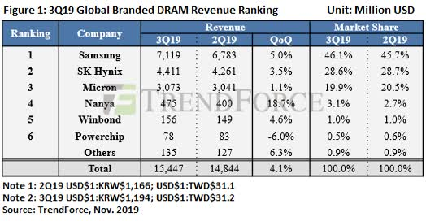
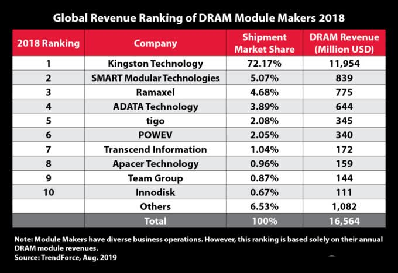

## 内存的命名
我们先说一下内存的命名吧，就以一款科赋DDR4 3200MHz 8GB内存为例，一般放在最前面的是内存品牌名称或内存品牌产品系列名称；“DDR4”的意思为第四代DDR内存，在选购内存时首先要注意的就是主板内存接口类型，DDR3跟DDR4是不兼容的，DDR4也不向下兼容；要注意“3200MHz”并不是内存本身的频率，而是内存厂商在出厂时能够保证内存稳定运行的一个频率，后面会具体讲；“8GB”就是内存容量，除了8GB之外还有16GB或32GB的单条内存。

## 内存颗粒
再来说一下内存条的组成，内存条中的颗粒是整个内存最重要的元件。内存不跟硬盘一样，没有主控芯片。至于什么是颗粒，就是内存上黑色的小方块。科赋这款内存条整体采用了一个黑色的PCB，单面颗粒设计，在颗粒上方有科赋的贴纸以及防伪贴纸。
颗粒其实也是分原片、白片、黑片的。目前的市场来看，白片颗粒的内存依旧存在，黑片内存就非常少见了，大都是采用了原片颗粒的内存。再简单说一下什么事原白黑片，原片就是经过行业内质检以及工厂质检合格的颗粒；白片仅通过了行业内的质检，没有通过工厂质检；黑片颗粒两次质检都没有通过。科赋这款内存条使用的是原厂颗粒，撕下贴在内存上面的标签就能看到内存的生产厂商。只有经过两次质检合格的颗粒，才会打上颗粒制造商的logo。
除了颗粒之外，还有一个算是比较重要的东西，就是SPD芯片。SPD芯片能够存储该内存的一些参数信息，通过AIDA64、CPU-Z等软件就能读取到SPD信息。科赋这根内存条的SPD芯片位于内存条的背面，部分内存的SPD芯片可能位于内存条正面。

## 内存马甲
对了，内存还分普条跟马甲条，普条就是上面这种直接能看到PCB板和颗粒的内存条。而马甲条通常PCB版外面都有一层金属的散热马甲覆盖，部分马甲条还会加入灯光灯效。当然，同一款内存，带马甲的内存条要比普条贵一些。

## 内存厂商
一般内存条厂商分为三类，第一类为DRAM内存颗粒原厂，第二类为消费类品牌，也就是模组厂，第三类为行业品牌，关注于行业特定领域。

DRAM内存颗粒原厂，三星是当之不让的老大哥，几乎占了半壁江山市场份额，第二位是海力士，第三位是镁光，第四是台商南亚，第五是华邦，第六是力晶。前三的厂商基本上蚕食了90%的DRAM市场，剩下的台资厂在苟延残喘。

先放一张给大家看看，2019年的DRAM颗粒出货量：

### 三星
发展历史：三星的发展史基本上就是韩国半导体的浓缩的发家史了!
- 90年代，韩国看到日本在存储行业里的发展，发现只有政府加入，才能让韩国在行业内有一席之地。
- 1975年韩国公布了扶持半导体产业的六年计划，这也是奠定韩国半导体产业发展的基础。
- 1986年10月，韩国政府联合三星，LG，现代三大集团以及六所大学，联合攻关DRAM的核心技术，总计投资1.1亿美元，政府承担57%，也就是6000多万美元。很快，在镁光跟CITRIX的技术引进下，三星完成了64K DRAM的研发，虽然依然落后美国10年，但是在1988年，在三星完成4M DRAM的研发之后，韩国的半导体技术仅比日本晚了几个月而已。
- 1992年，三星完成全球第一个64M DRAM的研发，一举超越日本NEC，成为世界第一大DRAM内存制造商，至此，韩国企业在半导体行业一直处于世界领先地位，蝉联27年世界第一。

市场定位：在DRAM市场里，三星主要服务的是OEM领域，也就是将DRAM供给行业客户，这里面就有我们熟知的联想，戴尔，惠普等PC电脑，也有一些服务器品牌。

购买须知：一般品牌，如联想在测试三星内存条的时候，都是一次直通率，也就是一次都要测试成功，如果不成功就废弃。那么这些废弃的内存条都去哪儿了呢？基本上都流在我们可见的市面上。所以某宝的三星内存条基本上是没有通过品牌一次性测试的，或者是拆机商拆出来单卖的，如果大家想要购入三星内存条，千万要小心小心再小心。
也有一些内存条消费级品牌会使用三星的颗粒，对超频有想法的朋友可以关注下所购内存条是不是B-DIE，普遍做到xmp4000。不过一般普条都是C-DIE。

### SK海力士
发展历史：在上面，我们写到三星在1992年成为世界第一，同样是韩国企业的海力士就没有这么幸运了。1999年韩国现代半导体跟LG半导体合并，并从现代集团完成拆分，将公司名称改为海力士（Hynix Semiconductor Inc）。但在金融危机来临之时，海力士陷入破产边缘，好在有韩国财团和中国无锡的支持，加上SK的金援，终于活了下来。2012年，海力士正式更名为SK海力士。直到现在，在半导体的行业里，韩国始终保持着半导体第一大国的地位，前三排名中，韩国独占两席。

市场定位：海力士目前的自有品牌主要是SSD产品，在内存条行业里，还是采用供颗粒给品牌机和内存条消费级品牌为主，如金士顿，威刚，海盗船等等。

购买须知：其实现在大家讨论最多的海力士颗粒就是cjr颗粒，cjr颗粒的来源是由于型号“H5AN8G8NCJR”后缀为CJR，所以被大家俗称为CJR颗粒。金士顿的骇客神条DDR4-2400使用了这一款颗粒，可以超频至3200Mbps以上，对AMD的主板也比较友好，被称为“AMD之友”。

### 镁光
发展历史：
- 美国早在1969年就正式推出了商业化的1K DRAM，次年，英特尔推出可量产的芯片，从此开启了DRAM时代，1974年，英特尔在DRAM行业的市场份额达到了82.9%。
- 1971年，德州仪器（TI）推出了2K DRAM产品，1973年推出4K DRAM产品，成为英特尔的强劲对手。
- 1976年，从德州仪器离职的工程师创办的莫斯泰克推出16K DRAM后，一举击败英特尔，占领全球75%的市场份额，1970年后期，莫斯泰克市场份额甚至高达85%。
- 1978年，莫斯泰克离职员工创立了镁光，开始投产64K DRAM。
- 1985年英特尔宣布退出DRAM市场；德州仪器也在1998年将存储业务甩给镁光后离开；1999年IBM将工厂卖给东芝后也退出了DRAM。

所以，只有镁光坚持到了现在，成为全球第三的半导体企业。

市场定位：在存储行业，雷克沙曾为镁光的消费类自有品牌，后被镁光卖给了中国企业江波龙，如今，镁光又有了一个面向行业市场的品牌，Crucial（英睿达）。镁光目前在做自己的品牌同时，还是会将颗粒卖给消费级品牌，如金士顿。不得不说，在DDR3时代，镁光的颗粒还是很强的，但是进入DDR4时代之后，镁光的颗粒在内存条里能做到xmp3000，超频性能比较弱。

### 消费类品牌
讲完了原厂，来讲讲消费级品牌，也就是模组厂。先来看个图，2018年各品牌的出货量：

排在第一的是金士顿，接下来是世迈，记忆，威刚，金泰克，嘉合劲威，创见，宇瞻，十铨，宜鼎。
从市场份额上来分，我将以上品牌分为一线品牌（金士顿），二线品牌（威刚，金泰克，嘉合劲威，宇瞻，十铨），和行业品牌（世迈，记忆，创见，宜鼎）。

## 参考资料
> - 
> - 
