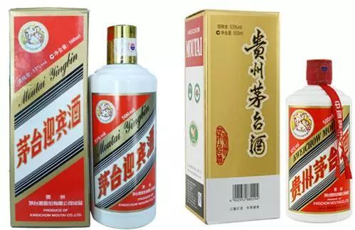
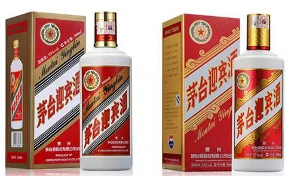
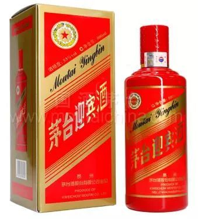
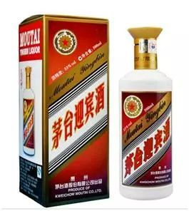
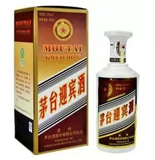
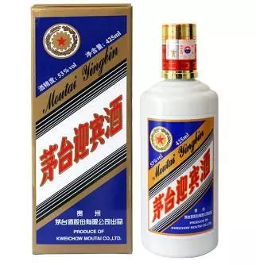

茅台迎宾酒，自2000年上市以来，至今已经有19年之久，2017年销售量达9000余吨，成为继飞天茅台、茅台王子酒之后的茅台股份又一大单品。茅台迎宾酒，国人的待客酒，茅台迎宾酒因为价格实惠，品质优良，颇受大众消费者的热爱。

## 1. 神秘的飞天迎宾酒

飞天迎宾酒2016年上市，没有条码，属于非流通产品，可以说是茅台迎宾酒的形象产品，被消费者称为“高性价比的茅台品牌酱酒”或“最接近飞天茅台的酒”。如果你收到或喝到这款酒，千万不要和普通茅台迎宾酒混淆吖。

## 2. 普通的茅台迎宾酒

无论是烟酒店及饭店，还是商超和电商，这两款普通茅台迎宾酒最为常见，左侧为经典款迎宾，右侧为2013款迎宾。

## 3. 茅台迎宾酒中国红

2017年上市，茅台迎宾酒中国红是茅台旗下自主核心品牌之一，是茅台迎宾酒系列重点打造推广的一支新品。其品质及品相双升级，是各种喜宴接待迎宾的常用酒。

## 4. 茅台迎宾酒之专销山东

这款产品多见于山东市场，为茅台迎宾酒山东的专销产品。

## 5. 茅台迎宾酒之情满中原

这款产品多见于河南市场，是河南经销商亿星集团的专销产品。

## 6. 蓝色茅台迎宾酒

这款产品多见于1919酒类直供系统，是1919酒类直供的渠道专销产品。

首先，外表高冷。众所周知，蓝色属于色系中的冷色调，给人坚实、强硬的感觉，蓝色常使人联想起高空的蓝天，阴影处的冰雪。蓝标茅台迎宾酒的外盒包装和酒瓶的整体设计都脱胎于普通迎宾，但整体色调改为蓝色，颜色高冷，因此酒友们都称呼之为“蓝标迎宾”。事实上，这款蓝标迎宾酒是茅台股份有限公司为1919酒类直供平台提供的定制产品。蓝标茅台迎宾酒属于正牌嫡传，与飞天茅台同宗同源，拥有茅台的稀缺品牌资源及股份公司的稀缺产能资源。

其次，酱心火热。开启瓶盖将酒倒于杯中。但见酒体清澈透明、色泽微黄，酒花饱满细腻，并且持续时间较长。继而稍微用力晃动酒杯，挂杯明显，初时杯壁上是均匀的链状，即珍珠链挂杯。大约静置2分钟后，杯壁布满“泪珠”，这就是通常所说的满天星挂杯。静置五分钟后，将酒杯置于鼻下3cm处，一股浓郁的酱香味扑鼻而来，且酱味中明显带有甜香，香味非常的协调。放置一个小时，香气变得略淡，出现粮香和糟香，香气整体的持久度较长。

闻罢，将杯中酒送入口中，香气立时充满口腔，焦香味明显，舌两侧感觉有淡淡的酸味。含5秒后咽下，回甘明显，无苦味，下喉顺畅，比较厚重饱满，回味悠长。继而将杯中酒一饮而尽，30秒钟后腹中温暖如春，身心畅快淋漓，回嗝很是舒服无杂味。蓝标茅台迎宾酒的入口相对柔顺，焦苦味明显但不会让人感受不适;后段焦香明显，充满口腔，非常舒适;落口冲刺感不是很强，回味比较长，而且有回甘。

再次，平民价格。从电商平台上看，蓝标茅台迎宾酒的价格不足百元，属于平民价格，国民酱香。价格虽然不贵，但是蓝色迎宾的质量等级却为“优级”，原料为优质糯高粱、小麦、水，而不掺杂茅台酒醅。白酒生产的执行标准和质量等级是有着严格要求的，不同的质量等级意味着不同的质量水平。在白酒质量管理体系中，“优级”的级别是要高于“一级”的。

## 7. 茅台迎宾酒龙呈与凤祥

龙呈、凤祥等两款茅台迎宾酒亦不多见，龙凤呈祥寓意着国人美好的祝福，这款酒适用于婚宴、庆典等喜事。

## 参考资料

> - 
> - 
