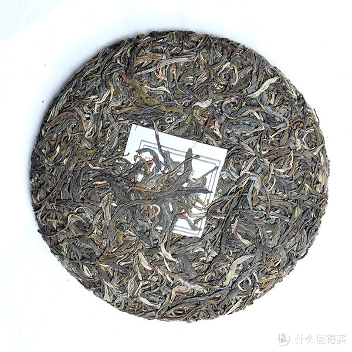
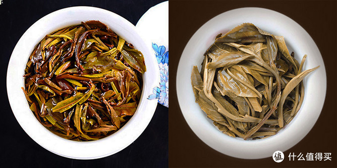
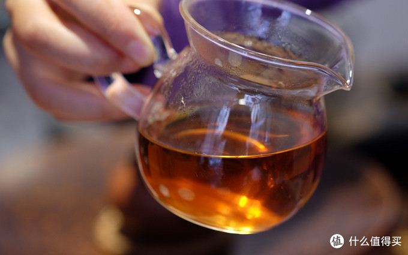

茶叶这个东西不像[手机](https://www.smzdm.com/fenlei/shouji/)有软件可以跑分，其品质的优劣，目前还没有一个能被大部分人接受的标准化的评判方法，而且滋味这个问题也会因个人的品饮习惯有极大的差异，这里只能谈一谈我认为的品质合格的生茶是怎么样的，主要的目的不是如何能挑选到好茶，而是怎样排除不好的茶叶，希望对大家的选购能有帮助。至于怎样买到好的茶叶，是一个需要积累和学习的过程，一些学费是必须交的，这条路真的没有捷径。

## 1. 观察干茶外形

**首先是茶叶的颜色要均匀**，芽、叶、梗加工之后颜色不同，过多的偏向某一部分都不是很好，出现茶叶之外的异物当然就更不好了，尤其要吐槽一下现在把各种花之类的东西压到茶饼里面去的，真的是三观尽毁。颜色这里还有一点就是饼面的色泽应该有一定的油润感，这里的油润当然不可能是真的有油，而是普洱茶的叶背绒毛反射光线产生的一种油亮的感觉，茶叶越细嫩，绒毛越多，这种光泽感也就越强。

**其次是茶叶的条索也要均匀**，即茶叶条索应保持完整，能清晰的分辨芽，叶等特征，同时条索的粗壮程度也应尽量保持一致。

加工过程中，因为茶叶各个部分的特性不同，在制成的毛茶中也会有不同的颜色呈现，**芽头的叶背绒毛丰富，会呈现银白色；叶片呈现墨绿色，有些偏墨黑色；较老的叶片则呈现土黄色**，而且不容易被揉捻成条（这部分叶片也被称为黄片，相对于普通的茶叶，黄片又有其独有的滋味）；**木质化的叶梗部分会呈现褐色**。

如果茶叶在加工过程中出现问题，则颜色会发生改变，常见的有芽头会从银白色变为偏金黄色，叶片和叶梗发红色，或者是叶片依然是鲜绿色，这都是加工工艺出现问题导致的，少量的出现这样的颜色是允许的，但如果一个茶叶的饼面大量出现上面这样的颜色，那基本也就和好茶两个字告别了…

下面上图来解释一下什么叫均匀

从饼面来看，条索都很完整，可以轻易的辨别芽和叶，芽头为银白色，叶片以墨绿主，黄褐色的粗老叶片几乎看不到，色泽，条索，都比较均匀，没有太大的差异。如下对比个反例

条索大小各异，颜色已经到了五颜六色的程度，和上面那饼茶比起来，这就是肉眼可见的差距，这两饼茶让你喝，你会喝哪饼？只能说没有对比就没有伤害

## 2. 观察湿茶的外形，也就是常说的叶底

- 颜色应该以润泽油亮的黄绿色为主，，如果是嫩绿或者红褐色，都是加工工艺有问题导致的

- 叶片的形状应该完整，冲泡后叶片能舒展开来，叶脉依然清晰，绒毛依然明显，冲泡后无法舒展，破碎甚至有腐烂的叶底，都是不好的

- 用手触碰叶底，以柔软有弹性为佳

如下上图说话

左边这个，一半的红叶红梗，就算它喝起来味道可能不错，但也已经不是我认为的普洱茶的味道了，而且叶片细小，不舒展，还非常不均匀，想必干茶的饼面也不会好看

右边这个就是高品质叶底的代表，黄绿油润，完整舒展，而且几乎看不到杂色（虽然可能是人工摆出来的，哈哈哈）。但并不是每一个茶叶的叶底都有如此品质，普通的茶叶中出现一点红叶红梗也属正常，但必须是少数，左图那样的已经严重影响茶叶的滋味和品质了。

## 3. 看冲泡的汤色

普洱生茶的新茶，汤色应该是如下图中这样黄绿明亮的，前几泡可能会略混，主要是新茶的叶面绒毛和一些表皮物质脱落造成的，不会持续出现。

随着普洱茶的自然发酵，其汤色会发生变化，基本是按绿-黄-橙-红转变的，下面上一张1998年的生茶的汤色图，给大家感受一下

## 4. 闻气味

讲了干茶，叶底，汤色，这些靠眼睛看的部分之后，就要进入最难以表达的气味，滋味的部分了，好想有个benchmark跑分啊…

- 干茶的气味：应该是茶叶的自然清香味，不应有异杂味，异杂味比如说霉味，糊味，烟味之类。有霉味的茶就不推荐喝了，必定是储藏过程中出现问题才会造成霉味，鬼知道这个茶叶经历了什么。烟味这里要特别说明一下，如下关沱，凤凰沱等，都会有明显的烟味，而这种味道是为大众所接受的，被认为是其本身的特点，所以在针对这一类茶叶时，有烟味不一定是不好的。
- 湿茶和茶汤的气味：主要通过闻在冲泡过程中散发的气味，以及茶具上留存的气味来判别。

正常的茶叶，冲泡时散发出来的气味主要是来自茶叶本身的香味，不同地区的茶叶会有不同的气味，香气的类型主要是花香和蜜香。如果闻到草青味，那就是杀青工艺不到位，再好的原料，如果连基本工艺都保证不了，还谈何价值呢？如果出现了水果的香味，多半是在制作过程中发酵产生的，此时观察叶底，肯定能看到红叶红梗这种氧化发酵的痕迹。

留存在茶具——如盖碗的盖子，公道杯，品杯上的味道，也应以茶叶的香味为佳，出现明显的烟糊味也是不好的，如果出现霉味或者腐烂的味道，不用我说你也该知道怎么做了吧…

总体来说，生茶的香味，更多以茶叶本身的香味为主，出现其他的异味都是不好的，这些异味也大多来自加工过程中，是工艺不成熟的表现，这样的茶无论是喝还是存放，都不是很好的选择

## 5.品滋味

分辨一杯茶汤，其实和分辨家里熬得一碗骨头汤没什么区别，盐味够不够，有没有熬出味，都是一个道理。

茶汤里包含三种基本的味道，**甜、苦、涩——就像骨头汤里的盐味，这三种味道就是茶汤最基本的滋味**。甜味是最基本的要求，茶汤中的甜味虽然容易被苦涩味掩盖，但是回甜的味道是必不可少的，缺少了甜，只剩苦涩的茶，应该不会有人喝吧。有一种说法叫“不苦不涩不是茶”，其实是要求一款茶**苦能回甘，涩能生津**，这三种味道的平衡就是衡量一杯茶好坏的基础。甜味虽好，但太甜的话似乎又不太像茶，我个人是不太接受，如果苦、涩的味道在口腔内一直持续不化，那就不能算是好茶，如果出现了甜，苦，涩之外的味道，比如酸味或者草青味，那必然是茶叶出了问题，更不能是好茶了。

**一个茶汤的浓度，就像骨头汤有没有熬出味道，这个浓度不是单纯的甜苦涩的程度，还包括了茶汤的质感**，一杯有颜色的水，和一碗骨头汤，肯定是有区别的。这个一方面是靠观察茶汤（例如前面发的茶汤图片，98年的老生茶明显有一种油亮的质感），另一方面就是靠口腔的感觉了，水大家都喝的多了，喝起来越像水的茶汤，滋味越差，只有不像水的茶汤，才可能是好茶。我喝过一些自己在淘宝上买的普洱生茶，外形，香气，汤色都不错，但是一喝起来，真的就只是一杯有颜色的水而已，根本没有任何滋味可言。

茶汤进入口腔之后，首先感觉到的是味道，接下来就是茶汤对口腔的刺激，甜味大家都喜欢，也就谈不上什么刺激，苦和涩则会进一步刺激整个口腔，使两颊，舌面出现紧绷收敛的情况，但只要能有回甘生津，口腔不觉得干燥，都是茶叶的正常表现。但是如果口腔一直保持这样紧绷的状态，回甘生津较弱甚至没有，口腔或者咽喉干燥，甚至出现微麻的感觉，那多半是因为茶叶的内含物质刺激性过大，这个茶就不好，或者是不太适合你。

这里要注意的是，不同的人对于同一款茶叶的体感反映是不同的，同一泡茶汤，有的人只是觉得有点涩，但有的人已经觉得口腔发麻了，这只能说是不同人之间的个体差异，不是一款茶好坏的绝对标准，不过既然已经能造成一部分人的不适，自己喝的时候也应该多注意了。

滋味这一部分没有图，讲起来也是很玄乎，但这却是判断一款茶好坏的根本，**好喝的茶才是好茶，只有平时多喝多感受，同时以自己已有的喝茶经验来不断对比辨别，才能真正学会如何去判断一款茶的好坏**，或者说是一款茶适不适合自己。

关于生茶的初步选择到这里就讲完了，总结起来其实就是最基本的“色香味形”四个方面，“色、香、形”的分辨相对简单直接，而“味”则需要长期的经验积累，只有通过不断的品饮学习，才能掌握判别的方法。

## 选择建议

如果要推荐大品牌的生茶作为入门的话，大概就是大益的7542，下关特沱，南涧凤凰沱，因为加工工艺的问题，烟糊味比较重，可以感受一下普洱茶的经典味道。 

扯一扯品牌，传统大品牌，比如大益，下关等品牌，这些品牌的生茶，相对于现在市场上流行的生茶来说，并没有什么优势，更多的是一种经典口味的传承，其产品的烟味，糊味，乃至茶汤的滋味。

最后说一说价格，生茶大多还是以饼茶为主，以常见的357g的饼来说，按100元/饼来算，也就是140元一斤，这个价格相对于绿茶来说，也算是实惠了，哪怕是200元，300元一饼，相应的也就是280元/斤，420元/斤，也不能算很贵吧！

## 参考资料

> - 
> - 
