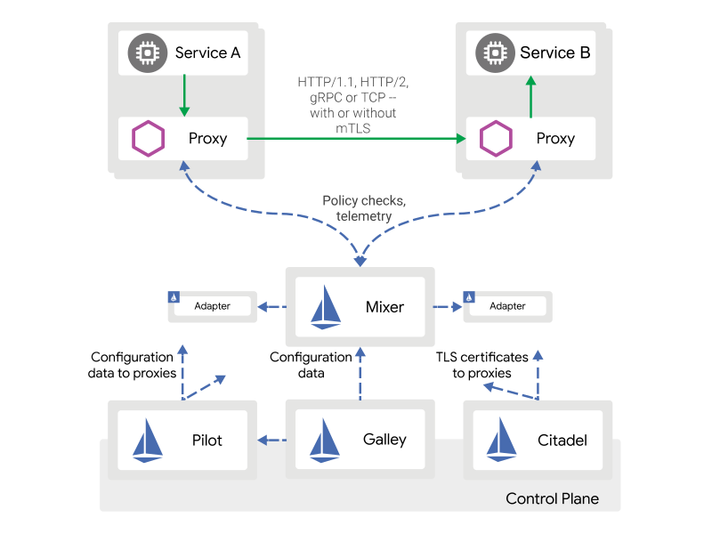

Istio是一个完全开源的Service Mesh实现，可以透明地分层到现有的分布式应用程序上。

也是一个平台，包含让你集成日志平台、遥测、策略系统的API。

Istio解决了开发人员和运维人员在单机应用程序向分布式微服务架构过渡时面临的挑战。

## 什么是Service Mesh

术语Service Mesh用于描述分布式应用程序组成的微服务网络及其之间的交互。随着服务网格的大小和复杂性的增长，它变得越来越难以理解和管理。它需要包含服务发现、负载均衡、容错恢复、指标监控等。一个复杂的Service Mesh也会有更复杂的需求，如A/B测试、金丝雀发布、限流、访问控制、端到端认证等。

Istio提供了整个服务网格上的行为洞察力和操作控制，从而提供了完整的解决方案来满足微服务应用程序的各种需求。

## 为什么使用Istio

Istio能在一个已经部署服务的微服务网络中，让服务代码中的代码更改很少或没有更改，就能使该网络具有负载平衡，服务到服务的身份验证，监视等功能。Istio通过在网络中的每个微服务边上部署一个特殊的sidecar代理来拦截微服务之间的所有网络通信，然后使用其控制平面功能管理和配置如下功能，包括：

- HTTP，gRPC，WebSocket和TCP流量的自动负载均衡。
- 通过丰富的路由规则，重试，故障转移和故障注入对流量行为进行细粒度控制。
- 可插拔的策略层和配置API，支持访问控制，速率限制和配额。
- 集群内所有流量的自动度量，日志和跟踪，包括集群的入口和出口。
- 通过强大的基于身份的身份验证和授权，在群集中进行安全的服务间通信。

Istio专为可扩展性而设计，可满足多种部署需求。

## 核心特性

Istio统一了微服务网络中的许多关键功能。

- 流量控制

Istio的简单规则配置和流量路由使您可以控制服务之间的流量和API调用的流量。Istio简化了诸如断路器，超时和重试之类的服务级别属性的配置，并使其轻而易举地设置了重要任务（如A / B测试，canary部署和基于百分比的流量拆分的分阶段部署）。

借助对流量的更好可见性和开箱即用的故障恢复功能，无论遇到什么情况，您都可以在问题引起问题之前及时发现问题，使调用更加可靠，微服务网络也更加强大。

- 安全

Istio的安全功能使开发人员可以将精力集中在应用程序级别。 Istio提供底层安全通信通道，并大规模管理服务通信的身份验证，授权和加密。借助Istio，默认情况下就可以保护服务通信，从而使您能够在各种协议和运行时之间一致地实施策略，而几乎不需要更改应用程序。

虽然Istio是独立于平台的，但将其与Kubernetes（或基础结构）网络策略配合使用，则好处更大，包括能够在网络和应用程序层保护Pod到Pod或服务到服务的通信的能力。

- 可观察性

Istio强大的跟踪，监视和日志记录功能使您可以深入了解服务网格部署。借助Istio的监视功能，您可以真正了解服务性能如何影响上游和下游事物，而其自定义仪表板则可以直观地了解所有服务的性能，并让您了解该性能如何影响您的其他流程。

Istio的Mixer组件负责策略控制和遥测收集。它提供了后端抽象和中介，使Istio的其余部分与各个基础架构后端的实现细节隔离开来，并为操作员提供了对网格和基础架构后端之间所有交互的精细控制。

所有这些功能使您可以更有效地设置，监视和实施服务上的SLO（服务水平）。当然，最重要的是您可以快速有效地检测和修复问题。

- 平台支持

Istio是独立于平台的，旨在在多种环境中运行，包括跨Cloud，本地，Kubernetes，Mesos等的环境。您可以在Kubernetes或单独的Consul上部署Istio。 Istio当前支持：

- kubernetes上部署服务
- 在Consul上注册服务
- 运行在单独虚拟机上的服务

- 集成与定制

Istio的策略执行组件可以扩展和定制，以与现有的ACL，日志记录，监视，配额，审核等解决方案集成。

##  架构

一个Istiof服务网格逻辑上分为数据平面和控制平面。

- 数据平面由部署为sidecar的一组智能代理（Envoy）组成。这些代理与Mixer一起协调和控制微服务之间的所有网络通信。
- 控制平面管理和配置代理以路由流量。此外，控制平面将配置Mixers去执行策略并收集遥测。

## Envoy

上面提到的智能代理，一般实现为Envoy。

Envoy是用C ++开发的高性能代理，可为服务网格中的所有服务调解所有入站和出站流量。Istio利用Envoy的许多内置功能，例如：

- 动态服务发现
- 负载均衡
- TLS终止
- HTTP / 2和gRPC代理
- 断路器
- 健康检查
- 按百分比分配流量的分阶段发布
- 故障注入
- 丰富的指标

Envoy被部署作为一个sidecar，和相关服务在同一个Pod中。通过这种部署，Istio可以提取有关流量行为的大量信号作为属性。Istio可以依次在Mixer中使用这些属性来实施策略决策，并将其发送到监视系统以提供有关整个网格行为的信息。Sidecar代理模型还允许您将Istio功能添加到现有部署中，而无需重新构造或重写代码。

## Mixer

Mixer是与平台无关的组件。 Mixer跨服务网格实施访问控制和使用策略，并从Envoy代理和其他服务收集遥测数据。Envoy代理提取请求级别属性，并将其发送到Mixer进行评估。

Mixer包括灵活的插件模型。该模型使Istio可以与各种主机环境和基础架构后端交互。因此，Istio从这些细节中抽象了Envoy代理和Istio管理的服务。

## Pilot

Pilot提供了Envoy的服务发现，智能路由的流量管理功能（例如A / B测试，金丝雀发布等）和弹性（超时，重试，断路器等）。

Pilot将控制流量行为的高级路由规则转换为Envoy的特定的配置，并在运行时将其传播到Envoy中。Pilot提取了特定于平台的服务发现机制，并将它们合成为标准格式，任何符合Envoy数据平面API的Sidecar都可以使用。这种松散的耦合使Istio可以在Kubernetes，Consul或Nomad等多种环境中运行，同时为流量管理保留相同的操作员界面。

## Citadel

Citadel通过内置的身份和凭据管理实现了强大的服务到服务和最终用户身份验证。您可以使用Citadel升级服务网格中的未加密流量。使用Citadel，运维人员可以基于服务身份而不是相对不稳定的第3层或第4层网络标识符来实施策略。从版本0.5开始，您可以使用Istio的授权功能来控制谁可以访问您的服务。

## Galley

Galley是Istio的配置验证，提取，处理和分发组件。它负责将其余Istio组件与从底层平台（例如Kubernetes）获取用户配置的细节隔离开来。

## 设计目标

Istio的体系结构涉及一些关键的设计目标。这些目标对于使系统能够大规模和高性能地处理服务至关重要。

- 最大化透明度：要采用Istio，需要操作员或开发人员进行尽可能少的工作，才能从系统中获得真正的价值。为此，Istio可以自动将其自身插入服务之间的所有网络路径中。 Istio使用Sidecar代理来捕获流量，并在可能的情况下自动对网络层进行编程，以通过这些代理路由流量，而无需更改已部署的应用程序代码。在Kubernetes中，代理被注入到Pod中，并通过对iptables规则进行编程来捕获流量。一旦注入了sidecar代理并且对流量路由进行了编程，Istio就可以调解所有流量。此原则也适用于性能。将Istio应用于部署时，运维人员会发现所提供功能的资源成本增加最小。组件和API必须在设计时充分考虑性能和规模。
- 可扩展性：随着运维人员和开发人员越来越依赖Istio提供的功能，系统必须随着他们的需求而增长。在我们继续添加新功能的同时，最大的需求是扩展策略系统，与其他策略和控制源集成以及将有关网格行为的信号传播到其他系统以进行分析的能力。策略运行时支持用于插入其他服务的标准扩展机制。此外，它还允许扩展其词汇表，从而可以根据网格生成的新信号来实施策略。
- 可移植性：使用Istio的生态系统在许多方面都有所不同。 Istio必须以最小的努力在任何云或本地环境上运行。将基于Istio的服务移植到新环境中的任务必须很简单。使用Istio，您可以操作部署到多个环境中的单个服务。例如，您可以部署在多个云上以实现冗余。
- 策略统一：将策略应用于服务之间的API调用可提供对网格行为的大量控制。但是，将策略应用于不一定在API级别表达的资源也同样重要。例如，对ML训练任务消耗的CPU数量应用配额比对启动工作的呼叫应用配额更有用。为此，Istio将策略系统作为具有其自己的API的独特服务来维护，而不是将策略系统集成到代理Sidecar中，从而允许服务根据需要直接与其集成。

## 参考资料

> - 
> - 
