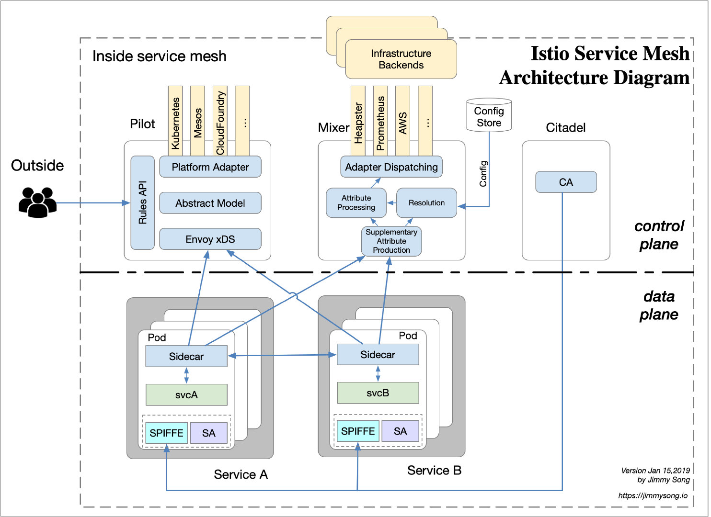
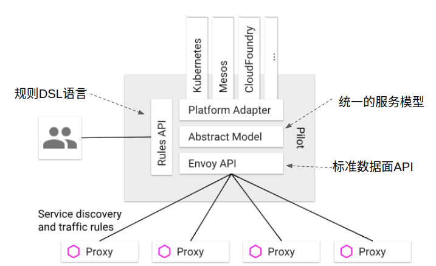

## Istio简介

Istio是一个Service Mesh开源项目，是Google继Kubernetes之后的又一力作，主要参与的公司包括Google，IBM和Lyft。

凭借kubernetes良好的架构设计及其强大的扩展性，Google围绕kubernetes打造一个生态系统。Kubernetes用于微服务的编排（编排是英文Orchestration的直译，用大白话说就是描述一组微服务之间的关联关系，并负责微服务的部署、终止、升级、缩扩容等）。其向下用CNI(容器网络接口），CRI（容器运行时接口）标准接口可以对接不同的网络和容器运行时实现，提供微服务运行的基础设施。向上则用Istio提供了微服务治理功能。

Istio 是独立于平台的，可以在 Kubernetes 、 Consul 、虚拟机上部署的服务。其架构图如下：

Istio的控制平面组件

- Pilot：服务发现、流量管理
- Mixer：访问控制、遥测
- Citadel：终端用户认证、流量加密
- Galley（1.1新增）：验证、处理和分配配置

Istio的数据平面组件

- Envoy：智能代理、流量控制

## Pilot

Istio控制面中负责流量管理的组件为Pilot，Pilot的高层架构如下图所示：

Pilot维护了网格中的服务的标准模型，这个标准模型是独立于各种底层平台的。Pilot通过适配器和各底层平台对接，以填充此标准模型。

例如Pilot中的Kubernetes适配器通过Kubernetes API服务器得到kubernetes中pod注册信息的更改，入口资源以及存储流量管理规则等信息，然后将该数据被翻译为标准模型提供给Pilot使用。通过适配器模式，Pilot还可以从Mesos, Cloud Foundry, Consul中获取服务信息，也可以开发适配器将其他提供服务发现的组件集成到Pilot中。

除此以外，Pilot还定义了一套和数据面通信的标准API，API提供的接口内容包括服务发现 、负载均衡池和路由表的动态更新。通过该标准API将控制面和数据面进行了解耦，简化了设计并提升了跨平台的可移植性。基于该标准API已经实现了多种Sidecar代理和Istio的集成，除Istio目前集成的Envoy外，还可以和Linkerd, Nginmesh等第三方通信代理进行集成，也可以基于该API自己编写Sidecar实现。

Pilot还定义了一套DSL（Domain Specific Language）语言，DSL语言提供了面向业务的高层抽象，可以被运维人员理解和使用。运维人员使用该DSL定义流量规则并下发到Pilot，这些规则被Pilot翻译成数据面的配置，再通过标准API分发到Envoy实例，可以在运行期对微服务的流量进行控制和调整。

## xDS 协议

xDS 协议是由 [Envoy](https://envoyproxy.io/) 提出的，所有名称以 DS 结尾统称为 xDS，分别如下：

- CDS（Cluster Discovery Service）：集群发现服务
- EDS（Endpoint Discovery Service）：端点发现服务
- HDS（Health Discovery Service）：健康发现服务
- LDS（Listener Discovery Service）：监听器发现服务
- MS（Metric Service）：将 metric 推送到远端服务器
- RLS（Rate Limit Service）：速率限制服务
- RDS（Route Discovery Service）：路由发现服务
- SDS（Secret Discovery Service）：秘钥发现服务

Envoy 现在是 Istio 中默认的 sidecar proxy，但只要实现 xDS 协议理论上都是可以作为 Istio 中的 sidecar proxy 的，例如蚂蚁金服开源的 [SOFAMosn](https://github.com/alipay/sofa-mosn) 和 nginx 开源的 [nginmesh](https://github.com/nginxinc/nginmesh)。

## 参考资料
> - 
> - 
