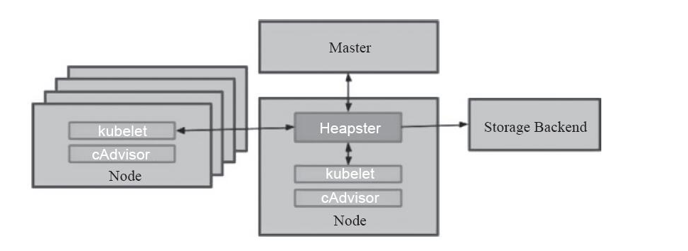
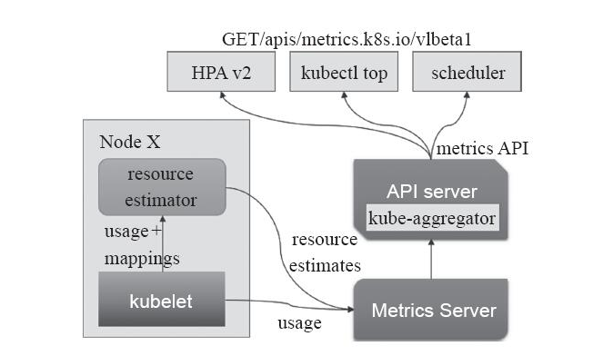
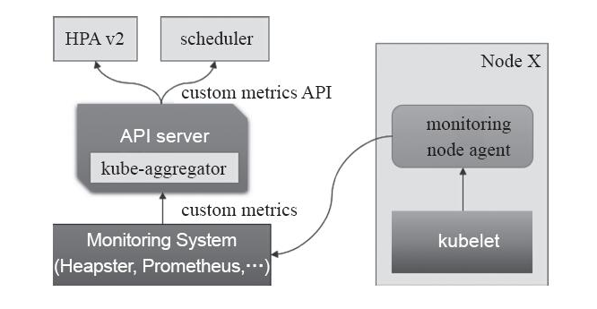
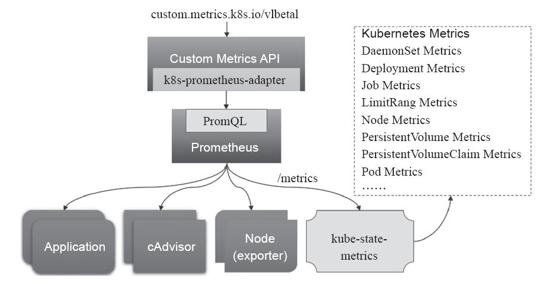

一个集群系统管理离不开监控。


## Docker原生监控

1. docker ps/top/logs：简单命令
2. docker stats：默认以流式方式输出
3. docker Remote API：暴露REST API 


- 优点：原生，很方便的看到当前宿主机上所有容器的CPU、内存、网络流量等数据。
- 缺点：只能统计当前宿主机的所有容器，数据是实时的，没有存储，没有报警，没有可视化。

## cAdvisor

Github: <https://github.com/google/cadvisor>

为了解决docker stats的问题(存储、展示)，谷歌开源的cAdvisor诞生了，cAdvisor不仅可以搜集一台机器上所有运行的容器信息，还提供基础查询界面和http接口，方便其他组件如Prometheus进行数据抓取，或者cAdvisor + influxdb + Grafna搭配使用。cAdvisor可以对节点机器上的资源及容器进行实时监控和性能数据采集，包括CPU使用情况、内存使用情况、网络吞吐量及文件系统使用情况。cAdvisor使用Go语言开发，利用Linux的cgroups获取容器的资源使用信息，在K8S中集成在Kubelet里作为默认启动项，官方标配。

- v1.7 +，k8s metrics API 不再包含 cAdvisor metrics API，而是提供了一个独立的 API 接口。
- v1.12+，cAdvisor 监听的端口将删除，建议所有外部工具使用 k8s metrics API 替代。

##  Heapster

在最初的系统资源监控，是通过`cAdvisor`去收集单个节点以及相关Pod资源的指标数据，但是这一功能仅能够满足单个节点，在集群日益庞大的过程中，该功能就显得low爆了。于是将各个节点的指标数据进行汇聚并通过一个接口进行向外暴露传送是必要的。

`Heapster`就是这样的一种方式，通过为集群提供指标API和实现并进行监控，它是集群级别的监控和事件数据的聚合工具，但是一个完备的Heapster监控体系是需要进行数据存储的，为此其解决方案就是引入了`Influxdb`作为后端数据的持久存储，`Grafana`作为可视化的接口。

原理就是Heapster从各个节点上的cAdvisor采集数据并存储到Influxdb中，再由Grafana展示。

heapster是一个监控计算、存储、网络等集群资源的工具，以k8s内置的cAdvisor作为数据源收集集群信息，并汇总出有价值的性能数据(Metrics)：cpu、内存、网络流量等，然后将这些数据输出到外部存储，如InfluxDB，最后就可以通过相应的UI界面显示出来，如grafana。 另外heapster的数据源和外部存储都是可插拔的，所以可以很灵活的组建出很多监控方案，如：Heapster+ElasticSearch+Kibana等等。

但是在1.11版本之后已经被废弃。



## Metrics API

官方的metrics项目：https://github.com/kubernetes/metrics

时代在变迁，陈旧的东西将会被淘汰，由于功能和系统发展的需求，Heapster无法满足k8s系统监控的需求。在新一代的指标监控体系当中，监控不依赖单个监控解决方案，而是通过API将实现解耦。

- v1.7版本引入了自定义指标: Custom Metrics API
- v1.8版本引入了资源指标:  Resource Metrics API

这些API都是通过聚合器（kube-aggregator）安装到主kube-apiserver中，聚合器运行在主kube-apiserver进程内部，允许用户为集群安装额外的Kubernetes风格的API，扩展core API的功能。

Resource Metrics API:   通过该API可以访问pods和nodes的CPU和内存资源。主要实现是metrics-server。只有部署了`metrics-server`应用才能使用API，API路径前缀为` /apis/metrics.k8s.io/`，可以通过 kubectl proxy 来访问，如下：

```
# 启动本地访问代理
kubectl proxy --port 8001

curl http://127.0.0.1:8001/apis/metrics.k8s.io/v1beta1/nodes
curl http://127.0.0.1:8001/apis/metrics.k8s.io/v1beta1/pods
```

也可以直接通过 kubectl 命令来访问这些 API，比如:
```
kubectl get --raw "/apis/metrics.k8s.io/v1beta1/nodes"
kubectl get --raw "/apis/metrics.k8s.io/v1beta1/pods"
```
Custom Metrics API:   该API允许使用者访问描述Kubernetes资源的自定义的任意指标，自定义指标不能被Kubernetes所解析，此时就需要依赖于用户选择第三方解决方案，常用实现为Prometheus。API路径前缀是`apis/custom.metrics.k8s.io/`。

一个可以同时使用资源指标API和自定义指标API的组件是HPAv2，其实现了通过观察指标实现自动扩容和缩容。

## Metrics-Server

Github:  https://github.com/kubernetes/kubernetes/tree/master/cluster/addons/metrics-server

Metrics-Server实现了Resource Metrics API。架构图如下：

1. Metrics-Server基于kubelet 的 Summary API 收集每个节点上的指标数据，并将它们存储于内存中。

2. 然后以Resource Metrics API格式提供给HPA-v2、kube-scheduler等使用指标。



`Metrics Server`基于内存存储， 重启后数据将全部丢失， 而且它仅能留存最近收集到的指标 数据， 因此如果 用户期望访问历史数据，就不得不借助于第三方的监控系统（ 如 Prometheus 等）。一般说来， Metrics Server在每个集群中仅 会 运行一个实例， 启动时， 它将自动 初始化与各节点的连接， 因此 出于安全方面的考虑， 它需要运行于普通节点而非 Master 主机 之上。

## Prometheus

k8s-prometheus-adapter:  https://github.com/DirectXMan12/k8s-prometheus-adapter

kube-state-metrics： https://github.com/kubernetes/kube-state-metrics

除了前面的资源指标（如CPU、内存）以外，用户或管理员需要了解更多的指标数据，比如`Kubernetes`指标、容器指标、节点资源指标以及应用程序指标等等。Custom Metrics API允许请求任意的指标，其指标API的实现要指定相应的后端监视系统。其原理图如下：




`Prometheus`是第一个开发了相应适配器的监控系统，主要用了下面两个适配组件：

- kube-state-metrics：k8s和prometheus两者数据格式不兼容，该组件用来作转换
- k8s-prometheus-adapter:  该组件通过kube-aggregator在kube-apiserver服务器中注册，将prometheus收集到的指标数据，以Custom Metrics API方式开放，供集群内其他资源使用。



Prometheus能够直接把Kubernetes API Server作为服务发现系统使用进而动态发现和监控集群中的所有可被监控的对象。这里需要特别说明的是，Pod资源需要添加下列注解信息才能被Prometheus系统自动发现并抓取其内建的指标数据。

- prometheus.io/scrape：用于标识是否需要被采集指标数据，布尔型值，true或false。
- prometheus.io/path：抓取指标数据时使用的URL路径，一般为/metrics。
- prometheus.io/port：抓取指标数据时使用的套接字端口，如8080。

## Weave Scope

Weave Scope 是 Docker 和 Kubernetes 可视化监控工具。Scope 提供了至上而下的集群基础设施和应用的完整视图，用户可以轻松对分布式的容器化应用进行实时监控和问题诊断。 对于复杂的应用编排和依赖关系，scope可以使用清晰的图标一览应用状态和拓扑关系。

官网： https://www.weave.works/oss/scope/

## 参考资料
> - [https://yasongxu.gitbook.io/container-monitor/]()
> - []()

