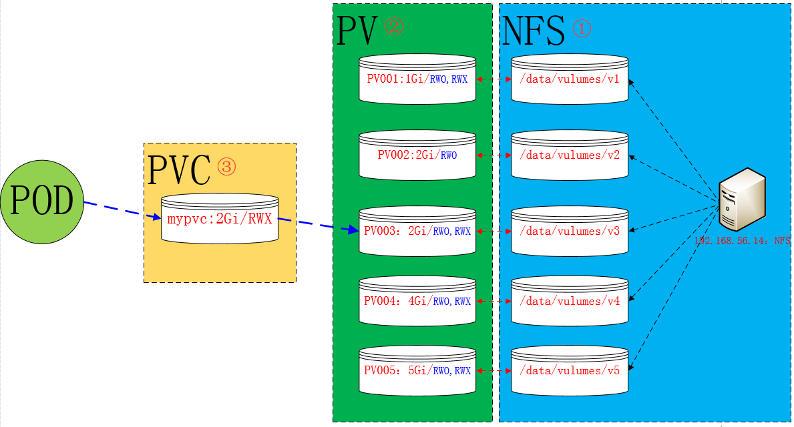

## 存储卷概念

为了保证数据的持久性，必须保证数据在外部存储。

在`docker`容器中，为了实现数据的持久性存储，在宿主机和容器内做映射，可以保证在容器的生命周期结束，数据依旧可以实现持久性存储。但是在`k8s`中，由于`pod`分布在各个不同的节点之上，并不能实现不同节点之间持久性数据的共享，并且，在节点故障时，可能会导致数据的永久性丢失。为此，`k8s`就引入了外部存储卷的功能。

k8s的存储卷类型，可通过下面命令查看：

```
kubectl explain pod.spec.volumes
```


- emptyDir: 临时目录，Pod删除，数据也会被清除，用于数据的临时存储
- hostPath: 宿主机目录映射
- 本地的SAN(iSCSI,FC)、NAS(nfs,cifs,http)存储
- 分布式存储: glusterfs，rbd，cephfs
- 云存储: EBS，Azure Disk


## emptyDir存储卷示例

一个emptyDir 第一次创建是在一个pod被指定到具体node的时候，并且会一直存在在pod的生命周期当中，正如它的名字一样，它初始化是一个空的目录，pod中的容器都可以读写这个目录，这个目录可以被挂在到各个容器相同或者不相同的的路径下。当一个pod因为任何原因被移除的时候，这些数据会被永久删除。注意：一个容器崩溃了不会导致数据的丢失，因为容器的崩溃并不移除pod.

默认的，emptyDir 磁盘会存储在主机所使用的媒介上，可能是SSD，或者网络硬盘，这主要取决于你的环境。当然，我们也可以将emptyDir.medium的值设置为Memory来告诉Kubernetes 来挂在一个基于内存的目录tmpfs，因为tmpfs速度会比硬盘块度了，但是，当主机重启的时候所有的数据都会丢失。

```
#查看emptyDir存储定义
kubectl explain pods.spec.volumes.emptyDir  

#查看容器挂载方式
kubectl explain pods.spec.containers.volumeMounts    
```

- 清单定义

```
apiVersion: v1
kind: Pod
metadata:
  name: pod-demo
  namespace: default
  labels:
    app: myapp
    tier: frontend
  annotations:
    magedu.com/create-by:"cluster admin"
spec:
  containers:
  - name: myapp
    image: ikubernetes/myapp:v1
    imagePullPolicy: IfNotPresent
    ports:
    - name: http
      containerPort: 80
    volumeMounts:    #在容器内定义挂载存储名称和挂载路径
    - name: html
      mountPath: /usr/share/nginx/html/
  - name: busybox
    image: busybox:latest
    imagePullPolicy: IfNotPresent
    volumeMounts:
    - name: html
      mountPath: /data/    #在容器内定义挂载存储名称和挂载路径
    command: ['/bin/sh','-c','while true;do echo $(date) >> /data/index.html;sleep 2;done']
  volumes:  #定义存储卷
  - name: html    #定义存储卷名称  
    emptyDir: {}  #定义存储卷类型
```

在上面，我们定义了2个容器，其中一个容器是输入日期到index.html中，然后验证访问nginx的html是否可以获取日期。以验证两个容器之间挂载的emptyDir实现共享。如下访问验证:

```
## 查看pod的ip
kubectl get pods -o wide

## 访问验证
curl 10.244.2.34  
```

## hostPath存储卷示例

hostPath宿主机路径，就是把pod所在的宿主机之上的脱离pod中的容器名称空间的之外的宿主机的文件系统的某一目录和pod建立关联关系，在pod删除时，存储数据不会丢失。

hostPath可以实现持久存储，但是在node节点故障时，也会导致数据的丢失

```
## 查看hostPath存储类型定义
kubectl explain pods.spec.volumes.hostPath  

path字段： 指定宿主机的路径
type字段：
        DirectoryOrCreate  宿主机上不存在创建此目录  
        Directory 必须存在挂载目录  
        FileOrCreate 宿主机上不存在挂载文件就创建  
        File 必须存在文件
```

1. 清单定义hostpath-pod.yaml

```
apiVersion: v1
kind: Pod
metadata:
  name: pod-vol-hostpath
  namespace: default
spec:
  containers:
  - name: myapp
    image: ikubernetes/myapp:v1
    volumeMounts:
    - name: html
      mountPath: /usr/share/nginx/html
  volumes:
    - name: html
      hostPath:
        path: /data/pod/volume1
        type: DirectoryOrCreate
```

2. 在node节点上创建挂载目录

```
## node01上
[root@k8s-node01 ~]# mkdir -p /data/pod/volume1
[root@k8s-node01 ~]# vim /data/pod/volume1/index.html
node01.yfming.com

## node02上
[root@k8s-node02 ~]# mkdir -p /data/pod/volume1
[root@k8s-node02 ~]# vim /data/pod/volume1/index.html
node02.yfming.com
```

3. 测试

```
## 应用配置
kubectl apply -f hostpath-pod.yaml

## 查看pod的ip
kubectl get pods -o wide

## 访问
curl 10.244.2.35

## 删除pod，再重建，验证是否依旧可以访问原来的内容
kubectl delete -f pod-hostpath-vol.yaml
```

## NFS共享存储卷示例

NFS使的我们可以挂在已经存在的共享到的我们的Pod中，和emptyDir不同的是，emptyDir会被删除当我们的Pod被删除的时候，但是NFS不会被删除，仅仅是解除挂在状态而已，这就意味着NFS能够允许我们提前对数据进行处理，而且这些数据可以在Pod之间相互传递.并且，NFS可以同时被多个pod挂在并进行读写

注意：必须先保证NFS服务器正常运行在我们进行挂在nfs的时候

1. 安装nfs

```
## 在stor01节点上安装nfs，并配置nfs服务
[root@stor01 ~]# yum install -y nfs-utils  ==》192.168.56.14
[root@stor01 ~]# mkdir /data/volumes -pv
[root@stor01 ~]# vim /etc/exports
/data/volumes 192.168.56.0/24(rw,no_root_squash)
[root@stor01 ~]# systemctl start nfs
[root@stor01 ~]# showmount -e
Export list for stor01:
/data/volumes 192.168.56.0/24

## 在node01和node02节点上安装nfs-utils，并测试挂载
[root@k8s-node01 ~]# yum install -y nfs-utils
[root@k8s-node02 ~]# yum install -y nfs-utils
[root@k8s-node02 ~]# mount -t nfs stor01:/data/volumes /mnt
[root@k8s-node02 ~]# mount
......
stor01:/data/volumes on /mnt type nfs4 (rw,relatime,vers=4.1,rsize=131072,wsize=131072,namlen=255,hard,proto=tcp,port=0,timeo=600,retrans=2,sec=sys,clientaddr=192.168.56.13,local_lock=none,addr=192.168.56.14)
[root@k8s-node02 ~]# umount /mnt/

## 修改了/etc/exports后，用下面命令，全部共享目录重新挂载并显示，不用重启nfs服务，配置文件就会生效
exportfs -arv
```

2. 清单定义

```
[root@k8s-master volumes]# vim pod-nfs-vol.yaml
apiVersion: v1
kind: Pod
metadata:
  name: pod-vol-nfs
  namespace: default
spec:
  containers:
  - name: myapp
    image: ikubernetes/myapp:v1
    volumeMounts:
    - name: html
      mountPath: /usr/share/nginx/html
  volumes:
    - name: html
      nfs:
        path: /data/volumes
        server: stor01
[root@k8s-master volumes]# kubectl apply -f pod-nfs-vol.yaml 
pod/pod-vol-nfs created
[root@k8s-master volumes]# kubectl get pods -o wide
NAME                     READY     STATUS    RESTARTS   AGE       IP            NODE
pod-vol-nfs              1/1       Running   0          21s       10.244.2.38   k8s-node02
```

3. 测试

```
在nfs服务器上创建index.html
[root@stor01 ~]# cd /data/volumes
[root@stor01 volumes ~]# vim index.html
<h1> nfs stor01</h1>
[root@k8s-master volumes]# curl 10.244.2.38
<h1> nfs stor01</h1>
[root@k8s-master volumes]# kubectl delete -f pod-nfs-vol.yaml   #删除nfs相关pod，再重新创建，可以得到数据的持久化存储
pod "pod-vol-nfs" deleted
[root@k8s-master volumes]# kubectl apply -f pod-nfs-vol.yaml
```

## PVC和PV的概念

我们前面提到kubernetes提供那么多存储接口，但是首先kubernetes的各个Node节点能管理这些存储，但是各种存储参数也需要专业的存储工程师才能了解，由此我们的kubernetes管理变的更加复杂的。由此kubernetes提出了PV和PVC的概念，这样开发人员和使用者就不需要关注后端存储是什么，使用什么参数等问题。


PersistentVolume（PV）是集群中已由管理员配置的一段网络存储。 PV是诸如卷之类的卷插件，但是具有独立于使用PV的任何单个pod的生命周期。 
该API对象捕获存储的实现细节，即NFS，iSCSI或云提供商特定的存储系统。

PersistentVolumeClaim（PVC）是用户存储的请求。PVC的使用逻辑：在pod中定义一个存储卷（该存储卷类型为PVC），定义的时候直接指定大小，pvc必须与对应的pv建立关系，pvc会根据定义去pv申请，而pv是由存储空间创建出来的。

StorageClass：虽然PersistentVolumeClaims允许用户使用抽象存储资源，但是常见的需求是，用户需要根据不同的需求去创建PV，用于不同的场景。而此时需要集群管理员提供不同需求的PV，而不仅仅是PV的大小和访问模式，但又不需要用户了解这些卷的实现细节。对于这样的需求，此时可以采用StorageClass资源。

如下图：


PV是集群中的资源。 PVC是对这些资源的请求，也是对资源的索赔检查。 PV和PVC之间的相互作用遵循这个生命周期：

```repl
Provisioning（配置）---> Binding（绑定）--->Using（使用）---> Releasing（释放） ---> Recycling（回收）
```

- Provisioning

这里有两种PV的提供方式:静态或者动态

静态-->直接固定存储空间：集群管理员创建一些 PV。它们携带可供集群用户使用的真实存储的详细信息。 它们存在于Kubernetes API中，可用于消费。

动态-->通过存储类进行动态创建存储空间：当管理员创建的静态 PV 都不匹配用户的 PVC 时，集群可能会尝试动态地为 PVC 配置卷。此配置基于  StorageClasses：PVC 必须请求存储类，并且管理员必须已创建并配置该类才能进行动态配置。 要求该类的声明有效地为自己禁用动态配置。
-  Binding

在动态配置的情况下，用户创建或已经创建了具有特定数量的PVC和特定访问模式PVC。主机中的控制回路监视新的PVC，找到匹配的PV（如果可能），并将 PVC 和 PV 绑定在一起。 如果为新的PVC动态配置PV，则循环将始终将该PV绑定到PVC。

如果匹配的卷不存在，PVC将保持无限期。 随着匹配卷变得可用，PVC将被绑定。 例如，提供许多50Gi PV的集群将不匹配要求100Gi的PVC。 当集群中添加100Gi PV时，可以绑定PVC。

- Using

Pod使用PVC作为卷。 集群检查声明以找到绑定的卷并挂载该卷的卷。 对于支持多种访问模式的卷，用户在将其声明用作pod中的卷时指定所需的模式。

一旦用户有声明并且该声明被绑定，绑定的PV属于用户，只要他们需要它。 用户通过在其Pod的卷块中包含PersistentVolumeClaim来安排Pods并访问其声明的PV。

- Releasing

当用户完成卷时，他们可以从允许资源回收的API中删除PVC对象。 当声明被删除时，卷被认为是“释放的”，但是它还不能用于另一个声明。 以前的索赔人的数据仍然保留在必须根据政策处理的卷上.

- Reclaiming

PersistentVolume的回收策略告诉集群在释放其声明后，该卷应该如何处理。 目前，卷可以是保留，回收或删除。 保留可以手动回收资源。 对于那些支持它的卷插件，删除将从Kubernetes中删除PersistentVolume对象，以及删除外部基础架构（如AWS EBS，GCE PD，Azure Disk或Cinder卷）中关联的存储资产。 动态配置的卷始终被删除

- Recycling

如果受适当的卷插件支持，回收将对卷执行基本的擦除（rm -rf / thevolume / *），并使其再次可用于新的声明。


## NFS使用PV和PVC示例

实验图如下：



```
[root@k8s-master ~]# kubectl explain pv    #查看pv的定义方式
FIELDS:
    apiVersion
    kind
    metadata
    spec
[root@k8s-master ~]# kubectl explain pv.spec    #查看pv定义的规格
spec:
  nfs（定义存储类型）
    path（定义挂载卷路径）
    server（定义服务器名称）
  accessModes（定义访问模型，有以下三种访问模型，以列表的方式存在，也就是说可以定义多个访问模式）
    ReadWriteOnce（RWO）  单节点读写
    ReadOnlyMany（ROX）  多节点只读
    ReadWriteMany（RWX）  多节点读写
  capacity（定义PV空间的大小）
    storage（指定大小）

[root@k8s-master volumes]# kubectl explain pvc   #查看PVC的定义方式
KIND:     PersistentVolumeClaim
VERSION:  v1
FIELDS:
   apiVersion   <string>
   kind <string>  
   metadata <Object>
   spec <Object>
[root@k8s-master volumes]# kubectl explain pvc.spec
spec:
  accessModes（定义访问模式，必须是PV的访问模式的子集）
  resources（定义申请资源的大小）
    requests:
      storage: 
```


1.  配置nfs存储

```
[root@stor01 volumes]# mkdir v{1,2,3,4,5}
[root@stor01 volumes]# vim /etc/exports
/data/volumes/v1 192.168.56.0/24(rw,no_root_squash)
/data/volumes/v2 192.168.56.0/24(rw,no_root_squash)
/data/volumes/v3 192.168.56.0/24(rw,no_root_squash)
/data/volumes/v4 192.168.56.0/24(rw,no_root_squash)
/data/volumes/v5 192.168.56.0/24(rw,no_root_squash)
[root@stor01 volumes]# exportfs -arv
exporting 192.168.56.0/24:/data/volumes/v5
exporting 192.168.56.0/24:/data/volumes/v4
exporting 192.168.56.0/24:/data/volumes/v3
exporting 192.168.56.0/24:/data/volumes/v2
exporting 192.168.56.0/24:/data/volumes/v1
[root@stor01 volumes]# showmount -e
Export list for stor01:
/data/volumes/v5 192.168.56.0/24
/data/volumes/v4 192.168.56.0/24
/data/volumes/v3 192.168.56.0/24
/data/volumes/v2 192.168.56.0/24
/data/volumes/v1 192.168.56.0/24
```

2. 定义PV

这里定义5个PV，并且定义挂载的路径以及访问模式，还有PV划分的大小。

```
[root@k8s-master volumes]# kubectl explain pv
[root@k8s-master volumes]# kubectl explain pv.spec.nfs
[root@k8s-master volumes]# vim pv-demo.yaml
apiVersion: v1
kind: PersistentVolume
metadata:
  name: pv001
  labels:
    name: pv001
spec:
  nfs:
    path: /data/volumes/v1
    server: stor01
  accessModes: ["ReadWriteMany","ReadWriteOnce"]
  capacity:
    storage: 1Gi
---
apiVersion: v1
kind: PersistentVolume
metadata:
  name: pv002
  labels:
    name: pv002
spec:
  nfs:
    path: /data/volumes/v2
    server: stor01
  accessModes: ["ReadWriteOnce"]
  capacity:
    storage: 2Gi
---
apiVersion: v1
kind: PersistentVolume
metadata:
  name: pv003
  labels:
    name: pv003
spec:
  nfs:
    path: /data/volumes/v3
    server: stor01
  accessModes: ["ReadWriteMany","ReadWriteOnce"]
  capacity:
    storage: 2Gi
---
apiVersion: v1
kind: PersistentVolume
metadata:
  name: pv004
  labels:
    name: pv004
spec:
  nfs:
    path: /data/volumes/v4
    server: stor01
  accessModes: ["ReadWriteMany","ReadWriteOnce"]
  capacity:
    storage: 4Gi
---
apiVersion: v1
kind: PersistentVolume
metadata:
  name: pv005
  labels:
    name: pv005
spec:
  nfs:
    path: /data/volumes/v5
    server: stor01
  accessModes: ["ReadWriteMany","ReadWriteOnce"]
  capacity:
    storage: 5Gi
[root@k8s-master volumes]# kubectl apply -f pv-demo.yaml 
persistentvolume/pv001 created
persistentvolume/pv002 created
persistentvolume/pv003 created
persistentvolume/pv004 created
persistentvolume/pv005 created
[root@k8s-master volumes]# kubectl get pv
NAME      CAPACITY   ACCESS MODES   RECLAIM POLICY   STATUS      CLAIM     STORAGECLASS   REASON    AGE
pv001     1Gi        RWO,RWX        Retain           Available                                      7s
pv002     2Gi        RWO            Retain           Available                                      7s
pv003     2Gi        RWO,RWX        Retain           Available                                      7s
pv004     4Gi        RWO,RWX        Retain           Available                                      7s
pv005     5Gi        RWO,RWX        Retain           Available                                      7s
```

3. 定义PVC

这里定义了pvc的访问模式为多路读写，该访问模式必须在前面pv定义的访问模式之中。定义PVC申请的大小为2Gi，此时PVC会自动去匹配多路读写且大小为2Gi的PV，匹配成功获取PVC的状态即为Bound

```
[root@k8s-master volumes ~]# vim pod-vol-pvc.yaml
apiVersion: v1
kind: PersistentVolumeClaim
metadata:
  name: mypvc
  namespace: default
spec:
  accessModes: ["ReadWriteMany"]
  resources:
    requests:
      storage: 2Gi
---
apiVersion: v1
kind: Pod
metadata:
  name: pod-vol-pvc
  namespace: default
spec:
  containers:
  - name: myapp
    image: ikubernetes/myapp:v1
    volumeMounts:
    - name: html
      mountPath: /usr/share/nginx/html
  volumes:
    - name: html
      persistentVolumeClaim:
        claimName: mypvc
[root@k8s-master volumes]# kubectl apply -f pod-vol-pvc.yaml 
persistentvolumeclaim/mypvc created
pod/pod-vol-pvc created
[root@k8s-master volumes]# kubectl get pv
NAME      CAPACITY   ACCESS MODES   RECLAIM POLICY   STATUS      CLAIM           STORAGECLASS   REASON    AGE
pv001     1Gi        RWO,RWX        Retain           Available                                            19m
pv002     2Gi        RWO            Retain           Available                                            19m
pv003     2Gi        RWO,RWX        Retain           Bound       default/mypvc                            19m
pv004     4Gi        RWO,RWX        Retain           Available                                            19m
pv005     5Gi        RWO,RWX        Retain           Available                                            19m
[root@k8s-master volumes]# kubectl get pvc
NAME      STATUS    VOLUME    CAPACITY   ACCESS MODES   STORAGECLASS   AGE
mypvc     Bound     pv003     2Gi        RWO,RWX                       22s
```

4. 测试访问

在存储服务器上创建index.html，并写入数据，通过访问Pod进行查看，可以获取到相应的页面。

```
[root@stor01 volumes]# cd v3/
[root@stor01 v3]# echo "welcome to use pv3" > index.html
[root@k8s-master volumes]# kubectl get pods -o wide
pod-vol-pvc             1/1       Running   0          3m        10.244.2.39   k8s-node02
[root@k8s-master volumes]# curl  10.244.2.39
welcome to use pv3
```

## StorageClass

在pv和pvc使用过程中存在的问题，在pvc申请存储空间时，未必就有现成的pv符合pvc申请的需求，上面nfs在做pvc可以成功的因素是因为我们做了指定的需求处理。那么当PVC申请的存储空间不一定有满足PVC要求的PV事，又该如何处理呢？？？为此，Kubernetes为管理员提供了描述存储"class（类）"的方法（StorageClass）。举个例子，在存储系统中划分一个1TB的存储空间提供给Kubernetes使用，当用户需要一个10G的PVC时，会立即通过restful发送请求，从而让存储空间创建一个10G的image，之后在我们的集群中定义成10G的PV供给给当前的PVC作为挂载使用。在此之前我们的存储系统必须支持restful接口，比如ceph分布式存储，而glusterfs则需要借助第三方接口完成这样的请求。如图：


```
[root@k8s-master ~]# kubectl explain storageclass  #storageclass也是k8s上的资源
KIND:     StorageClass
VERSION:  storage.k8s.io/v1
FIELDS:
   allowVolumeExpansion <boolean>     
   allowedTopologies    <[]Object>   
   apiVersion   <string>   
   kind <string>     
   metadata <Object>     
   mountOptions <[]string>    #挂载选项
   parameters   <map[string]string>  #参数，取决于分配器，可以接受不同的参数。 例如，参数 type 的值 io1 和参数 iopsPerGB 特定于 EBS PV。当参数被省略时，会使用默认值。  
   provisioner  <string> -required-  #存储分配器，用来决定使用哪个卷插件分配 PV。该字段必须指定。
   reclaimPolicy    <string>   #回收策略，可以是 Delete 或者 Retain。如果 StorageClass 对象被创建时没有指定 reclaimPolicy ，它将默认为 Delete。 
   volumeBindingMode    <string>  #卷的绑定模式
```

StorageClass 中包含 provisioner、parameters 和 reclaimPolicy 字段，当 class  需要动态分配 PersistentVolume  时会使用到。由于StorageClass需要一个独立的存储系统，此处就不再演示。从其他资料查看定义StorageClass的方式如下：

```
kind: StorageClass
apiVersion: storage.k8s.io/v1
metadata:
  name: standard
provisioner: kubernetes.io/aws-ebs
parameters:
  type: gp2
reclaimPolicy: Retain
mountOptions:
  - debug
```

## 参考资料

> - []()
> - []()
