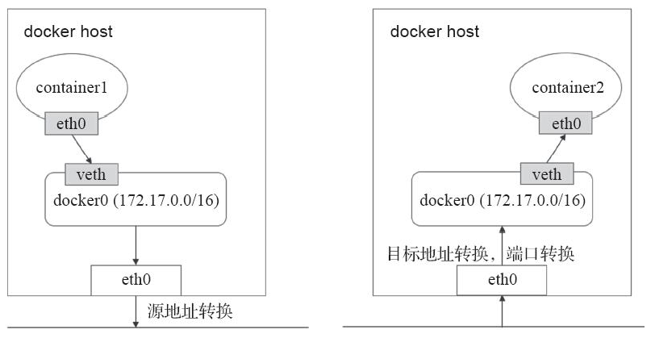
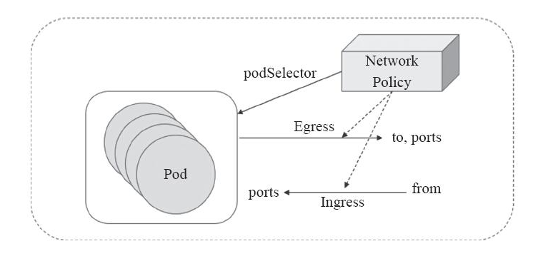

Kubernetes设计了一种网络模型，要求无论容器运行在集群中的哪个节点，所有容器都能通过一个扁平的网络平面进行通信，即在同一IP网络中。需要注意的是：在K8S集群中，IP地址分配是以Pod对象为单位，而非容器，同一Pod内的所有容器共享同一网络名称空间，即通过localhost访问。

## Docker网络模型

Docker容器的原生网络模型主要有3种：Bridge（桥接）、Host（主机）、none。

- Bridge：借助虚拟网桥设备为容器建立网络连接。
- Host：设置容器直接共享当前节点主机的网络名称空间。
- none：多个容器共享同一个网络名称空间，仅有lo网卡。

```
#使用以下命令查看docker原生的三种网络
[root@localhost ~]# docker network ls
NETWORK ID          NAME                DRIVER              SCOPE
0efec019c899        bridge              bridge              local
40add8bb5f07        host                host                local
ad94f0b1cca6        none                null                local

#none网络，在该网络下的容器仅有lo网卡，属于封闭式网络，通常用于对安全性要求较高并且不需要联网的应用
[root@localhost ~]# docker run -it --network=none busybox
/ # ifconfig
lo        Link encap:Local Loopback  
          inet addr:127.0.0.1  Mask:255.0.0.0
          UP LOOPBACK RUNNING  MTU:65536  Metric:1
          RX packets:0 errors:0 dropped:0 overruns:0 frame:0
          TX packets:0 errors:0 dropped:0 overruns:0 carrier:0
          collisions:0 txqueuelen:1000 
          RX bytes:0 (0.0 B)  TX bytes:0 (0.0 B)

#host网络，共享宿主机的网络名称空间，容器网络配置和host一致，但是存在端口冲突的问题
[root@localhost ~]# docker run -it --network=host busybox
/ # ip addr
1: lo: <LOOPBACK,UP,LOWER_UP> mtu 65536 qdisc noqueue qlen 1000
    link/loopback 00:00:00:00:00:00 brd 00:00:00:00:00:00
    inet 127.0.0.1/8 scope host lo
       valid_lft forever preferred_lft forever
    inet6 ::1/128 scope host 
       valid_lft forever preferred_lft forever
2: eth0: <BROADCAST,MULTICAST,UP,LOWER_UP> mtu 1500 qdisc pfifo_fast qlen 1000
    link/ether 00:0c:29:69:a7:23 brd ff:ff:ff:ff:ff:ff
    inet 192.168.1.4/24 brd 192.168.1.255 scope global dynamic eth0
       valid_lft 84129sec preferred_lft 84129sec
    inet6 fe80::20c:29ff:fe69:a723/64 scope link 
       valid_lft forever preferred_lft forever
3: docker0: <NO-CARRIER,BROADCAST,MULTICAST,UP> mtu 1500 qdisc noqueue 
    link/ether 02:42:29:09:8f:dd brd ff:ff:ff:ff:ff:ff
    inet 172.17.0.1/16 brd 172.17.255.255 scope global docker0
       valid_lft forever preferred_lft forever
    inet6 fe80::42:29ff:fe09:8fdd/64 scope link 
       valid_lft forever preferred_lft forever
/ # hostname
localhost

#bridge网络，Docker安装完成时会创建一个名为docker0的linux bridge，不指定网络时，创建的网络默认为桥接网络，都会桥接到docker0上。
[root@localhost ~]# brctl show
bridge name bridge id       STP enabled interfaces
docker0     8000.024229098fdd   no      

[root@localhost ~]# docker run -d nginx #运行一个nginx容器
c760a1b6c9891c02c992972d10a99639d4816c4160d633f1c5076292855bbf2b

[root@localhost ~]# brctl show      
bridge name bridge id       STP enabled interfaces
docker0     8000.024229098fdd   no      veth3f1b114

一个新的网络接口veth3f1b114桥接到了docker0上，veth3f1b114就是新创建的容器的虚拟网卡。进入容器查看其网络配置：
[root@localhost ~]# docker exec -it c760a1b6c98 bash
root@c760a1b6c989:/# apt-get update
root@c760a1b6c989:/# apt-get iproute
root@c760a1b6c989:/# ip a
1: lo: <LOOPBACK,UP,LOWER_UP> mtu 65536 qdisc noqueue state UNKNOWN group default qlen 1000
    link/loopback 00:00:00:00:00:00 brd 00:00:00:00:00:00
    inet 127.0.0.1/8 scope host lo
       valid_lft forever preferred_lft forever
38: eth0@if39: <BROADCAST,MULTICAST,UP,LOWER_UP> mtu 1500 qdisc noqueue state UP group default 
    link/ether 02:42:ac:11:00:02 brd ff:ff:ff:ff:ff:ff link-netnsid 0
    inet 172.17.0.2/16 brd 172.17.255.255 scope global eth0
       valid_lft forever preferred_lft forever
```

 从上可以看到容器内有一个网卡`eth0@if39`，实际上`eth0@if39`和`veth3f1b114`是一对`veth pair`。`veth pair`是一种成对出现的特殊网络设备，可以想象它们由一根虚拟的网线进行连接的一对网卡，`eth0@if39`在容器中，`veth3f1b114`挂在网桥`docker0`上，最终的效果就是`eth0@if39`也挂在了`docker0上`。

  桥接式网络是目前较为流行和默认的解决方案。但是这种方案的弊端是无法跨主机通信的，仅能在宿主机本地进行，而解决该问题的方法就是NAT。所有接入到该桥接设备上的容器都会被NAT隐藏，它们发往Docker主机外部的所有流量都会经过源地址转换后发出，并且默认是无法直接接受节点之外的其他主机发来的请求。当需要接入Docker主机外部流量，就需要进行目标地址转换甚至端口转换将其暴露在外部网络当中。如下图：



 容器内的属于私有地址，需要在左侧的主机上的eth0上进行源地址转换，而右侧的地址需要被访问，就需要将eth0的地址进行NAT转换。SNAT---->DNAT

 这样的通信方式会比较麻烦，从而需要借助第三方的网络插件实现这样的跨主机通信的网络策略。

## Kubernetes网络模型

在K8S上的网络通信包含以下几类：

- 容器间的通信：同一个Pod内的多个容器间的通信，它们之间通过lo网卡进行通信。
- Pod之间的通信：通过Pod IP地址进行通信。
- Pod和Service之间的通信：Pod IP地址和Service IP进行通信，两者并不属于同一网络，实现方式是通过IPVS或iptables规则转发。
- Service和集群外部客户端的通信，实现方式：Ingress、NodePort、Loadbalance


在k8s集群各节点上，docker0上默认使用同一个子网，不同节点的容器都有可能会获取到相同的地址，那么在跨节点通信时就会出现地址冲突的问题。如果配置为使用不同的子网，也会因为没有准确的路由信息导致无法准确送达报文。所以k8s重新定义了网络模型。

k8s网络的实现不是集群内部自己实现，而是通过CNI网络插件进行编排网络。CNI主要是定义容器网络模型规范，链接容器管理系统（如k8s）和网络插件实现（如flannel），两者主要通过JSON格式文件进行通信，实现容器的网络功能。CNI的主要核心是：在创建容器时，先创建好网络名称空间（netns），然后调用CNI插件为这个netns配置网络，最后在启动容器内的进程。

如每次Pod被初始化或删除，kubelet都会调用默认的CNI插件去创建一个虚拟设备接口附加到相关的底层网络，为Pod去配置IP地址、路由信息并映射到Pod对象的网络名称空间。在配置Pod网络时，kubelet会在默认的/etc/cni/net.d/目录中去查找CNI的 JSON配置文件，然后通过type属性到/opt/cni/bin中查找相关的插件二进制文件，如下面的"portmap"。然后CNI插件调用IPAM插件（IP地址管理插件）来配置每个接口的IP地址：

```
[root@k8s-master ~]# cat /etc/cni/net.d/10-flannel.conflist 
{
  "name": "cbr0",
  "plugins": [
    {
      "type": "flannel",
      "delegate": {
        "hairpinMode": true,
        "isDefaultGateway": true
      }
    },
    {
      "type": "portmap",
      "capabilities": {
        "portMappings": true
      }
    }
  ]
}
```

flannel、calico、canel等是目前比较流行的第三方网络插件实现。这三种的网络插件需要实现Pod网络方案的方式通常有以下几种：虚拟网桥、多路复用（MacVLAN）、硬件交换（SR-IOV）。

- Flannel：为Kubernetes提供叠加网络的网络插件，基于TUN/TAP隧道技术，使用UDP封装IP报文进行创建叠 加网络，借助etcd维护网络的分配情况，缺点：无法支持网络策略访问控制。
- Calico：基于BGP的三层网络插件，也支持网络策略进而实现网络的访问控制；它在每台主机上都运行一个虚拟路由，利用Linux内核转发网络数据包，并借助iptables实现防火墙功能。实际上Calico最后的实现就是将每台主机都变成了一台路由器，将各个网络进行连接起来，实现跨主机通信的功能。
- Canal：由Flannel和Calico联合发布的一个统一网络插件，提供CNI网络插件，并支持网络策略实现。
- 其他的还包括Weave Net、Contiv、OpenContrail、Romana、NSX-T、kube-router等等。而Flannel和Calico是目前最流行的选择方案。

## Kubernetes网络策略

网络策略（Network Policy ）是 Kubernetes 的一种资源，属于名称空间级别，它的作用范围为其所属的名称空间。

在Kubernetes系统中，报文的流入和流出的核心组件是Pod资源，它们也是网络策略功能的主要应用对象。`NetworkPolicy`对象通过`podSelector`选择 一组Pod资源作为控制对象。`NetworkPolicy`是定义在一组Pod资源之上用于管理入站流量，或出站流量的一组规则，有可以是出入站规则一起生效，规则的生效模式通常由`spec.policyTypes`进行 定义。如下图：



Kubernetes的网络策略功能也是由第三方的网络插件实现的，因此，只有支持网络策略功能的网络插件才能进行配置网络策略，比如Calico、Canal、kube-router等等。自v1.8开始才支持Egress网络策略，在该版本之前仅支持Ingress网络策略。

默认情况下，Pod对象的流量控制是为空的，报文可以自由出入。在附加网络策略之后，Pod对象会因为NetworkPolicy而被隔离，一旦名称空间中有任何NetworkPolicy对象匹配了某特定的Pod对象，则该Pod将拒绝NetworkPolicy规则中不允许的所有连接请求，但是那些未被匹配到的Pod对象依旧可以接受所有流量。

就特定的Pod集合来说，入站和出站流量默认是放行状态，除非有规则可以进行匹配。还有一点需要注意的是，在`spec.policyTypes`中指定了生效的规则类型，但是在`networkpolicy.spec`字段中嵌套定义了没有任何规则的Ingress或Egress时，则表示拒绝入站或出站的一切流量。定义网络策略的基本格式如下：

```
apiVersion: networking.k8s.io/v1		#定义API版本
kind: NetworkPolicy					   #定义资源类型
metadata:
  name: allow-myapp-ingress			    #定义NetwokPolicy的名字
  namespace: default
spec:								  #NetworkPolicy规则定义
  podSelector: 						   #匹配拥有标签app:myapp的Pod资源
    matchLabels:
      app: myapp
  policyTypes ["Ingress"]			    #NetworkPolicy类型，可以是Ingress，Egress，或者两者共存
  ingress:							  #定义入站规则
  - from:
    - ipBlock:						  #定义可以访问的网段
        cidr: 10.244.0.0/16
        except:						  #排除的网段
        - 10.244.3.0/24
    - podSelector:					  #选定当前default名称空间，标签为app:myapp可以入站
        matchLabels:
          app: myapp
    ports:							 #开放的协议和端口定义
    - protocol: TCP
      port: 80
```

如上网络策略就是将default名称空间中拥有标签"app=myapp"的Pod资源开放80/TCP端口给10.244.0.0/16网段，并排除10.244.3.0/24网段的访问，并且也开放给标签为app=myapp的所有Pod资源进行访问。  

## 参考资料

> - []()
> - []()
