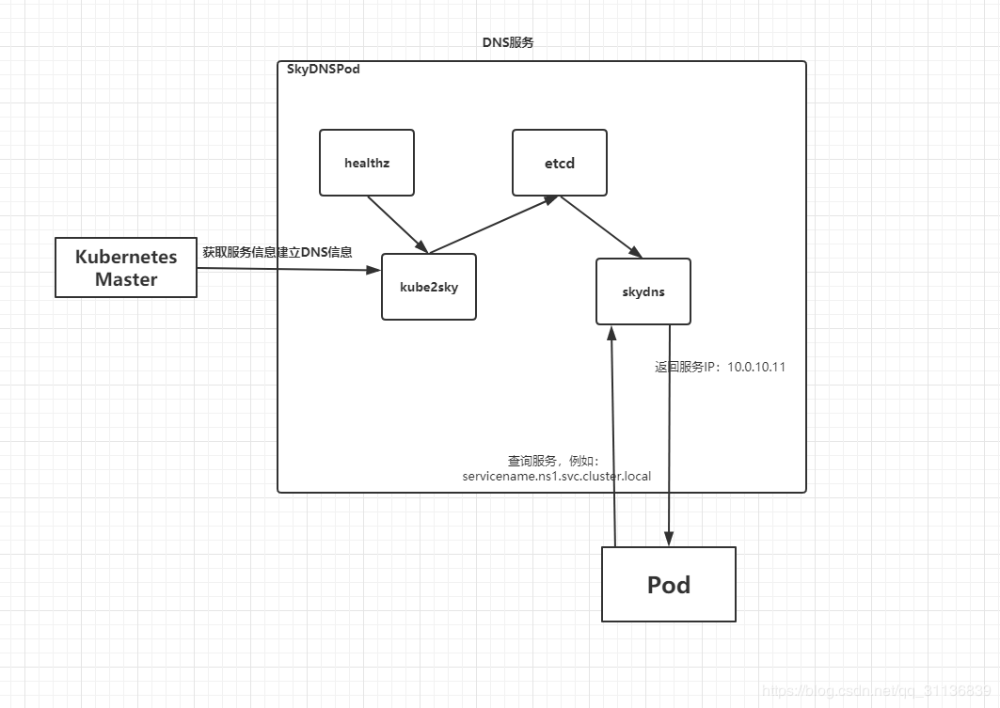
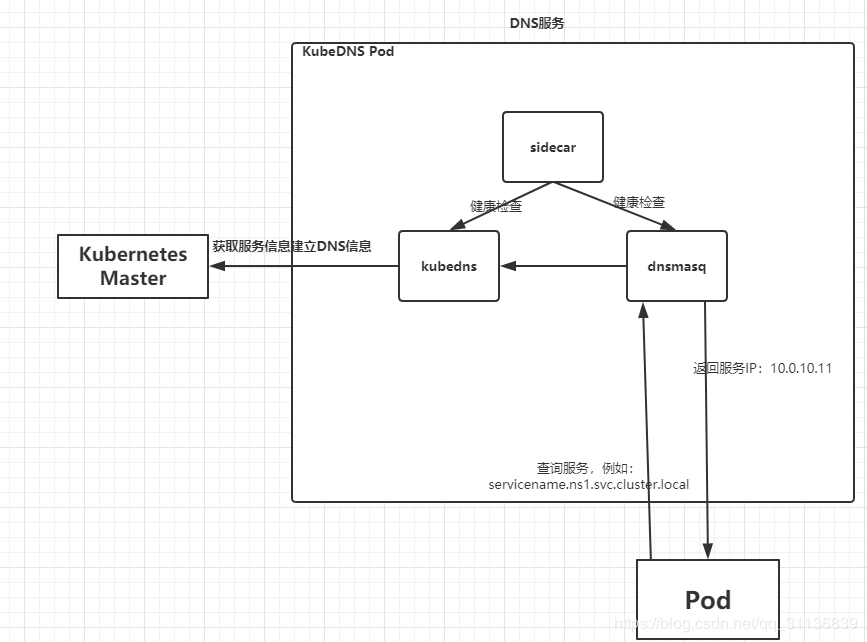
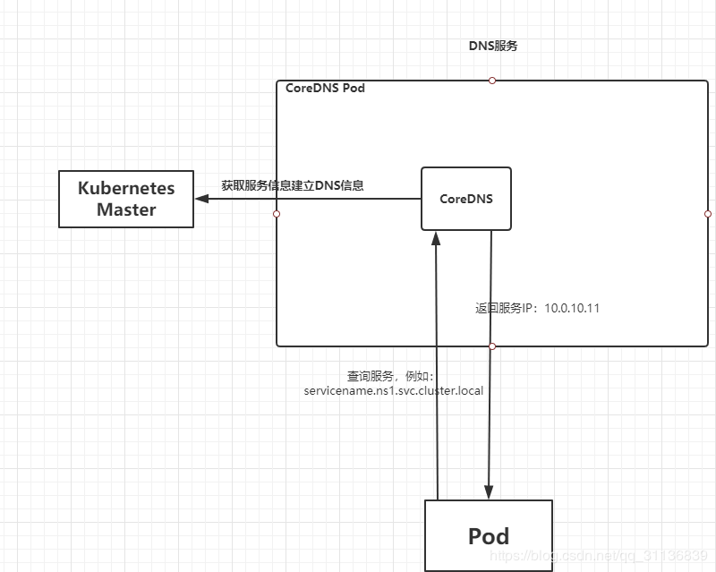

作为服务发现机制的基本功能，在集群内需要能够通过服务名对服务进行访问，这就需要一个集群范围内的DNS服务来完成从服务名到ClusterIP的解析。DNS服务在Kubernetes的发展过程中经历了3个阶段，接下来会继续讲解。

## SkyDNS

v1.2开始，DNS服务是由SkyDNS提供的。

它由4个容器组成：kube2sky、skydns、etcd和healthz。

- kube2sky容器监听k8s中Service资源的变化，根据Service的名称和IP地址信息生成DNS记录，并将其保存到etcd中
-  skydns容器从etcd中读取DNS记录，并为客户端容器应用提供DNS查询服务
- healthz容器提供对skydns服务的健康检查功能。




## KubeDNS

Github: https://github.com/kubernetes/dns

v1.4开始，SkyDNS组件被KubeDNS替换。

主要考虑是SkyDNS组件之间通信较多，整体性能不高。KubeDNS由3个容器组成：kubedns、dnsmasq和sidecar，去掉了SkyDNS中的etcd存储，将DNS记录直接保存在内存中，以提高查询性能好。

- kubedns容器监控Kubernetes中Service资源的变化，根据Service的名称和IP地址生成DNS记录，并将DNS记录保存在内存中
- dnsmasq容器从kubedns中获取DNS记录，提供DNS缓存，为客户端容器提供DNS查询服务
- sidecar提供对kubedns和dnsmasq服务的健康检查功能。




## CoreDNS

官网：https://coredns.io/

v1.11开始，DNS服务由CoreDNS提供。

CoreDNS是CNCF基金会的一个项目，是用GO语言实现的高性能、插件式、易扩展的DNS服务端。CoreDNS解决了KubeDNS的一些问题，例如dnsmasq的安全漏洞、externalName不能使用stubDomains设置，等等。

CoreDNS支持自定义DNS记录及配置upstream DNS Server，可以统一管理Kubernetes基于服务的内容DNS和数据中心的物理DNS。CoreDNS 没有使用多个容器的架构，只有一个容器便实现了KubeDNS内3个容器的全部功能。



## 服务名的DNS解析

先了解一些概念

- service_name: 服务的名称
- namespace：资源对象所在名称空间
- domain：提供的域名后缀，比如默认的 cluster.local

在 pod 中通过 service_name.namespace.svc.domain 来访问kubernetes集群中的服务，如果 pod 和 service 在同一个 namespace 中，可以直接使用 service_name。接下来使用一个带有nslookup工具的Pod来验证DNS服务能否正常工作。

- busybox.yaml

```
apiVersion: v1
kind: Pod
metadata:
  name: busybox
  namespace: default
spec:
  containers:
  - name: busybox
    image: busybox
    command:
    - sleep
    - "3600"
```

- myapp-pod-service.yaml

```
apiVersion: v1
kind: Pod
metadata:
  name: pod-myapp
  namespace: default
  labels:
    app: myapp
spec:
  containers:
  - name: myapp
    image: ikubernetes/myapp:v1
    ports:
    - name: http
      containerPort: 80
---
apiVersion: v1
kind: Service
metadata:
  name: service-myapp
  namespace: default
spec:
  selector:
    app: myapp
  ports:
  - name: http
    port: 80
    targetPort: 80
```

- 进入pod测试

```
# 进入到busybox的pod中
kubectl exec -it busybox -- /bin/sh

# 通过域名访问Service，busybox、service-myapp都在默认名称空间default下，不用写全名
wget -O - -q http://service-myapp
wget -O - -q http://service-myapp.default.svc.cluster.local

# 查看DNS解析，结果对应其ClusterIP
nslookup service-myapp 

# 查看DNS服务器配置，一般就是集群DNS服务器Service的ClusterIP
cat /etc/resolv.conf
```

- 在Node上测试

```
# 安装dig命令
yum install bind-utils

# 对Service域名进行解析，结果对应其ClusterIP
# 10.1.0.10是集群中DNS服务的ClusterIP
dig -t A service-myapp.default.svc.cluster.local. @10.1.0.10
```


## DNS相关设置

主要有两个配置：DNS服务的IP和域名。

- 二进制安装方式，修改每个Node上kubelet的启动参数，加上以下两个参数: 

```
# 为DNS服务的ClusterIP地址
--cluster-dns=169.169.0.100

# 为在DNS服务中设置的域名
--cluster-domain=cluster.local
```

- kubeadm安装时，已经安装了coredns，配置文件在如下路径

```
vi /usr/lib/systemd/system/kubelet.service.d/10-kubeadm.conf

# 添加如下内容
Environment="KUBELET_DNS_ARGS=--cluster-dns=10.96.0.10 --cluster-domain=cluster.local"

# 或者也可以在/var/lib/kubelet/config.yaml中添加启动参数
```


## 参考资料

> - []()
> - []()
