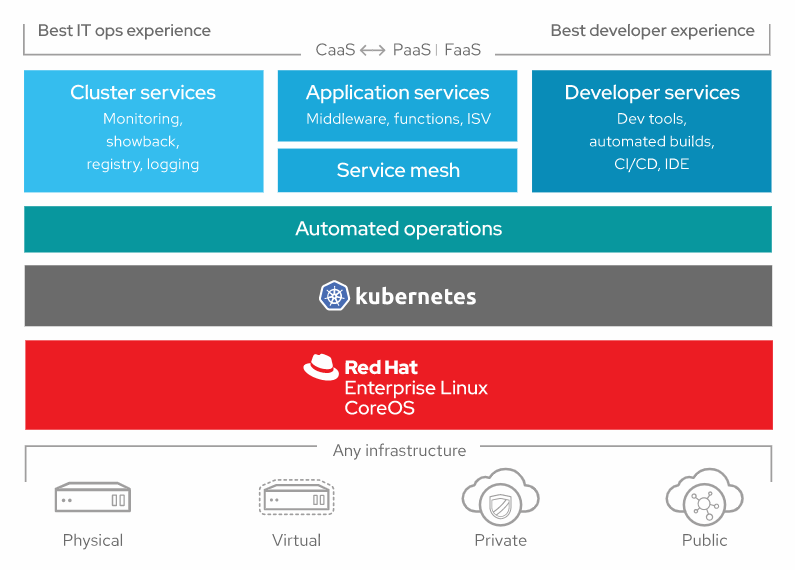

OpenShift是一个开源容器云平台，Openshift底层以Docker作为容器引擎驱动，以K8s作为容器编排引擎组件，并提供了开发语言，中间件，DevOps自动化流程工具和web console用户界面等元素，提供了一套完整的基于容器的应用云平台。

Red Hat是Openshift的最大贡献者，并发布有企业版。社区版的OpenShift产品叫做OKD，之前称为Openshift Origin。

官网：https://www.openshift.com

## OKD

OKD提供了完整的开源容器应用程序平台。

官网：https://www.okd.io

OKD是Kubernetes的发行版，针对持续的应用程序开发和多租户部署进行了优化。 OKD在Kubernetes的基础上增加了以开发人员和操作为中心的工具，以实现快速的应用程序开发，轻松的部署和扩展以及对大小团队的长期生命周期维护。 

OKD版本与Kubernetes发行版相对应-例如，OKD 1.10包含Kubernetes 1.10。OKD在github和文档中也称为Origin。

## RedHat OpenShift 特性

- 容器主机和运行时

红帽OpenShift支持标准Docker和CRI-O运行时。

-  企业级Kubernetes

红帽OpenShift在每个发行版中都包含数百个针对上游Kubernetes的缺陷，安全性和性能问题的修复程序。它已通过多种技术进行了测试，并且是功能强大且紧密集成的平台，在9年的生命周期中受其支持。

- 经过验证的集成

红帽OpenShift包括软件定义的网络并验证其他常见的网络解决方案。红帽OpenShift还可以针对每个发行版验证大量存储和第三方插件。

- 集成容器注册中心

Red Hat Hat随附了一个集成的私有容器注册中心（作为Kubernetes集群的一部分安装或作为独立组件安装，以提高灵活性）。要求更高的团队也可以使用Red Hat Quay。

- 开发者工作流

红帽OpenShift包括简化的工作流程以帮助团队更快地投入生产，包括内置的Jenkins管道和我们的从源代码到镜像的技术，可直接从应用程序代码到容器。它也可以扩展到Istio和Knative等新框架。

- 易于访问

Red Hat OpenShift通过嵌入式OperatorHub通过服务代理（包括对AWS服务的直接访问），经过验证的第三方解决方案以及Kubernetes操作员，帮助管理员和支持应用程序团队。

架构图如下：

企业版产品： 

- RedHat Openshift Container Platform：跨云和本地基础架构构建，部署和管理您的应用程序
- Red Hat OpenShift Dedicated：公有云中的单租户，高可用性Kubernetes集群
- Microsoft Azure Red Hat OpenShift：Microsoft Azure上的完全托管的Red Hat OpenShift服务
- RedHat Openshift Online：开发人员在公共云中构建，托管和扩展应用程序的最快方法

## 参考资料
> - 
> - 
