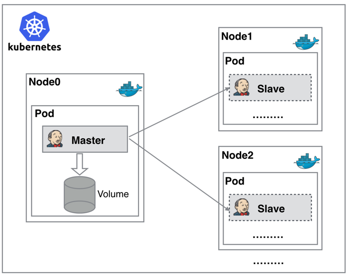

持续构建与发布是我们日常工作中必不可少的一个步骤，目前大多公司都采用 Jenkins 集群来搭建符合需求的 CI/CD 流程，然而传统的 Jenkins一主多从方式会存在一些痛点，比如：主 Master 发生单点故障时，整个流程都不可用了；每个 Slave 的配置环境不一样，来完成不同语言的编译打包等操作，但是这些差异化的配置导致管理起来非常不方便，维护起来也是比较费劲；资源分配不均衡，有的 Slave 要运行的 job 出现排队等待，而有的 Slave 处于空闲状态；最后资源有浪费，每台 Slave 可能是实体机或者 VM，当 Slave 处于空闲状态时，也不会完全释放掉资源。

提到基于Kubernete的CI/CD，可以使用的工具有很多，比如Jenkins、Gitlab CI以及新兴的drone之类的，我们这里会使用大家最为熟悉的Jenins来做CI/CD的工具。

正因为上面的这些种种痛点，我们渴望一种更高效更可靠的方式来完成这个 CI/CD 流程，而 Docker 虚拟化容器技术能很好的解决这个痛点，又特别是在 Kubernetes 集群环境下面能够更好来解决上面的问题，下图是基于 Kubernetes 搭建 Jenkins 集群的简单示意图：




从图上可以看到 Jenkins Master 和 Jenkins Slave 以 Pod 形式运行在 Kubernetes 集群的  Node 上，Master 运行在其中一个节点，并且将其配置数据存储到一个 Volume 上去，Slave  运行在各个节点上，并且它不是一直处于运行状态，它会按照需求动态的创建并自动删除。

这种方式的工作流程大致为：当 Jenkins Master 接受到 Build 请求时，会根据配置的 Label 动态创建一个运行在  Pod 中的 Jenkins Slave 并注册到 Master 上，当运行完 Job 后，这个 Slave 会被注销并且这个 Pod  也会自动删除，恢复到最初状态。

那么我们使用这种方式带来了哪些好处呢？

- 服务高可用，当 Jenkins Master 出现故障时，Kubernetes 会自动创建一个新的 Jenkins Master 容器，并且将 Volume 分配给新创建的容器，保证数据不丢失，从而达到集群服务高可用。
- 动态伸缩，合理使用资源，每次运行  Job 时，会自动创建一个 Jenkins Slave，Job 完成后，Slave 自动注销并删除容器，资源自动释放，而且  Kubernetes 会根据每个资源的使用情况，动态分配 Slave  到空闲的节点上创建，降低出现因某节点资源利用率高，还排队等待在该节点的情况。
- 扩展性好，当 Kubernetes 集群的资源严重不足而导致 Job 排队等待时，可以很容易的添加一个 Kubernetes Node 到集群中，从而实现扩展。

是不是以前我们面临的种种问题在 Kubernetes 集群环境下面是不是都没有了啊？看上去非常完美。


## 部署Jenkins

既然要基于Kubernetes来做CI/CD，当然我们这里需要将 Jenkins 安装到 Kubernetes 集群当中

1. 创建命名空间

```
kubectl create namespace kube-ops
```

2. 创建PV/PVC

将容器的 /var/jenkins_home 目录挂载到了一个名为 opspvc 的 PVC 对象上面，所以我们同样还得提前创建一个对应的 PVC 对象，当然我们也可以使用我们前面的 StorageClass 对象来自动创建

```
apiVersion: v1
kind: PersistentVolume
metadata:
  name: opspv
spec:
  capacity:
    storage: 2Gi
  accessModes:
  - ReadWriteMany
  persistentVolumeReclaimPolicy: Delete
  nfs:
    server: 192.168.11.171
    path: /data/volumes/jenkins

---
kind: PersistentVolumeClaim
apiVersion: v1
metadata:
  name: opspvc
  namespace: kube-ops
spec:
  accessModes:
    - ReadWriteMany
  resources:
    requests:
      storage: 2Gi
```

3. 创建ServiceAccount并配置RBAC

给 jenkins 赋予了一些必要的权限，当然如果你对 serviceAccount 的权限不是很熟悉的话，我们给这个 sa 绑定一个 cluster-admin 的集群角色权限也是可以的，当然这样具有一定的安全风险

```
apiVersion: v1
kind: ServiceAccount
metadata:
  name: jenkins
  namespace: kube-ops

---

kind: Role
apiVersion: rbac.authorization.k8s.io/v1beta1
metadata:
  name: jenkins
  namespace: kube-ops
rules:
  - apiGroups: [""]
    resources: ["pods"]
    verbs: ["create","delete","get","list","patch","update","watch"]
  - apiGroups: [""]
    resources: ["pods/exec"]
    verbs: ["create","delete","get","list","patch","update","watch"]
  - apiGroups: [""]
    resources: ["pods/log"]
    verbs: ["get","list","watch"]
  - apiGroups: [""]
    resources: ["secrets"]
    verbs: ["get"]

---
apiVersion: rbac.authorization.k8s.io/v1beta1
kind: RoleBinding
metadata:
  name: jenkins
  namespace: kube-ops
roleRef:
  apiGroup: rbac.authorization.k8s.io
  kind: Role
  name: jenkins
subjects:
  - kind: ServiceAccount
    name: jenkins
    namespace: kube-ops
```

4. 部署Jenkins

```
---
apiVersion: extensions/v1beta1
kind: Deployment
metadata:
  name: jenkins
  namespace: kube-ops
spec:
  template:
    metadata:
      labels:
        app: jenkins
    spec:
      terminationGracePeriodSeconds: 10
      serviceAccountName: jenkins
      containers:
      - name: jenkins
        image: jenkins/jenkins:lts
        imagePullPolicy: IfNotPresent
        ports:
        - containerPort: 8080
          name: web
          protocol: TCP
        - containerPort: 50000
          name: agent
          protocol: TCP
#        resources:
#          limits:
#            cpu: 2000m
#            memory: 4Gi
#          requests:
#            cpu: 1000m
#            memory: 2Gi
        livenessProbe:
          httpGet:
            path: /login
            port: 8080
          initialDelaySeconds: 60
          timeoutSeconds: 5
          failureThreshold: 12
        readinessProbe:
          httpGet:
            path: /login
            port: 8080
          initialDelaySeconds: 60
          timeoutSeconds: 5
          failureThreshold: 12
        volumeMounts:
        - name: jenkinshome
          subPath: jenkins
          mountPath: /var/jenkins_home
        env:
        - name: LIMITS_MEMORY
          valueFrom:
            resourceFieldRef:
              resource: limits.memory
              divisor: 1Mi
        - name: JAVA_OPTS
          value: -Xmx$(LIMITS_MEMORY)m -XshowSettings:vm -Dhudson.slaves.NodeProvisioner.initialDelay=0 -Dhudson.slaves.NodeProvisioner.MARGIN=50 -Dhudson.slaves.NodeProvisioner.MARGIN0=0.85 -Duser.timezone=Asia/Shanghai
      securityContext:
        fsGroup: 1000
      volumes:
      - name: jenkinshome
        persistentVolumeClaim:
          claimName: opspvc

---
apiVersion: v1
kind: Service
metadata:
  name: jenkins
  namespace: kube-ops
  labels:
    app: jenkins
spec:
  selector:
    app: jenkins
  ports:
  - name: web
    port: 8080
    targetPort: web
  - name: agent
    port: 50000
    targetPort: agent
```

5. 配置Ingress

```
apiVersion: extensions/v1beta1
kind: Ingress
metadata:
  name: jenkins-ingress
  namespace: kube-ops
spec:
  rules:
  - host: jenkins.yfming.com
    http:
      paths:
      - backend:
          serviceName: jenkins
          servicePort: 8080
```

## 初始化Jenkins

1. 配置hosts:  

```
192.168.11.130 	jenkins.yfming.com
```

2. 访问jenkins.yfming.com，进入界面


3. 查看初始密码，有两种方式

```
## 进入容器查看密码：
kubectl exec jenkins-66598b574-gfjbt -n kube-ops -- cat /var/jenkins_home/secrets/initialAdminPassword

## 也可以直接在 nfs 的共享数据目录中查看：
cat /opt/nfs/jenkins/secret/initAdminPassword
```

4. 输入密码，然后继续下一步，先不要选怎么安装插件，默认的插件地址安装会错误

```
## 进入如下地址，设置插件地址
http://jenkins.yfming.com/pluginManager/advanced

## 插件地址
http://mirror.esuni.jp/jenkins/updates/update-center.json
```

5. 选择推荐的插件安装，等待安装完成。


## 配置Jenkins Slave

接下来我们就需要来配置 Jenkins，让他能够动态的生成Slave的Pod。jenkins依赖插件清单：kubernetes、managed scripts。

1. 我们需要安装kubernetes plugin， 点击 系统管理 -> 插件管理 -> Available -> Kubernetes勾选安装即可。

2. 安装完毕后，点击 系统管理 -> 系统设置 -> (拖到最下方)新增一个云 -> 选择 Kubernetes，然后填写 Kubernetes 和 Jenkins 配置信息。

   

   关键配置说明:

- Kubernetes 地址：https://kubernetes.default.svc.cluster.local
- Kubernetes 命名空间填 kube-ops，然后点击连接测试，如果出现 Connection test successful 的提示信息证明Jenkins 已经可以和 Kubernetes 系统正常通信了。
- Jenkins  URL地址：http://jenkins2.kube-ops.svc.cluster.local:8080  这里的格式为：服务名.namespace.svc.cluster.local:8080，根据之前创建的jenkins的服务名填写。

3. 配置 Pod Template，其实就是配置 Jenkins Slave 运行的 Pod 模板，命名空间我们同样是用kube-ops，Labels 这里也非常重要，对于后面执行 Job 的时候需要用到该值，然后我们这里使用的是 cnych/jenkins:jnlp 这个镜像，这个镜像是在官方的 jnlp 镜像基础上定制的，加入了 kubectl 等一些实用的工具。


还需要在下面挂载一个主机目录，一个是 /var/run/docker.sock，该文件是用于 Pod 中的容器能够共享宿主机的 Docker，这就是大家说的 docker in docker 的方式，Docker二进制文件我们已经打包到上面的镜像中了。


如果在slave agent中想要访问kubernetes 集群中其他资源，我们还需要绑定之前创建的Service Account 账号：jenkins，点击高级可以看到Service Account选项。


到这里我们的 Kubernetes 插件就算配置完成了。点击保存即可。


## 测试构建

Kubernetes 插件的配置工作完成了，接下来我们就来添加一个 Job 任务，看是否能够在 Slave Pod 中执行，任务执行完成后看 Pod 是否会被销毁。

1. 在 Jenkins 首页点击新建任务，输入任务名称：haimaxy-jnlp-slave-demo，然后我们选择：构建一个自由风格的软件项目。点击确定


注意：在下面的 标签表达式 这里要填入haimaxy-jnlp，就是前面我们配置的 Slave Pod 中的 Label，这两个地方必须保持一致。

2. 然后往下拉，在 构建 区域选择执行shell，输入如下：

   ```
   echo "测试 Kubernetes 动态生成 jenkins slave"
   echo "==============docker in docker==========="
   docker info
    
   echo "=============kubectl============="
   kubectl get pods -n kube-ops
   ```

3. 点击保存，直接在页面点击 立即构建 触发构建即可。
4. 然后观察 Kubernetes 集群中增加了jnlp名字的pod，同样也可以查看到对应的控制台信息
5. 任务已经构建完成后，然后这个时候我们再去集群查看我们的 Pod 列表，发现 kube-ops 这个 namespace 下面已经没有之前的 Slave 这个 Pod 了


## 安装BlueOcean

BlueOcean 是 Jenkins 团队从用户体验角度出发，专为 Jenkins Pipeline 重新设计的一套 UI 界面，仍然兼容以前的 fressstyle 类型的 job，BlueOcean 具有以下的一些特性：

1. 连续交付（CD）Pipeline 的复杂可视化，允许快速直观的了解 Pipeline 的状态

2. 可以通过 Pipeline 编辑器直观的创建 Pipeline

3. 需要干预或者出现问题时快速定位，BlueOcean 显示了 Pipeline 需要注意的地方，便于异常处理和提高生产力

4. 用于分支和拉取请求的本地集成可以在 GitHub 或者 Bitbucket 中与其他人进行代码协作时最大限度提高开发人员的生产力。

 

BlueOcean 可以安装在现有的 Jenkins 环境中，也可以使用 Docker  镜像的方式直接运行，我们这里直接在现有的 Jenkins 环境中安装 BlueOcean 插件：登录 Jenkins Web UI ->  点击左侧的 Manage Jenkins -> Manage Plugins -> Available -> 搜索查找  BlueOcean -> 点击下载安装并重启

## 参考资料

> - []()
> - []()
