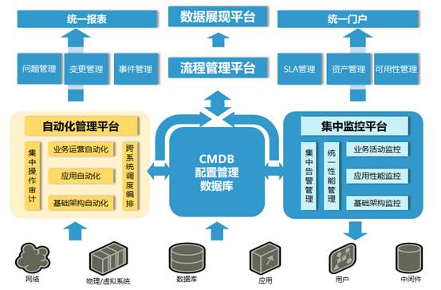
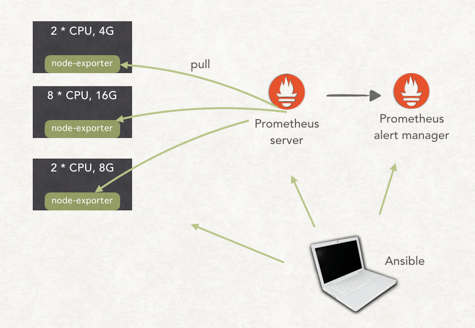
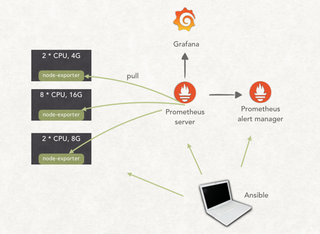
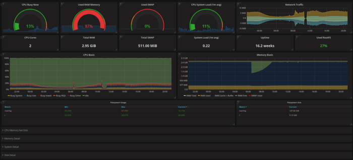
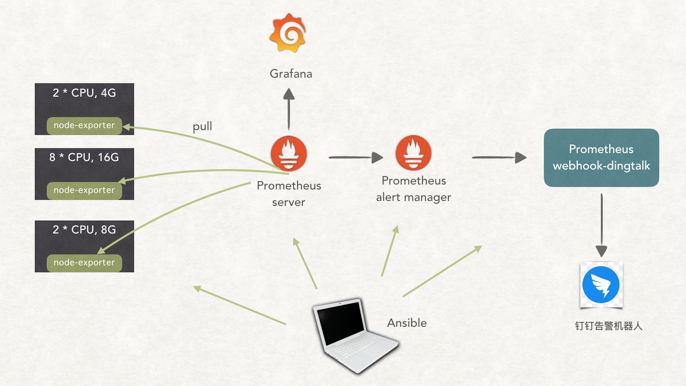
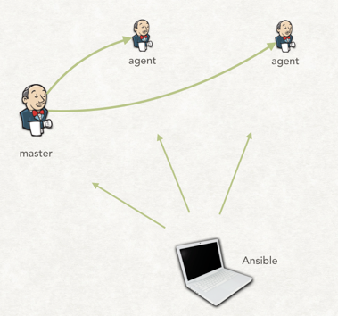
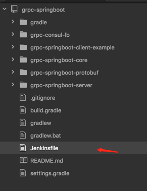
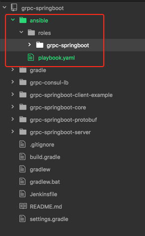
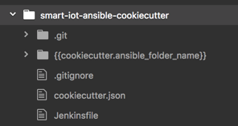

> 注：本文要求读者对Ansible和 Jenkins有一定的认识。

题记: 幸福的家庭都是相似的 不幸的家庭各有各的不幸

行业内各巨头的自动化运维架构都各种功能各种酷炫，如下图，让人可望不可及。现在最终的样子大家都知道了，但问题是如何根据自己团队当前的情况一步步向那个目标演进？





笔者所在团队，三个半开发，要维护几十台云机器，部署了十来个应用，这些应用90%都是遗留系统。应用系统的编译打包基本在程序员自己的电脑上。分支管理也清一色的 dev 分支开发，测试通过后，再合并到 master 分支。生产环境的应用配置要登录上具体的机器看才知道，更不用说配置中心及配置版本化了。

对了，连基本的机器级别的基础监控都没有。

我平时的工作是 50% 业务开发，50% 运维。面对这么多问题，我就想啊，如何在低成本情况下实现自动化运维。本文就是总结我在这方面一些经验和实践。希望对读者有帮助。

### 别说话，先上监控和告警

事情有轻重缓急，监控和告警是我觉得一开始就要做的，即使业务开发被拖慢。只有知道了当前的情况，你才好做下一步计划。

现在市面上监控系统很多：Zabbix、Open-Falcon、Prometheus。最终作者选择了 Prometheus。因为：

1. 它是拉模式的
2. 它方便使用文本方式来配置，有利于配置版本化
3. 插件太多了，想要监控什么，基本都会有现成的

以上三者，我基本都要重新学，我为什么不学一个 Google SRE 书上推荐的呢？之前我们已经介绍过，人少机器多，所以，安装 Prometheus 的过程也必须要自动化，同时版本化。笔者使用的是 Ansible + Git 实现。最终样子如下：




这里需要简单介绍一下：

1. Prometheus Server 负责监控数据收集和存储
2. Prometheus Alert manager 负责根据告警规则进行告警，可集成很多告警通道
3. node-exporter 的作用就是从机器读取指标，然后暴露一个 http 服务，Prometheus 就是从这个服务中收集监控指标。当然 Prometheus 官方还有各种各样的 exporter。

使用 Ansible 作为部署工具的一个好处是太多现成的 role 了，安装Prometheus 时，我使用的是现成的：prometheus-ansble

有了监控数据后，我们就可以对数据进行可视化，Grafana 和 Prometheus 集成得非常好，所以，我们又部署了 Grafana:





在 Grafana 上查看 nodex-exporter 收集的数据的效果图大概如下：





可是，我们不可能24小时盯着屏幕看CPU负载有没有超吧？这时候就要上告警了，Promehtues 默认集成了 N 多告警渠道。可惜没有集成钉钉。但也没有关系，有好心的同学开源了钉钉集成 Prometheus 告警的组件：prometheus-webhook-dingtalk。接着，我们告警也上了：





完成以上工作后，我们的基础监控的架子就完成了。为我们后期上 Redis 监控、JVM 监控等更上层的监控做好了准备。

### 配置版本化要从娃娃抓起

在搭建监控系统的过程中，我们已经将配置抽离出来，放到一个单独的代码仓库进行管理。以后所有部署，我们都会将配置和部署逻辑分离。

关于如何使用 Ansible 进行配置管理，可以参考这篇文章：How to Manage Multistage Environments with Ansible 。我们就是使用这种方式来组织环境变量的。


```
├── environments/         # Parent directory for our environment-specific directories
│   │
│   ├── dev/              # Contains all files specific to the dev environment
│   │   ├── group_vars/   # dev specific group_vars files
│   │   │   ├── all
│   │   │   ├── db
│   │   │   └── web
│   │   └── hosts         # Contains only the hosts in the dev environment
│   │
│   ├── prod/             # Contains all files specific to the prod environment
│   │   ├── group_vars/   # prod specific group_vars files
│   │   │   ├── all
│   │   │   ├── db
│   │   │   └── web
│   │   └── hosts         # Contains only the hosts in the prod environment
│   │
│   └── stage/            # Contains all files specific to the stage environment
│       ├── group_vars/   # stage specific group_vars files
│       │   ├── all
│       │   ├── db
│       │   └── web
│       └── hosts         # Contains only the hosts in the stage environment
│
```


现阶段，我们所有的配置都以文本的方式存储，将来要切换成使用Consul做配置中心，也非常的方便，因为 Ansible2.0以上的版本已经原生集成了consule: consul_module

**Tips**: Ansible 的配置变量是有层次的，这为我们的配置管理提供了非常大的灵活性。

### Jenkins 化：将打包交给 Jenkins

我们要将所有的项目的打包工作交给 Jenkins。当然，现实中我们是先将一些项目放到 Jenkins 上打包，逐步将项目放上 Jenkins。

首先我们要有 Jenkins。搭建 Jenkins 同样有现成的 Ansible 脚本：ansible-role-jenkins。注意了，在网上看到的大多文章告诉你 Jenkins 都是需要手工安装插件的，而我们使用的这个 ansible-role-jenkins 实现了自动安装插件，你只需要加一个配置变量 jenkins_plugins 就可以了，官方例子如下：


```
---
- hosts: all
  vars:
    jenkins_plugins:
      - blueocean
      - ghprb
      - greenballs
      - workflow-aggregator
    jenkins_plugin_timeout: 120

  pre_tasks:
    - include_tasks: java-8.yml

  roles:
    - geerlingguy.java
    - ansible-role-jenkins
```

搭建好 Jenkins 后，就要集成 Gitlab 了。我们原来就有Gitlab了，所以，不需要重新搭建。如何集成就不细表了，网络上已经很多文章。

最终 Jenkins 搭建成以下这个样子：




关于 Jenkins master 与 Jenkins agent 的连接方式，由于网络环境各不相同，网上也有很多种方式，大家自行选择适合的方式。

好，现在我们需要告诉 Jenkins 如何对我们的业务代码进行编译打包。有两种方法：

1. 界面上设置
2. 使用 Jenkinsfile：类似于 Dockerfile 的一种文本文件，具体介绍：[Using a Jenkinsfile](https://jenkins.io/doc/book/pipeline/jenkinsfile/)

作者毫不犹豫地选择了第2种，因为一是利于版本化；二是灵活。

Jenkinsfile 类似这样：

```
pipeline {
    agent any
    stages {
        stage('Build') {
            steps {
                sh './gradlew clean build'
                archiveArtifacts artifacts: '**/target/*.jar', fingerprint: true
            }
        }
    }
}
```

那么 Jenkinsfile 放哪里呢？和业务代码放在一起，类似这样每个工程各自管理自己的 Jenkinsfile:




这时，我们就可以在 Jenkins 上创建一个 pipleline Job了：

关于分支管理，我们人少，所以，建议所有项目统一在 master 分支进行开发并发布。

### 让 Jenkins 帮助我们执行 Ansible

之前我们都是在程序员的电脑执行 Ansible 的，现在我们要把这项工作交给 Jenkins。具体操作：

1. 在 Jenkins 安装 Ansible 插件
2. 在 Jenkinsfile 中执行


```
withCredentials([sshUserPrivateKey(keyFileVariable:"deploy_private",credentialsId:"deploy"),file(credentialsId: 'vault_password', variable: 'vault_password')]) {
             ansiblePlaybook vaultCredentialsId: 'vault_password', inventory: "environments/prod", playbook: "playbook.yaml",
             extraVars:[
               ansible_ssh_private_key_file: [value: "${deploy_private}", hidden: true],
               build_number: [value: "${params.build_number}", hidden: false]
             ]
}
```


这里需要解释下：

1. ansiblePlaybook 是 Jenkins ansible 插件提供的 pipeline 语法，类似手工执行：ansible-playbook 。
2. withCredentials 是 Credentials Binding 插件的语法，用于引用一些敏感信息，比如执行 Ansible 时需要的 ssh key 及 Ansible Vault 密码。
3. 一些敏感配置变量，我们使用 Ansible Vault 技术加密。

### Ansible 脚本应该放哪？

我们已经知道各个项目各自负责自己的自动化构建，所以，Jenkinfile 就放到各自项目中。那项目的部署呢？同样的道理，我们觉得也应该由各个项目自行负责，所以，我们的每个要进行部署的项目下都会有一个 ansible 目录，用于存放 Ansible 脚本。类似这样：



但是，怎么用呢？我们会在打包阶段将 Ansible 目录进行 zip 打包。真正部署时，再解压执行里面的 playbook。

### 快速为所有的项目生成 Ansible 脚本及Jenkinsfile

上面，我们将一个项目进行 Jenkins 化和 Ansible 化，但是我们还有很多项目需要进行同样的动作。考虑到这是体力活，而且以后我们还会经常做这样事，所以笔者决定使用 [cookiecutter](https://github.com/audreyr/cookiecutter) 技术自动生成 Jenkinsfile 及 Ansible 脚本，创建一个项目，像这样：





### 小结

总结下来，我们小团队的自动化运维实施的顺序大概为：

1. 上基础监控
2. 上 Gitlab
3. 上 Jenkins，并集成 Gitlab
4. 使用 Jenkins 实现自动编译打包
5. 使用 Jenkins 执行 Ansible

以上只是一个架子，基于这个“架子”，就可以向那些大厂的高大上的架构进行演进了。比如：

- CMDB的建设：我们使用 ansible-cmdb 根据 inventory 自动生成当前所有机器的情况
- 发布管理：Jenkins 上可以对发布的每个阶段进行定制。蓝绿发布等发布方式可以使用通过修改 Ansible 脚本和 Inventory 实现。
- 自动扩缩容：通过配置 Prometheus 告警规则，调用相应 webhook 就可以实现
- ChatOps: ChatOps实战

以上就是本文作者关于自动化运维的一些实践。还在演进路上。希望能与大家交流。

## 参考资料
> - [翟志军](http://showme.codes/2018-06-07/devops-in-action/)
