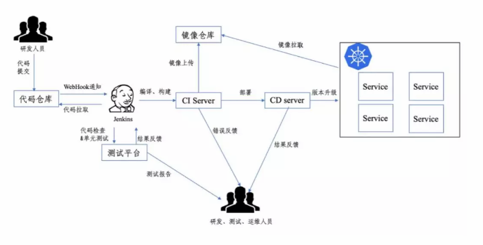
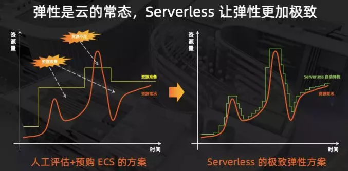
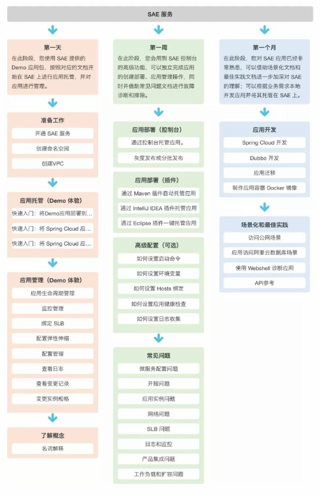
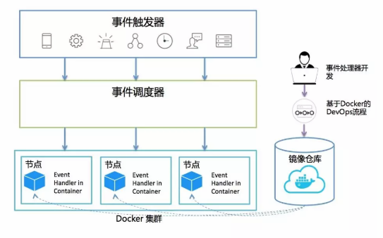

## DevOps 概述

DevOps 是一组用于促进开发和运维人员之间协作的过程、方法和系统的统称。

DevOps 提倡通过一系列的技术和工具降低开发和运维人员之间的隔阂，实现从开发到最终部署的全流程自动化，从而达到开发运维一体化。通过将 DevOps 的理念引入到整个系统的开发过程中，能够显著提升软件的开发效率，缩短软件交付的周期，更加适应当今快速发展的互联网时代。

说到 DevOps ，就必然会提到持续集成，持续集成指的是在软件开发过程中，软件开发人员持续不断地将开发出来的代码和其他的开发人员的代码进行合并，每次合并后自动地进行编译、构建，并运行自动化测试进行验证，而不是等到最后各自开发完成后才合并在一起。持续集成能从根本上提高一个团队的软件开发效率。在软件开发过程中引入持续集成，可以帮助团队及时的发现系统中的问题，并快速做出修复，不仅可以缩短软件开发的时间，而且可以交付更具质量的系统。

## 基于 Docker 实现一个 DevOps 开发环境

一个 DevOps 开发环境需要满足以下 8 点需求：

1. 环境一致性：在本地开发出来的功能，无论在什么环境下部署都应该能得到一致的结果。
2. 代码自动检查：为了尽早发现问题，每一次代码提交后，系统都应该自动对代码进行检查，及早发现潜在的问题，并运行自动化测试。
3. 持续集成：每次代码提交后系统可以自动进行代码的编译和打包，无需运维人员手动进行。
4. 持续部署：代码集成完毕后，系统可以自动将运行环境中的旧版本应用更新成新版本的应用并且整个过程中不会让系统不可用。
5. 持续反馈：在代码自动检查、持续集成、持续部署的过程中，一旦出现问题，要能及时将问题反馈给开发人员以及运维人员。开发和运维人员收到反馈后对问题及时进行修复。
6. 快速回滚：当发现本次部署的版本出现问题时，系统应能快速回退到上一个可用版本。
7. 弹性伸缩：当某个服务访问量增大时，系统应可以对这个服务快速进行扩容，保证用户的访问。当访问量回归正常时，系统能将扩容的资源释放回去，实现根据访问情况对系统进行弹性伸缩。
8. 可视化运维：提供可视化的页面，可实时监控应用、集群、硬件的各种状态。

为了满足以上 8 点要求，设计出的 DevOps 开发环境如下图所示：

整个环境主要由 6 部分组成。

1. 代码仓库 Gitlab 
2. 容器技术 Docker 
3. 持续集成工具 Jenkins
4. 代码质量检测平台 SonarQube 
5. 镜像仓库 Harbor 
6. 容器集群管理系统 Kubernetes

整个环境的运行流程主要分为以下 6 步。

1. 开发人员在本地开发并验证好功能后，将代码提交到代码仓库。
2. 通过事先配置好的 Webhook 通知方式，当开发人员提交完代码后，部署在云端的持续集成工具 Jenkins 会实时感知，并从代码仓库中获取最新的代码。
3. 获取到最新代码后，Jenkins 会启动测试平台 SonarQube 对最新的代码进行代码检查以及执行单元测试，执行完成后在 SonarQube 平台上生成测试报告。如果测试没通过，则以邮件的方式通知研发人员进行修改，终止整个流程。若测试通过，将结果反馈给 Jenkins 并进行下一步。
4. 代码检查以及单元测试通过后， Jenkins 会将代码发送到持续集成服务器中，在服务器上对代码进行编译、构建然后打包成能在容器环境上运行的镜像文件。如果中间有步骤出现问题，则通过邮件的方式通知开发人员和运维人员进行处理，并终止整个流程。
5. 将镜像文件上传到私有镜像仓库 Harbor 中保存。
6. 镜像上传完成后， Jenkins 会启动持续交付服务器，对云环境中运行的应用进行版本更新，整个更新过程会确保服务的访问不中断。持续交付服务器会将最新的镜像文件拉取到 Kubernetes 集群中，并采用逐步替换容器的方式进行对应用进行更新，在服务不中断的前提下完成更新。

通过上述几步，我们就可以简单实现一个 DevOps 开发环境，实现代码从提交到最终部署的全流程自动化。

但是自从 2014 年 AWS 发布 ASW Lambda 以来， Serverless 的概念开始逐渐火热起来。

各大云厂商开始纷纷开始推出各自的 Serverless 产品，如 Google 的 Cloud Functions ，阿里云的函数计算、Serverless应用引擎(SAE)，等等。那么什么是Serverless 无服务计算呢？

## **什么是 Serverless？**

根据CNCF(云原生计算基金会)发布的 Serverless 白皮书里的定义：

> Serverless computing refers to the concept of building and running applications that do not require server management. It describes a finer-grained deployment model where applications, bundled as one or more functions, are uploaded to a platform and then executed, scaled, and billed in response to the exact demand needed at the moment.

Serverless中文译为无服务器，首先需要强调一点的是无服务器计算并不意味着我们不再需要使用服务器来运行代码，代码仍需要运行在服务器上对外提供服务。

在无服务计算时代，研发人员无需对服务器进行监控、配置、更新、扩容等运维操作。只需要将代码上传到云厂商提供的无服务器计算平台上即可，云厂商会保证代码能正常运行，**当流量突增时，自动对服务器进行扩容，流量减少时，对服务器进行缩容。**

这些运维操作对研发人员来说都是黑盒的，会将开发人员从繁琐的运维工作中解放出来，只需要按运行时长对资源进行付费即可。和 DevOps 概念提倡的是通过一系列工具和自动化的技术来降低运维的难度，促进研发运维一体化不同， Serverless 更像是一种 NoOps，即通过“不用做”的方式来解决“如何更高效做”的问题。

## **阿里云在 Serverless 上的实践**

当前阿里云上实现 Serverless 技术的产品有Serverles应用引擎和函数计算FAAS。

- Serverles应用引擎

Serverless 应用引擎是面向应用的 Serverless PaaS 平台，它向上抽象了应用的概念，支持 Spring Cloud、Dubbo、HSF 等流行的开发框架，并通过WAR包、JAR包和镜像等多种方式部署应用。它的使用可以通过下面这张图来了解。

- 函数计算

FAAS 是 Serverless 所提供的服务的另一种形态。以阿里云函数计算为例，阿里云函数计算的流程大致如下图所示。

1. 开发者在本地编写代码。
2. 代码开发完成后通过命令行工具 fcli, fun 或者可视化界面控制台上传到阿里云函数计算平台。
3. 开发者上传完代码后，平台会自动启动基于 Docker 的 DevOps 流程，对代码进行编译、打包成镜像文件。并上传到镜像仓库。
4. 开发者在平台是配置事件触发器，当前阿里云已经支持 OSS、HTTP、CDN、SLS、定时任务等多种形式的触发器形式。
5. 当触发器被触发后，会到达事件调度器。平台会将镜像快速启动成容器并执行代码，根据流量自动对服务进行弹性伸缩。保证代码能正常并执行完成。

## **伯克利对 Serverless 未来的预测**

尽管 Serverless 仍存在诸多的挑战，但是我们相信随着市场规模的不断扩大，这些挑战会逐渐被解决。 UC 伯克利对 Serveless 未来十年的发展趋势做了以下几点预测。

1. 新型的 Bass 存储服务会被创造出来，这样更多类型的应用可以迁移到 Serveless 平台上。这种存储服务的性能会和本地存储的性能相当，并提供长期和短期的存储。更多适用于 Serveless 平台的硬件会被使用。
2. 由于更高级别的编程抽象以及更加细粒度的资源隔离，在无服务器计算平台上运行的代码将会比传统的方式更加安全可靠。
3. 随着无服务器计算收费模式的不断发展，几乎任何应用迁移到无服务器计算平台都会比原先的有服务器计算的方式的成本更低。
4. 有服务器计算在未来会促进 BaaS 的发展。
5. 虽然现有的有服务器计算不会消失，但是随着Serveless技术的不断发展，有服务器计算在云上所占的比例会逐年下降。
6. 无服务器计算将会成为云时代默认的编程方式，它将大规模取代传统的基于服务器的编程方式，并终结传统的 C/S 架构。

## **总结**

当前数据中心的资源利用率仍处于一个较低水平，特别是对于在线业务而言，日均资源使用率仅在 10% 左右，主要是由于当今资源都是属于独享型的，不管你用不用，这些资源都需要保留。而一旦大规模使用 Serveless 之后，资源的使用由平台统一调度，按需使用，整体的资源利用率会大幅提升，整个云计算资源的使用成本无疑也会大幅降低。

随着 Serverless 的不断发展，未来编程方式将会有很大的不同。无论是从成本的角度还是使用的角度，我们有理由相信下一个时代是 Serveless 的时代，并应该朝着这个方向不断探索。

## 参考资料

> - [<https://mp.weixin.qq.com/s/aTpnY4AdUHFj8R8zcaVCMQ>]()

