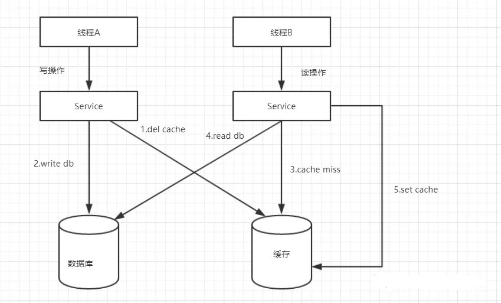
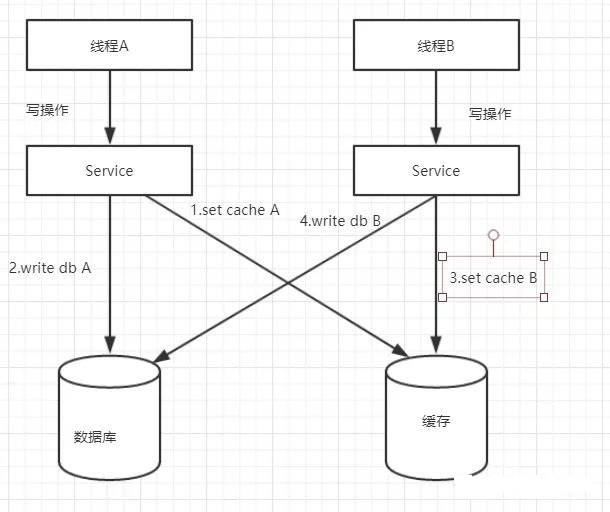
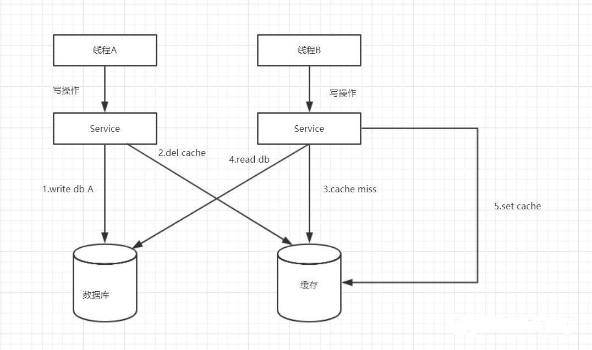
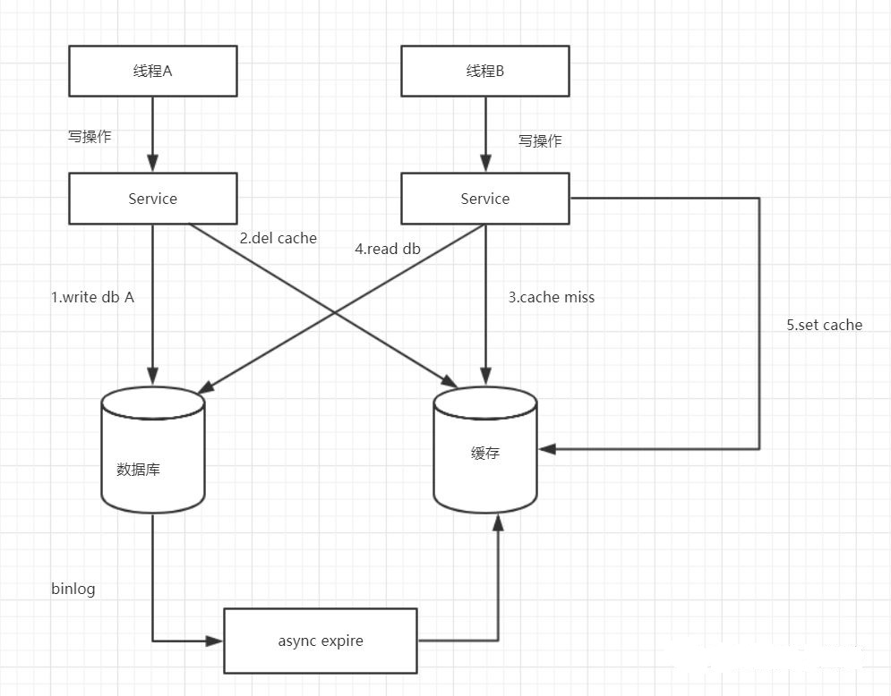
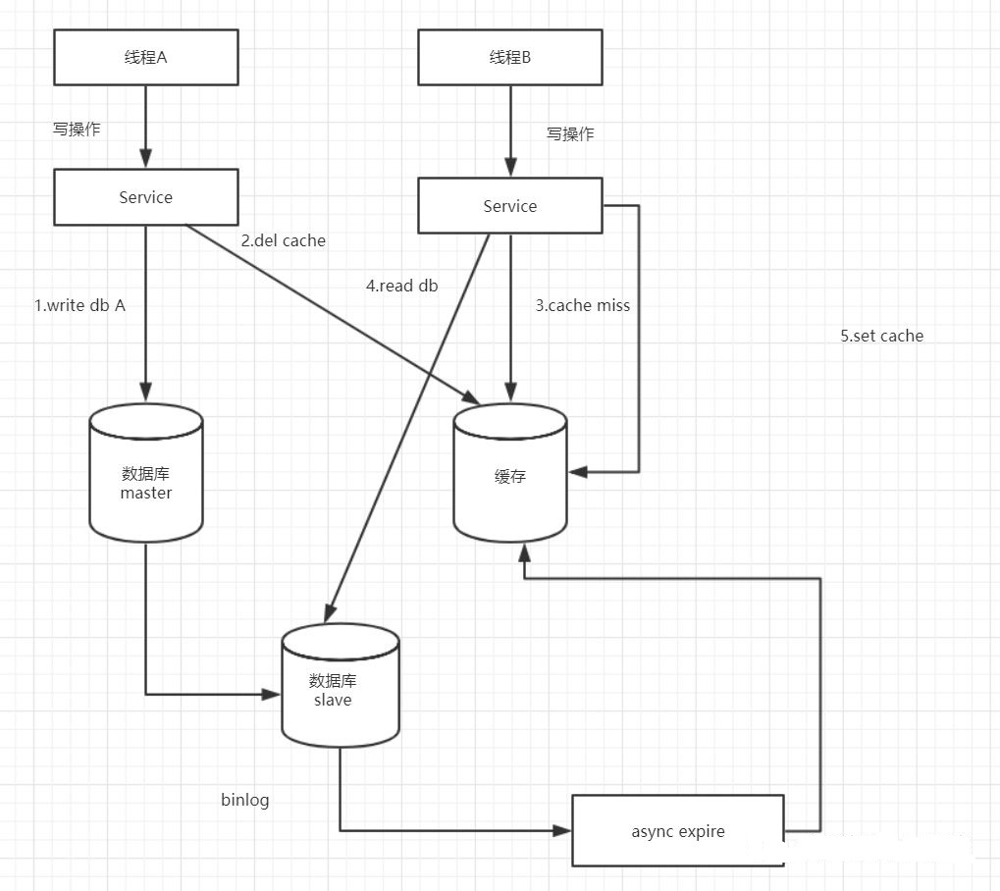

先提一些常见的缓存策略： https://www.jianshu.com/p/207130233e60
- Cache-Aside：缓存位于一边，应用程序直接与缓存和数据库对话。最常用的，如下是对这中场景的数据一致性的分析
- Read-Through Cache：缓存位于应用程序和数据库中间，应用程序只与缓存交互
- Write-Throug Cache: 
- Write-Around: 同时操作缓存和db, 写db，失效缓存
- Write-Back： 写到缓存即返回，再从缓存中异步刷新到db

场景分析: 首先读请求不会产生数据一致性，只有要更新DB数据，再同步缓存时才会涉及数据一致性问题，然后就产生了下面三个问题
1. 一是先操作缓存还是先更新DB
2. 二是对于操作缓存是更新还是删除
3. 三是当有并发请求的问题时，即双写问题

先给出结论和解决方案：

- 先操作数据库，再删除缓存，但删除可能失败，可通过阿里开源的一个数据库中间件canal监控binlog，再放进mq通过ack确保删除缓存成功
- 如果有主从，要监听从，否则当缓存删除成功，但从库还没同步到binlog，即从库还是旧值时，来了读请求检测到缓存没有值，访问从库会读取到旧值再放入缓存，导致数据不一致
- 另外要注意如果有多从，要监听所有从，全部从都同步到binlog后再删除缓存。

下面针对几种组合情况进行分析，并说明存在的问题，以及为什么会有上面的方案，但是并不会对每一种组合情况进行说明

## 先删除缓存，再更新数据库，no
先看一写一读的情况，如下流程图所示：

理想流程如下：
1. 线程A发起一个写操作，第一步del cache
2. 线程A第二步写入新数据到DB
3. 线程B发起一个读操作，cache miss，
4. 线程B从DB获取最新数据
5. 请求B同时set cache

但是并发下会有如下流程：
1. 线程A发起一个写操作，第一步del cache
2. 此时线程B发起一个读操作，cache miss
3. 线程B继续读DB，读出来一个老数据
4. 然后老数据入cache
5. 线程A写入了最新的数据

这样就有问题了吧，老数据入到缓存了，每次读都是老数据啦，缓存与数据与数据库数据不一致。

这种情况下，一写一读就有问题，双写时，再来读请求，肯定有问题。

## 先更新缓存，在更新数据库，no
在这种情况下，来看一个双写的问题，如下流程图所示：

理想流程：
1. 线程A发起一个写操作，第一步set cache
2. 线程A第二步写入新数据到DB
3. 线程B发起一个写操作，set cache，
4. 线程B第二步写入新数据到DB

造成不一致的流程：
1. 线程A发起一个写操作，第一步set cache
2. 线程B发起一个写操作，第一步setcache
3. 线程B写入数据库到DB
4. 线程A写入数据库到DB

执行完后，缓存保存的是B操作后的数据，数据库是A操作后的数据，缓存和数据库数据不一致。

## 先更新数据库，再删除缓存，ok
先更新数据库，再删除缓存，这种方案，在一写一读情况时的流程图如下：

1. 线程A发起一个写操作，第一步write DB
2. 线程A第二步del cache
3. 线程B发起一个读操作，cache miss
4. 线程B从DB获取最新数据
5. 线程B同时set cache

这种方案没有明显的并发问题，但是有可能步骤二删除缓存失败，虽然概率比较小，优于方案一和方案二

双写情况下，同样不会有问题，最终都会删除缓存，读请求再来就能拿到最新值，但也存在删除缓存失败。

## 先更新数据库，再删除缓存+改进，ok
这个是方案三的改进方案，都是先操作数据库再操作缓存，我们来看一下流程图：

通过数据库的binlog来异步淘汰key，以mysql为例，可以使用阿里的canal将binlog日志采集发送到MQ队列里面，然后通过ACK机制确认处理 这条更新消息，删除缓存，保证数据缓存一致性。

但是呢还有个问题，如果是主从数据库呢？

## 先更新数据库+主从，再删除缓存+改进，ok
主从DB问题：因为主从DB同步存在同时延时时间如果删除缓存之后，数据同步到备库之前已经有请求过来时，会从备库中读到脏数据，如何解决呢？解决方案如下流程图：

## 总结
综上所述，在分布式系统中，缓存和数据库同时存在时，如果有写操作的时候，先操作数据库，再操作缓存。如下：
1. 读取缓存中是否有相关数据
2. 如果缓存中有相关数据value，则返回
3. 如果缓存中没有相关数据，则从数据库读取相关数据放入缓存中key->value，再返回
4. 如果有更新数据，则先更新数据，再删除缓存
5. 为了保证第四步删除缓存成功，使用binlog异步删除
6. 如果是主从数据库，binglog取自于从库
7. 如果是一主多从，每个从库都要采集binlog，然后消费端收到最后一台binlog数据才删除缓存

## 参考资料
> - 
> - 
