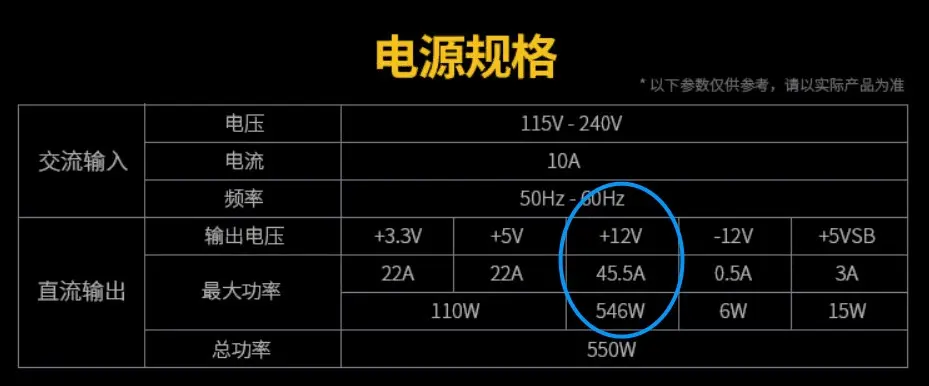
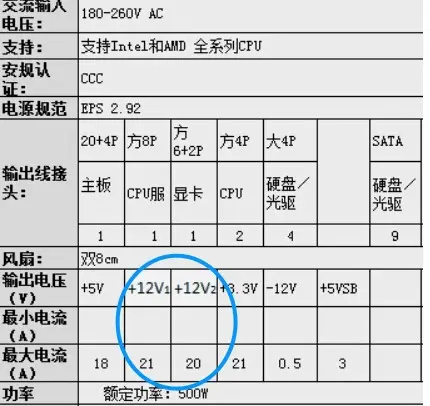
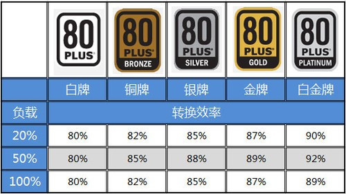
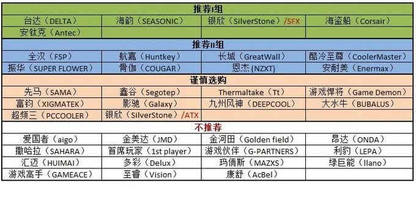

说到CPU就好比大脑，那么电源做个恰当的比喻就是心脏，可想而知电源在电脑里面的重要性，我下面直接切入正题，我将会为大家带来简单明了的电源介绍。

## 电源铭牌

电源上的贴的介绍说明，一般电源输出分为+12V、+5V、+3.3V、-12V、+5VSB，那么这些分别代表什么呢？

大部分用户一般来说只用看+12v列即可，现在的台式主机中，CPU（全部为+12V供电）和显卡（绝大部分+12V)，是电脑中电力消耗最大的地方。我们用12V×35A所得到的420（w）就是这一款电源所能够提供最大的CPU以及显卡功耗，换言之，理论上来讲，CPU加显卡的功耗加起来在420W以下可以用这一款电源。

## 额定功率VS峰值功率
额定功率就是正常的实际功率；而峰值功率，则是说的在很短一段时间内能够提供的功率，要注意某些电源的虚假宣传。

## 多路12v和单路12v

多路12v会在电源铭牌上，电源输出行有多个12v，如双路一般会有+12V1和+12V2，对应的电流一般较单路小，分别给CPU和显卡供电。
单路和多路12V电源，在性能上并没有什么明显的优劣之分。不少对电源比较懂的玩家，会选择单路12V电源，因为双路12V每路的限流值比较低，出现过流保护的可能性更大一些，而单路12V的电源往往比较大，出现几率更小。其实大家不必纠结哪种方式更好，只要电源的12V联动输出功率能够带动你的配件，单路和双路12V用起来完全感觉不出差别的。

## 80PLUS和转换率
百度上面是这么说的“80 PLUS 计划是由美国能源署出台的一项全国性节能现金奖励方案。起初为降低能耗，鼓励系统商在生产台式机或服务器时选配使用满载、50%负载、20%负载效率均在80%以上和在额定负载条件下PF值大于0.9的电源。由美国政府自掏腰包，对于符合以上要求的，台式机每套系统奖励5美元，对于服务器每套系统则奖励10美元。”
转换率的问题呢，比如你电脑功耗为200W，那么插座上面的功耗是不止200W的，会超过，因为电源自身要消耗一些功耗，那么这个时候80plus的出现就是为了环保，节约能源，如果你的电源转换率较高，那么考虑到对环保的供献会有奖励同时给你发个牌子。我们来看看不同牌的转换率分别是多少。

我们可以看到有五个段位，白、铜、银、金、白金，不过现在又搞出来了一个钛金，然而售价感人，如果是土豪请直接上钛金电源，买最贵的，品质不会差。

## PFC主动被动？宽幅
主动PFC和被动PFC，听名字就知道大家要选主动PFC，除非说你喜欢被动，不过大家也不用担心选到被动PFC，一般来说，300W以上的电源大多数都是主动PFC的，不用担心。另外宽幅电源一般都是主动pfc电源。

主动PFC: 电路由高频电感、开关管、电容以及控制IC等元件构成。电路的特点是构造复杂，但优点很多：功率因数高达0.99、低损耗和高可靠、输入电压可以从90V到270V（宽幅输入）等，由于输出DC电压纹波很小，因此采用主动式PFC的电源不需要采用很大容量的滤波电容。

被动式PFC: 通常为一块体积较大的电感，其内部由多块硅钢片外部缠绕铜线而组成。功率因数不是很高，只能达到0.7~0.8，因此其效率也比较低，发热量也比较大。被动式PFC也并非一无是处，其结构简单，稳定性上表现好，比较适合中低端电源，价格便宜。

宽幅与非宽幅的电源，简单来说，宽幅电源比较适合用电环境比较复杂（农村）等交流电比较不稳定的区域使用，他们可以保证在交流电低到110v的范围，还能继续供电，不重启。所以如果说你所在的地方交流电比较不稳定，而你又经常使用你的电脑，如果你想愉快地玩耍不想电脑在用电高峰期时不时地重启，那么老老实实上宽幅电源，顺便配合一个防电涌插座，然后就可以愉快玩耍了。

## 关于模组
主要来说分为三种：非模组、半模组、全模组。说白了，区别的就是线材是不是焊死在电源上以及焊死多少在电源上。

## 关于电源性能指标
包括转换效率、输出稳定性（电压偏离）、交叉负载、纹波、保持时间、温升与噪音

- 转换效率上面已经说过，就不重复说了。
- 电压偏离就是稳定性，虽然铭牌上面标了+12V，+5V什么的，但是实际输出的过程中会有一定的偏差，比如+5V可能是5.15V这样。
- 纹波：纹波不好容易对电脑硬件寿命造成影响。
- 交叉负载：这个测试的目的就是检查当12V 5V 3.3V功耗占用比例不同的时候，他们是不是还能保持准确的电压。
- 保持时间：太短对硬件寿命也有影响。
- 噪音和温升也是比较重要的因素呢，试想你的风扇嗡嗡直响，你会觉得不是在家里，而是在飞机场

## 关于保修
- 一般电源都是3年质保
- 大陆的一般都是3年质保。
- 台系一般是5年质保
- 美商海盗船，10年质保，上船吧。

## 电源内部参数
电容、变压方案、稳压方案、电路板做工。

- 先看电容：一般来说，日本电容 > 台湾电容 > 大陆电容
- 再看变压方案：LLC全桥＞LLC半桥＞双管正激＞单管正激
- 接着看稳压方案：DC-DC＞双路放大＞单路放大

## 电源品牌

- 推荐I组：整体质量不错，闭着眼睛选型号较难遇到大坑货（并非没有坑货）。
- 推荐II组：或产品跨度大，一部分型号不错，一部分型号难以恭维；或型号辨识度太低，较为混乱；或产品问题不大、但厂商喜欢搞小动作；或有实力但不重视大陆零售市场，可以期待。
- 谨慎选购：品牌比较常见，但整体产品水准明显低于前两组，全系列有极少数值得选购的型号，但不明就里的新手尽量绕道。

## 参考资料
> - 
> - 
