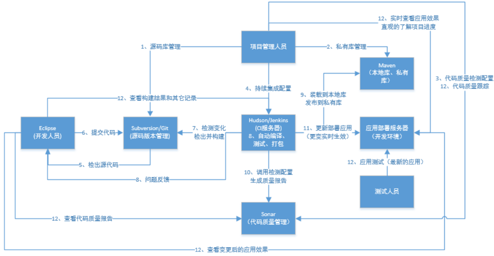

## 基础服务

| 服务名    | 常用方案    | 开源服务      | 描述                          |
| --------- | ----------- | ------------- | ----------------------------- |
| 代码仓库  | gitlab      | github/gitee  |                               |
| Maven私服 | nexus       | 阿里/华为镜像 | 镜像只可拉包，不可deploy,也可做docker镜像私服          |
| 持续构建  | jenkins     | 无            |                               |
| 代码质量  | sonar       | 无            |                               |
| 数据库    | mysql       | 无            | 只允许本地访问，远程用ssh代理 |
| 缓存      | redis       | 无            |                               |
| 消息队列  | RabbitMQ    | 无            |                               |
| 短信服务  | www.juhe.cn | 无            |                               |

## 持续集成方案
默认采用maven项目构建工具

1. 物理机运行服务：从gitlab拉代码在jenkins构建后，传送构件到部署物理机启动，如下图所示

2. 容器运行服务：从gitlab拉代码在jenkins构建后，推镜像到镜像仓库，运行容器，暂未找到图

   

   

   

   

   

## 参考资料
> - 
> - 
