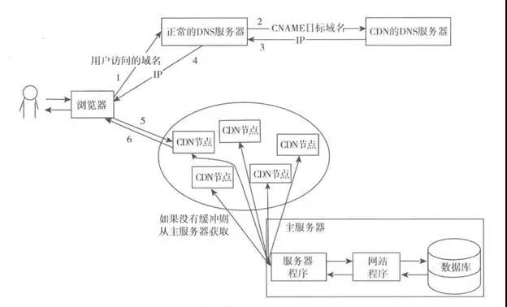

CDN服务器其实是一种集群页面缓存服务器，其目的就是尽早的返回用户所需要的数据，一方面加速用户访问速度，另一方面也减轻后端服务器的负载压力。

CDN的全称是Content Delivery Network，即内容分发网络。其基本思路是尽可能避开互联网上有可能影响数据传输速度和稳定性的瓶颈和环节，使内容传输的更快、更稳定。

CDN通过在网络各处放置节点服务器所构成的在现有的互联网基础之上的一层智能虚拟网络，CDN系统能够实时地根据网络流量和各节点的连接、负载状况以及到用户的距离和响应时间等综合信息将用户的请求重新导向离用户最近的服务节点上。其目的是使用户可就近取得所需内容，解决 Internet网络拥挤的状况，提高用户访问网站的响应速度。

也就是说CDN服务器是部署在网络运行商的机房，提供的离用户最近的一层数据访问服务，用户在请求网站服务的时候，可以从距离用户最近的网络提供商机房获取数据。电信的用户会分配电信的节点，联通的会分配联通的节点。

CDN分配请求的方式是特殊的，不是普通的负载均衡服务器来分配的那种，而是用专门的CDN域名解析服务器在解析域名的时候就分配好的。

## 参考资料
> - 
> - 
