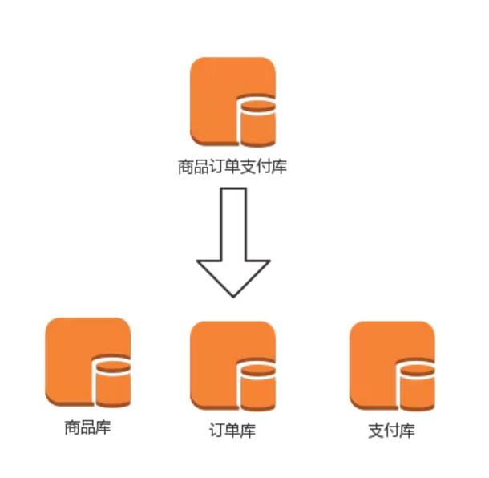
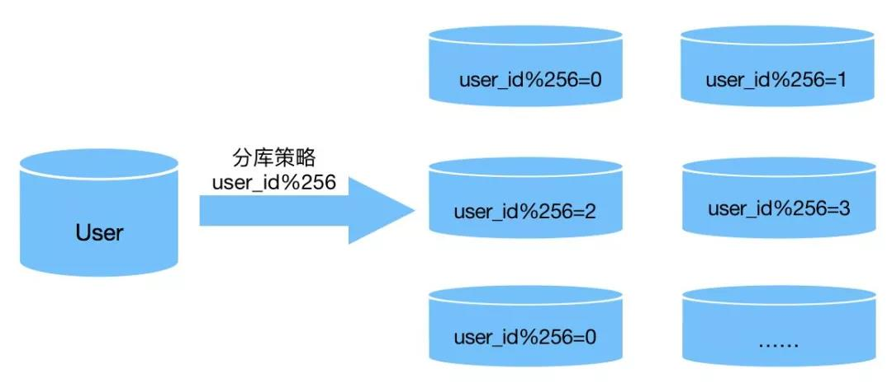
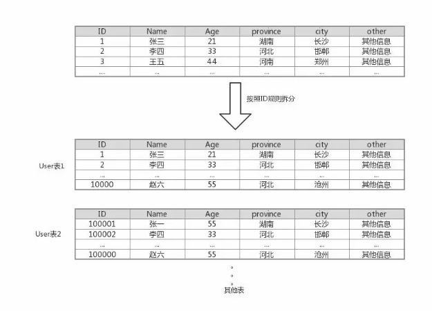
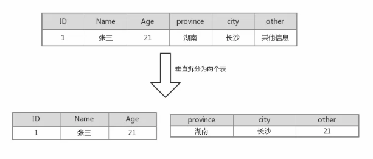

## 是否需要分

说到数据库分库分表，不能一味的追求，我们要明白为什么要进行分库分表才是最终目的。现在网上一些人鼓吹分库分表如何应对了多大数据，却不知针对很多人的业务来说，分库分表策略也许并非是银弹，而是令人焦虑的焦油坑。

分库分表是业务发展到一定阶段，数据积累到一定量级而衍生出来的解决方案。当DB的数据量级到达一个阶段，写入和读取的速度会出现瓶颈，即使是有索引，索引也会变的很大，而且数据库的物理文件大的会使备份和恢复等操作变的很困难。这个时候由于DB的瓶颈已经严重危害到了业务，最有效的解决方案莫过于DB的分库分表了。

有的leader甚至架构师会在业务初期以自己的主观意愿就进行分库分表，会为以后业务高速发展做铺垫。但是这里我要表达我几个观点：

1.  如果当前这个业务并非公司的核心业务，而且在业务是否能存活的前提下，初级的设计不要这么复杂。如果每个业务我们都按淘宝那样的规模做系统架构设计，将来不但会害死业务，更会让程序员死的更惨，背上黑锅的数量会更多。

2. 单台数据库的能力并非想象中那么脆弱。就算是mysql单表数据量大部分场景下也在百万级别（当然这和存储的具体数据格式有关），sqlserver更是不在话下，我司用的sqlserver，单表千万级别数据的大有所在，亿级的也有几个，Oracle更是不用多说。

3. 如果业务周期比较短，或者人力物力不足的情况下，盲目的在初期就进行分库分表设计，更是给自己下了绩效背D的套，

4. 系统的设计初期和公司的基础数据有直接关系，比如微信这样的数据规模，稍微一个小系统就有可能是千万甚至上亿的数据级别，但是多数初创公司有多少能有这样的级别呢？我这里喷一句：有的创业公司号称从XX大公司重金挖来的CTO，技术总监等等高人，尤其是这些带着金色光环的人在创业初期给开发人员埋雷，一个创业公司搞一套XX分布式，XX设计，殊不知，在当前的公司环境下这些其实没有必要，给公司带来的更多是苦不堪言。

## 分库策略

- 根据业务划分

说到分库，这里想多啰嗦一句：推荐大家根据业务来进行划分，我一直在过去的文章中强调，一个系统的好坏，业务的边界划分起到举足轻重的作用。业务按照规则划分好边界，每个业务对应的数据库自然而然就诞生了，不要站在数据库的层面上去给业务分库。有的leader会有这样的行为：某个表的数据量太大，分配到单独的一个库，结果导致的结果就是很多SQL语句必须跨库Join。

具体的业务怎么划分呢？这个规则我不敢说，每个公司的业务形态不同，划分的维度就会不同。举一个简单的例子：一个典型的电商系统根据业务可划分为商品，订单，这也是许多公司的典型业务划分，但是我司根据自己的业务规则，划分为商品，订单，支付。因为支付系统在我司是一个独立的业务，不但包含了订单的支付，还包含了很多其他的支付场景。根据业务上的划分，DB的层面就出现了商品DB，订单DB和支付DB。

- 同一业务横向划分

  除了根据业务垂直切分的策略之外，还有另外一种常用的分库方案，如果某个具体业务数据量比较大，可以把这业务的数据库根据某种规则来进行横向切分。比如用户信息的业务，当用户量达到一定量级，有些公司会把用户信息拆分到多个数据库，说到这里，有的同学会问，这和拆分到多个表有什么区别呢？如果把用户信息横切到同一个数据库的多个表，如果这些表位于一个物理磁盘上，对于提高这个业务的写入和读取IO最大值并没有什么用处，但是如果分配到多个服务器上，意味着这个业务整体的最大IO得到了提升，在一定程度上要比拆表效果要好，当然如果用到了表分区，每个分区散落在不同的物理磁盘上，也不一定比分库方式差。

  把某个业务的DB按照规则横向切分之后，当然也会引入新的问题，下边会介绍。切分的规则在很多情况下用的最多的就是哈希取余的方式了，有时间咱们在讨论。

## 分库引入复杂性

我在上文提到过，分库分表并非是银弹，任何一种解决方案能解决一个问题，但是有可能会引入其他问题，世界是公平的，计算机世界亦如此。那分库会引入哪些问题呢？

1. 在执行了分库之后，难以避免会将原本逻辑关联性很强的数据划分到不同的表、不同的库上，这时，表的关联操作将受到限制，我们多数情况下无法join位于不同分库的表（因为多数公司都明令禁止跨库sql），结果原本一次查询能够完成的业务，可能需要多次查询才能完成。

2. 原来在单体DB环境下，可以用DB的事务来保证一些操作的原子操作，但是在分散到多个数据库的情况下，统一管理这些操作变的困难。虽然一些大厂提供的也有跨库的事务解决方案，但是性能上实在是差强人意，所以在很多情况下并不实用。比如上边提到的商品库存支付，在单体应用的情况下，三个业务在同一个数据库，当发生支付业务，更改商品库存和更新订单状态这两个操作可以利用数据库提供的事物来完成，而且性能在可接受范围之内，如果这三个业务分布在不同的数据库，有几率会发生只执行其中一个操作的情况发生，其实这也是分布式事物要解决的问题。在很多情况下，分布式事物是无法避免的，根据业务综合情况适当采用分布式事物也是一种有效的解决方案，最坏的情况下，可能需要人工介入了。

3. 分库对于DBA来说意味着工作量的成倍增加，原来只需要管理一个DB，现在却要管理N个DB，而且每个DB都需要备份，监控，甚至做高可用，扩展等工作。原来可能只需要一个DBA管理人员，分库之后可能会需要两个甚至三个，导致了公司在人力投入上的加大。

## 分表策略

表的拆分和数据库的拆分有相似之处，但是拆分的规则也有不同。以下的拆分规则针对的是拆分一个表。

- 横向切分

横向切分是诸多业务中最常用的切分方式，本质是把一个表中的数据行按照规则分散到多个表中，比如最常见的按照ID范围，按照业务主键的哈希值等。至于表数据到达什么数量级之后进行切分，这和表中存的数据格式有关，比如一个表只有几列的int字段肯定要比几列text类型的表存储的极限要高。姑且认为这个极限是1000万吧。但是作为一个系统的负责人或者架构师来说，当表的数据量级到达千万级别要引起重视，因为这是一个系统性能瓶颈的隐患。

相对于数据表的横向切分，在符合业务优化的场景下我更倾向于做表分区，按照规则把不同的分区分配到不同的物理磁盘，这样的话，业务里的sql语句几乎可以不用改动。我司的一个sqlserver数据库，某个业务的表做了表分区之后，已经到达几十亿级别的数据量，但是查询和插入速度还是能满足业务的需求（优化一个系统还是要花精力优化业务层面）。

- 垂直拆分

说到垂直拆分，表也可以按照业务来拆分，比如一个数据库中有用户的信息，根据业务可以划分为基础信息和扩展信息，如果对业务有利，完全可以拆分为基础信息表和扩展信息表。当然也可以按照别的规则来拆，比如把访问频繁的信息拆分成一个表，其他不频繁的信息拆分成一个表，具体的拆分规则还是要看当时要解决的问题是什么。垂直拆分可能会引入一定复杂性，比如原来查询一个用户的基础信息和扩展信息可以一次性查询出结果，分表之后需要进行Join操作或者查询两次才能查询出结果。

## 分表代价

1. 数据表垂直切分之后，原来一次查询有可能会变为连表的join查询，在一定程度上会有性能损失。

2. 数据表横向切分需要一定的规则，常用的主要有两种规则：范围切分和哈希值切分。范围切分是指按照某个字段的范围来切分，比如用户表按照用户ID来切分，id为1到10万的位于User表1中，100001到200000万的位于User2中，这样切分的优势是，可以无限的扩容下去，不用考虑数据迁移的问题，劣势就是新表和旧表数据分布不均匀，而且分表的范围选取有一定难度，范围太小会导致表太多，太大会导致问题根本上没有解决的困惑。另外一种分表策略就是把某一列按照哈希值来路由到不同的表中，同样以用户ID为例，假如我们一开始就规划了10个数据库表，路由算法可以简单地用 user_id %10的值来表示数据所属的数据库表编号，ID为985的用户放到编号为 5的子表中，ID为10086的用户放到编号为 6 的字表中。这种切分规则的优势是每个表的数据分布比较均匀，但是后期扩容会设计到部分数据的迁移工作。

3. 表拆分之后如果遇到有order by 的操作，数据库就无能为力了，只能由业务代码或者数据库中间件来完成了。

4. 当有搜索的业务需求的时候，sql语句只能是Join多个表来进行连表查询了，类似的还有统计的需求，例如count的统计操作。

## 参考资料

> - 
> - 
