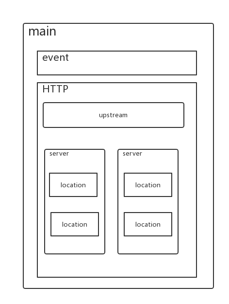

## 配置文件结构



- nginx配置文件主要分为四个部分：

1. main（全局设置）
2. http (http服务器设置 )
3. upstream（负载均衡服务器设置）
4. server（主机设置）
5. location（URL匹配特点位置的设置）


- 关系如下：
  1. server继承main
  2. location继承server
  3. upstream即不会继承其他设置也不会被继承


## main全局配置

nginx在运行时与具体业务功能（比如http服务或者email服务代理）无关的一些参数，比如工作进程数，运行的身份等。

```
user  www www;
worker_processes 4;
worker_cpu_affinity 0001 0010 0100 1000;
error_log  /data/logs/nginx_error.log  crit;
pid        /usr/local/webserver/nginx/nginx.pid;
worker_rlimit_nofile 65535;
```

- `user www www;`: 指定nginx进程使用什么用户启动
- `worker_processes 4;` : 指定启动多少进程来处理请求，一般情况下设置成CPU的核数，如果开启了ssl和gzip更应该设置成与逻辑CPU数量一样甚至为2倍，可以减少I/O操作。使用`grep ^processor /proc/cpuinfo | wc -l`查看CPU核数。
- `worker_cpu_affinity 0001 0010 0100 1000;`: 在高并发情况下，通过设置将CPU和具体的进程绑定来降低由于多核CPU切换造成的寄存器等现场重建带来的性能损耗。如worker_cpu_affinity 0001 0010 0100 1000; （四核）。
- `error_log /data/logs/nginx_error.log crit;`: error_log是个主模块指令，用来定义全局错误日志文件。日志输出级别有debug、info、notice、warn、error、crit可供选择，其中，debug输出日志最为最详细，而crit输出日志最少。
- `pid /usr/local/webserver/nginx/nginx.pid;`: 指定进程pid文件的位置。
- `worker_rlimit_nofile 65535;`: 用于指定一个nginx进程可以打开的最多文件描述符数目，这里是65535，需要使用命令“ulimit -n 65535”来设置。


## events模块

```
 events{
  use epoll;
  worker_connections      65536;
}
```

- `use epoll;`use是个事件模块指令，用来指定Nginx的工作模式。Nginx支持的工作模式有select、poll、kqueue、epoll、rtsig和/dev/poll。其中select和poll都是标准的工作模式，kqueue和epoll是高效的工作模式，不同的是epoll用在Linux平台上，而kqueue用在BSD系统中。对于Linux系统，epoll工作模式是首选。在操作系统不支持这些高效模型时才使用select。
- `worker_connections 65536;`每一个worker进程能并发处理（发起）的最大连接数（包含与客户端或后端被代理服务器间等所有连接数）。nginx作为反向代理服务器，计算公式 `最大连接数 = worker_processes * worker_connections/4`，所以这里客户端最大连接数是65536，这个可以增到到8192都没关系，看情况而定，但不能超过后面的worker_rlimit_nofile。当nginx作为http服务器时，计算公式里面是除以2。进程的最大连接数受Linux系统进程的最大打开文件数限制，在执行操作系统命令`ulimit -n 65536`后`worker_connections`的设置才能生效。

## HTTP服务器

```
http
{
  include       mime.types;
  default_type  application/octet-stream;
  #charset  gb2312;
  }
```

- include是个主模块指令，实现对配置文件所包含的文件的设定，可以减少主配置文件的复杂度。类似于Apache中的include方法。
- default_type属于HTTP核心模块指令，这里设定默认类型为二进制流，也就是当文件类型未定义时使用这种方式，例如在没有配置PHP环境时，Nginx是不予解析的，此时，用浏览器访问PHP文件就会出现下载窗口。
- charset gb2312; 指定客户端编码格式。

## HTTP参数之客户端head缓存

```
server_names_hash_bucket_size 128;
client_header_buffer_size 32k; 
large_client_header_buffers 4 128k; 
client_max_body_size 10m; 
client_body_buffer_size 128k; 
sendfile on ; 
tcp_nopush on;
tcp_nodelay on;
keepalive_timeout 65 : 
client_body_timeout 60s;
send_timeout 60s;
```

- `server_names_hash_bucket_size 128;`: 服务器名字的hash表大小。
- `client_header_buffer_size 32k;`：用来指定来自客户端请求头的header buffer 大小。对于大多数请求，1K的缓存已经足够了，如果自定义了消息头或有更大的cookie，可以增大缓存区大小。
- `large_client_header_buffers 4 128k;`：用来指定客户端请求中较大的消息头的缓存最大数量和大小，4为个数，128k为大小，最大缓存为4个128KB。
- `client_max_body_size 8m;` : 客户端请求的最大的单个文件字节数。
- `client_max_body_size 10m;` : 允许客户端请求的最大单文件字节数。如果有上传较大文件，请设置它的限制值。
- `client_body_buffer_size 128k;`: 缓冲区代理缓冲用户端请求的最大字节数。
- `sendfile on ;` : 开启高效文件传输模式，sendfile指令指定nginx是否调用sendfile函数来输出文件，减少用户空间到内核空间的上下文切换。对于普通应用设为 on，如果用来进行下载等应用磁盘IO重负载应用，可设置为off，以平衡磁盘与网络I/O处理速度，降低系统的负载。开启 `tcp_nopush on;` 和`tcp_nodelay on;` 防止网络阻塞。
- `keepalive_timeout 65 :` : 长连接超时时间，单位是秒，这个参数很敏感，涉及浏览器的种类、后端服务器的超时设置、操作系统的设置，可以另外起一片文章了。长连接请求大量小文件的时候，可以减少重建连接的开销，但假如有大文件上传，65s内没上传完成会导致失败。如果设置时间过长，用户又多，长时间保持连接会占用大量资源。
- `client_body_timeout 60s;` : 用于设置客户端请求主体读取超时时间，默认是60s。如果超过这个时间，客户端还没有发送任何数据，nginx将返回`Request time out(408)`错误。
- `send_timeout :` : 用于指定响应客户端的超时时间。这个超时仅限于两个连接活动之间的时间，如果超过这个时间，客户端没有任何活动，Nginx将会关闭连接。

## HTTP参数之gzip模块设置

```
gzip on;
gzip_min_length 1k;
gzip_buffers    4 16k;
gzip_http_version 1.1;
gzip_comp_level 6;
gzip_types text/html text/plain text/css text/javascript application/json application/javascript application/x-javascript application/xml;
gzip_vary on;
```

- `gzip on;`开启gzip压缩输出
- `gzip_min_length 1k;` 最小压缩文件大小，页面字节数从header头的Content-Length中获取。默认值为0，不管多大页面都压缩，建议设置成大于1K的字节数，小于1K可能会越压越大。
- `gzip_buffers 4 16k;` 压缩缓冲区，表示申请四个16K的内存作为压缩结果流缓存，默认是申请与原始数据大小相同的内存空间来存储gzip压缩结果。
- `gzip_http_version 1.1;` 用于设置识别HTTP协议版本，默认是1.1，目前主流浏览器都已成指出。（默认1.1，前端如果是squid2.5请使用1.0）
- `gzip_comp_level 6;` 压缩等级，1压缩比最小，处理速度最快，9压缩比最大，传输速度快，但是消耗CPU资源。
- `gzip_types text/plain application/x-javascript text/css application/xml;`压缩类型，默认就已经包含text/html，所以下面就不用再写了，写上去也不会有问题，但是会有一个warn。
- `gzip_vary on;` 和http头有关系，会在响应头加个 Vary: Accept-Encoding ，可以让前端的缓存服务器缓存经过gzip压缩的页面，例如，用Squid缓存经过Nginx压缩的数据。
- `gzip_proxied any;` Nginx作为反向代理的时候启用，决定开启或者关闭后端服务器返回的结果是否压缩，匹配的前提是后端服务器必须要返回包含”Via”的 header头。
- `limit_zone crawler $binary_remote_addr 10m;` 开启限制IP连接数的时候需要使用

## 完整通用配置文件

```
user  www www;
worker_processes  2;
error_log  logs/error.log;
#error_log  logs/error.log  notice;
#error_log  logs/error.log  info;
pid        logs/nginx.pid;
events {
    use epoll;
    worker_connections  2048;
}
http {
    include       mime.types;
    default_type  application/octet-stream;
    #log_format  main  '$remote_addr - $remote_user [$time_local] "$request" '
    #                  '$status $body_bytes_sent "$http_referer" '
    #                  '"$http_user_agent" "$http_x_forwarded_for"';
    #access_log  logs/access.log  main;
    
    sendfile        on;
    # tcp_nopush     on;
    keepalive_timeout  65;
    
  # gzip压缩功能设置
    gzip on;
    gzip_min_length 1k;
    gzip_buffers    4 16k;
    gzip_http_version 1.1;
    gzip_comp_level 6;
    gzip_types text/html text/plain text/css text/javascript application/json application/javascript application/x-javascript application/xml;
    gzip_vary on;
  
  # http_proxy 设置
    client_max_body_size   10m;
    client_body_buffer_size   128k;
    proxy_connect_timeout   75;
    proxy_send_timeout   75;
    proxy_read_timeout   75;
    proxy_buffer_size   4k;
    proxy_buffers   4 32k;
    proxy_busy_buffers_size   64k;
    proxy_temp_file_write_size  64k;
    proxy_temp_path   /usr/local/nginx/proxy_temp 1 2;
    
  # 设定负载均衡后台服务器列表 
    upstream  backend  { 
              #ip_hash; 
              server   192.168.10.100:8080 max_fails=2 fail_timeout=30s ;  
              server   192.168.10.101:8080 max_fails=2 fail_timeout=30s ;  
    }
    
  # 很重要的虚拟主机配置
    server {
        listen       80;
        server_name  itoatest.example.com;
        root   /apps/oaapp;
        charset utf-8;
        access_log  logs/host.access.log  main;
        #对 / 所有做负载均衡+反向代理
        location / {
            root   /apps/oaapp;
            index  index.jsp index.html index.htm;
            proxy_pass        http://backend;  
            proxy_redirect off;
            # 后端的Web服务器可以通过X-Forwarded-For获取用户真实IP
            proxy_set_header  Host  $host;
            proxy_set_header  X-Real-IP  $remote_addr;  
            proxy_set_header  X-Forwarded-For  $proxy_add_x_forwarded_for;
            proxy_next_upstream error timeout invalid_header http_500 http_502 http_503 http_504;
            
        }
        
        #静态文件，nginx自己处理，不去backend请求后端的服务
        location  ~* /download/ {  
            root /data/app/nginx/downloads;  
            
        }
        
        location ~ .*\.(gif|jpg|jpeg|bmp|png|ico|txt|js|css)$  {   
            root /data/app/nginx/images;   
            expires      7d; 
        }
        
        location /nginx_status {
            stub_status on;
            access_log off;
            allow 192.168.10.0/24;
            deny all;
        }
        
        location ~ ^/(WEB-INF)/ {   
            deny all;   
        }
        
        #error_page  404              /404.html;
        # redirect server error pages to the static page /50x.html
        #
        error_page   500 502 503 504  /50x.html;
        location = /50x.html {
            root   html;
        }
    }
  ## 其它虚拟主机，server 指令开始
}
```


## 参考资料
> - []()
> - []()
