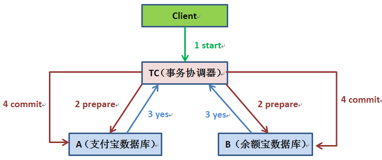

在OLTP系统领域，我们在很多业务场景下都会面临事务一致性方面的需求，例如最经典的Bob给Smith转账的案例。传统的企业开发，系统往往是以单体应用形式存在的，也没有横跨多个数据库。我们通常只需借助开发平台中特有数据访问技术和框架（例如Spring、JDBC、ADO.NET），结合关系型数据库自带的事务管理机制来实现事务性的需求。关系型数据库通常具有ACID特性：原子性（Atomicity）、一致性（Consistency）、隔离性（Isolation）、持久性（Durability）。

而大型互联网平台往往是由一系列分布式系统构成的，开发语言平台和技术栈也相对比较杂，尤其是在SOA和微服务架构盛行的今天，一个看起来简单的功能，内部可能需要调用多个“服务”并操作多个数据库或分片来实现，情况往往会复杂很多。单一的技术手段和解决方案，已经无法应对和满足这些复杂的场景了。

## 分布式系统的特性

在分布式系统中，同时满足“CAP定律”中的“一致性”、“可用性”和“分区容错性”三者是不可能的，这比现实中找对象需同时满足“高、富、帅”或“白、富、美”更加困难。在互联网领域的绝大多数的场景，都需要牺牲强一致性来换取系统的高可用性，系统往往只需要保证“最终一致性”，只要这个最终时间是在用户可以接受的范围内即可。

## X/Open DTP模型

X/Open DTP(X/Open Distributed Transaction Processing Reference Model) 是X/Open 这个组织定义的一套分布式事务的标准，也就是了定义了规范和API接口，由各个厂商进行具体的实现。这个思想在java 平台里面到处都是。

X/Open DTP 定义了三个组件： AP，TM，RM

- AP(Application Program)：也就是应用程序，可以理解为使用DTP的程序
- RM(Resource Manager)：资源管理器，这里可以理解为一个DBMS系统，或者消息服务器管理系统，应用程序通过资源管理器对资源进行控制。资源必须实现XA定义的接口
- TM(Transaction Manager)：事务管理器，负责协调和管理事务，提供给AP应用程序编程接口以及管理资源管理器

## XA协议

XA协议指的是TM和RM之间的接口。目前主流的关系型数据库产品都是实现了XA接口的。

XA协议的常用实现模型是两阶段提交（Two-phase Commit，2PC）。 

总的来说，XA协议比较简单，而且一旦商业数据库实现了XA协议，使用分布式事务的成本也比较低。但是，XA也有致命的缺点，那就是性能不理想，XA无法满足高并发场景。XA目前在商业数据库支持的比较理想，在mysql数据库中支持的不太理想，mysql的XA实现，没有记录prepare阶段日志，主备切换回导致主库与备库数据不一致。许多nosql也没有支持XA，这让XA的应用场景变得非常狭隘。

## JTA

JTA(Java Transaction API)，是JavaEE的编程接口规范，它是XA协议的JAVA实现。它主要定义了：

- 一个TM的接口`javax.transaction.TransactionManager`，定义了有关事务的开始、提交、撤回等操作。
- 一个满足XA规范的资源定义接口`javax.transaction.xa.XAResource`，一种资源如果要支持JTA事务，就需要让它的资源实现该`XAResource`接口，并实现该接口定义的两阶段提交相关的接口。

如果我们有一个应用，它使用JTA接口实现事务，应用在运行的时候，就需要一个实现JTA的容器，一般情况下，这是一个J2EE容器，像JBoss，Websphere等应用服务器。但是，也有一些独立的框架实现了JTA，例如[Atomikos](https://www.atomikos.com/), [bitronix](https://github.com/bitronix/btm)都提供了jar包方式的JTA实现框架。这样我们就能够在Tomcat或者Jetty之类的服务器上运行使用JTA实现事务的应用系统。

## 基于两阶段提交的XA协议实现

两阶段提交（Two-phase Commit，2PC）经常被用来实现分布式事务。一般分为协调器C和若干事务执行者Si两种角色，这里的事务执行者就是具体的数据库，协调器可以和事务执行器在一台机器上。

1. 我们的应用程序（client）发起一个开始请求到TC；
2. TC先将<prepare>消息写到本地日志，之后向所有的Si发起<prepare>消息。

以支付宝转账到余额宝为例，TC给A的prepare消息是通知支付宝数据库相应账目扣款1万，TC给B的prepare消息是通知余额宝数据库相应账目增加1w。为什么在执行任务前需要先写本地日志，主要是为了故障后恢复用，本地日志起到现实生活中凭证 的效果，如果没有本地日志（凭证），出问题容易死无对证；

3. Si收到<prepare>消息后，执行具体本机事务，但不会进行commit，如果成功返回<yes>，不成功返回<no>。同理，返回前都应把要返回的消息写到日志里，当作凭证。
4. TC收集所有执行器返回的消息，如果所有执行器都返回yes，那么给所有执行器发生送commit消息，执行器收到commit后执行本地事务的commit操作；如果有任一个执行器返回no，那么给所有执行器发送abort消息，执行器收到abort消息后执行事务abort操作。

TC或Si把发送或接收到的消息先写到日志里，主要是为了故障后恢复用。如某一Si从故障中恢复后，先检查本机的日志，如果已收到<commit >，则提交，如果<abort >则回滚。如果是<yes>，则再向TC询问一下，确定下一步。如果什么都没有，则很可能在<prepare>阶段Si就崩溃了，因此需要回滚。

现如今实现基于两阶段提交的分布式事务也没那么困难了，如果使用java，那么可以使用开源软件atomikos(<http://www.atomikos.com/>)来快速实现。

不过但凡使用过的上述两阶段提交的同学都可以发现性能实在是太差，根本不适合高并发的系统。为什么？

- 两阶段提交涉及多次节点间的网络通信，通信时间太长！
- 事务时间相对于变长了，锁定的资源的时间也变长了，造成资源等待时间也增加好多！

正是由于分布式事务存在很严重的性能问题，大部分高并发服务都在避免使用，往往通过其他途径来解决数据一致性问题。

## 参考资料

> - 
> - 
