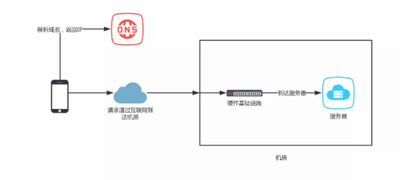
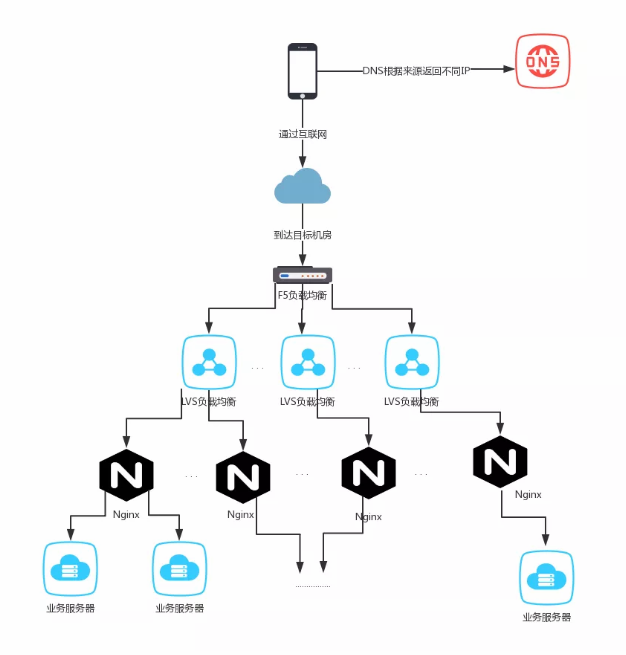

## 前言

一个系统发展初期，往往都是单机系统。应用和数据库在一台服务器上，随着业务的发展，访问量的增大，一台服务器性能就会出现天花板，往往已经难以支撑业务量了。这个时候就要考虑把数据库和应用服务器分开，访问继续增加，就会考虑数据库分库分表，应用服务器做负载均衡，其实这也属于分布式系统的一个范畴。分布式系统的核心概念就是一个“分”字，一台服务器支撑不住，那就两台，三台，四台....当然分之后会带来其他问题，比如最常见的数据一致性问题，调用链监控等问题，这些不在今日的讨论范围内，有兴趣的同学请移步百度。

## 什么是负载均衡

很多项目做“分布式”部署提高系统性能，首期采用的往往是负载均衡策略。

负载均衡，英文名称为Load Balance，其含义就是指将负载（工作任务）进行平衡、分摊到多个操作单元上进行运行，例如FTP服务器、Web服务器、企业核心应用服务器和其它主要任务服务器等，从而协同完成工作任务。负载均衡构建在原有网络结构之上，它提供了一种透明且廉价有效的方法扩展服务器和网络设备的带宽、加强网络数据处理能力、增加吞吐量、提高网络的可用性和灵活性。

负载均衡既然属于“分”策略的一种表现形式，就会涉及到任务的分配者，任务执行者，分配算法。这里的任务分配者就是我们常说的负载均衡器，任务执行者就是处理任务的服务器，分配算法就是常说的轮训等分配策略。这里把任务的分配者叫做负载均衡器其实是不正确的，负载均衡器这个概念注重的更多是均匀分配任务，让每个任务的计算单元的任务量达到均衡状态，而现实中任务的分配更多是出于每个计算单元的性能或者业务来考虑。让每个计算单元处理几乎相同数量的任务只是分布式均衡器其中的一部分内容。

以http请求为例，在一个http请求的过程中，其实会遇到有很多负载均衡的过程，一个系统在什么阶段做负载均衡取决于它的请求量，这和常说的QPS/TPS/DAU等有直接关系，假设系统的请求量非常少，其实完全没有必要做负载均衡，当然有时候为了达到高可用的目的也做负载均衡，这里不在展开讨论。那一个http请求到底可以经过哪些负载均衡器呢？http请求的过程如下图所示

## DNS负载均衡

当一个client向一个url发起请求（这里不考虑直接请求IP地址的情况），第一步需要做的就是请求DNS服务器去做域名解析，把请求的域名转换成IP地址。DNS解析同一个域名可以根据来源返回不同的IP地址，利用这个特性可以做DNS负载均衡。client请求离自己最近的资源才是最快的，所以可以把系统部署在不同区域的机房，每个client经过DNS解析只请求离自己最近的机房资源，比请求异地的机房资源要快的多。例如：一个网站可以同时部署在北京机房和深圳机房，河北的用户请求网站的时候都会被导向北京机房，比访问深圳的速度要快的多。

DNS负载均衡仅限于解析域名的时机，所以它的力度是很粗的，相应的负载均衡算法也有限。但是这种方案实现起来比较简单，成本也很低，而且在一定程度了缩短了用户的响应时间，加快了访问速度。由于DNS信息都有很长时间的缓存，所以更新的时候会有一段时间的信息差异，会导致部分用户正常业务的访问的错误。

## 硬件负载均衡

当一个请求知道了要访问的目标IP，便会通过层层的网关和路由器到达目标IP的机房，在这之前属于网络传输的范畴，一般很难进行干预。有很多机房都通过硬件设施来实现负载均衡的目的，这和路由器、交换机类似，也可以理解为底层的设备。目前最常用的莫过于F5了，这样的硬件设备一般都出产于大公司，性能都经过严格测试，功能强大，但是很贵，一般的中小公司不会更没有必要使用这种土豪设备。

硬件负载均衡性能很强大，支撑的并发一般都在每秒几百万，而且支持的负载算法也很多，而且一般都配套的有安全防护措施，比如防火墙，防攻击等安全功能。

## 软件负载均衡

相比于硬件负载均衡，现在每个公司更常见的是软件负载均衡，基本过程就是独立出一个负载均衡服务器或者集群，安装上有负载均衡功能的软件来进行分发。最常用的4层负载均衡软件LVS，几乎所有应用层的负载均衡都可以做，目前LVS已经被集成到Linux内核模块中。该项目在Linux内核中实现了基于IP的数据请求负载均衡调度方案。还有处于7层的nginx也可以实现负载均衡，Nginx 支持 HTTP、E-mail协议，当然现在有相应的nginx做4层负载均衡的模块。

与硬件想比，软件负载均衡的吞吐量要小很多，就算是4层的LVS的性能也只在几十万而已，nginx在几万，不过这对于一般公司的业务也足够了，当一个公司的业务量请求量达到几百万，估计也有钱买F5硬件了。软件负载均衡的最大优势在于配置灵活，可扩展性强，可定制性比较强，而且成本还很低。这也是中小公司首选的方案。

## 应用实践

说了这么多，其实以上几种方案是基于http请求的途经来解决问题，每种方案都有它自己的缺点和优点，设计一个系统的时候初期就把以上方案全部采用以达到高性能的要求，也许并不是什么好事，每一个系统都是随着业务的增长而逐渐改变架构形态，而这个过程采用的负载方案一般过程都是 软件负载->硬件负载->DNS负载，当然这里的硬件和DNS也许有时候会颠倒过来，但是软件肯定是首当其冲的。随着业务量的增大，以上三种方案更多的是互相配合，互相补充的，就像微信这种业务，不可能单独的使用硬件负载就能达到业务要求的。

至于什么阶段采用什么方案，还是要根据具体业务的请求量来决定，比如：当前我的QPS在 一万左右，完全可以用nginx或者LVS去解决，当上升到百万级别，可以尝试着用硬件+软件的方式去解决，当到达千万甚至更高，就要考虑多机房部署DNS负载均衡了，没有一种方案是完美的，但是可以采用多种方案混用的方式来达到近乎完美的情况。

## 参考资料
> - 
> - 
