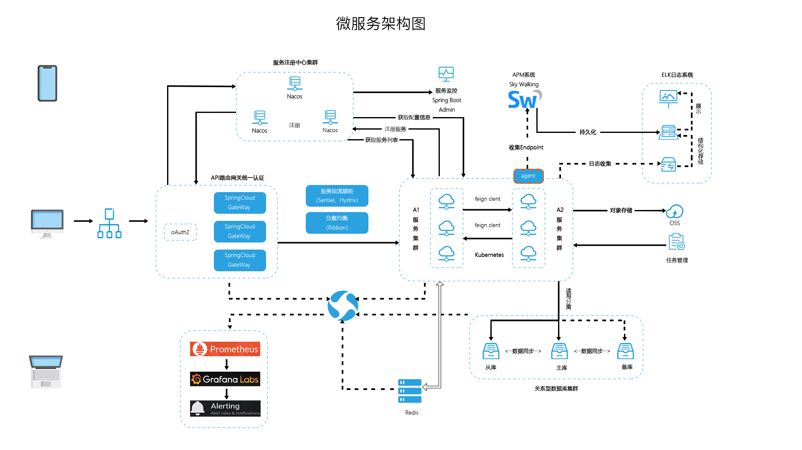

## 开发流程方案

1. 物理机运行服务：从gitlab拉代码在jenkins构建后，传送构件到部署物理机启动
2. 容器运行服务：从gitlab拉代码在jenkins构建后，推镜像到镜像仓库，运行容器

如下是一个完整的开发流水线

## 技术架构

## 基础支撑服务
根据以上规划图，规划如下需要搭建的基础支撑服务

服务名 | 常用方案 | 开源服务 | 描述
---|---|---|---
代码仓库 | gitlab | github/gitee | 公开免费，私有收费，也可用各大云服务商提供的代码托管平台 
Maven私服 | nexus | 阿里/华为镜像仓库  | nexus3也支持做docker镜像私服 
持续集成服务 | jenkins | Drone/Travis CI |
代码质量检测| sonar | 无 | 配合jenkin插件使用

## 开发环境服务

名称 | 技术 | 建议版本 
---|---|---
关系数据库| MySQL |5.7+
缓存|Redis| 3.2
消息队列|RabbitMQ|3.7.14
搜索引擎|Elasticsearch|6.2.2
NoSql数据库|MongoDb|3.2
应用容器引擎|Docker|18.09.0

## 参考资料
> - 
> - 
