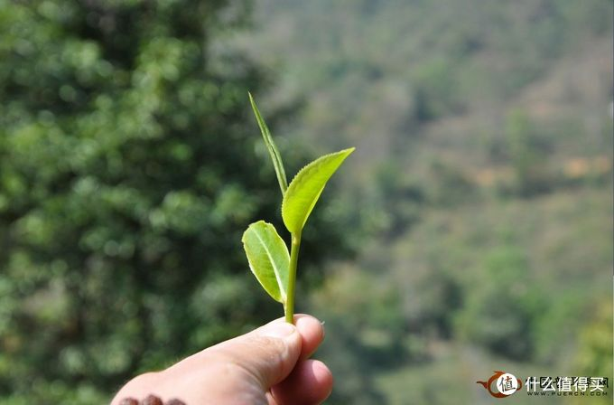
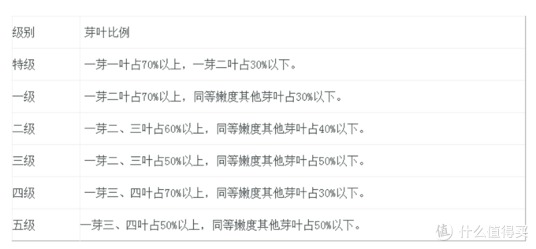

今天这篇文章就是整个系列的第一篇，主要介绍普洱茶的基本概念，大部分内容来源于书本，网络上关于[茶叶](https://www.smzdm.com/fenlei/chalei/)的知识，其实和医疗信息差不多，真假参半，也不可全信……

## 什么是普洱茶

  在《GB/T 22111—2008地理标志产品普洱茶》国家标准中，关于普洱茶的定义如下：

> 以地理标志保护范围内的云南大叶种晒青茶为原料，并在地理标志保护范围内采用特定的加工工艺制成，具有独特品质特征的茶叶。按其加工工艺及品质特征，普洱茶分为普洱茶（生茶）和普洱茶（熟茶）两种类型。

其中有几个关键词解释如下：

- 地理标志保护范围：普洱茶的产地是有限制的，在上面提到的国标中，对于这个保护范围做了非常非常详细的规定，共列举了639个乡，镇，街道办事处。
- 云南大叶种：除了茶树叶子大这个特点，本人也很难理解大叶种，中叶种，小叶种茶有什么区别
- 晒青茶：晒青茶指的是在茶叶的制造过程中，用日晒进行干燥的茶叶，作为对比，大家都知道的西湖龙井，是直接在[炒锅](https://www.smzdm.com/fenlei/chaoguo/)里完成杀青和干燥过程的，这类工艺被称为炒青。这里面的工艺区别后面会进行讲解。
-  特定加工工艺：个人理解这一条主要是针对熟茶，熟茶是毛茶经过人工渥堆发酵之后制作出来的，这个就是普洱茶与其他茶叶都不同的后发酵工艺，后面再做进一步介绍。

## 普洱茶是怎么制作的

前面通过一些定义介绍了什么是普洱茶，如何从模糊的概念定义转变为有型的茶叶实物，就要看这最重要的普洱茶的制作工艺了。在我的个人理解之中，任何一个种类的茶叶，最重要的部分就是其制造工艺，而原料、产区之类的外在条件反而不是最重要的。没有合适的技艺，就算把库利南钻石给你，你能把它做到英王的权杖上么，所以，个人认为工艺第一，其他的都得往后排，而能综合考虑各方面特点，善用个人技艺，将茶叶滋味发挥到极致的人，才可称为大师，现在那些欺世盗名的狗屁大师，真是无力吐槽

好了，不扯淡了，开始说工艺。在普洱茶从长在树上的树叶变成杯中的茶叶这个过程中，主要有以下几个步骤：

1. 采摘：  普洱茶主要依靠人工采摘，虽然都号称要采一芽二叶，但根据不同的树种，以及不同的制作要求，实际的采摘标准也各有不同。如下图是标准的一芽二叶。

2. 萎调：鲜叶采摘下来之后，需要脱水到一定程度才能进行后续的加工，萎凋就是这个脱水的过程。一般都在阴凉的地方把鲜叶摊开，自然通风进行萎凋，现在逐渐开始使用萎凋槽，更适合对大批量的鲜叶进行萎凋。

3. 杀青：在几乎所有的茶叶制作过程中，你都能听到这个词，引用一下百度百科对杀青的定义

   > 杀青，是绿茶、黄茶、黑茶、[乌龙茶](https://www.smzdm.com/fenlei/wulongcha/)、普洱茶、部分红茶等的初制工序之一。主要目的是通过高温破坏和钝化鲜叶中的氧化酶活性，抑制鲜叶中的茶多酚等的酶促氧化，蒸发鲜叶部分水分，使茶叶变软，便于揉捻成形，同时散发青臭味，促进良好香气的形成。

    简单说就是去除茶叶的草青味——割完草坪之后的那个味道，并且渐少水分，使鲜叶中的酶失去活性，减缓甚至阻止茶叶自身的发酵。

   普洱茶主要使用人工炒锅杀青，也有有滚筒式杀青机的（和干衣机差不多），杀青的过程由人工控制，包括温度，时间，茶叶的变化等，都是需要经验积累才能完成的工作，哪怕是用机器杀青，也需要人工控制其杀青程度。这也是普洱茶生茶制作过程中最重要的一个步骤，制成的茶叶的好坏与加工者的杀青技术有直接关系。
   
4. 揉捻：杀青之后的茶叶，就像你炒菜，炒出来的菜就还是原来那副模样，并没有一定的形状，所以要经过揉捻，才能把茶叶做成条索状。

   揉捻的作用也不仅限于让茶叶成型，在揉捻的过程中，植物的细胞壁受损，有利于冲泡时茶叶内质的释放，提高茶汤的口感。

   你问怎么揉？手洗衣服的时候怎么揉，揉普洱茶也就差不多一样，也有部分使用机器揉捻的，还是要靠人工判断揉捻的程度。

5. 解块：无论是手工还是机器的揉捻，茶叶都会结块，就像耳机装在口袋里，总会打结一样。在解块的过程中，可以整理条索的形状，在保证茶叶外形美观的同时，也有助于下一个阶段的干燥过程。

6. 干燥：干燥没啥好说的，解块之后的茶叶，平铺在簸箕里，就这样晒，晒足180天，不不不，不用180天，阳光好的情况下，一两天就够了。

   前面提到过西湖龙井是炒青，普洱茶是晒青，在国标GB/T30766-2014里，还有烘青和蒸青。但是这样的茶叶分类方式让我有点困惑，炒青，晒青，烘青，说的是干燥工艺，而蒸青却是杀青工艺，不过根据行业传统来分类好像也没什么错。

   这里只说干燥工艺，从字面上就很好理解了，炒青就是直接在锅里炒制进行干燥；烘青就像你用暖气片烘干衣服一样；晒青就是用太阳晒，比较受限于天气条件。

    晒干之后的原料，一般称为毛茶，毛茶已经可以直接销售——就是散茶，经过蒸压之后就可以制成饼，砖或者沱——就是大家常见的普洱茶了。

7. 渥堆发酵（仅限熟茶）：渥堆发酵，其实就和做臭豆腐差不多……只是臭豆腐已经诞生几百年了，而熟茶一般认为是上世纪70年代才完全掌握了其制造工艺。说的简陋一点，就是把成百上千斤的毛茶堆在一起，洒上水，控制好温度湿度，一般在4-6周可以完成发酵。

   听起来很简单吧，但实际操作起来，真不是一般人随随便便就能掌握这个技术的……臭豆腐几百年历史了，也不是每家的臭豆腐都能做的好吃，这一次性发酵成百上千斤的茶叶，其中的区别也就非常非常大了，怎么个区别法，后面咱们再说……

8. 蒸压成型：蒸压就是将制作好的生茶或者熟茶，经过蒸汽软化之后，用一定的模具压制成型。压制成型之后就是大家常见的饼茶，砖茶以及沱茶了。

以上就是普洱茶制作过程中的几个基础工艺，每一款普洱茶都要经历上面这些过程，才能从茶树上的一片树叶变成我们杯中的茶汤，喝茶易，制茶却真心不易，还望大家珍惜手中的那杯茶汤，跨过山河大海，穿过人山人海来到你手中，也是不容易啊

什么是普洱茶，至此应该讲的比较清楚了，希望大家看完之后能对普洱茶有一个基本的认识，在妹子面前侃大山的时候也能说个一二三出来——虽然似乎并没有妹子对这类问题感兴趣

## 普洱茶的等级

普洱茶的等级有两套标准：

- 茶菁的等级标准 
- 成茶的等级标准

茶菁就是只刚才下来未经过加工处理的鲜叶。茶菁的分级标准参照了绿茶鲜叶分级，2008版《GB/T22111-2008地理标志产品普洱茶国家标准》中做了规定。

## 常见普洱茶相关名词解释

> 七子饼

为了方便普洱茶外销而制定的标准，每件茶叶30公斤，有12筒，每筒7饼，折算下来正好357g一饼，357g差不多7两，所以又叫七子饼。

> 老茶头

老茶头是制作熟茶时人工渥堆发酵中产生的无法解散的茶块。老茶头这个名字应该是一直都有的，但以前喝的不多，随着普洱茶的火爆，也开始大量进入市场，因其独特的风味，和耐泡的特点，成为了很多茶友钟爱的普洱茶。老茶头只是发酵普洱熟茶时产生的副产品，其成因一般认为是茶叶自身的果胶以及微生物发酵产生的物质使得茶叶粘连产生的，这也从侧面反映了这一部分茶叶的内质相对更丰富，而且粘连成块之后，其内部的发酵程度与外部产生了差异，这就直接造成了老茶头独特的风味。现在在发酵过程中，可以通过对原料级别，翻堆时间，含水量的控制，人工的促进老茶头的形成，这也算是一种工艺的发展吧。

> 干仓 VS 湿仓

熟普制成后很重要的环节就是入仓存储。合理的存储条件会让茶叶持续转化。这其中，干仓和湿仓就是最经常提到的概念。

所谓干仓，是指温度、湿度适中，既常温下，通风透气，清爽无杂味，不易滋生物的仓储环境；而湿仓是指在高温、高湿下，空气对温度在80%以上，不通风透气，容易滋生物的仓储环境。字面意思理解，湿仓转化速度更快，但是遇速则不达，这样得环境容易造成茶叶中细菌的滋生，会完全破坏了茶叶纤维，改变了茶叶原有的本质，违反茶叶内质自然氧化发酵的规律，成茶自然也会有杂味。

普洱的存放很是一门讲究，要想让茶叶往好的方向持续转化对温度和湿度要求很高。湿度和温度越高转化越快但风险越高。如果普洱茶放在北京，可能几年也不会发生变化。即使是云南省境内也不全都适宜存放普洱茶，相熟的昆明茶叶从业朋友，都把茶存放在版纳思茅。

>   台地茶 VS 大树茶 VS 古树茶

**台地茶**，灌木形态，多指那些运用现代茶叶种植技术，新种植的密植高产的现代茶园产出的茶叶。它们通常树龄较短，品种较新，茶叶品质上较老树茶稍逊。

**大树茶**，乔木形态，自然生态环境成长，生长周期长，乔木特征。

**古树茶**，乔木形态，自然生长环境极佳。生长周期缓慢，茶内质极其丰富。

大树和古树有时很难区分，约定俗称的叫法是：

100年以下为小树茶

100-300年为大树茶

300年以上为古树茶

> 纯料（山头茶） VS 拼配

**纯料茶**是一个相对的概念，约束性条件比较明显，比如对于地区、茶种、或者说采摘时间等。所谓纯料指的应该是同一地区、同一品种、同一季节时间和同一的茶叶工艺手法制作的茶。普洱茶具有一山一寨、一地一味的特点。班章 冰岛 曼松 昔归....... 这些，全都是山头地名。

**拼配茶**是指不同产地、同一品质或同一产地、不同级别的茶青按照配方进行混合加工的茶叶。目前的拼配概念有五种：茶区拼配、级数拼配、树龄拼配、季节拼配、不同年份拼配。比较常见的是茶区拼配和季节、年份拼配。拼配茶其实并不低端，茶叶拼配是个技术活，对拼配师的技术要求非常高，目前拼配配方和优秀的拼配师资源都掌握在大厂手里。

这其实就是个农产品的普遍特性，就算同种类的红薯，长在不同的地理环境下味道也会不同。其实不仅地理环境不同茶的味道不同，就算是相同的地域，每一年养护情况 降雨情况等客观因素也会很大程度的影响茶叶口感。其实最有经验的茶人，也不可能仅凭两口茶汤猜出是哪个山头的茶。纯料山头茶和拼配茶，各有魅力。拼配得当也会让茶叶口感得到丰富补充，并且促进普洱茶标准化良性发展。

> 黄金叶

黄金叶，也叫黄片。是普洱茶叶采摘时一芽一叶或一芽二叶之外的第三叶。在揉捻时没有揉捻到位，条索比较疏松，杀青后这样的叶片颜色发黄绿色。这样的茶菁就成为“黄金叶”。

黄金叶价格合理，好材料的黄金叶有时会有期待以上的收获。

> 耐泡度

拿耐泡度来宣传普洱茶，也是很常见的手段，那些瞎吹15泡，20泡不淡的，在我看来完全就是瞎扯淡…标准的150ml盖碗，投茶8g，好的古树茶10泡也减弱了，15泡还算能喝，20泡就是水了，更别提那些普通原料的茶了。当然，这里的浓淡强弱是以我的口感来说的，茶汤必须维持一个浓度，才是一杯合格的茶汤，如果单纯的为了耐泡度，你每泡都是注完水就快速出汤，那泡个20泡我觉得没问题，但是那能喝出个什么味道来？所以，不要轻信耐泡度这种虚无的东西，不是耐泡就是好茶，有滋味的才是好茶。

## 参考资料

> - 
> - 
