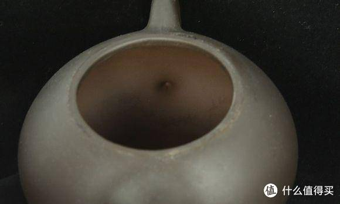
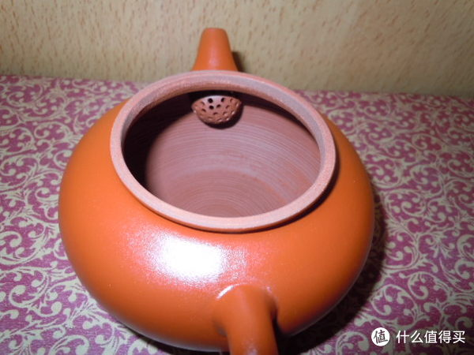

总体分为全手工、半手工、机车、手拉胚、灌浆。其中灌浆壶和手拉胚因为成形时候需要加入玻璃水等物质，或是目数非常大，成形的壶已经丧失了透气性，所以这两种成形工艺做出来的壶已经不能称之为“紫砂壶”了。

1. 全手工

全手工是最标准、最传统的紫砂壶制作工艺。同时，全手工也是最繁琐的工艺，制作一把壶快的话也要两三天。全手工做壶大概就像捏橡皮泥一样，捏一个壶出来。因为是人手操作，作品外观看起来会比较有灵性，前提是老师傅，如果是小学徒做的，那恐怕不会好看。

由于全手工壶制作时间长，因此价格相对高，800元以内想买全手壶基本没可能。

## 半手工/模具

由于全手工工艺效率低、经济效益相对差，所以制壶师傅就借助模具做壶，这种壶就是半手壶。这是目前市面上最最最常见的成形方式了，就是用两个模具，把拍打好的泥片放进去，一合，就成了，再加上壶把壶嘴，一把壶就出来了，说的是简单，但是这个还是要借助各种工具去做的，用这样的成形工艺，可以节约大量的时间，也就是说可以批量制作了，所以淘宝上大几十、大几百、甚至小几千的壶，都是用这样的方式做出来的。想要区别全手和半手，主要还是看做工细不细，因为用模具制作出来的，所以壶身会有两个接缝处，仔细看壶嘴那边，如果可以看到有两边不均匀的情况，基本就可以断定是半手工壶了。还有就是看壶的内壁，有没有推墙刮底的痕迹，一般大几十小几百的半手工壶，不会花时间做一些掩盖半手工痕迹的工序，所以很容易就能看出来，但是上千块的壶，一般都会做一点推墙刮底的痕迹出来，这个时候就要看痕迹是否自然了，不自然的话，基本也可以断定是半手工壶。总结起来就是看各处细节，壶身没有手工痕迹的，基本就是半手工壶了。 

## 灌浆

七十年代，没有机车壶的时代，为解决大批量生产，发明了灌浆技术。这种技术并不是当下的主流技术了。灌浆壶特点明显，一是泥料细；二是外壁凸处，内壁对应有凹处，比如对应壶把位置，壶内有凹陷。目前，市面上灌浆壶并不多，如果有卖的也是非常便宜，十块二十块就能买到。

## 手拉胚

在转动的轮盘上将泥拉成各种形态。给小朋友体验做陶的那种游戏，就是手拉胚。这种壶也是手工的，但不是紫砂壶传统工艺，手拉胚比起全手工难度还是要小很多很多的。市面上手拉胚的紫砂壶很少，这种工艺一般见于坭兴陶等陶壶中。

## 参考资料
> - 
> - 
