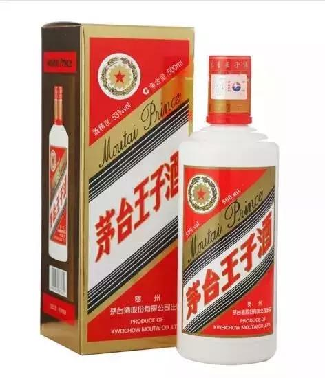
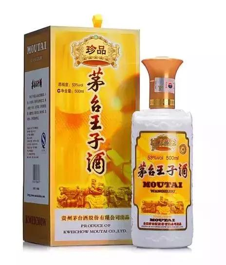
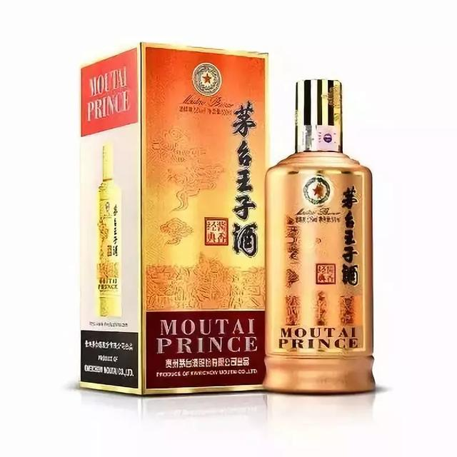
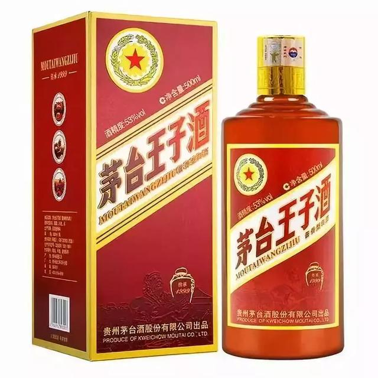
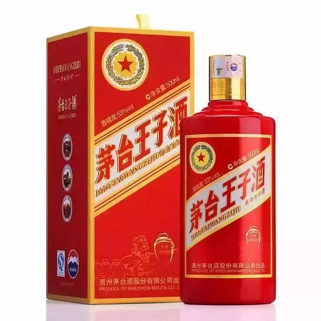
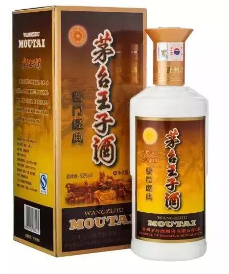
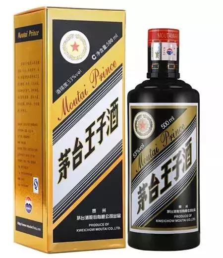
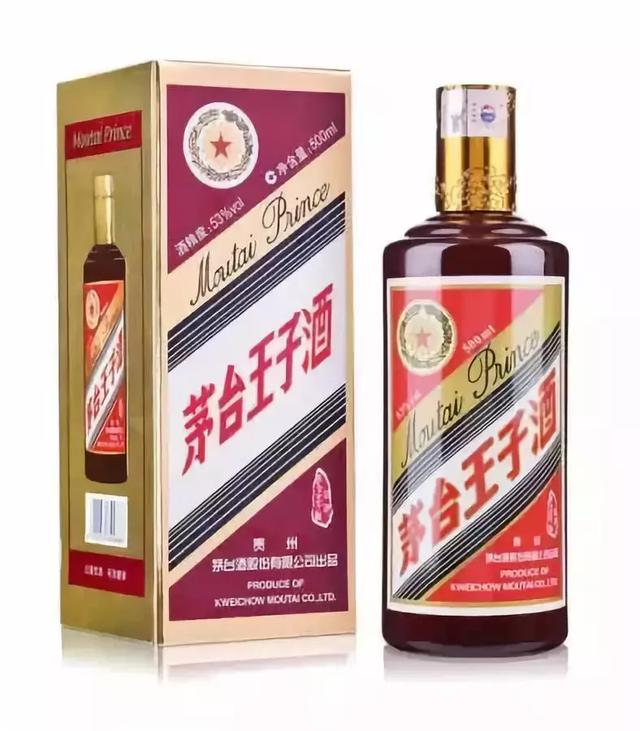
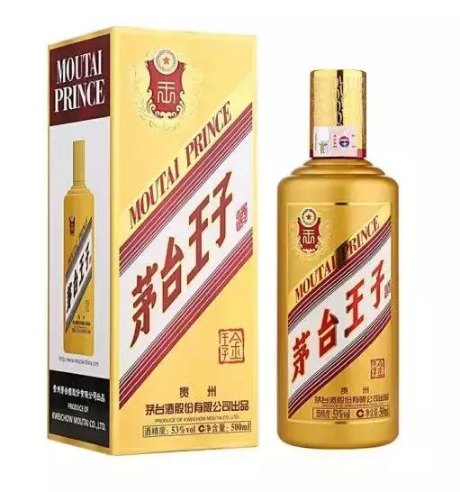
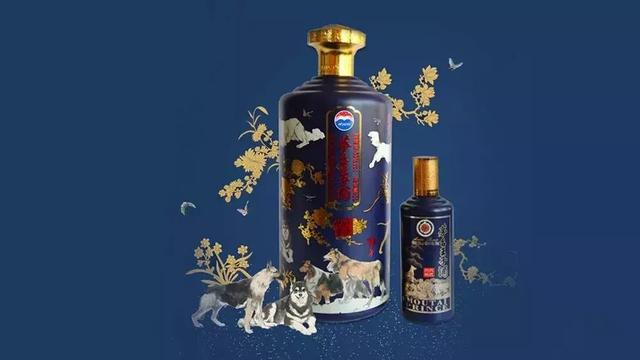

老酒鬼对茅台产品都是比较熟悉的，但是并不是茅台的所有产品酒友们有能够喝得起，茅台王子确实深得老酒友们的钟爱，虽然没有飞天的天价，但是还有点点飞天的感觉，不过只是停留在一点点。王子酒众多，看得让人眼花缭乱，很多人只能从价格上分辨哪个酒好。今天我们就说说茅台的王子们。

茅台王子酒是贵州茅台酒股份有限公司生产的53度的酱香型白酒，是面向大众的普通酒。它完全采用贵州茅台酒酿造工艺和按照贵州茅台酒质量管理标准要求，经长期贮存精心勾兑而成的酱香型白酒。同时也是弥补中低端茅台系列产品，填补其中的空缺。

| 名字                      | 价格 |
| ------------------------- | ---- |
| 茅台王子酒 （蓝标）       | 100  |
| 茅台王子酒 （普王）       | 100  |
| 茅台王子酒 金王子（金王） | 190  |
| 茅台王子酒 酱门经典       | 180  |
| 茅台王子酒 酱色           | 200  |
| 茅台王子酒 黑金           | 200  |
| 茅台王子酒 珍品（珍王）   | 220  |
| 茅台王子酒 酱香经典       | 250  |
| 茅台王子酒 传承2000       | 220  |
| 茅台王子酒 传承1999       | 250  |
| 茅台王子酒 生肖狗         | 320  |
| 茅台王子酒 生肖鸡         | 380  |
| 茅台王子酒 生肖猪         | 450  |

## **1.茅台王子酒 （普王）**

第一代茅台王子酒采用的是玻璃瓶，酒盒为金黄色，存世量不大，在此不介绍，第二代茅台王子酒才有了现在的模样，箱子和酒盒都呈黄色箱子和酒盒都呈黄色。

这批茅台王子酒为98年10月茅台集团兼并习酒后，用曾经的对手习酒酒质灌装并定名为茅台王子酒，于99年正式出品。其基酒来自于兼并习酒厂201车间（习厂一车间），201厂对外命名为“茅台王子酒车间”，包括目前建新厂（习水二郎河边）均以王子酒车间命名。

## **2.茅台王子酒 珍品（珍王）**

“茅台珍品酒”是茅台酒股份有限公司在2004年全国秋季糖酒会推出的新品，2004年王子酒细分成王子酒和珍品王子酒，从此普王酒质在原来基础上有所下降，至少降了半个等级，而珍品王子在原来普王子基础上有所提升。

到了09年王子酒从普王和珍品王子又细分出普通王子、（新品）王子、珍品王子，普通王子酒质再一次下降，而新品王子在普王子基础上有所提升。

## **3.茅台王子酒 酱香经典**

茅台王子酒（酱香经典）是2017年为开创茅台酱香系列酒营销新局面而推出的新品，官方号称茅台王子酒酱香经典在秉承了传统酿造工艺的基础上对酒质和包装都进行了升级，是具有超高性价比的酱香酒新典范。

具有酱香典雅、酒体丰满、醇和协调、回味长、空杯留香久的特点。听国酒茅台专卖店员说最接近飞天酒的一款王子酒了，似乎是王子系列出的顶配酒，但个人觉得相比珍王认可度更高，只是酱香经典瓶子包装胜于珍王。

## **4.茅台王子酒 传承1999**

传承1999是2016年推出的茅台王子酒系列的一个“重量级”产品，官方宣传是茅台王子酒的升级产品，品质更近似茅台酒风格。

据评：品三口，得以看得见“小米花”、“珍珠链”及“满天星”；评三杯，得以闻得到酒体酱香突出，空杯酱香绵长；喝三次，得以信得过入口典雅细腻，落喉醇厚顺畅，饮后舒适。但据传和传承2000一样都是经销商定制产品。

## **5.茅台王子酒 传承2000**

传承2000也是和传承1999一样为2016年推出的茅台王子酒系列，酒质和售价都低于传承1999。在包装上，采用的是茅台五星徽标。在品质上，茅台王子传承2000号称完全有超越茅台王子的趋势。

有资深酒友对茅台王子传承2000评价：“品质很地道，喝酒的人一尝就知道”，但也有酒友评价不如普王，没有酱香味，下口后太烧，很辣。

## **6.茅台王子酒 酱门经典**

由于第一批新品王子酒大概09年3月左右出来后，除了和普通王子的包装不同外，名字也是一样，区分度不明显，新出产品的意义不大，所以后面几批新品王子酒加印“酱门经典”四个字，以此区分和普通王子的不同。

因此，新品王子酒和酱门经典不但条形码相同，其实就是同一款酒不同批次而已，酒质区分可以简单理解为越早越好，比如第一批新品王子酒09年3月酒质好过第一批酱门经典。

然而，市场上酱门经典似乎更受人们欢迎，所以在零售价上酱门经典比新品王子更贵，对于喝的人来说，哪个更便宜日期更老才是硬道理。

酱门经典现已停产，停产的原因茅台王子酒“珍品”与“酱门经典”在价格上几乎相等，但是酒质的差别也不大。酱门经典与珍品王子酒的价格定位存在冲突，可能会形成激烈的内部竞争，从而导致该产品被砍掉。

## **7.茅台王子酒 黑金**

黑金王子是16年才推出的新品！官方介绍黑金王子酒是最大化满足市场对茅台酱香酒的需求，全面提升产品质量推出的新品，宣称“改款产品以黑色为主色调的外观设计显得逼格十足，让人看到之后总能够感受到一种神秘气息”。

茅台王子酒黑金的全新形象，颠覆了人们传统意识里的那个茅台形象！在我们传统认知里，似乎白瓶茅台才是正统，其他都是异类。但很多茅粉反馈，"黑金不苦还带有麦香气"、"甜度略大、尾苦轻"、"不如酱门经典"，虽然褒贬不一，但是既然是新出的，那应该要比酱门经典好点儿。

## **8.茅台王子酒 酱色**

酱色和黑金基本算是同一个等级，推出的时间也差不多，但酱色的口碑似乎比黑金要好一些。

部分茅友这样评价到：酱色勾兑上相当于珍品王子的简化版、比普王口感更浓郁、酱色比黑金口感更好、酱色味道更醇、送人选黑金，自己喝选酱色......

其实，黑金是茅台经销商定制版，酱色王子才是茅股直接控制的。但酒质是一样。

## **9.茅台王子酒 金王子**

金王子于17年12月在山西朔州举行了新品发布会上上市。目前关于这款酒的评价很少，知名度较小。这款酒茅台在外观做了很大提升，令许多女性消费者爱不释手。

## **10.狗年王子酒**

茅台王子酒（戊戌狗年）酒精度53度，分为5L装和500ml装两种规格。而这两种规格的王子狗中，5L装王子狗更是格外受到市场的喜爱。

王子狗5L装，共10斤，与其外盒以及瓶身上的画作“十全十美”相互呼应，其画作“十全十美”是由国画大师范曾老先生亲自画作，画中以“十犬”寓意“十全”，以十种花朵寓意“十美”，整体合为十全十美！另外，此款酒由音乐才子郎朗亲情加盟代言，这也给此款酒增添了更多的艺术细胞。

作为和贵州茅台酒酿造是同样员工，同样生产流程的茅台王子酒，无论是在口感还是酒质上都是一款与贵州茅台酒极其相近的，甚至坊间有言语称茅台王子酒是最接近茅台酒的一款系列酒。

## 参考资料
> - 
> - 
