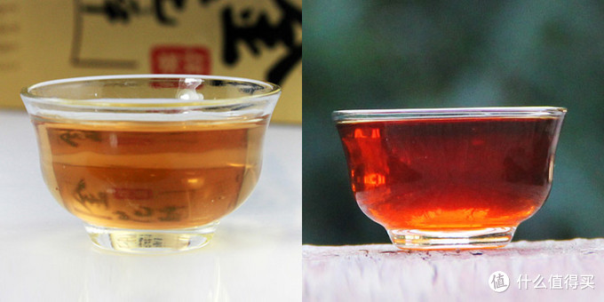
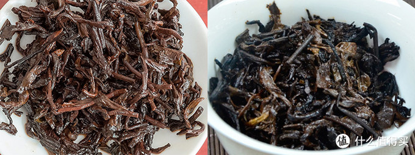

普洱熟茶是以毛茶为基础经过人工渥堆发酵制作而成的，虽然说起来就是一句话的事儿，但其实熟茶的制作工艺却是在1970年代才被人工掌握的，而直到今日，优质熟茶的制作依然是一门真正的技术活，不是字面上的渥堆发酵一下那么简单。通过人工发酵技术，可以使制成的普洱熟茶获得与陈化多年的老生茶相媲美的口感滋味，但要注意的是，熟茶和老生茶并不能划等号，因为它们经历的发酵过程不一样，其内含物质的变化也明显不同。

一般提到发酵，大家的理解应该都是豆腐制成臭豆腐，牛奶制成酸奶这一类的微生物发酵，但**在茶叶的制作工艺中，发酵一词有两种含义**。

一种是指茶叶中的多酚类物质在酶的作用下产生氧化聚合作用，是一种茶叶内部的酶对茶叶内其他物质的氧化反应。白茶，乌龙茶，红茶的发酵属于这一类，个人将其称为氧化发酵。其变化形式类似于切开的苹果或梨，一段时间就会变色。

还有一种就是上面提到的微生物发酵，即日常概念中的发酵，黑茶，普洱茶，黄茶属于这一类。

> 普洱熟茶和其他茶叶的区别

常有人说熟茶就是红茶吧，虽然两者汤色和叶底的颜色有时会很接近，但**两者的香味和滋味都相去甚远**。而从工艺上来说的话，在上一部分的介绍就能看出来，是两种完全不同的发酵过程，所以熟茶和红茶是完全不同的两种茶。

 在国标GB/T30766-2014的茶叶分类标准中，普洱熟茶被分类为黑茶，但黑茶和普洱茶的发酵过程还是有不同的，黑茶从鲜叶到制成成品，是一个连续的过程，在初揉之后直接渥堆发酵，发酵之后还会进行复揉，而且其发酵时间较短；普洱熟茶则是在制成毛茶之后，再进行其人工发酵过程，发酵过程长达4-6周。通过茶汤颜色的比较，也可以分辨出两种茶的区别，此处对比新生产出来的两种茶的汤色,左图是黑茶，右图是熟茶。

> 普洱熟茶的越陈越好

熟茶的诞生，就是以模拟生茶长期陈化之后的效果为目的的，所以**熟茶已经是经过快速陈化之后的茶叶**了。但是在人工渥堆发酵的过程中，除了茶叶发酵的味道，还会产生一些不太好的味道，比如常说的堆味，火味，甚至霉味，这其中一部分是工艺原因，但也有一些是工艺无法避免的味道，所以**刚渥堆出来的熟茶，是不适合直接做成产品出售的**，基本都要进行一段时间的存放之后才能制成成品进行出售。在这个过程中，不仅可以减弱甚至消除发酵时产生的异味，茶叶本身也会继续自然发酵，使茶性更趋于平和稳定，进一步增进茶汤的滋味和口感。而随着年份的增长，自然发酵的不断进行，熟茶还会发生更进一步的转变，但因其内含物质在经过发酵之后已经发生了大量的变化，所以其变化过程较生茶更缓慢，其滋味也会从浓醇渐渐转变为一种“无味至味”的感受，这个就有一点玄学的味道了，在你喝过这种真正有年份的熟茶之前是很难体会到的，与新出厂的熟茶有非常大的区别，滋味也是不同的。

## 1. 发酵工艺

一次渥堆发酵的毛茶量不会低于1吨（传说中的一些小堆发酵可能在一两百千克），发酵过程中损耗率高达20%到30%，整个发酵过程更是长达40天以上，这样的制作条件，**对于资金和人工都是有要求的**，并不是你买了一堆茶就能发酵出熟茶来。有一些发酵熟茶的人是抱着碰运气的态度去做这个事情的，毛茶堆在这里堆个四五十天，出来的茶是什么样就什么样了，毕竟微生物的事情，你能和它去讲道理？运气碰的多了，才慢慢的有了经验，有了经验，才能去开发技术来控制碰运气的事情。怎么才能多碰运气呢，当然是要多发酵茶叶了，而可以长期大批量发酵熟茶的厂家，毫无疑问，只能是以大益为代表的大厂家了。据说大益现在已经进化到了第三代发酵技术“黑马”，对于整个发酵过程已经实现了基本控制，在发酵过程中，人占到了更主动的位置，而不是微生物。至于业内的其他厂家，在熟茶发酵工艺这一块敢出来和大益叫板的还真没见过。淘宝上那些什么元发酵，小堆发酵，竹筐离地发酵，真的能叫工艺？只是商业宣传而已，真要拉出来比品质比稳定性，那还不得把底裤都输光。

既然发酵工艺大益一枝独秀了，那其他厂家还玩啥呢？刚也讲了，给自己的工艺取个名字，说自己有多认真多努力，是一种玩法，但成品的品质并不稳定，有好有坏。另一种玩法就是强调发酵的原料，比如号称用古树原料来发酵，损耗率前面也说了，再加上古树原料的成本问题，很多厂家只能用小堆发酵来降低发酵的成本，但小堆发酵的可控性比传统大堆发酵差远了，真要发酵出品质还行的熟茶来，难上加难，你说这真要发酵出一点能卖的茶叶，得卖多少钱一饼。

## 2. 拼配工艺

前面讲的都是发酵的工艺问题，接下来讲一讲拼配的工艺问题。生茶篇中讲过，茶叶的不同部位，其特性是不一样的，而发酵是一个集体行为，为了避免发酵过程中因为原料的差异而导致的发酵程度区别，一般会先将原料分级归类再进行发酵。发酵出来的茶叶，不同级别的滋味是不同的，而且发酵度也会存在区别，为了使最终的产品获得更好的滋味，就必须要对不同的原料进行拼配，这一步对于熟茶滋味的影响，仅次于发酵工艺。而拼配工艺的掌握，比发酵还难，所以一饼熟茶要好喝，**工艺和原料相比起来，工艺比原料不知道高到哪里去了**。

现在生茶流行纯料，拼配方面的研究不太多，有些商家的拼配更只是单纯的为了降低成本，样子好看，味道过得去就行。熟茶的拼配就更少了，要做拼配，首先你得有那么多原料可以来拼吧，不是大点的厂家谁有那么多存货，其次是拼配的师傅，没有经验也做不了。所以小厂家小品牌的熟茶基本是发酵出来是啥样就啥样来卖了，比起大益之类的厂家来说，少了拼配的环节，滋味必然是有缺陷的。

 说到这里，对于怎么选熟茶，大家应该有一个初步的印象了吧，**大品牌的产品是入门首选，感觉自己已经入门之后，再去尝试其他家的茶叶吧**。

拼配这里有一个内容要单独说一下，就是**关于什么叫洒面，包芯和一口料**，这部分内容生茶也同样适用。高等级的原料芽头和嫩叶较多，视觉上看起来比较漂亮，而级别较低的粗老叶包括叶梗则无论是颜色和外形，都不那么好看。所以在普洱茶的压制过程中，自古以来就有以高等级原料洒面的传统，目的就是为了好看。但一个饼面只有正面会进行洒面处理，背面就还是真实原料的样子，如果两面都洒，就变成了包芯，不是为了好看，而是为了掩盖原料级别低的事实，与作假无异。一口料就是不进行洒面处理，正反，里外都一样。下图所示就是常见的洒面，饼正面使用高级原料保证了美观，饼背面则是实际的原料。

## 3. 冲泡前的辨别

和生茶一样，熟茶的饼面也以条索肥硕紧实，色泽，大小均匀为佳。干茶颜色，芽头是金黄色，其余的叶梗都以红褐色为主，如果色泽发黑，或者花杂，都是不好的。但要从外观直观的判断熟茶的好坏，除了饼面发霉，明显的发黑，有异物之类的，基本看不出个好坏，所以大概看一下就好，熟茶主要还是靠喝来判断。

外型上熟茶和生茶有一个最大的不同，生茶一般原料级别都较高，要求老叶片也就是黄片的比例要尽量低一些，一个是为了口感，一个是为了饼面的美观，所以老叶片太多的生茶是不太好的。但熟茶有时候会故意拼配一些老叶片甚至叶梗，比如洒面那张图的饼面的背面，就有可见的粗老叶片和叶梗，主要是为了提高茶汤的甜度，这时候老叶片的出现不一定代表茶叶不好，还是要靠最后的滋味来判断，这就是熟茶拼配工艺的重要性。

## 4.  熟茶的叶底

熟茶的叶底，可以看出一个茶叶的发酵程度，发酵程度越深，叶底的颜色也越深，正常发酵程度的熟茶，叶底应该是红褐色的，发酵程度低的会偏绿色，发酵过重的则会变为黑色，甚至出现碳化的情况。现在有一些产品就是专门以轻发酵来制作的，所以也不能说发酵度低就是不好，毕竟也是一种新的口感，好坏还要看市场的接受程度，但如果发酵过度，叶底明显发黑甚至碳化，那就肯定是不好的了，谁愿意喝一股碳味的茶。熟茶的叶底以柔软、肥嫩、有光泽为佳，如果有腐烂的情况，肯定是不好了，多半是发酵工艺的问题，没救。

左边的原料级别较高，几乎没看到叶梗，发酵度稍低，呈不是很深的红褐色，但整体比较匀整，发酵程度也比较统一。

右边这个，有黑色，褐色，甚至绿色，必然是发酵工艺不成熟，发酵堆中的茶叶发酵不均匀才会发生这种情况，而从整体发黑的情况来看，已经发酵过度了。

## 5. 茶汤、滋味和香气

在熟茶的发酵过程中，造成茶汤苦涩味的茶多酚含量大幅下降，这就降低了茶汤的刺激感，基本消除了茶汤的苦涩味。[氨基酸](https://www.smzdm.com/fenlei/anjisuan/)的含量也是下降的，所以熟茶的茶汤也就失去了鲜爽的滋味。原本存在在细胞中的胶质物质被分解为水溶性的果胶，加大了茶汤的浓稠度。糖分的变化目前还有争论，但从经验上来说，原料级别越低，熟茶的茶汤越甜。

综合来看，熟茶茶汤的基本特点就是几乎没有苦涩感，同时有一定的浓醇度，入口顺滑。颜色方面，红浓明亮是熟茶的标准，就是要求茶汤颜色是红色到深红色，同时有一定的粘稠度，色泽通透明亮，不能浑浊，前几泡轻微的浑浊对于新熟茶来说也是允许的，但不能持续。

以上就是一个熟茶茶汤的基本要求，但说实话，这实际是一个非常高的要求。前面讲工艺的时候就说过了，发酵工艺很难掌握，也就直接造成了成品可能会存在各种缺陷，**常见的问题主要是茶汤浑浊，颜色发黑，没有粘稠度，有一些还有苦涩味，甚至出现酸味怪味**。

香气方面，一般都说熟茶的茶香是以陈香为主，但这个陈香是什么香呢，肯定不是一支一支的那种香，这个**陈香个人觉得是一种定义，就是纯正的发酵味，不夹带任何异味的纯正的发酵味**。看淘宝的肯定很熟悉，什么陈香初显啊啥啥的，其实就是经过适当的存放，发酵过程中产生的异味已经消除殆尽，只有纯正的发酵味了。关于熟茶的茶香还有枣香，樟香，参香，桂圆香等，更加的难以描述，总之就是别有异杂味就行了。

## 选择建议

说了那么多，到底如何判断一个熟茶的味道正不正常呢，只有祭出大益7572了，对普洱茶熟茶感兴趣的朋友，一定要从大益7572开始喝，无论是价格还是品质，7572都是业界标杆。在掌握了7572的滋味之后，再去尝试其他熟茶吧，不然入门就歪了的话，以后也很难救回来了。

先岔一句解释一下**7572这一串数字是什么意思**，前两位数字是这个配方的创始年份，第三位数字是原料的综合等级，最后一位数字是茶厂的编号——1是昆明茶厂，2是勐海茶厂，3是下关茶厂，4是普洱茶厂，7572即是指勐海茶厂以7级料按75年的配方生产的一款茶。普洱茶比较出名的几个配方还有7542，7581，8653，也是同样的命名方式。有些饼的批次是1601，也就是2016年生产的第一批。

有些纸盒包装，里面的茶叶可能会吸附纸盒的味道，所以要及时把茶叶拿出来，不能一直装在里面，绵纸包装没事。

## 谈小青柑

最近整个茶叶市场都被“小青柑”三个字刮起的台风席卷了，从普洱熟茶的小青柑，到白茶小青柑，甚至正山小种小青柑等等，说实话，我不知道是在喝什么，喝了好多不同厂家的熟普小青柑，除了橘子皮的味道，我真没喝出个所以然来。但可能问题就在这里，大家喝到的都是橘子皮或者是陈皮的味道，也就忽略了茶的味道，至于茶怎么样，反而不重要了。再看小青柑，动辄10块甚至20块一颗，一颗就是一泡，按茶叶的重量折合下来都达到了1000元/千克以上的价格，这样的价格放在任何茶叶上面，其品质都不会太差了。广东地区一向有做柑普茶的传统，但都是**以茶为主，冲泡时加一点陈皮的碎块，以陈皮的香气配合普洱的滋味**，是挺好喝的。但现在的小青柑，真的除了陈皮味就再无其他了，而一些劣质的茶叶，也借着小青柑的外壳，身价倍增，长此以往，是不是茶叶的工艺就不重要了，添加剂加点味道就行？

市场总是在追逐热点的，07年普洱茶的暴涨暴跌就是前车之鉴，没有过硬的基础，再美也只是空中花园。希望大家在买茶的时候理性选择，提升自己的品鉴水品，从自己的口感和需求出发，才不会成为市场的接盘侠

## 参考资料

> - 
> - 
