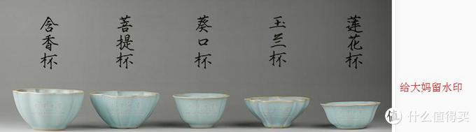
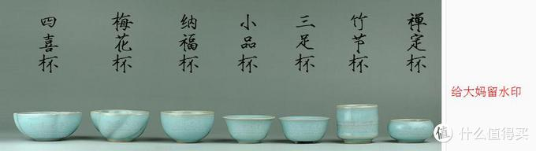

汝窑，中华传统制瓷著名工艺之一，中国北宋时期主要代表瓷，五大名窑之一，因产于汝州而得名，窑址在今河南省宝丰县大营镇清凉寺村，汝瓷位居宋代“汝、官、哥、钧、定”五大名窑之首，在中国陶瓷史上素有“汝窑为魁”之称。

因为汝窑在宋代历史中，只烧制了20年左右，然后就因为战乱而消逝，而在烧制的这些年中，汝窑的供应也仅是对皇宫大内，只有挑拣出不要的残次品，才允许出售。所以现存的宋代汝窑制品，据说只有六十七件半，这一说法有很大争议，有的学者说应该在300-500件左右，不论是哪种说法吧，反正真正的汝窑是非常稀少的，所以才有了那句“纵有万贯不如汝瓷一片”的说法。现代工艺下的汝窑产品各具特色，也有接近于宋代的，但是都只能称之为“仿汝窑”。

不过说“仿汝窑”还是不太方便，为了方便编辑，下文就直接称之为“汝窑”了，所以朋友们不要见怪。

现代汝窑主要产地大致分为三类，一类为台湾艺人、陶瓷工作室烧制，因为当地胎土含铁较高的原因，常见铁骨胎质，类似于哥窑的“紫口铁足”。这些汝瓷，器形较精美，釉面多为亚光，温润程度各有不同。一类为内地仿制的，该类仿汝窑品质不一，各色均有。常见的有广东恒福旗下的东道汝窑，“璡”字款等私人窑口，以及河南汝州出产的仿汝瓷。另一类为介于哥窑和汝窑之间的青瓷仿汝，常见的有青瓷兰庭、御赏青瓷，该类瓷质介于哥窑和汝窑之间，釉面不玻化，同时又没有釉面的气泡。

在汝窑烧制的过程中，有一句话叫做“汝窑无大器十窑九不成”，足可见成品率和烧制的困难，当然在现代工艺的帮助下，成品率也不是没有提高，根据烧制师傅说，手工制品，一级品的成品率大概在17%左右，提高的好像不是很多呢。

## 支钉烧

支钉烧，宋代少数瓷窑使用的一种支烧工具。汝窑、官窑、哥窑等多用支钉支烧，其状呈山字形、上尖下圆，在圆形垫饼上有不同数量的支钉，也有只有一个支钉的。用支钉支烧的瓷器，底部都留有细小支钉烧痕。汝窑支钉痕最小，呈香灰色；官窑、哥窑支钉痕稍大，呈铁黑色。

## 天青釉

天青釉，瓷器釉色名。又名雨过天青，是一种幽淡隽永的高温兰色釉，我国古代陶书描写的青如天，明如镜，正是这种釉色特点的形容。有钧窑天青，始于宋，呈淡蓝色，釉层厚而不透明，以铁的化合物为着色剂。另有宋汝窑天青，是一种淡淡的天青色，色调较稳定，多数釉面无光泽。还有景德镇窑天青，始于清康熙，呈淡灰蓝色，釉薄而坚，莹润光洁，以钴的化合物为着色剂。

## 满釉支烧

满釉支烧，是指在底部挂满釉的器皿使用支钉方式烧制瓷器方法。满釉支烧瓷器在晚唐开始烧造的。因为釉在高温时候熔融，经化学变化后变成硬度高的半透明玻璃质物质，如果挂满釉直接入窑烧制，一定会使器皿粘在窑里，造成无法拿取下来，所以以前的器皿底部是不挂釉的。后来人们为了使底部挂满釉，就发明了支钉以便解决这一问题。釉也粘支钉，但是支钉毕竟面积小，待出窑之后，用东西敲下去就行了，所以底部满釉的器皿通常会有支钉痕迹。

## 杯子器型

## 参考资料

> - 
> - 
