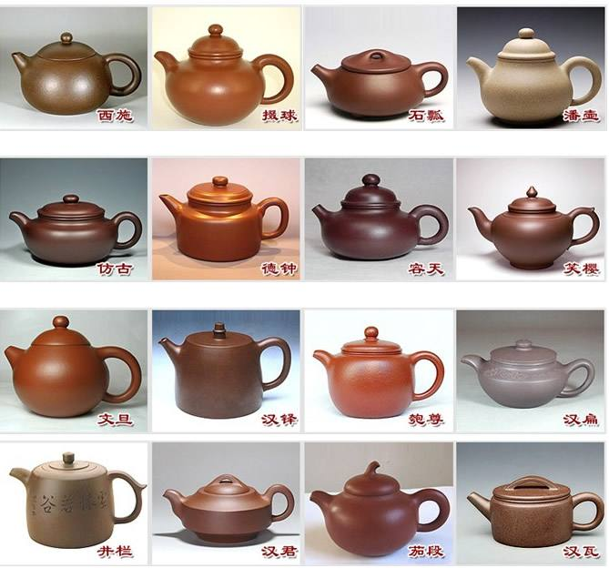

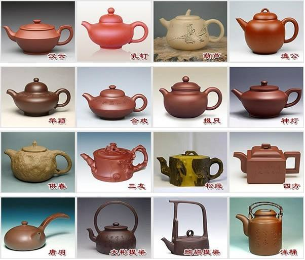

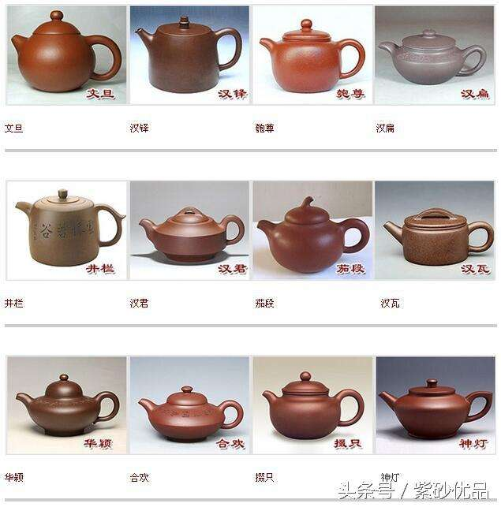

## 1. 西施壶

原名西施乳，言壶之形若美女西施之丰乳，流短而略粗，把为倒耳之形，盖采用截盖式，壶底近底处内收，一捺底，后人觉“西施乳”不雅，改称“倒把西施壶”。

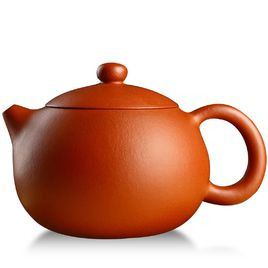

## **2. 掇球壶**

掇(duō)，落起来的意思,掇球,落起来的球。掇只是大亨原创，掇球壶是典型的几何型传统圆壶式，也是最优秀的紫砂壶代表款式之一，它的基本造形是壶钮，壶盖，身壶，由小中大三个顺序排列的球体组成，壶腹为大球，壶盖为小球，似小球掇于大球上。故称掇球壶。

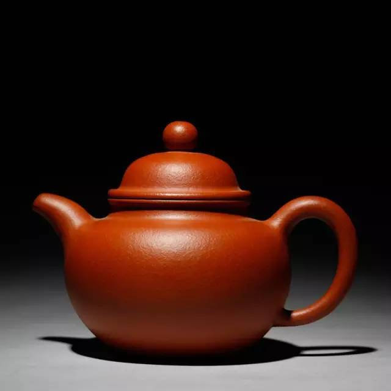

## **3. 石瓢壶**

“石瓢”最早称为“石铫（diào）”，“铫”在《辞海》中释为“吊子，一种有柄，有流的小烹器”。从留传于世的石铫壶看，至陈曼生、杨彭年时期，已有了很大的变化，“曼生石铫”主要特色是上小下大，重心下垂，使用稳当，壶嘴为矮而有力的直筒形，出水畅顺，壶身呈“金字塔”式，观赏端庄。那么，紫砂“石铫”何时称“石瓢”呢？这应从顾景舟时期说起，顾引用古文“弱水三千，仅饮一瓢”，“石铫”应称“石瓢”，从此相沿均称石瓢壶。

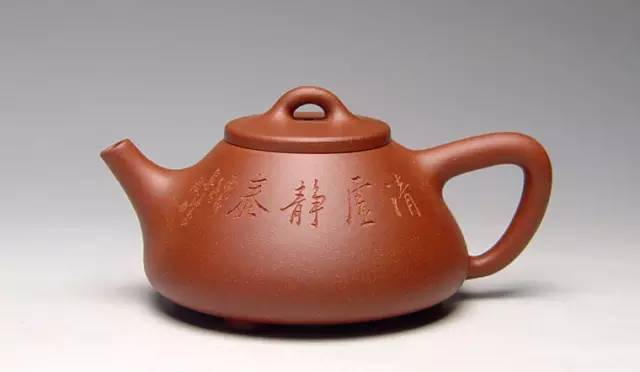

## 4. 潘壶

据《阳羡砂壶图考》记载，潘仕成字德畲，为清道光广东番禺人。由于潘氏家传素嗜饮茶，便在宜兴订制专属砂壶，一则自用，一则往还馈赠。潘氏订制的砂壶形制固定，且惯于将印款落于盖沿之上，壶底及他处反而不落款，所用印款均为阳文篆字“潘”印。由于潘氏声名远播，世人乃将此一形制称为“潘壶”。壶腹作扁柿形者，曰“矮潘”；器身稍高，近扁球形曰“中潘”；器身高，近梨形者，是为“高潘”。

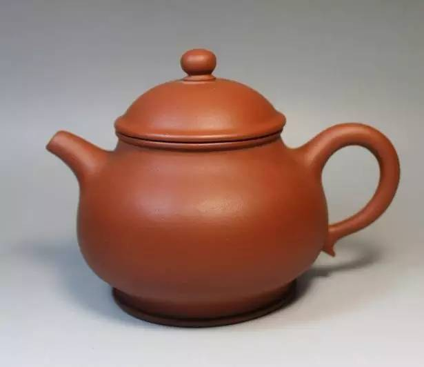

## 5. 仿古壶

一说清代邵大亨初创,原意是壶体仿照鼓型，后人仿制做这种壶形就成了仿古代壶型的意思了。另说最早见于近代赵松亭按吴大徴授意所作,身扁、腹鼓、颈高、盖板平滑，壶盖与口沿子母线吻合严密，合成圆线饱满，扁钮有力，虹钮有势，二弯流胥出自然 ;圆圈把匀势而起，有些款把圆下有垂，富于灵动，整体骨肉亭匀，收展有度，有一气呵成之畅。

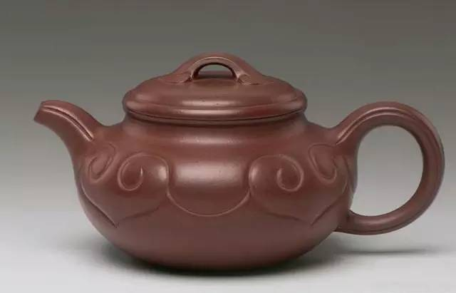

## 6. 德钟壶

容量： 180cc ，原矿底槽青， 也有不带刻绘的。 【底糟青】名泥，产于江苏宜兴黄龙山系，紫泥原矿大致可分：头糟青、二糟青、底糟青等三类，本名泥产于紫泥最底层，质量之佳，为历代陶人推崇之首，亦为数百年来经典名器，及已故顾景舟大师最锺爱之名泥；此泥矿名称，因宜兴产地方言沿用已久，为恐溷淆，故用其音直译文字，以“底糟青”名之。

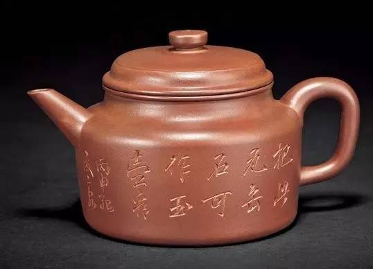

## 7. 容天壶

取材于源于佛教中的大肚罗汉，取名源于“肚大能容天下事”。中国工艺美术大师吕尧臣首创，早期作品壶形偏低，后来壶形较高。要体现此壶的气韵的确很难，需要做壶之人用心体会。在气韵饱满的壶身上添加一微微矮颈,壶盖增高成半球状,平添拙朴童趣。出水效果极佳，用起来确实方便舒适。视觉上稳重大度，在质朴中见深厚。

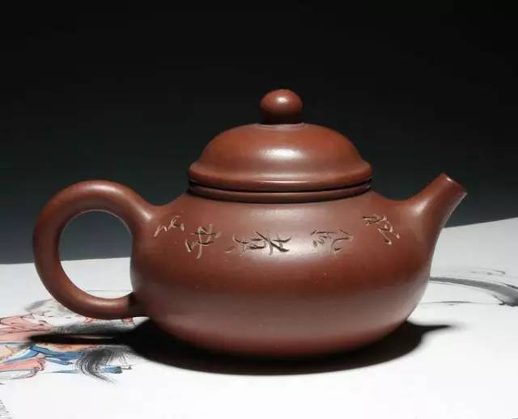

## 8. 笑婴壶

笑樱壶是紫砂壶中的经典壶型之一，流传甚广，皆因其张力十足，为人所喜爱。看外表也许你会觉得平淡无奇，但由于形体轮廓，结构比例，尺度的细部处理安排得当，恰如其分。据说“笑樱壶”的造型原是出自“婴宁一笑”的历史典故“婴宁一笑千愁解”。笑樱壶以交融而又谐调之态漫流的几种色彩，恰如“婴宁一笑”，表现出传统文化中的“君子和而不同”的精神内质。

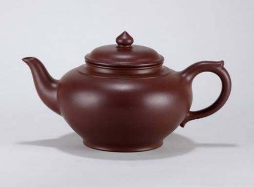

## **9. 文旦壶**

文旦创于明未清初，形与西施、贵妃壶相近，后两者为清中末后所创，重玲珑娇秀，前者则重古拙，这也与当时艺术审美注重相关。清代文人吴梅鼎曾经称赞文旦壶说：“至于摹形象体，殚精毕异；韵敌美人(美人肩)，格高西子(西施乳)。”是啊，在文人的眼中，文旦壶的韵味风格堪比美人之肩，柔若无骨;又似西施那动人的曲线，丰神绰约，俊俏天成。

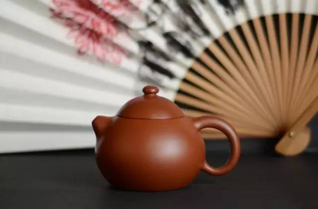

## **10. 汉铎壶**

汉铎，即汉朝之铎。汉铎，即汉朝之铎。《说文》中对铎的解释是：铎，大铃也。它是器物的名称。具体地说形状有些像甬钟，但体积小。梅调鼎(1839—1906年)字友竹，号赧翁，慈溪人，长期在慈城居住。有人称赞他是清代书法家中成就最高的一位。其为之作铭的汉铎壶可算是目前在紫砂历史上最据研究价值的汉铎壶了。

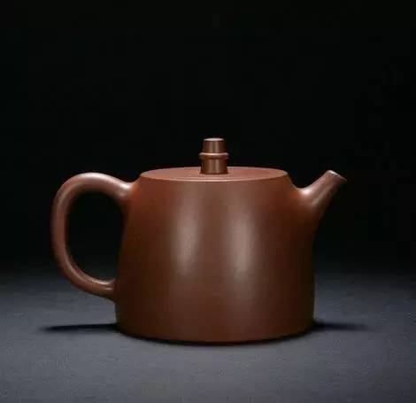

## 11. 匏尊壶

《说文》：“从包从瓠。包,取其可包藏物也。”按“瓠”(hù)，葫芦，一种圆大而扁的葫芦，即匏瓜。匏尊：以干匏制成的酒器。苏东坡《前赤壁赋》的“驾一叶之扁舟，举匏尊以相属。” 一代大文豪苏东坡的黄州生活和“匏尊”的命运，何其相似？紫砂“匏尊”壶的形象，创意来自这种有苦意的匏瓜。陈曼生设计的十八式中有四款壶是有关匏瓜的，经典的“匏尊”壶，就是他“匏壶”的升华。

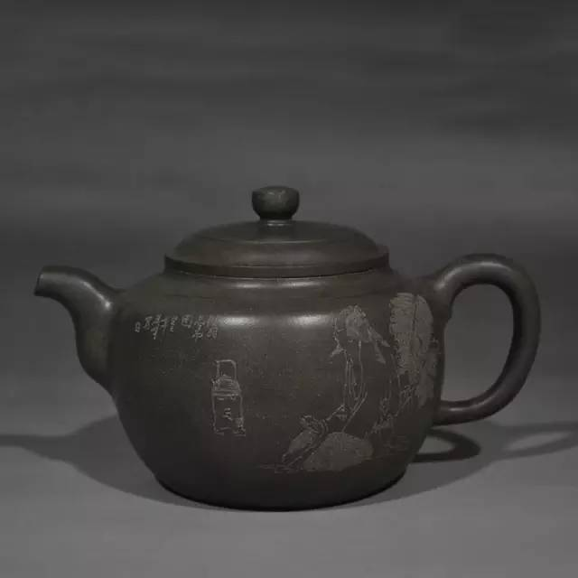

## 12. 汉扁壶

形体扁圆,底部圆韵而丰满,肩有圆棱,口与肩平滑舒展,平盖,盖边饰反弧线,扁圆钮,形成大小对比。腹肩口产生曲折刚劲的张力。大平盖稳住架势。嘴微曲,大把向外拉出,嘴侧肩与把侧形成一条气贯全壶的流线,相互呼应,生动而自然。壶质朴大气。

## 13. 井栏壶

顾名思义，其造型源于井栏。“井栏”一词，传统文化中多见，如“命理之学”中有“井栏”一格，陈式老架二路太极拳谱第四十一式为“回头井栏直入”。实际生活中的井栏即井之护栏，亦名井床，井干。古人掘井多置井栏，有的还置井盖，井顶，井亭，它们即可护井，又能起到美化环境作用。

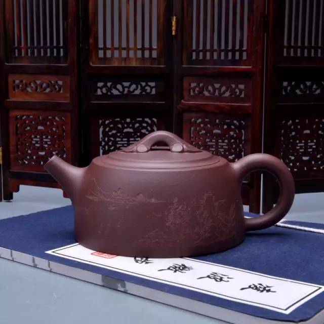

## 14. 汉君壶

汉君壶是六十年代初，紫砂陶趋于低谷时所制，为大众服务之茗壶，至今比较珍贵。汉君壶曾以商品大量涌现，现一壶款，由于壶艺家学养不同，所制器物差别甚大，有失之毫厘，差之千里之感。汉君壶原似曼生扁石壶之式，清末民初为平盖汉君壶，基本定型。

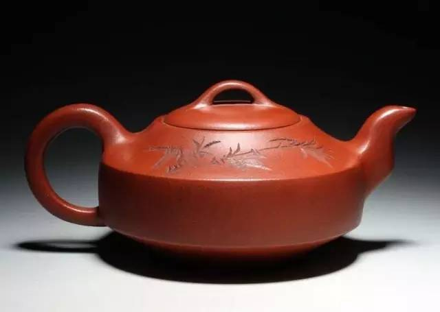

## **15. 茄段壶**

茄段壶，造型灵感来自枝头成熟的茄子，若要达到较高的艺术表现力，最佳须使用特级紫茄泥。以茄蒂为壶纽，生动有趣；气度饱满，将张力处理在欲破不破之间；流、把的呼应自然顺畅，静动如一。壶面充分表现出紫砂的种种优越属性，色泽暗淡沉朴，如紫水晶深邃，如古玉温润。

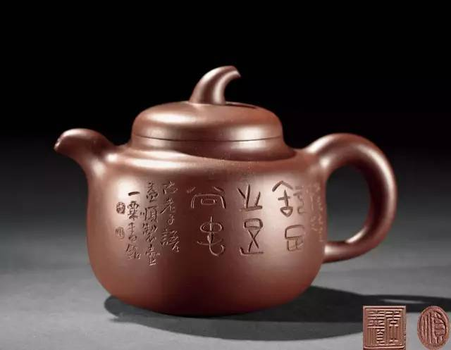

## 16. 汉瓦壶

汉瓦属于圆器当中的一种，历来多位艺人都有仿制此种款型，而之前杨彭年的一款汉瓦壶却给人留下深刻印象，是圆筒形壶体，上侈下教，短流势较直。盖平略见弧，桥式钮，钮面阴刻海棠纹样。泥质坚结，砂色暗红。壶盖子口制作圆而不规，转捻即紧，拈钮可以翕起全壶。

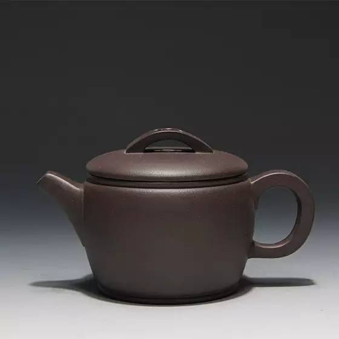

## 17. 美人肩壶

美人肩紫砂壶宛如古代女子端庄可爱，带点宫廷的雍容华贵，又不失大家闺秀般的妖娆。造型饱满，大方得体，以体现圆润的壶身为主，壶盖与壶身仿佛合为一体，没有空隙，用手抚摸上去，能感受到它的温暖。美人肩作为传统器型是由清代的老作品演化而来，是一款经典器型，同一种器型在不同的工艺师手里能够表现出不同的神韵与气韵来，以古代美人的肩线及丰腴美妙的曲线，幻化出动人心弦的壶形。

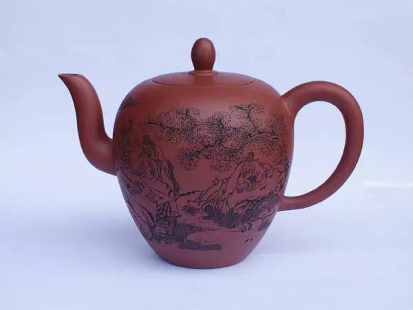

## **18. 牛盖莲子壶**

直腹圈足，阔口出唇，短弯流，环状柄。平盖，宽带拱形钮犹如牛鼻，牛盖莲子故此得名。制作此款作品老师都会精心选用精品泥料，牛盖切合紧密，整体清秀敦厚，胎质细腻，色泽典雅。“牛盖莲子壶”为裴石民先生六十年代于宜兴紫砂厂所创制，遂成紫砂壶中的经典之作，发展至今仍是一款不可超越的经典。

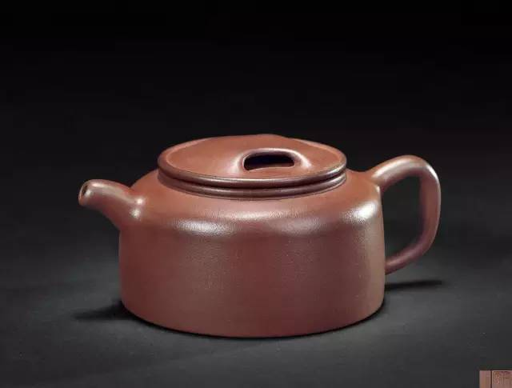

## 19. 秦权壶

秦权：秦统一六国后统一了度量衡，“权”就是用来称量重量用的秤砣;“秦权”壶就是仿其外型。谁最早创制了秦权壶，无从得知。但晚清梅友竹与韵石合作，一如当年陈鸿寿与杨彭年的传奇。紫砂题铭，直追曼生，神采翻飞。“载船春茗桃源卖，自有人家带秤来。” 桃源卖茶，以壶为秤。充满了想象的意境和潇洒不羁的情趣。秦权为壶，气度泰然，刚正不阿。光面古拙中意象万千，顾老更是将秦权做成了素器的巅峰典范。

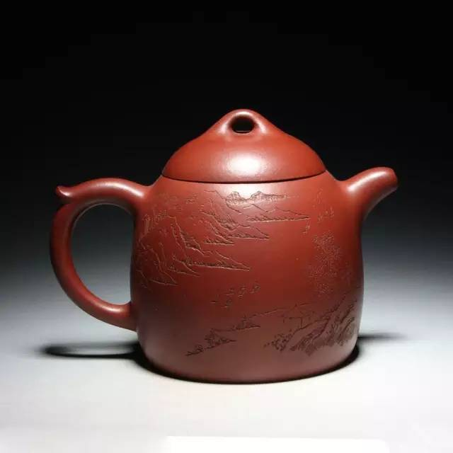

## 20. 柿圆壶

柿圆壶以柿子为型,表现了制壶者对成熟之秋的感怀,也表现了制壶者对柿子以硕大红润之果实来报答自然的赞美。

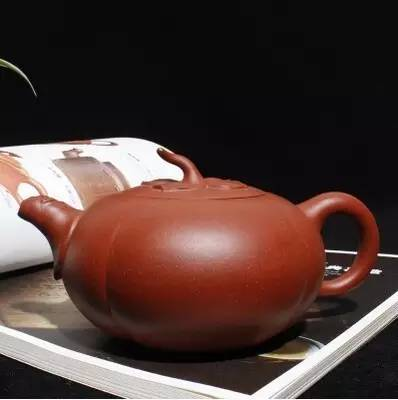

## 21. 如意壶

呈铁栗色，表面细润，是以优质紫砂泥制作。壶身呈莲子式，平肩高颈，压盖微穹，三弯嘴粗大，把环而方，扁珠状钮，为典型清中期手工制作特征。加底向内包卷，大平底，做工精细，形制敦实古朴。

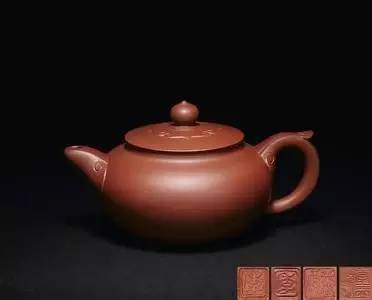

## 22. 乳鼎壶

“乳鼎壶”，壶体简洁腴润，线条流畅而富有张力，体现了乳鼎壶的含蓄美，壶盖与身截成一体，壶钮、嘴、把采用暗接过渡，整壶更显秀润雅致，充分的体现了紫砂的特质。乳鼎有时候又被称之为“玉乳”，与乳鼎不同之处在于底为平底，无三足而立，依然显得端庄典雅，不失风韵！

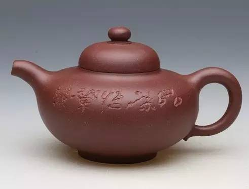

## 23. 书扁壶

为明·时大彬制。为紫砂壶形制中少见的极扁造型，艺趣盎然，也是早期紫砂壶几何形体造型的代表作品。线面屈曲和谐，寓潇洒于纤巧中，形虽扁而气度却昂，刚柔相济，是时壶中的神品。泥质是较粗的调砂，经烧成后，粗而不糙，粗犷中豪气盎然，这种选料，反映出紫砂的特有肌理，乃时大彬偏师出奇之佳作。时壶刻款是仿唐代欧阳询的书体，铁划银钩，笔力劲道，是鉴定时壶真伪的依据之一。

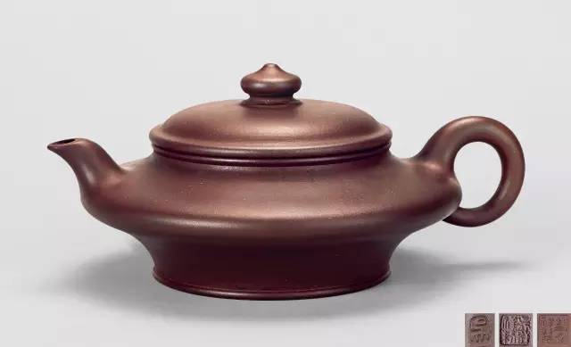

## 24. 传炉壶

传炉壶，式度端庄，风格雅致，隐隐然有古风韵，堪称佳品。老子曰“大象无形，大巧不工”。制壶赏壶，到了极致就是看其气度，观其神韵。至于细节的处理到显得不过尔尔。传炉壶的特点正是如此！传炉壶有着青铜器般的威严与稳重，它古朴典雅，曲线强劲有力，浑厚端正。是方中有圆，圆中寓方的典范，要想做得比例恰当、珠圆玉润，骨肉廷均实属不易。

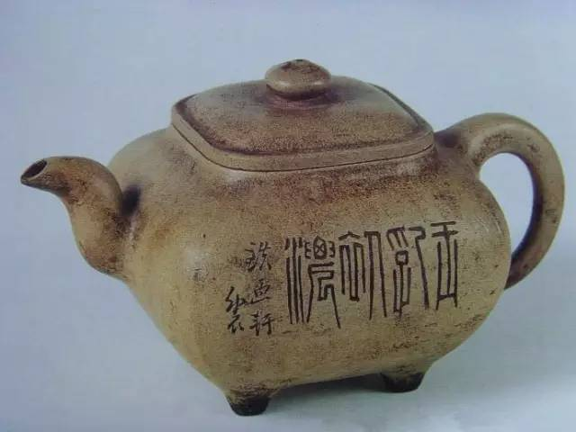

## 25. 一粒珠

一粒珠造型古朴，古韵盎然，庄重又不乏新意，典雅大气又不失阳刚之气，造型惹人喜爱。一粒珠如西瓜的壶型，可以使人清心安静，来洗涤尘间烦躁的心情，原因在于有句话如是说：若瓜时，辄偃卧以瓜镇心。但一粒的造型又如同一颗珍珠般珠圆玉润，饱满而剔透，壶身一大珠，壶钮一小珠，如同“母子珠”般形影不离。然无论型如哪种造型，一粒珠大度豁达的造型以及其细腻精致都是一样的。

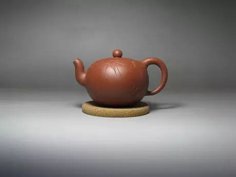

## 26. 玉乳壶

紫砂壶的一种。 壶以紫砂老拼紫泥为材质，紫而不姹，细润如脂，整器以玉乳为名，造型圆润充实，以曲线构成主体形式，自壶钮、盖、身、底脚，没有硬性的折线和角，显现球形大小均衡适度的节奏感。一弯嘴、圈把、截盖与口吻合，扁钮至脚线与主体造型紧密呼应，触觉舒适，具有很强的形式美感，尤其是形态流线的掌握，优柔曲折如小泉流水，妙哉妙哉！

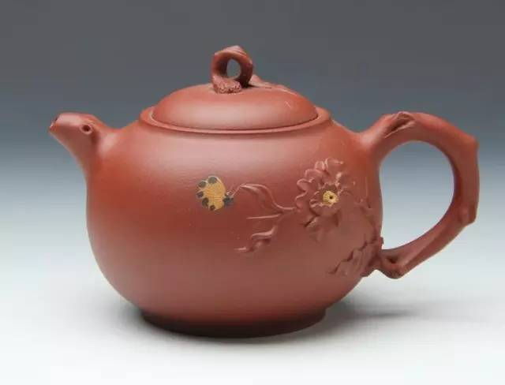

## **27. 钟鼎壶**

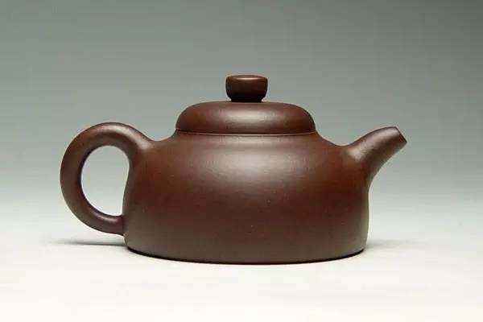

## **28. 君德壶**

“君德式”乃因明季壶工张君德而名。呈鼓腹矮梨形，三弯流朝天，圆环把，截盖圆珠钮，捺底，底款以行书刻满篇“诫子书”。此壶以细密青灰砂制成，胎薄均匀，制作精巧，刻款流畅，窑烧火候得宜，手感顺滑，十分讨喜。晚清时期，东瀛煎茶道盛行，外销日本的紫砂茗壶类颇为畅销，但满刻名篇文章之甚为少见。

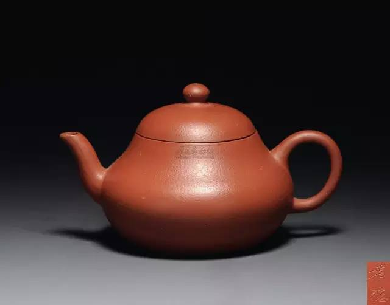

## 29. 巨轮珠

“巨轮珠”壶，以壶型简洁著称，壶流均为炮管直流，大都为小品壶，有多种款式。壶型圆润而敦厚，与泥料相得益彰，充分体现出了古朴的美。炮管流，出水有力，水流如柱，气势磅礴！

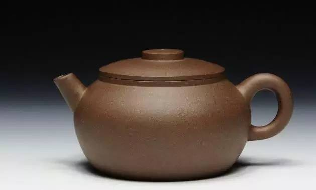

## 30. 思亭壶

早期的思亭壶，壶嘴曲度较小，流口简练，以竹刀落款于盖口墙沿，笔致尚称工整；年代稍晚些的思亭壶，风格柔美，曲线明显，流口较尖，署款则各式皆备，有竹刀写刻，也有钢刀双钩刻，罕见钤印者。思亭壶式以其俊秀高雅，留名于朱泥陶史。闽南俗谚：「一无名，二思亭，三孟臣，四逸公」。思亭排名优于孟臣，有可能是思亭壶式俊挺，伫立茶船之中，有若蟜龙昂首，气韵出众。

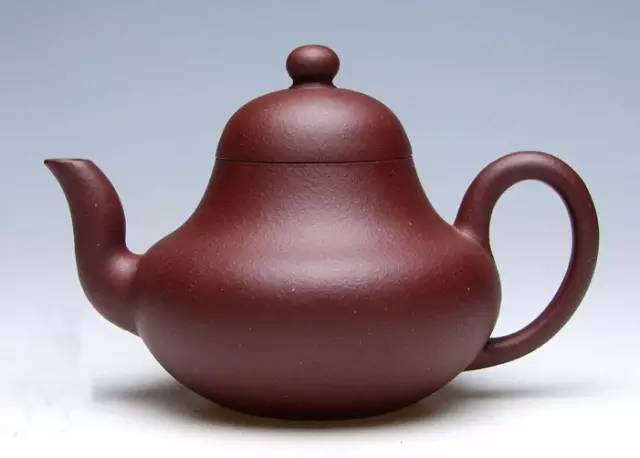

## 31. 线圆壶

线圆壶是一款经典器型，作为圆壶中的经典，被不断的效仿和演绎，圆壶一直是紫砂艺人所忠情的一种器型，而圆器又是由不同方向不同曲度的曲线组成，讲究的是珠圆玉润，比例协调，隽永耐看。

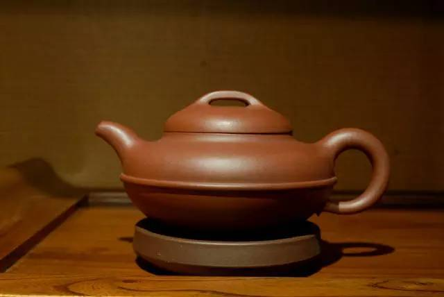

## 32. 龙胆壶

龙旦壶（龙蛋壶）是紫砂壶器型中的经典一类，其圆滑可爱的造型深受壶友喜爱。作品做工小巧精致，壶身通体为蛋状，壶身光滑圆润，短嘴为直流状，倒把拿捏方便，扁圆珠纽。关于龙旦壶的起源，有这样的记载，清代吴鼎梅《阳羡茗壶赋》：“圆者如丸，体稍纵，为龙蛋。”这是最早的龙蛋壶式。龙旦壶的造型是取于蛋型。

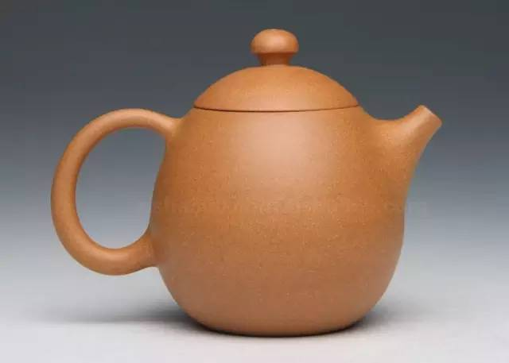

## **33. 汉云壶**

汉云壶是紫砂壶中比较具有另类特色的器型，为顾景舟原创壶式，是改良传统经典壶式别具匠心的巅峰之作，汉云壶壶身光素无纹，纯以造型的优美取胜。壶以圆形线条为主，束颈，折腹外鼓。肩部凸起线条，延伸至壶嘴，与把手在视觉上保持了平衡，上小下大的两个倾斜块面突出中间线条的优美，使之过渡到壶嘴上成为阴阳分割之界，连接到壶把上端下沿，充分体现“线”的美感，使整个造型简练而又挺拔。

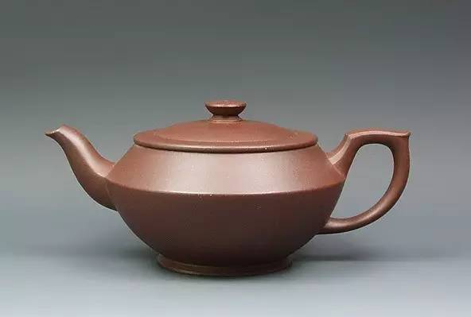

## 34. 乳钉壶

乳钉壶为"曼生十八式"之一，由杨彭年作壶、乔重禧刻铭，此为仅见。黄泥壶能似此壶坚洁亦属罕见。这是本山绿泥与紫砂泥对等相配制，古时用石磨粉碎加工，泥质稍粗，故砂质隐现似花岗石。杨彭年与陈曼生合作，对诸传器均有独到之处，尤其是形态流线的掌握，优柔曲折如小泉流水，与大彬之皇皇重器，好比一钟一笛，各臻其妙。

## 35. 葫芦壶

葫芦壶是曼生十八式中的一款，深得艺人们的喜爱，更是玩家的收藏佳品，时下最珍藏的便是杨彭年制的套环钮葫芦壶。壶体设计新颖。造型呈葫芦状，壶流短直而微向上翘，把成半环形，盖顶设有套环钮装饰。整器形制的线条以浑圆为主，十分流畅。

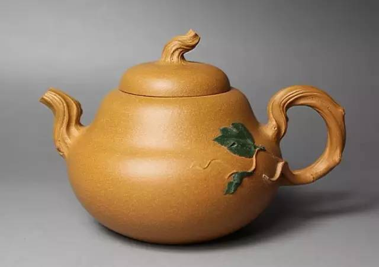

## 36. 逸公壶

逸公清乾隆至嘉庆年间人。制壶工巧，大壶古朴可爱，小壶亦佳。其书法楷、行、草齐备，楷书尤有唐人遗意。镌刻或飞舞。或沉着。非干嘉后辈所逮也。 在本期年代末，也有名列‘四大名壶’的‘逸公壶’出现。

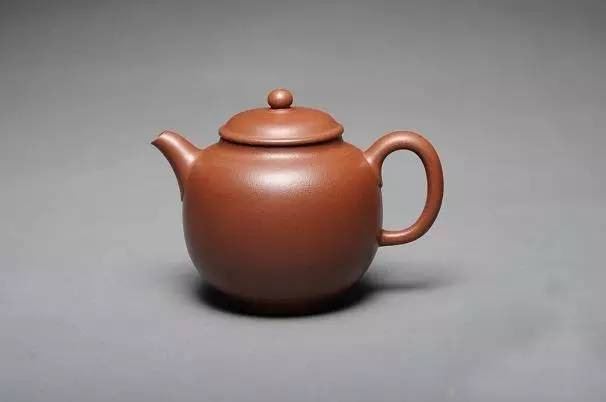

## 37. 华颖壶

此壶是顾景舟先生根据传统壶体演变所创作品，名为华颖。在古字中没有“花”字，“花”为后世字，故而古时“花”亦用“华"”代之，华颖的“华”意为“花”，华颖所表达的意境为：招展的花意。作品摘手圆、盖圆、壶身圆、三圆垒叠在圆壶底上，分外精神，遥望犹如花苞初绽。从“掇球”变形而来。

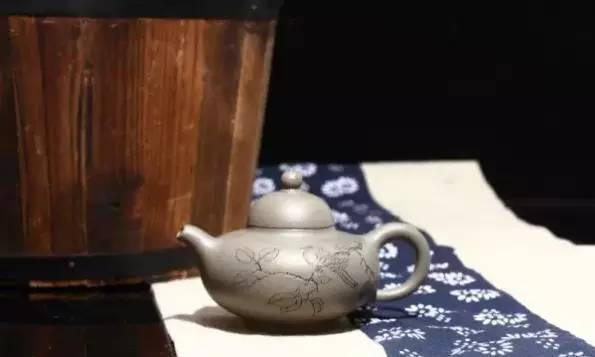

## 38. 合欢壶

曼生在溧阳为官，上任伊始，便遇到运送“白芽”贡茶上京之重任。曼生不敢怠慢，征集、挑选、包装，命人昼夜兼程，送往京城。终如期而至，龙颜大悦。消息传来，曼生及其幕客好友皆欣喜。曼生设宴以贺。席间，曼生一时兴起，挥毫泼墨，写下“八饼头纲，为鸾为凤，得雌者昌”之墨宝。好友郭通提议，何不造壶以载此喜，曼生喜不自禁。大镲凹凸有致，合则响，合而美。曼生有感于大镲分分合合，奏响人间欢乐，遂以合镲为样，合欢为名，设计出合欢壶，以朱泥造之，通体大红，富含吉祥与幸福之意。此壶极富天趣，取皆大欢喜之意，适用于节庆、祝福聚会之场合以添乐趣。　　

## 39. 掇只壶

“掇只”是紫砂壶造型中特有的一种壶型，造型像是把许多球状和半球状堆积到一起，由于掇在汉语里有连缀堆叠的意思，因此，这种造型的壶被称为掇只壶。《宜兴县志》中记载的掇只壶之所以价值连城，一个重要原因是它出自宜兴制壶大师邵大亨之手。

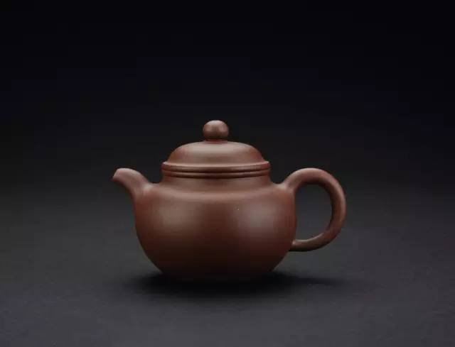

## 40. 神灯壶

泥质细腻，色泽极美，整款壶形如神灯，刚柔之意融入神灯这款传统壶型中，更具意境。光洁圆润、典雅喜人，对立面均衡，顶钮、虚盖、直颈、敛肩、鼓腹，线条疏朗。口、盖、沿、钮几近完美。

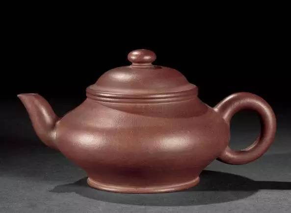

## **41. 供春壶**

供春壶造型古朴精工。温雅天然，质纯薄坚实。负有盛名。供春之壶，胜于金玉。周澍《台阳百咏》：“最重供春小壶，一具用数十年，则值金一笏。”传世的供春壶极少。1928年，储南强在苏州搜集到一把供春壶，壶把的款识“供春”二字，缺盖，后由裴石民配做。现藏北京历史博物馆。 供春所制砂壶，款式不一，相传他制作过“树　瘿”、“龙　蛋”、“印　方”等壶式。其中以“树瘿壶”最名贵。清末民初，仿制品甚多。供春树瘿壶简称供春壶。

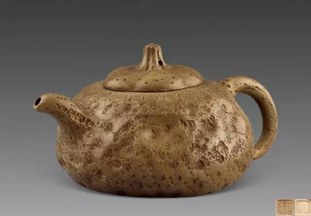

## 42. 三友壶

借鉴松、竹、梅题材来表达个人的感情和思想，圆形壶身似竹筒。此壶壶形、色、工各方面均独树一帜。其形注重意，其色重真，其工细兼精，造形艺术突出。

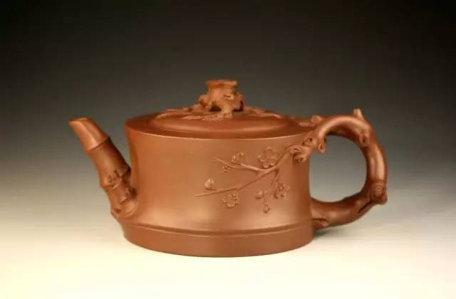

## **43. 松段壶**

泥色呈古老苍松树皮质感，造型以松段一截做壶身，结构极严谨，比例合理协调，整体气势古朴。树皮斑驳苍劲，松枝虬蟠其上，针叶写形亦写意，形意俱佳。壶嘴与把手均以老松枝塑成，质朴古雅，挺秀有神，形象逼真;壶盖为嵌入式，口盖紧密无间，盖呈不规则形，有年轮效果。

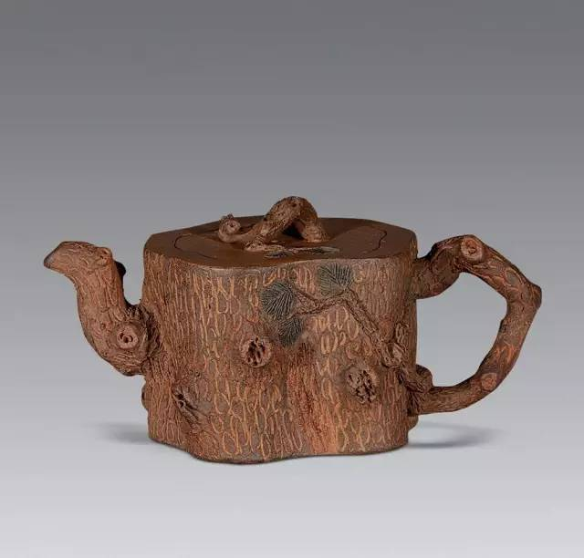

## 44. 四方壶

四方方器作品形体优美，工艺严谨，气韵生动，造型古朴，技法独特。整体壶行透露出豪爽、刚劲、正直的阳刚之气;比例准确，口盖紧密平整，块面挺括，线条利落，气势挺拔，力度到位，其工艺水平毫不逊色于其它造型。

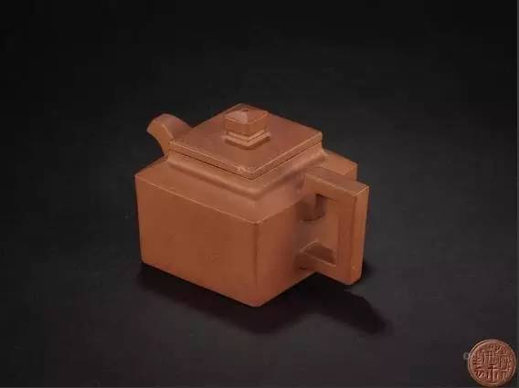

## 45. 唐羽壶

《唐羽壶》为光素器形，为创新系列作品中经典之佳作。创作构思源于唐代宫廷中的羽觞壶，它的造型与之非常贴近，须知，唐人饮茶并非今日沏茶，而是用类似如今沱茶样的茶团和茶饼研碎放入壶中，文火之上慢慢煎煮。有点类似现在煮咖啡。因而壶的手柄一般都较细长，似有羽翼飞升之感。他的创意也可以诠释为唐代陆羽之壶。手中把玩似有拉回时空，重温唐风，再现历史的美妙感觉。

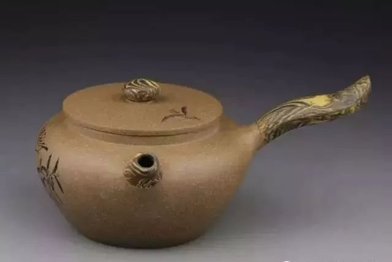

## **46. 大彬提梁壶**

粗看很不起眼！大彬提梁身筒成较大且丰满的扁球形，上部圆环状提梁粗大，六方三弯嘴，六瓣平扣钮，压盖，圈底，溜肩，素身。再看耐人寻味！身筒以实托虚，圆环以虚带实，上下两个圆弧构成的虚实对照，达到了视觉上的微妙平衡，整体上让人感觉气势雄健，浑然一体。所谓“周接四海之表，浮于元气之上”。三看惊为天物！大彬提梁如佛趺坐，清风朗朗。

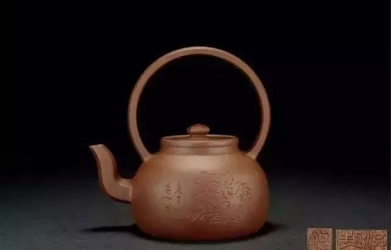

## **47. 鹧鸪提梁壶**

这把提梁壶的造型为扁圆形壶身,把手为见棱见方的三柱高提梁,从侧面望去犹如一只飞翔着的鸟儿的头部。原创者顾景舟大师为其命名“鹧鸪提梁壶”。顾老晚婚，需五十才与比他小十一岁的徐义宝结婚，仅共同生活了不到二十年，徐患鼻咽癌，越过这个鬼门关几乎无望，顾景舟预感到妻子此病的凶险，仿佛听到了鹧鸪“行不得也，哥哥”的凄惶叫声，从而在这只外型仿鹧鸪鸟的壶身上寄托自己凄血哀号。

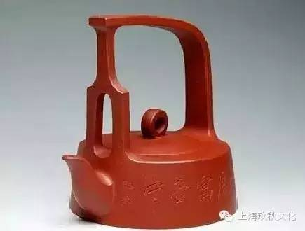

## **48. 洋桶壶**

紫砂洋桶壶是紫砂茗壶名种里较为常见的一种款式，亦是一种茶壶款式的专用名称。紫砂洋桶壶自清末民初创制以来，以其造型简练，使用方便，是宜把玩，便于提携，便于茗泡而一度盛行，并为大多数茗壶爱好者接受，嗜好、收藏而成为紫砂光货素器类经典传统作品之一。俞国良、汪宝根、储铭、顾景舟、何道洪等等艺人，无不为紫砂洋桶壶的流行发展作出了较大的贡献。

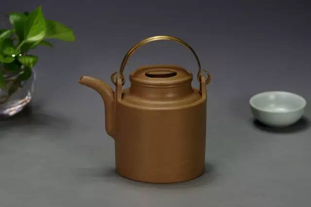

## 参考资料

> - 
> - 
