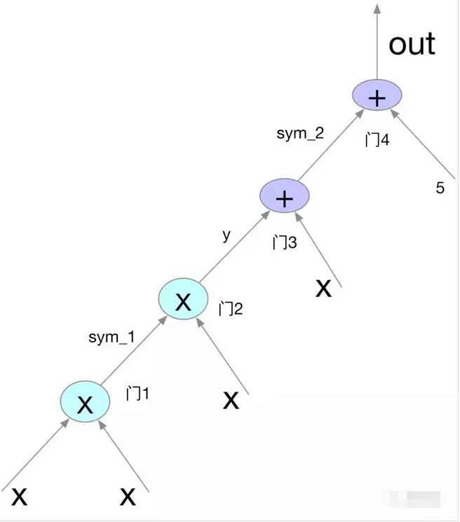

## 零知识证明例子

关于零知识证明，概念并不难理解，我们以一个老掉牙的故事作为例子。

阿里巴巴被强盗抓住，为了保命，他需要向强盗证明自己拥有打开石门的密码，同时又不能把密码告诉强盗。他想出一个解决办法，先让强盗离开自己一箭之地，距离足够远让强盗无法听到口令，足够近让阿里巴巴无法在强盗的弓箭下逃生。阿里巴巴就在这个距离下向强盗展示了石门的打开和关闭。

这个整个过程就是零知识证明，证明者能够在不向验证者提供任何有用信息（石门的口令）的情况下，使验证者相信某个论断（阿里巴巴知道打开石门的方法）是正确的。

当然，现实生活中类似的应用有很多，大家可以参考[阿里巴巴的零知识证明](https://songshuhui.net/archives/36968)或者[零知识证明](https://baike.baidu.com/item/%E9%9B%B6%E7%9F%A5%E8%AF%86%E8%AF%81%E6%98%8E)。

在计算机世界里面，零知识的应用场景就更多了，例如我们常用非对称加密来做身份认证，验证方只要使用公钥解出自己提供的随机数，即可证明被认证方的身份，不需要其提供自己的私钥。

以上例子都是针对特定场景的特定方法，比如说石门不是通过口令控制而是通过实物钥匙控制，这个方法就不可用了，是否有一个通用方法去认证任何事件呢？

## 术语介绍

- **SP - Span Program** ，采用多项式形式实现计算的验证。
- **QSP - Quadratic Span Program**，QSP 问题，实现基于布尔电路的 NP 问题的证明和验证。
- **QAP - Quadratic Arithmetic Program**，QAP 问题，实现基于算术电路的 NP 问题的证明和验证，相对于 QSP，QAP 有更好的普适性。
- **PCP - Probabilistically Checkable Proof** ，在 QSP 和 QAP 理论之前，学术界主要通过 PCP 理论实现计算验证。PCP 是一种基于交互的，随机抽查的计算验证系统。
- **NIZK - Non-Interactive Zero-Knowledge**，统称，无交互零知识验证系统。NIZK 需要满足三个条件：1/ 完备性 (Completeness)，对于正确的解，肯定存在相应证明。 2 / 可靠性 (Soundness) ，对于错误的解，能通过验证的概率极低。3/ 零知识。
- **SNARG - Succinct Non-interactive ARGuments**，简洁的无须交互的证明过程。
- **SNARK - Succinct Non-interactive ARgumentss of Knowledge**，相比 SNARG，SNARK 多了 Knowledge，也就是说，SNARK 不光能证明计算过程，还能确认证明者 “拥有” 计算需要的 Knowledge（只要证明者能给出证明就证明证明者拥有相应的解）。
- **zkSNARK - zero-knowledge SNARK**，在 SNARK 的基础上，证明和验证双方除了能验证计算外，验证者对其他信息一无所知。
- **Statement** - 对于 QSP/QAP，和电路结构本身（计算函数）相关的参数。比如说，某个计算电路的输入 / 输出以及电路内部门信息。Statement 对证明者和验证者都是公开的。
- **Witness** - Witness 只有证明者知道。可以理解成，某个计算电路的正确的解（输入）。

## 什么是zkSNARK

`zkSNARK` 是 `zero-knowledge succint non-interactive arguments of knowledge` 的简称，全称里面每个单词都有特定的含义：

- **Zero knowledge**：零知识证明。
- **S**uccinct：证明的数据量比较小
- **N**on-interactive：没有或者只有很少交互。
- **AR**guments：验证者只对计算能力有限的证明者有效。拥有足够计算能力的证明者可以伪造证明。这也叫 “计算可靠性”（相对的还有” 完美可靠性”）。
- of **K**nowledge：对于证明者来说在不知道证据（**Witness**，比如一个哈希函数的输入或者一个确定 Merkle-tree 节点的路径）的情况下，构造出一组参数和证明是不可能的。

零知识证明大体由四部分组成：

- **多项式问题的转化** - 需要证明的问题转化为多项式问题 t (x) h (x) = w (x) v (x)，证明者提交证明让验证者确认多项式成立。
- **随机挑选验证** - 随机选择验证的数值 s，验证 t (s) h (s) = w (s) v (s)。相对于验证多项式相等 t (x) h (x) = w (x) v (x)，随机挑选验证，简单，验证数据少。随机挑选验证，安全性肯定不及多项式等式验证，但如果确实足够随机，安全性还是相当高的。
- **同态隐藏** - 同态隐藏指的是函数的一种特性。输入的计算和输出的计算保持 “同态”。以加法同态为例，满足如下的三个条件的函数 E (x)，称为加法同态：1. 给定 E (x)，很难推导出 x. 2. 不同的输入，对应不同输出 3. E (x+y) 可以由 E (x)，E (y) 计算出来。乘法同态类似。
- **零知识** - 证明者和验证者之间除了 “问题证明与否” 知识外，不知道其他任何知识（不知道随机挑选值，不知道挑选值的多项式计算结果等等）。

零知识证明由四部分组成：多项式问题的转化，随机挑选验证，同态隐藏以及零知识。需要零知识证明的问题先转化为特定的 NP 问题，挑选随机数，设置参数，公布 CRS。证明者，在求得证据的情况下，通过 CRS 计算出证据。验证者再无需其他知识的情况下可以进行验证。

## **NP 问题以及约化**

解决一个问题需要花费时间。

- 多项式复杂度：如果解决问题需要的时间与问题的规模之间是多项式关系，则可以称该问题具有多项式复杂度。

  

一般问题可分成两类：**P 问题**和 **NP 问题**。

- P 问题：指的是在多项式时间内可解的问题。 
- NP 问题：Non-Deterministic Polynomial Problem，非确定性多项式问题，指不能在多项式内可解，但是可以在多项式时间内验证的问题。

很显然，P 问题也是 NP 问题，因为存在多项式时间解法的问题，总能在多项式时间内验证他。但是是否 NP 问题是 P 问题，NP=P？，目前为止还没有人能证明。一般认为，NP 问题不等于 P 问题，也就是说，NP 问题不存在多项式解法。

- 约化： Reduction，可以理解成问题的转化。对任意一个程序 A 的输入，都能按某种法则变换成程序 B 的输入，使两程序的输出相同，那么，可以说，问题 A 可约化为问题 B。
- NPC 问题：是一个 NP 问题，并且，其他所有的 NP 问题都能归约到它。简单的说，NP 问题之间可以相互归约，一个 NP 问题求解，其他 NP 问题一样能求解。

需要证明的问题，肯定是 NP 问题，因为P 问题在多项式时间内很容易得到解，不存在问题解的” 寻找 “过程，也就不存在证明。简单的说，zkSNARK 问题处理的都是 NP 问题。既然 NP 问题相互可以归约，首先需要确定一个 NP 问题，其他 NP 问题都可以归约到这个 NP 问题，再进行证明。也就是，证明了一个 NP 问题，就可以证明所有 NP 问题。

## QSP问题

QSP/QAP 问题的思想都是出自 2012 年一篇论文：Quadratic Span Programs and Succinct NIZKs without PCPs。论文的下载地址：[https://eprint.iacr.org/2012/215.pdf。](https://eprint.iacr.org/2012/215.pdf%E3%80%82)

这篇论文提出了使用 QSP/QAP 问题，而不使用 PCP 方式，实现零知识证明。

QSP 问题是个 NP 问题，也特别适合 zkSNARK。为啥特别适合，目前还不需要深究。

QSP 问题是这样一个 NP 问题：给定一系列的多项式，以及给定一个目标多项式，找出多项式的组合能整除目标多项式。

## QAP问题

QAP 问题也是一个 NP 问题。

QAP 的定义和 QSP 的定义有些相似（毕竟都是一个思想理论的两种形式）。论文中给出了 QAP 的一般定义和强定义。

## **算术电路**

算术电路可以简单看成由如下的三种门组成：加门，系数乘法门以及通用乘法门（减法可以转化为加法，除法可以转化为乘法）。Vitalik 在 2016 年写过的 [QAP 介绍](https://medium.com/@VitalikButerin/quadratic-arithmetic-programs-from-zero-to-hero-f6d558cea649)，深入浅出的解释 NP 问题的算术电路生成和 QAP 问题的转化，推荐大家都读一读。

以 Vitalik 文章中的例子为例，算术逻辑（x3+x+5x3+x+5）对应的电路如下图所示：

QAP 问题的转化:  把一个算术电路转化为 QAP 问题的过程，其实就是将电路中的每个门描述限定的过程，也就是所谓的 R1CS （Rank-1 constraint system）。通过朗格朗日定理，实现算术电路的多项式表达。

## 参考资料

> - 
> - 
